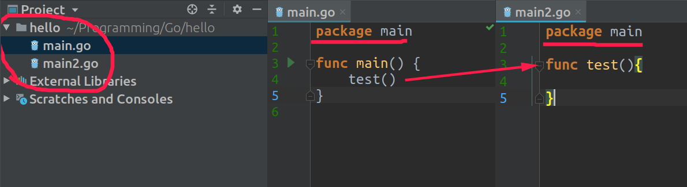
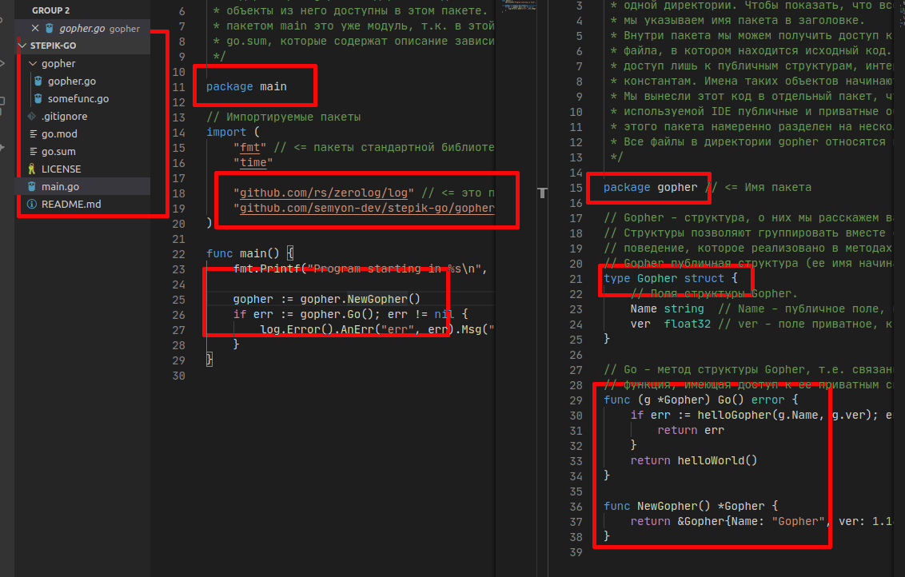
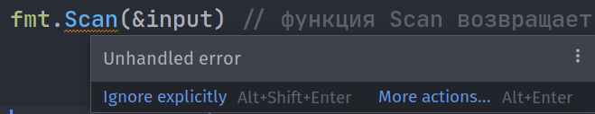

# Конспект материала с платформы Stepic
[https://stepik.org/course/54403](https://stepik.org/course/54403)

# Основы
## Целые числа
В Go существуют следующие типы целых чисел: `uint8`, `uint16`, `uint32`, `uint64`, `int8`, `int16`, `int32` и `int64`.
8, 16, 32 и 64 говорит нам, сколько бит использует каждый тип.
`uint` означает «unsigned integer» (беззнаковое целое), в то время как `int` означает «signed integer» (знаковое целое).
Беззнаковое целое может принимать только положительные значения (или ноль).


| Тип     | Описание                               | Принимаемые значения |
|---------|----------------------------------------| --- |
| uint8   | Беззнаковые 8-битные целые числа       |    от 0 до 255
| uint16  | Беззнаковые 16-битные целые числа      |    от 0 до 65535
| uint32  | Беззнаковые 32-битные целые числа      |	от 0 до 4294967295
| uint64  | 	Беззнаковые 64-битные целые числа  | 	от 0 до 18446744073709551615
| int8    | 	Знаковые 8-битные целые числа      |	от -128 до 127
| int16   | 	Знаковые 16-битные целые числа     | 	от -32768 до 32767
| int32   | 	Знаковые 32-битные целые числа     | 	от -2147483648 до 2147483647
| int64   | 	Знаковые 64-битные целые числа     | 	от -9223372036854775808 до 9223372036854775807

В дополнение к этому существуют два типа-псевдонима: `byte` (то же самое, что `uint8`) и `rune` (то же самое, что `int32`).
Байты — очень распространенная единица измерения в компьютерах (1 байт = 8 бит, 1024 байта = 1 килобайт, 1024 килобайта = 1 мегабайт, …), и именно поэтому тип `byte` в Go часто используется для определения других типов.

Также существует 3 машинно-зависимых целочисленных типа: `uint`, `int` и `uintptr`.
Они машинно-зависимы, потому что их размер зависит от архитектуры используемого компьютера:

`int`: представляет целое число со знаком, которое в зависимости от платформы может занимать либо 4 байта, либо 8 байт. То есть соответствовать либо `int32`, либо `int64`.

`uint`: представляет целое число только без знака, которое, аналогично типу `int`, в зависимости от платформы может занимать либо 4 байта, либо 8 байт.
То есть соответствовать либо `uint32`, либо `uint64`.

В общем, если вы работаете с целыми числами — просто используйте тип `int`.


## Числа с плавающей точкой
**Числа с плавающей точкой** — это числа, которые содержат вещественную часть (вещественные числа) (1.234, 123.4, 0.00001234).
* Числа с плавающей точкой неточны. Бывают случаи, когда число вообще нельзя представить. Например, результатом вычисления 1.01 - 0.99 будет0.020000000000000018 - число очень близкое к ожидаемому, но не то же самое.
* Как и целые числа, числа с плавающей точкой имеют определенный размер (32 бита или 64 бита). Использование большего размера увеличивает точность (сколько цифр мы можем использовать для вычисления)
* В дополнение к числам существуют несколько других значений, таких как:  (`NaN`, для вещей наподобие 0/0), а также положительная и отрицательная бесконечность (`+∞` и `−∞`).

В Go есть два вещественных типа: `float32` и `float64` (соответственно часто называемые вещественными числами с одинарной и двойной точностью), а также два дополнительных типа для представления комплексных чисел (чисел с мнимой частью): `complex64` и `complex128`.
При работе с вещественными числами достаточно использовать `float32`, однако, если Вы хотите работать с более точными числами, можно использовать и `float64`. 


## Строки
Строка — это последовательность символов определенной длины, используемая для представления текста.
Строки в Go состоят из независимых байтов, обычно по одному на каждый символ (символы из других языков, таких как китайский, представляются несколькими байтами).

Строковые литералы могут быть созданы с помощью двойных кавычек "Hello World" или с помощью обратных апострофов \`Hello World\`.
Различие между ними в том, что строки в двойных кавычках не могут содержать новые строки и они позволяют использовать особые управляющие последовательности символов.
Например, `\n` будет заменена символом новой строки, а `\t` - символом табуляции.

Распространенные операции над строками включают в себя нахождение количества байт строки `len("Hello World")`, доступ к отдельному символу в строке `"Hello World"[1]` (строки “индексируются” начиная с 0, а не с 1), и конкатенацию двух строк `"Hello " + "World"`.

Так как строки в Go хранятся в виде байтов нужно понимать что такой код не выведет символ:
```go
package main

import "fmt"

func main() {
    fmt.Println("Hello Go"[0]) // вывод: 72
}
```

Представим байты в виде строки:
```go
package main

import "fmt"

func main() {
    fmt.Println(string("Hello Go"[0])) // вывод: H
}
```


## Логические типы
Булевый тип - `bool` (названный так в честь Джорджа Буля) — это специальный целочисленный тип, используемый для представления истинности и ложности.
Переменная такого типа будет занимать только один байт.
С этим типом используются три логических оператора:

| Литерал       | Пояснение |
|---------------|-----------|
| &&            | И         |
| &#124;&#124;  | 	ИЛИ      |
| !             | 	НЕ       |

Переменная типа `bool` может принимать только два значения: `truе` или `false`.


## Переменные
Для определения переменной применяется ключевое слово var, после которого идет имя переменной, а затем указывается ее тип:
```
var имя_переменной тип_данных
```

Имя переменной представляет произвольный идентификатор, который состоит из алфавитных и цифровых символов и символа подчеркивания. При этом первым символом должен быть либо алфавитный символ, либо символ подчеркивания.

При этом имена не должны представлять одно из ключевых слов: `break, case, chan, const, continue, default, defer, else, fallthrough, for, func, go, goto, if, import, interface, map, package, range, return, select, struct, switch, type, var`.

Можно одновременно объявить сразу несколько переменных через запятую:
```go
var a, b, c string
```

Для хранения символов можно использовать `int32`/`rune`.
Здесь используются одинарные кавычки.
Компилятор определяет код буквы в unicode и присваивает его переменной symbol.
То есть мы не храним никакую 'c', а храним лишь число 99.
Функция `string()` из переданного в него числа 99 делает строку 'c'.
```go
var symbol int32 = 'c'
fmt.Println(string(symbol))
```

Также можно объявить сразу несколько переменных в одном блоке var:
```go
var (
    name string = "Dima"
    age int = 23
)
```


## Арифметические операции
У переменных есть разные операции, как в алгебре.
* \+ сложение
* \- вычитание
* \* умножение
* / деление
* % остаток от деления
* x++ инкремент
* x-- декремент


При делении стоит быть внимательным, так как если в операции участвуют два целых числа, то результат деления будет округляться до целого числа:
```go
var a int = 10 / 6
------------------
Вывод: 1
```

Чтобы получить в результате деления вещественное число,  как минимум один из операндов также должен представлять собой вещественное число и результат мы должны при этом тоже сохранять в переменную вещественного типа:
```go
var m float32 = 10.0 / 6
----------------------
Вывод: 1.6666666
```


## Константы
Константы, как и переменные, хранят некоторые данные, но, в отличие от переменных, значения констант нельзя изменить, они устанавливаются один раз.
Вычисление констант производится во время компиляции.
Благодаря этому уменьшается количество работы, которую необходимо произвести во время выполнения, упрощается поиск ошибок, связанных с константами (так как некоторые из них можно обнаружить на момент компиляции).

Для определения констант применяется ключевое слово `const`:
```go
const pi float64 = 3.1415
```

Константы, как и обычные переменные, можно объявлять в блоке:
```go
const (
	a int = 45
	b float32 = 3.3
)
```

Также можно не указывать значение следующей константы по порядку (значение будет скопировано):
```go
package main

import (
	"fmt"
)

const(
	A int = 45
	B
	C float32 = 3.3
	D
)

func main() {
	fmt.Println(A, B, C, D)  // Вывод: 45 45 3.3 3.3
}
```


## iota
**iota** идентификатор Go используется в объявлениях констант для упрощения определений увеличивающихся чисел.

Сделаем дни недели с использованием iota - теперь это выглядит проще (особенно если много данных):  
```go
const (
	Sunday = iota
	Monday
	Tuesday
	Wednesday
	Thursday
	Friday
	Saturday
)

func main() {
	fmt.Println(Sunday)   // вывод 0
	fmt.Println(Saturday) // вывод 6
}
```

В объявлении константы предварительно объявленный идентификатор iota представляет последовательные не типизированные целочисленные константы.
Его значение является индексом соответствующего ConstSpec в объявлении константы, начиная с нуля.
Поскольку он может использоваться в выражениях, он обеспечивает общность, выходящую за рамки простых перечислений.
Его можно использовать для построения набора связанных констант, ознакомьтесь с примерами:
```go
const (
  c0 = iota  // c0 == 0
  c1 = iota  // c1 == 1
  c2 = iota  // c2 == 2
)
fmt.Println(c0, c1, c2) // вывод: 0 1 2


const (
	Sunday = iota
	Monday
	Tuesday
	Wednesday
	Thursday
	Friday
	Saturday
	_  // пропускаем 7
	Add
)

fmt.Println(Sunday)   // вывод: 0
fmt.Println(Saturday) // вывод: 6
fmt.Println(Add) // вывод: 8


const (
	u         = iota * 42 // u == 0 (индекс - 0, поэтому 0 * 42 = 0)
	v float64 = iota * 42 // v == 42.0 (индекс - 1, поэтому 1.0 * 42 = 42.0)
	w         = iota * 42 // w == 84  (индекс - 2, поэтому 2 * 42 = 84)
)

// переменные ни в одном блоке const, поэтому индекс не увеличился
const x = iota  // x == 0
const y = iota  // y == 0
```


## Условные выражения
Условные выражения представляют операции отношения и логические операции.
Они представляют некоторое условие и возвращают значение типа `bool`: `true` (если условие истинно) или `false` (если условие ложно).

### Операции отношения
Операции отношения позволяют сравнить два значения.
В языке Go есть следующие операции отношения:
* ==
* \>
* <
* <=
* \>=
* !=

### Логические операции
Логические операции сравнивают два условия.
Как правило, они применяются к отношениям и объединяют несколько операций отношения.

К логическим операциям относят следующие:
* ! (операция отрицания, логическое НЕ)
* && (конъюнкция, логическое умножение,  логическое И)
* || (дизъюнкция, логическое сложение, логическое ИЛИ)


## Условные конструкции
### Условная конструкция if
Конструкция if принимает условие - выражение, которое возвращает значение типа `bool`.
Если это условие истинно, то выполняется последующий блок инструкций:
```go
package main

import "fmt"

func main() {
   a := 6    
   b := 7
   if a < b {     
      fmt.Println("a меньше, чем b")  
   }
}
```

### If с краткой инструкцией

Так же как и `for` (про него в следующем уроке), оператор `if` может начинаться с инструкции, которая будет выполнена перед проверкой условия.

Переменные, объявленные в этом блоке, доступны только в области видимости, которая существует до конца `if`.
Пример:
```go
if v := math.Pow(x, n); v < lim {
   // ...
}
```

### Условные конструкции else if и else
Если нам нужно проверить несколько условий, мы можем использовать оператор `else if`:
```go
if a < b {
    fmt.Println("a меньше b")
} else if a > b {
    fmt.Println("a больше b")
}
```

Если нам нужен вариант, когда ни одно из условий не выполняется, то мы используем оператор `else`:
```go
if a < b {
    fmt.Println("a меньше b")
} else if a > b {
    fmt.Println("a больше b")
} else {
    fmt.Println("a равно b")
}
```

### Switch
Go содержит в себе другой оператор, позволяющий делать перечисления: оператор switch (переключатель).
С ним программа может выглядеть так:
```go
switch i {
case 0: fmt.Println("Zero")
case 1: fmt.Println("One")
case 2: fmt.Println("Two")
case 3: fmt.Println("Three")
case 4: fmt.Println("Four")
case 5: fmt.Println("Five")
default: fmt.Println("Unknown Number")
}
```

Переключатель начинается с ключевого слова `switch`, за которым следует выражение (в нашем случае `i`) и серия возможных значений (`case`).
Значение выражения по очереди сравнивается с выражениями, следующими после ключевого слова `case`.
Если они оказываются равны, то выполняется действие, описанное после `:`.

Как и условия, обход возможных значений осуществляется сверху вниз, и выбирается первое значение, которое сошлось с выражением.
Переключатель также поддерживает действие по умолчанию, которое будет выполнено в случае, если не подошло ни одно из возможных значений (напоминает `else` в операторе `if`).

В `switch` можно использовать любой тип данных.

#### Стоит дополнить, что:
1.  В Go код после case выполняется до следующего case, и нет нужды каждый `case`-блок заканчивать ключевым словом **break** (данная особенность добавлена в язык специально, чтобы уменьшить количество ошибок в switch-блоках).
 
    Если в текущем case написать `fallthrough`, то тело следующего case выполнится вне зависимости от того истинно ли его (следующего `case`) условие:
    ```go
    v := 42
    switch v {
    case 100:
        fmt.Println(100)
        fallthrough
    case 42:
        fmt.Println(42)
        fallthrough
    case 1:
        fmt.Println(1)
        fallthrough
    default:
        fmt.Println("default")
    }
    // Вывод:
    // 42
    // 1
    // default
    ```
2.  Существует специальная форма `switch`, допускающая использование произвольных условий в каждом `case`-блоке:
    ```go
    var c uint32
    fmt.Scan(&c)
    switch {
    case 1 <= c && c <= 9:
        fmt.Println("от 1 до 9")
    case 100 <= c && c <= 250:
        fmt.Println("от 100 до 250")
    case 1000 <= c && c <= 6000:
        fmt.Println("от 1000 до 6000")
    }
    ```
    
    То есть, сразу после switch "переключатель" не нужен, а после каждого `case` идет выражение с произвольным условием.

## Задания блока "1.9 Условные конструкции"
<details><summary>Раскрыть</summary>

### Step 5
На ввод подается целое число.
Если число положительное - вывести сообщение "Число положительное", если число отрицательное - "Число отрицательное".
Если подается ноль - вывести сообщение "Ноль". Выводить сообщение без кавычек.

**Sample Input**: 5

**Sample Output**: Число положительное

```go
package main

import "fmt"

func main() {
  var iData int
  fmt.Scan(&iData)
  if iData > 0 {
    fmt.Println("Число положительное")
  } else if iData < 0 {
    fmt.Println("Число отрицательное")
  } else {
    fmt.Println("Ноль")
  }
}
```

### Step 6
По данному трехзначному числу определите, все ли его цифры различны.

**Формат входных данных**

На вход подается одно натуральное трехзначное число.

**Формат выходных данных**

Выведите "YES", если все цифры числа различны, в противном случае - "NO".

**Sample Input 1**: 237

**Sample Output 1**: YES

**Sample Input 2**: 117

**Sample Output 2**: NO

```go
package main

import "fmt"

func main() {
  var i1, i2, i3, iData int
  fmt.Scan(&iData)
  
  i1 = iData / 100
  i2 = (iData % 100) / 10
  i3 = iData % 10
  
  if i1 != i2 && i1 != i3 && i2 != i3 {
    fmt.Println("YES")
  } else {
    fmt.Println("NO")
  }
}
```

### Step 7
Дано неотрицательное целое число. Найдите и выведите первую цифру числа. 

**Формат входных данных**

На вход дается натуральное число, не превосходящее 10000.

**Формат выходных данных**

Выведите одно целое число - первую цифру заданного числа.

**Sample Input**: 1234

**Sample Output**: 1

```go
package main

import "fmt"

func main() {
  var iData int
  fmt.Scan(&iData)
  
  switch {
  case iData < 10:
    fmt.Println(iData)
  case iData >= 10 && iData < 100:
    fmt.Println(iData / 10)
  case iData >= 100 && iData < 1000:
    fmt.Println(iData / 100)
  case iData >= 1000 && iData < 10000:
    fmt.Println(iData / 1000)
  default:
    fmt.Println(1)
  }
}
```

### Step 8
Определите является ли билет счастливым. Счастливым считается билет, в шестизначном номере которого сумма первых трёх цифр совпадает с суммой трёх последних.

**Формат входных данных**

На вход подается номер билета - одно шестизначное  число.

**Формат выходных данных**

Выведите "YES", если билет счастливый, в противном случае - "NO".

**Sample Input**: 613244

**Sample Output**: YES

```go
package main

import "fmt"

func main() {
  var iData int
  var numb [6]int  
  fmt.Scan(&iData)
  
  numb[0] = iData / 100000
  numb[1] = (iData % 100000) / 10000
  numb[2] = (iData % 10000) / 1000
  numb[3] = (iData % 1000) / 100
  numb[4] = (iData % 100) / 10
  numb[5] = iData % 10
  
  if numb[0] + numb[1] + numb[2] == numb[3] + numb[4] + numb[5] {
    fmt.Println("YES")
  } else {
    fmt.Println("NO")
  }
}
```

### Step 9
Требуется определить, является ли данный год високосным, напомним:

Год является високосным если он соответствует хотя бы одному из нижеперечисленных условий:
- кратен 400;
- кратен 4, но не кратен 100.

**Входные данные**

Вводится единственное число - номер года (целое, положительное, не превышает 10000).

**Выходные данные**

Требуется вывести слово YES, если год является високосным и NO - в противном случае.

**Sample Input**: 2000

**Sample Output**: YES

```go
package main

import "fmt"

func main() {
  var iData int
  fmt.Scan(&iData)
  
  if iData % 400 == 0 {
    fmt.Println("YES")
  } else if iData % 4 == 0 && iData % 100 != 0 {
    fmt.Println("YES")
  } else {
    fmt.Println("NO")
  }
}
```

</details>


## Циклы в Go
Единственной конструкцией для циклов в Go является оператор `for`.

Его базовая форма выглядит следующим образом:
```
for [инициализация счетчика]; [условие]; [изменение счетчика]{
    // действия
}
```

Пример использования:
```go
package main

import "fmt"

func main() {
	sum := 0
	for i := 1; i < 10; i++ {
		sum += i
	}
	fmt.Println(sum)
}
```

Объявление цикла `for` разбивается на три части.
Вначале идет инициализация счетчика: `i := 1`.
Фактически она представляет объявление переменной, которая будет использоваться внутри цикла.
В данном случае это счетчик `i`, начальное значение которого равно 1.

Вторая часть представляет условие: `i < 10`.
Пока это условие истинно, то есть возвращает `true`, будет продолжаться цикл.

Третья часть представляет изменение (увеличение) счетчика на единицу.

Нам необязательно указывать все условия при объявлении цикла.
Например, можно вынести объявление переменной вовне:
```go
var i = 1
for ; i < 10; i++{
    fmt.Println(i * i)
}
```

Можно убрать изменение счетчика в само тело цикла и оставить только условие:
```go
var i = 1
for ; i < 10;{
    fmt.Println(i * i)
    i++
}
```

Если цикл использует только условие, то его можно сократить следующим образом:
```go
var i = 1
for i < 10{
    fmt.Println(i * i)
    i++
}
```

При этом в последнем случае мы получим по сути аналог цикла `while` в других языках программирования.

Так же можно реализовать бесконечный цикл:
```go
for {

}
```

**Кстати**, иногда удобно пользоваться такой конструкцией ввода данных:

(но будьте осторожны, ведь мы не обрабатываем здесь ошибки)
```go
var n int
// считываем числа пока не будет введен 0
for fmt.Scan(&n); n != 0; fmt.Scan(&n){
	fmt.Println(n)
}
```

## Задания 2-5
<details><summary>Раскрыть</summary>

### Задание 2
Напишите программу, которая выводит квадраты натуральных чисел от 1 до 10.
Квадрат каждого числа должен выводится в новой строке.
```go
package main

import "fmt"

func main() {
    for i := 1; i <= 10; i++ {
        fmt.Println(i * i)   
    }
}
```

### Задание 3
Требуется написать программу, при выполнении которой с клавиатуры считываются два натуральных числа A и B (каждое не более 100, A < B).
Вывести сумму всех чисел от A до B включительно.

**Sample Input**: 1 5
**Sample Output**: 15

```go
package main

import "fmt"

func main() {
    var A, B, out int
    
    fmt.Scan(&A, &B)
    
    for i := A; i <= B; i++ {
        out = out + i
    }
    
    fmt.Println(out)
}
```

### Задание 4
Напишите программу, которая в последовательности чисел находит сумму двузначных чисел, кратных 8.
Программа в первой строке получает на вход число n - количество чисел в последовательности, во второй строке -- n чисел, входящих в данную последовательность.

**Sample Input**:

5

38 24 800 8 16

**Sample Output**: 40

```go
package main

import "fmt"

func main() {
    var n, iData, out int
    
    fmt.Scan(&n)
    
    for i := 0; i < n; i++ {
        fmt.Scan(&iData)
        if iData >= 10 && iData < 100 && iData % 8 == 0 {
            out = out + iData
        }
    }
    
    fmt.Println(out)
}
```

### Step 5
Последовательность состоит из натуральных чисел и завершается числом 0.
Определите количество элементов этой последовательности, которые равны ее наибольшему элементу.

**Формат входных данных**

Вводится непустая последовательность натуральных чисел, оканчивающаяся числом 0 (само число 0 в последовательность не входит, а служит как признак ее окончания).

**Формат выходных данных**

Выведите ответ на задачу.

**Sample Input**:

1

3

3

1

0

**Sample Output**: 2

```go
package main

import "fmt"

func main() {
    var iData, iMax, oData int
    
    for fmt.Scan(&iData); iData != 0; fmt.Scan(&iData){
        if iData > iMax {
            iMax = iData
            oData = 1
        } else if iData == iMax {
            oData++
        }
    }
    
    fmt.Println(oData)
}
```

</details>


### Операторы break и continue
Может возникнуть ситуация, когда нам надо при определенных условиях завершить текущую итерацию цикла, не выполнять все инструкции цикла, а сразу перейти к следующей итерации.
В этом случае можно использовать оператор `continue`.
Например, нам нужно в диапазоне от 1 до 10 посчитать сумму нечетных чисел.
Если нам встретится четное число, мы можем просто перейти к следующей итерации с помощью `continue`:
```go
var sum = 0
 
for i := 1; i <= 10; i++{
    if i % 2 == 0 {
        continue        // переходим к следующей итерации
    }
    sum += i
}
fmt.Println("Сумма: ", sum)    // Сумма: 25
```

Оператор `break` полностью осуществляет выход из цикла:
```go
var sum = 0
 
for i := 1; i <= 9; i++{
    if i > 4 {
        break       // если число больше 4 выходим из цикла
    }
    sum += i
}
fmt.Println("Сумма: ", sum)    // Сумма: 10
```

## Задания 7-10
<details><summary>Раскрыть</summary>

### Step 7
Найдите первое число от 1 до n включительно, кратное c, но НЕ кратное d.

**Входные данные**

Вводится 3 натуральных числа n, c, d, каждое из которых не превышает 10000.

**Выходные данные**

Вывести первое число от 1 до n включительно, кратное c, но НЕ кратное d. Если такого числа нет - выводить ничего не нужно.

**Sample Input**: 20 3 5
**Sample Output**: 3

```go
package main

import "fmt"

func main() {
    var n, c, d int
    fmt.Scan(&n, &c, &d)
    
    for i := 1; i <= n; i++ {
        if (i % c == 0) && (i % d != 0) {
            fmt.Println(i)
            break
        }
    }
}
```

### Step 8
Напишите программу, которая считывает целые числа с консоли по одному числу в строке.

Для каждого введённого числа проверить:
* если число меньше 10, то пропускаем это число;
* если число больше 100, то прекращаем считывать числа;
* в остальных случаях вывести это число обратно на консоль в отдельной строке.
---
**Sample Input**:

30

11

7

101

---
**Sample Output**:

30

11

---
```go
package main

import "fmt"

func main() {
    var iData int
    
    for fmt.Scan(&iData); iData <= 100; fmt.Scan(&iData) {
        if iData >= 10 {
            fmt.Println(iData)
        }
    }
}
```

### Step 9
Вклад в банке составляет x рублей.
Ежегодно он увеличивается на p процентов, после чего дробная часть копеек отбрасывается.
Каждый год сумма вклада становится больше.
Определите, через сколько лет вклад составит не менее y рублей.

**Входные данные**

Программа получает на вход три натуральных числа: x, p, y.

**Выходные данные**

Программа должна вывести одно целое число.

---
**Sample Input**: 100 10 200

---
**Sample Output**: 8

---
```go
package main

import "fmt"

func main() {
    var x, y, oData int
    var p float32
    
    fmt.Scan(&x, &p, &y)
    p = p / 100 + 1
    
    for {
        x = int(float32(x) * p)
        oData++
        if x >= y {
            fmt.Println(oData)
            break
        }
    }
}
```

### Step 10
Даны два числа.
Определить цифры, входящие в запись как первого, так и второго числа.

**Входные данные**

Программа получает на вход два числа.
Гарантируется, что цифры в числах не повторяются.
Числа в пределах от 0 до 10000.

**Выходные данные**

Программа должна вывести цифры, которые имеются в обоих числах, через пробел.
Цифры выводятся в порядке их нахождения в первом числе.

---
**Sample Input**: 564 8954

---
**Sample Output**: 5 4

---
```go
package main

import "fmt"

func main() {
    var iData1, iData2 string
    
    fmt.Scan(&iData1, &iData2)
    
    for i := 0; i < len(iData1); i++ {
        for k := 0; k < len(iData2); k++ {
            if iData1[i] == iData2[k] {
                fmt.Print(string(iData1[i]), " ")
            }
        }
    }
}
```

</details>


## Форматированный вывод
`fmt.Printf()` на вход принимает сначала строку форматирования, а только потом переменные для вывода.
Строка форматирования представляет набор спецификаторов.
Каждый спецификатор представляет набор символов, которые интерпретируются определенным образом и предваряются знаком процента `%`.

Каждый спецификатор представляет определенный тип данных:
* `%t`: для вывода значений типа boolean (true или false)
* `%b`: для вывода целых чисел в двоичной системе
* `%c`: для вывода символов, представленных числовым кодом
* `%d`: для вывода целых чисел в десятичной системе
* `%o`: для вывода целых чисел в восьмеричной системе
* `%q`: для вывода символов в одинарных кавычках
* `%x`: для вывода целых чисел в шестнадцатеричной системе, буквенные символы числа имеют нижний регистр a-f
* `%X`: для вывода целых чисел в шестнадцатеричной системе, буквенные символы числа имеют верхний регистр A-F
* `%U`: для вывода символов в формате кодов Unicode, например, U+1234
* `%e`: для вывода чисел с плавающей точкой в экспоненциальном представлении, например, -1.234456e+78
* `%E`: тоже самое что `%e` но в верхнем регистре, например, -1.234456E+78
* `%f`: для вывода чисел с плавающей точкой, например, 123.456
* `%F`: то же самое, что и `%f`
* `%g`: `%e` для огромных экспонент, `%f` в противном случае
* `%G`: `%E` для огромных экспонент, `%F` в противном случае
* `%s`: для вывода строки
* `%p`: для вывода значения указателя - адреса в шестнадцатеричном представлении (указатели мы пройдем на следующих уроках)
* `%T` для вывода типа переменной

Также можно применять универсальный спецификатор `%v`, который для типа boolean аналогичен `%t`, для целочисленных типов - `%d`, для чисел с плавающей точкой - `%g`, для строк - `%s`.

Для чисел с плавающей точкой можно указать точность или количество символов в дробной части.
Для этого количество символов указывается после точки: `%.2f` - две цифры в дробной части после точки.

Например, варианты форматирования чисел с плавающей точкой:
* `%f`: точность и ширина значения по умолчанию
* `%9f`: ширина - 9 символов и точность по умолчанию (число с плавающей точкой будет занимать как минимум 9 позиций. Если ширина больше, чем требуется значению, то заполняется пробелами.)
* `%.2f`: ширина по умолчанию и точность - 2 символа
* `%9.2f`: ширина - 9 и точность - 2
* `%9.f`: ширина - 9 и точность - 0

Примеры:
```go
var a float64 = 100.123456
fmt.Printf("это число %f типа %T", a, a)
// вывод: это число 100.123456 типа float64

var a1 byte = 's'
var a2 int = 1234
fmt.Printf("%q %b", a1, a2)
// вывод: 's' 10011010010


// использование \n позволяет сделать перенос строки
var a1 string = "123"
var a2 string = "1234"
fmt.Printf("%q \n%s", a1, a2)
// вывод: 
// "123" 
// 1234
```


### Sprintf
Также есть функция `Sprintf()` которая работает как и `Printf()`, за исключением того что она ничего не печатает, а возвращает результат форматирования, рассмотрим пример:

```go
package main

import (
	"fmt"
)

func main() {
	var a float64 = 100.123456789
	result := fmt.Sprintf("%.2f", a)
	fmt.Printf("%q", result) // вывод: "100.12"
        // result будет типа string
}
```

### Литералы строк
Вначале определим разницу между литералами строк и значениями строк.
Литерал строк — это то, что мы видим в исходном коде компьютерной программы, включая кавычки.
Значение строки — это то, что мы видим в окне терминала когда вызываем функцию `fmt.Println` после запуска программы Go.

В простой программе `Hello, World!` литерал строки будет выглядеть как `"Hello, World!"`, а значением строки будет `Hello, World!` без кавычек.

Однако для некоторых значений строк могут требоваться кавычки, в частности в случае с цитатами.
Поскольку литералы строк и значения строк не эквивалентны, часто требуется добавлять в литералы строк дополнительное форматирование, чтобы значения строк отображались ожидаемым образом.

### Кавычки и обратный апостроф
В Go можно использовать обратный апостроф (``) или двойные кавычки ("), поэтому мы можем легко вставлять цитаты в строку, выделяя их двойными кавычками, в то время как сама строка выделена обратными апострофами:
```
`Sammy says, "Hello!"`
```

Также вы можете использовать обратные апострофы и заключить строку в двойные кавычки:
```
"Sammy likes the `fmt` package for formatting strings.."
```

Кроме того, комбинирование обратных апострофов и двойных кавычек позволяет контролировать отображение символов кавычек и одинарных кавычек в строках.

Важно помнить, что при использовании обратных апострофов в Go создается чистый литерал строки, а при использовании двойных кавычек — интерпретированный литерал строки.
Чтобы узнать больше о разнице между ними, ознакомьтесь с руководством [Введение в работу со строками в Go](https://www.digitalocean.com/community/tutorials/an-introduction-to-working-with-strings-in-go).

### Управляющие символы
Также для форматирования строк используются **управляющие символы**.
Управляющие символы интерпретируются кодом как имеющие особое значение.
Управляющие символы начинаются с обратной косой черты (\), за которой идет другой символ строки, в результате чего строка имеет определенный формат.

Далее приведен перечень нескольких распространенных управляющих символов, а также примеры экранирования:

| Оператор | 	Формат                                                                    | 	Пример кода       | 	Результат 
|----------|----------------------------------------------------------------------------|--------------------|------------|
| \\\\     | Обратная косая черта (это пример экранирования, а не управляющего символа) | fmt.Printf("\\\\") | \          |
| \\"      | Двойные кавычки (это пример экранирования, а не управляющего символа)      | fmt.Printf("\\"") | "          |
| \f       | подача страницы                                                            | fmt.Printf("123\f456\f789") |            |
| \v       | вертикальный таб                                                           | fmt.Printf("\vf\v") |            |
| \r | возврат каретки                                                            | fmt.Printf("\r Input ") fmt.Scan(&a) |            |
| \b | возврат (backspace U+0008)                                                 | fmt.Printf("123\b") fmt.Scan(&a) |            |
| \t | Табуляция (горизонтальный отступ)                                          | fmt.Printf("\ttest") | |
| \n | Перевод строки                                                             | fmt.Printf("test\ntest") | |

Так же есть `\a` - особый управляющий символ, необходимый для создания звука (alert).

### Многострочная печать
Многострочная печать строк делает текст более удобным для чтения.
Размещение строк в нескольких рядах делает текст более понятным и упорядоченным, позволяет форматировать его как письмо или сохранить разрывы строк в стихотворении или тексте песни.

Для создания строк, отображаемых на нескольких рядах, их нужно заключить в обратные апострофы.
Помните, что хотя при этом сохраняются символы возврата строки, создаваться будут чистые литералы строки.
```
`
This string is on
multiple lines
within three single
quotes on either side.
`
```

Если вы распечатаете этот текст, вы увидите, что символ возврата имеется в начале и в конце строки:
```
This string is on
multiple lines
within three single
quotes on either side.
```

Во избежание этого следует поместить первый ряд сразу же за обратным апострофом и закончить последний ряд обратным апострофом.
```
`This string is on
multiple lines
within three single
quotes on either side.`
```

Если вам нужно создать интерпретированный литерал строки, вы можете использовать двойные кавычки и оператор `+`, но при этом вам нужно будет самостоятельно вставлять символы разрыва строки между рядами.
```
"This string is on\n" +
"multiple lines\n" +
"within three single\n" +
"quotes on either side."
```

Хотя с обратными апострофами намного проще распечатывать и читать длинный текст, если вам требуется интерпретированный литерал строки, вам нужно использовать двойные кавычки.

### Чистые литералы строк
Что, если нам не нужно особое форматирование строк?
Например, нам может понадобиться сравнить или оценить несколько строк программного кода, где целенаправленно используется символ обратного слеша, так что мы не хотим, чтобы Go использовал этот символ как управляющий или как элемент экранирования.

Чистый литерал строки указывает Go игнорировать все форматирование строки, включая управляющие символы.

Мы можем создать чистую строку, заключив строку в обратные апострофы:
```
fmt.Println(`Sammy says,\"The balloon\'s color is red.\"`)
```
```
Sammy says,\"The balloon\'s color is red.\"
```

Построение чистой строки с помощью обратных апострофов вокруг нее позволяет сохранить в тексте символы обратного слеша и другие символы, которые используются в качестве управляющих символов.


## Массивы и срезы
### Понятие массива. Объявление и инициализация массива
**Массив** — это последовательность элементов одного типа фиксированной длины.
Объявление массива осуществляется следующим образом:
```go
var a [3]int
fmt.Println(a) // [0 0 0]
```

При объявлении массива в квадратных скобках указывается его длина (length), которая совместно с типом элементов, определяет тип самого массива, т.е. `[3]int` не может просто так взаимодействовать с `[5]int` (массивы разной длины относятся к разным типам независимо от того, что хранят значения одного типа), также как не могут без приведения взаимодействовать `int64` и `int32`.

Как мы увидели в приведенном примере, объявленный массив был при объявлении инициализирован нулевыми значениями (0 для int).
Такое поведение не является стандартным, в частности в языках C / C++ объявленный массив нулевыми значениями не заполняется.

Одновременно с объявлением массива мы можем задать значения его элементов (инициализировать его):
```go
var a [3]int = [3]int{1, 2, 3}
b := [3]int{1, 2, 3}
c := [...]int{1, 2, 3}
d := [3]int{1: 12}

fmt.Println(a) // [1 2 3]
fmt.Println(b) // [1 2 3]
fmt.Println(c) // [1 2 3]
fmt.Println(d) // [0 12 0]
```

В понимании первого и второго примера сложности возникнуть не должно - с этим вы уже сталкивались.
Остановимся чуть подробнее на вариантах три и четыре (массивы c и d).

Вместо явного указания длины массива мы можем указать символ многоточия (`...`) в квадратных скобках, тогда длина массива будет определена Go в зависимости от количества указанных при инициализации значений.
Несмотря на то, что такой вариант допустим, он не считается идиоматичным для Go и не рекомендуется к использованию в документации.

Четвертый же способ инициализации позволяет явно указать значение, которое должно быть присвоено элементу массива с определенным индексом.
В этом случае индексы могут появляться в любом порядке, а некоторые из них могут быть опущены; как и прежде, неуказанные значения получают нулевое значение типа элемента.

### Сравнение массивов
Поскольку мы можем последовательно сравнить все элементы массива, мы можем сравнить и сами массивы:
```go
a := [3]int{1, 2, 3}
b := [3]int{1, 2, 3}
c := [3]int{3, 2, 1}

fmt.Println(a == b) // true
fmt.Println(a == c) // false
```

Но при этом нужно учитывать, что сравнимы только массивы одного типа (массивы одинаковой длины, содержащие элементы одинакового типа).

### Обращение к элементам массива. Индексы
Для обращения к элементам массива применяются индексы - номера элементов.
При этом нумерация элементов массива начинается с нуля, то есть первый элемент будет иметь индекс 0.
Индекс указывается в квадратных скобках.
По индексу можно получить значение элемента, либо изменить его:
```go
package main

import "fmt"

func main() {   
    var numbers [5]int = [5]int{1,2,3,4,5}    

    fmt.Println(numbers[0])     // 1  
    fmt.Println(numbers[4])     // 5   

    numbers[0] = 87   

    fmt.Println(numbers[0])     // 87
}
```

Однако в большинстве случаев нам необходимо обратиться ко всем элементам массива и выполнить с ними определенную работу.
Мы можем сделать это с помощью цикла:
```go
a := [5]int{1, 2, 3, 4, 5}
fmt.Println(a) // [1 2 3 4 5]

for i := 0; i < len(a); i++ {
	fmt.Println(a[i])
	// 1
	// 2
	// 3
	// 4
	// 5
}
```

Обратите внимание, что определяя условие продолжения выполнения цикла мы использовали встроенную функцию `len()`, возвращающую длину массива.
Поскольку индексация элементов массива начинается с 0, то последний элемент массива a будет иметь индекс `len(a) - 1`.

При итерации по массиву мы можем использовать ключевое слово range, тогда цикл будет иметь следующий вид:
```go
a := [5]int{1, 2, 3, 4, 5}
fmt.Println(a) // [1 2 3 4 5]

for idx, elem := range a {
    fmt.Printf("Элемент с индексом %d: %d\n", idx, elem)
    // Элемент с индексом 0: 1
    // Элемент с индексом 1: 2
    // Элемент с индексом 2: 3
    // Элемент с индексом 3: 4
    // Элемент с индексом 4: 5
}
```

`Range` возвращает 2 объекта: индекс элемента в массиве и копию значения этого элемента.
Любой из этих объектов должен быть опущен, если мы не планируем использовать его, для этого вместо имени переменной мы можем указать символ `_`.
Кроме того, если мы хотим использовать только индекс элемента, мы можем вообще не использовать второе возвращаемое значение:
```go
a := [5]int{1, 2, 3, 4, 5}

for idx := range a {
    fmt.Println(a[idx])
}

for idx, _ := range a {
    // В этом случае следует использовать приведенный выше вариант,
    // хотя технически эти варианты работают одинаково
    fmt.Println(a[idx])
}

for _, elem := range a {
    fmt.Println(elem)
}
```

Необходимо запомнить, что в качестве второго значения `range` возвращает копию элемента массива, это может быть важно, если в цикле мы хотим изменить массив.
В этом случае мы должны обращаться к элементам массива по индексу:
```go
a := [5]int{1, 2, 3, 4, 5}
fmt.Println(a) // [1 2 3 4 5]

for _, elem := range a {
    elem = 100
    fmt.Println(elem)

    // 100
    // 100
    // 100
    // 100
    // 100
}
fmt.Println(a) // [1 2 3 4 5]

for idx := range a {
    a[idx] = 100
    fmt.Println(a[idx])

    // 100
    // 100
    // 100
    // 100
    // 100
}
fmt.Println(a) // [100 100 100 100 100]
```

### Задание 5

<details><summary>Раскрыть</summary>
Внутри функции main (объявлять функцию не нужно) необходимо написать программу:

На первом этапе на стандартный ввод подается 10 целых положительных чисел, которые должны быть записаны в порядке ввода в массив из 10 элементов.
Тип чисел, входящих в массив, должен соответствовать минимально возможному целому беззнаковому числу.
Имя массива который вы должны сами создать workArray (условие обязательное).
Для чтения из стандартного ввода уже импортирован пакет fmt.

На втором этапе на стандартный ввод подаются еще 3 пары чисел - индексы элементов этого массива, которые требуется поменять местами (если такая пара чисел 3 и 7, значит в массиве элемент с 3 индексом нужно поменять местами с элементом, индекс которого 7).

Элементы полученного массива должны быть выведены через пробел на стандартный вывод.
Далее автоматически будет проведена проверка используемых типов, результат которой будет добавлен к вашему ответу.

Использование массива - обязательное условие!

Ответ:
```go
var workArray [10]uint8
var switchArray [6]uint8

for i := 0; i < 10; i++ {
    fmt.Scan(&workArray[i])
}
for i := 0; i < 6; i++ {
    fmt.Scan(&switchArray[i])
}

for i := 0; i < 6; i = i + 2 {
    workArray[switchArray[i]], workArray[switchArray[i+1]] = workArray[switchArray[i+1]], workArray[switchArray[i]]
}
for i := range workArray {
    fmt.Print(workArray[i], " ")
}
```

</details>


## Срезы (слайсы, slices)
**Срез** — это последовательность элементов одного типа переменной длины.

Массивы и срезы тесно связаны.
Срез — это структура данных, которая предоставляет доступ к подпоследовательности элементов базового массива.
Длину массива изменять нельзя, а вот новые элементы в срез добавлять можно, так что в некоторых языках срезами называются динамические массивы.

Срез состоит из трех компонентов: указателя, длины и емкости:
* указатель указывает на первый элемент массива, доступный через срез (который не обязательно совпадает с первым элементом массива);
* длина (length) — это количество элементов среза;
* емкость (capacity) - количество элементов между началом среза и концом базового массива.

Длина и емкость среза могут быть определены при помощи встроенных функций `len()` и `cap()` соответственно.

## С оздание среза
### Создание пустого среза
Пустой срез может быть создан аналогично созданию массива за тем исключением, что нам нет необходимости указывать длину среза, поскольку она изменяема.
При создании пустого среза мы также можем инициализировать его, явно указав элементы среза.
Давайте рассмотрим, чем различается создание массива и среза:
```go
var a []int
var b []int = []int{1, 2, 3}
c := []int{1, 2, 3}
d := []int{1: 12}

fmt.Println(a) // []
fmt.Println(b) // [1 2 3]
fmt.Println(c) // [1 2 3]
fmt.Println(d) // [0 12]
```

Варианты b и c идентичны тем, что мы уже видели при создании массива (вы можете вернуться к ранее приведенным примерам и удостовериться в этом).

В том случае, если мы просто объявляем пустой срез, он не содержит элементов (его длина равна 0, в чем мы можем удостовериться, воспользовавшись функцией `len`) - в аналогичном случае длина массива явно задается при его объявлении.

Вариант d позволяет нам создать срез и явно указать значения элементов по его индексу, Go инициализирует нужное для выполнения этой задачи число элементов нулевым значением: в примере элемент с индексом 0 равен 0, хотя мы не объявляли его явно.

На этом способы создания среза в Go не заканчиваются.
Для гибкого способа создания пустых срезов в Go существует встроенная функция make следующего вида:
```go
make([]T, length, capacity)
```

Чтобы разобраться с этой функцией нам нужно посмотреть, что происходит при создании пустого среза: Go создает массив какой-то длины.
О понятии среза мы говорили выше: указатель среза будет указывать на первый элемент созданного массива, длина среза составит 0 (если мы явно не указали элементы среза), емкость необходимого массива будет определена Go самостоятельно.

Для чего нам может потребоваться явно указать длину и емкость среза:

* для того, чтобы инициализировать нулевыми значениями элементы массива (длина среза);
* для того, чтобы выделить нужное количество памяти для хранения массива, лежащего в основе нашего среза.

```go
a := make([]int, 10, 10) // [0 0 0 0 0 0 0 0 0 0]
fmt.Println(a)
```

Функция `make` широко применяется на практике, в дальнейшем вы не раз будете использовать ее.


## Оператор среза
Оператор среза `s[i:j]` создает из последовательности s новый срез, который содержит элементы последовательности `s` с `i` по `j-1`.
При этом должно соблюдаться условие `0 <= i <= j <= cap(s)`.
В качестве исходной последовательности, из которой берутся элементы, может использоваться массив, указатель на массив или другой срез.
В итоге в полученном срезе будет `j-i` элементов.

Если значение `i` не указано, то применяется по умолчанию значение 0.
Если значение `j` не указано, то вместо него используется длина исходной последовательности `s`.
```go
initialUsers := [8]string{"Bob", "Alice", "Kate", "Sam", "Tom", "Paul", "Mike", "Robert"} // базовый массив

users1 := initialUsers[2:6] // с 3-го по 6-й
users2 := initialUsers[:4] // с 1-го по 4-й
users3 := initialUsers[3:] // с 4-го до конца

fmt.Println(users1) // [Kate Sam Tom Paul]
fmt.Println(users2) // [Bob Alice Kate Sam]
fmt.Println(users3) // [Sam Tom Paul Mike Robert]
```

## Встроенные функции для работы со срезами
Для работы со срезами в Go предусмотрены встроенные функции `append` и `copy`.

### Функция append - добавление элементов в срез
Функция `append` позволяет добавить в срез новый элемент, выглядит она следующим образом:
```go
func append(slice []Type, elems ...Type) []Type
```

В качестве первого аргумента функция получает срез, в который необходимо добавить новые элементы, второй и последующий элементы - это элементы совместимого со срезом типа, которые необходимо добавить в срез.
Функция возвращает новый срез, содержащий ранее содержавшиеся в срезе элементы, а также новые элементы, переданные в качестве аргумента функции append.
Подробно функции будут рассмотрены в разделе 2.1. Функции.
```go
a := []int{1, 2, 3}
a = append(a, 4, 5)

fmt.Println(a) // [1 2 3 4 5]
```

### Немного сложного
Теперь самое время вернуться к вопросу о длине и емкости среза, чтобы в контексте работы функции append рассмотреть внутренне устройство срезов.
Что произойдет, если добавить в срез длины N и такой же емкости элементов больше N?
Посмотрим на примере:
```go
baseArray := [10]int{0, 1, 2, 3, 4, 5, 6, 7, 8, 9}
fmt.Printf("Базовый массив: %v\n", baseArray)

baseSlice := baseArray[5:8]
fmt.Printf(
    "Срез, основанный на базовом массиве длиной %d и емкостью %d: %v\n",
    len(baseSlice),
    cap(baseSlice),
    baseSlice,
)

// Output:
// Базовый массив: [0 1 2 3 4 5 6 7 8 9]
// Срез, основанный на базовом массиве длиной 3 и емкостью 5: [5 6 7]
```

И так, мы создали массив из 10 элементов типа int, а затем создали срез на его элементы 5-7 (значения элементов в примере соответствуют их индексам).
Таким образом длина среза составляет 3, а емкость 5 (если вы не понимаете, почему получилось именно так, посмотрите еще раз в шестом шаге этого урока, из каких компонентов состоит срез).

Теперь проведем небольшую подготовительную работу.
Мы знаем, что один из компонентов среза: указатель на элемент массива, который является первым элементом среза.
Сохраним этот указатель в переменной pointer в виде строки (мы не будем его печатать, т.к. во время каждого исполнения программы он будет разным, но мы сможем использовать сохраненное значение для сравнения):
```go
pointer := fmt.Sprintf("%p", baseSlice)
```

_Напоминание_: Конструкция %p говорит, что в качестве результата должен быть возвращен адрес элемента массива, на который ссылается baseSlice.

Теперь добавим новый элемент в наш срез и посмотрим, как это повлияет на наш базовый массив:
```go
baseSlice = append(baseSlice, 10)
fmt.Printf("Массив: %v\n", baseArray)
fmt.Printf("Срез длиной %d и емкостью %d: %v\n", len(baseSlice), cap(baseSlice), baseSlice)
fmt.Println(pointer == fmt.Sprintf("%p", baseSlice))

// Output:
// Массив: [0 1 2 3 4 5 6 7 10 9]
// Срез длиной 4 и емкостью 5: [5 6 7 10]
// true
```

Мы видим, что изменился не только наш срез, но и базовый массив, на который ссылается срез.
Длина среза изменилась автоматически.
А теперь повторим предыдущую операцию, но добавим столько элементов, чтобы емкости среза не хватило:
```go
baseSlice = append(baseSlice, 11, 12, 13)
fmt.Printf("Массив: %v\n", baseArray)
fmt.Printf("Срез длиной %d и емкостью %d: %v\n", len(baseSlice), cap(baseSlice), baseSlice)
fmt.Println(pointer == fmt.Sprintf("%p", baseSlice))

// Output:
// Массив: [0 1 2 3 4 5 6 7 10 9]
// Срез длиной 7 и емкостью 10: [5 6 7 10 11 12 13]
// false
```

Мы видим, что базовый массив не изменился, а наш срез теперь ссылается на другой массив и имеет емкость больше длины.
Почему так произошло?
При добавлении элементов в срез Go проверяет, достаточно ли емкости среза для добавления новых элементов в срез (т.е. есть ли еще место в массиве, на котором основан срез).
Если емкости не достаточно, то создается новый срез, основанный на массиве большего объема, в который копируются все элементы из старого среза, а также добавляются новые элементы.

Этот пример наглядно демонстрирует как устроены срезы в Go: создав один раз срез на основе массива достаточной нам длины, мы можем избежать операций выделения памяти при создании нового массива и копирования элементов из одного массива в другой.

### Использование append для удаления элемента из среза
В Go отсутствует встроенная функция для удаления элемента из среза, но мы можем воспользоваться функцией append для того, чтобы создать новый срез, включающий в себя срез элементов до игнорируемого элемента, а также все элементы после игнорируемого:
```go
a := []int{1, 2, 3, 4, 5, 6, 7}
a = append(a[0:2], a[3:]...)
fmt.Println(a) // [1 2 4 5 6 7]
```

В этом примере встречается символ `...` после указания на передачу среза в качестве аргумента.
В настоящий момент можете запомнить, что такое использование многоточия означает раскрытие среза (его элементы передаются функции append как отдельные аргументы).

### Функция copy - копирование элементов среза
Сразу рассмотрим описание функции:
```go
func copy(dst, src []Type) int
// про функции мы поговорим в 2 модуле, ничего страшного если вам не очень понятно ;)
```

`Copy` принимает срез-назначение и срез источник, а возвращает число скопированных элементов:
```go
a := []int{1, 2, 3}
b := make([]int, 3, 3)
n := copy(b, a)

fmt.Printf("a = %v\n", a)                  // a = [1 2 3]
fmt.Printf("b = %v\n", b)                  // b = [1 2 3]
fmt.Printf("Скопировано %d элемента\n", n) // Скопировано 3 элемента
```

Почему мы явно указали длину создаваемого среза b?
Потому что иначе функции было бы некуда копировать.
Имей срез b длину 1, был бы скопирован 1 элемент из среза a.


## Особенности работы со срезами
Методики работы со срезами аналогичны работе с массивами с учетом тех особенностей, которые мы рассмотрели ранее.
Последовательность элементов среза также можно обойти с использованием цикла, обращаясь к ним с использованием индекса или получая значение с использованием range.

Однако существует особенность, которую ранее мы не рассматривали напрямую, поскольку сама проблема выходит за рамки рассматриваемой темы.

Рассматривая эти темы помните о том, что срез по своей сути - указатель на массив, а это влияет на его поведение при передаче в качестве аргумента в функцию:
```go
func fnA(a [3]int) {
	a[1] = 15
}

func fnB(a []int) {
	a[1] = 15
}

func main() {
	a := [3]int{1, 2, 3}
	b := []int{1, 2, 3}

	fnA(a)
	fnB(b)

	fmt.Println(a) // [1 2 3]
	fmt.Println(b) // [1 15 3]
}
```

В приведенном примере мы создали 2 функции: fnA и fnB.
Первая получает в качестве аргумента массив из 3-х элементов, вторая - срез.
Обе функции изменяют второй элемент последовательности, но мы получаем совсем разный результат, потому что fnB работала с указателем на массив и изменила непосредственно сам массив, fnA же работала с копией массива, поэтому внутри функции был изменен элемент копии массива, а базовый массив остался неизменен.

### Задания
<details><summary>Раскрыть</summary>

#### Step 14
На ввод подаются пять целых чисел, которые записываются в массив. Однако эта часть программы уже написана.
Вам нужно написать фрагмент кода, с помощью которого можно найти и вывести максимальное число в этом массиве.
```go
package main
import "fmt"

func main()  {
	array := [5]int{}
	var a int
	for i:=0; i < 5; i++{
		fmt.Scan(&a)
		array[i] = a
	}
 
 for _, v := range array {
  if v > a {
   a = v
  }
 }
 
 fmt.Println(a)
}
```

#### Step 15
Дан массив, состоящий из целых чисел. Нумерация элементов начинается с 0. Напишите программу, которая выведет элементы массива, индексы которых четны (0, 2, 4...).

**Входные данные**

Сначала задано число NN — количество элементов в массиве (1 \leq N \leq 1001≤N≤100). Далее через пробел записаны NN чисел — элементы массива. Массив состоит из целых чисел.

**Выходные данные**

Необходимо вывести все элементы массива с чётными индексами.
```go
package main
import "fmt"

func main() {
  var nElem int
  fmt.Scan(&nElem)
  nSlice := make([]int, nElem, nElem)
  
  for i := 0; i < nElem; i++ {
    fmt.Scan(&nSlice[i])
  }
  
  for i := 0; i < nElem; i=i+2 {
    fmt.Print(nSlice[i], " ")
  }
}
```

#### Step 16
Дана последовательность, состоящая из целых чисел. Напишите программу, которая подсчитывает количество положительных чисел среди элементов последовательности.

**Входные данные**

Сначала задано число NN — количество элементов в последовательности (1\leq N\leq1001≤N≤100). Далее через пробел записаны NN чисел — элементы последовательности. Последовательность состоит из целых чисел.

**Выходные данные**

Необходимо вывести единственное число - количество положительных элементов в последовательности.
```go
package main

import "fmt"

func main() {
	var iN, oN int
	fmt.Scan(&iN)
	iSlice := make([]int, iN, iN)

	for i := 0; i < iN; i++ {
		fmt.Scan(&iSlice[i])
		if iSlice[i] > 0 {
			oN++
		}
	}
	fmt.Println(oN)
}
```

</details>

## 1.13 Решение задач
<details><summary>Раскрыть</summary>

### Step 1
Дано трехзначное число. Найдите сумму его цифр. 

**Формат входных данных**
На вход дается трехзначное число.

**Формат выходных данных**
Выведите одно целое число - сумму цифр введенного числа.

```go
package main
import "fmt"

func main() {
	var iNum int
	var oSlice [3]int

	fmt.Scan(&iNum)

	oSlice[0] = iNum / 100
	oSlice[2] = iNum % 10
	oSlice[1] = (iNum - oSlice[0] * 100) / 10
	
	fmt.Print(oSlice[0] + oSlice[1] + oSlice[2])
}
```

### Step 2
Дано трехзначное число. Переверните его, а затем выведите. 

**Формат входных данных**
На вход дается трехзначное число, не оканчивающееся на ноль.

**Формат выходных данных**
Выведите перевернутое число.

```go
package main
import "fmt"

func main() {
	var iNum int
	var oSlice [3]int

	fmt.Scan(&iNum)

	oSlice[0] = iNum / 100
	oSlice[2] = iNum % 10
	oSlice[1] = (iNum - oSlice[0] * 100) / 10

	oSlice[0], oSlice[2] = oSlice[2], oSlice[0]
	
	fmt.Printf("%d%d%d", oSlice[0], oSlice[1], oSlice[2])
}
```

### Step 3
Идёт k-я секунда суток. Определите, сколько целых часов h и целых минут m прошло с начала суток. Например, если

k=13257=3*3600+40*60+57,

то h=3 и m=40.

**Входные данные**

На вход программе подается целое число k (0 < k < 86399).

**Выходные данные**

Выведите на экран фразу:

`It is ... hours ... minutes.`

Вместо многоточий программа должна выводить значения h и m, отделяя их от слов ровно одним пробелом.

```go
package main
import "fmt"

func main() {
	var iNum int
	var oSlice [2]int

	fmt.Scan(&iNum)

	oSlice[0] = iNum / 3600
	oSlice[1] = (iNum - oSlice[0] * 3600) / 60

	fmt.Printf("It is %d hours %d minutes.", oSlice[0], oSlice[1])
}
```

### Step 4
Заданы три числа - a, b, c (a < b < c)a,b,c(a<b<c) - длины сторон треугольника. Нужно проверить, является ли треугольник прямоугольным. Если является, вывести "Прямоугольный". Иначе вывести "Непрямоугольный"

**Sample Input:**

`6 8 10`

**Sample Output:**

`Прямоугольный`

```go
package main
import "fmt"

func main() {
	var iSlice [3]int
	var maxKey int

	for k := range iSlice {
		fmt.Scan(&iSlice[k])
		if iSlice[k] > iSlice[maxKey] {
			maxKey = k
		}
	}

	iSlice[0], iSlice[maxKey] = iSlice[maxKey], iSlice[0]
	if (iSlice[0] * iSlice[0] - iSlice[1] * iSlice[1] - iSlice[2] * iSlice[2]) == 0 {
		fmt.Println("Прямоугольный")
	} else {
		fmt.Println("Непрямоугольный")
	}
}
```

### Step 5
**Входные данные**

Даны три натуральных числа a, b, c.
Определите, существует ли треугольник с такими сторонами.

**Выходные данные**

Если треугольник существует, выведите строку "Существует", иначе выведите строку "Не существует".
Строку выводите без кавычек.

```go
package main
import "fmt"

func main() {
	var iSlice [3]int

	for k := range iSlice {
		fmt.Scan(&iSlice[k])
	}

	if (iSlice[0] + iSlice[1] > iSlice[2]) && (iSlice[0] + iSlice[2] > iSlice[1]) && (iSlice[1] + iSlice[2] > iSlice[0]) {
		fmt.Print("Существует")
	} else {
		fmt.Print("Не существует")
	}
}
```

### Step 6
Даны два числа.
Найти их среднее арифметическое.

**Формат входных данных**

На вход дается два целых положительных числа a и b.

**Формат выходных данных**

Программа должна вывести среднее арифметическое чисел a и b (ответ может быть целым числом или дробным)
```go
package main
import "fmt"

func main() {
	var iSlice [2]int

	for i := range iSlice {
		fmt.Scan(&iSlice[i])
	}

	fmt.Printf("%v", float64(iSlice[0] + iSlice[1]) / 2)
}
```

### Step 7
По данным числам, определите количество чисел, которые равны нулю.  

**Входные данные**

Вводится натуральное число N, а затем N чисел.

**Выходные данные**

Выведите количество чисел, которые равны нулю.
```go
package main
import "fmt"

func main() {
	var iN, oN, temp int

	fmt.Scan(&iN)

	for i := 0; i < iN; i++ {
		fmt.Scan(&temp)
		if temp == 0 {
			oN++
		}
	}

	fmt.Print(oN)
}
```

### Step 8
Найдите количество минимальных элементов в последовательности.

**Входные данные**

Вводится натуральное число N, а затем N целых чисел последовательности.

**Выходные данные**

Выведите количество минимальных элементов последовательности.
```go
package main
import "fmt"

func main() {
	var iN, oN, minN, temp int

	fmt.Scan(&iN)

	for i := 0; i < iN; i++ {
		fmt.Scan(&temp)
		if (temp < minN) || (i == 0) {
			minN = temp
			oN = 1
		} else if temp == minN {
			oN++
		}
	}

	fmt.Print(oN)
}
```

### Step 9
Цифровой корень натурального числа — это цифра, полученная в результате итеративного процесса суммирования цифр, на каждой итерации которого для подсчета суммы цифр берут результат, полученный на предыдущей итерации.
Этот процесс повторяется до тех пор, пока не будет получена одна цифра.

Например цифровой корень 65536 это 7 , потому что 6+5+5+3+6=25 и 2+5=7 . 

По данному числу определите его цифровой корень.

**Входные данные**

Вводится одно натуральное число n, не превышающее 10^7

**Выходные данные**

Вывести цифровой корень числа n.
```go
package main
import "fmt"

func main() {
	var iN, oN int
	var temp string

	fmt.Scan(&iN)
	temp = fmt.Sprint(iN)

	for ; len(temp) != 1; {
		oN = 0
		for _, v := range temp {
			oN = oN + int(v - '0')
		}
		temp = fmt.Sprint(oN)
	}

	fmt.Println(oN)
}
```

### Step 10
Самое большое число, кратное 7
Найдите самое большее число на отрезке от a до b, кратное 7 .

**Входные данные**

Вводится два целых числа a и b (a≤b).

**Выходные данные**

Найдите самое большее число на отрезке от a до b (отрезок включает в себя числа a и b), кратное 7 , или выведите "NO" - если таковых нет.
```go
package main
import "fmt"

func main() {
	var oN int
	var iArray [2]int
    var oSwitch bool

	for k := range iArray {
		fmt.Scan(&iArray[k])
	}
	
	for i := iArray[1]; i >= iArray[0]; i-- {
        if i % 7 == 0 {
			oN = i
            oSwitch = true
			break
		}
	}

	if !oSwitch {
		fmt.Println("NO")
	} else {
		fmt.Println(oN)
	}
}
```

### Step 11
По данному числу n закончите фразу "На лугу пасется..." одним из возможных продолжений: "n коров", "n корова", "n коровы", правильно склоняя слово "корова".

**Входные данные**

Дано число n (0<n<100).

**Выходные данные**

Программа должна вывести введенное число n и одно из слов (на латинице): korov, korova или korovy, например, 1 korova, 2 korovy, 5 korov.
Между числом и словом должен стоять ровно один пробел.
```go
package main
import "fmt"

func main() {
	var iN int

	fmt.Scan(&iN)

	switch {
	case iN / 10 == 1:
		fmt.Printf("%d korov", iN)
	case iN % 10 == 1:
		fmt.Printf("%d korova", iN)
	case (iN % 10 > 1) && (iN % 10 < 5):
		fmt.Printf("%d korovy", iN)
	default:
		fmt.Printf("%d korov", iN)
	}
}
```

### Step 12
По данному числу N распечатайте все целые значения степени двойки, не превосходящие N, в порядке возрастания.

**Входные данные**

Вводится натуральное число.

**Выходные данные**

Выведите ответ на задачу.
```go
package main

import (
	"fmt"
	"math"
)

func main() {
	var iN, oN, base int

	fmt.Scan(&iN)
	oN = 1
	base = 2

	for i := 1; oN <= iN; i++ {
		fmt.Print(oN, " ")
		oN = int(math.Pow(float64(base), float64(i)))
	}
}
```

### Step 13
Дано натуральное число A > 1.
Определите, каким по счету числом Фибоначчи оно является, то есть выведите такое число n, что φn=A.
Если А не является числом Фибоначчи, выведите число -1.

**Входные данные**

Вводится натуральное число.

**Выходные данные**

Выведите ответ на задачу.
```go
package main

import "fmt"

func main() {
	var iN int
	var iFibo [2]int = [2]int{1, 1}

	fmt.Scan(&iN)
	
	for i := 2; ; i++ {
		iFibo[0], iFibo[1] = iFibo[1], iFibo[0] + iFibo[1]

		if iN == iFibo[1] {
			fmt.Println(i+1)
			break
		} else if (iN > iFibo[0]) && (iN < iFibo[1]) {
			fmt.Println(-1)
			break
		}
	}
}
```

### Step 14
Дано натуральное число N. Выведите его представление в двоичном виде.

**Входные данные**


Задано единственное число N

**Выходные данные**

Необходимо вывести требуемое представление числа N.
```go
package main

import "fmt"

func main() {
	var iN int

	fmt.Scan(&iN)
	
	fmt.Printf("%b", iN)
}
```

### Step 15
Из натурального числа удалить заданную цифру.

**Входные данные**

Вводятся натуральное число и цифра, которую нужно удалить.

**Выходные данные**

Вывести число без заданных цифр.
```go
package main

import "fmt"

func main() {
	var iN, iDel, oStr string
	
	fmt.Scan(&iN)
	fmt.Scan(&iDel)

	for i := 0; i < len(iN); i++ {
		if string(iN[i]) != iDel {
			oStr += string(iN[i])
		}
	}
	
	fmt.Println(oStr)
}
```

</details>


# 2. Функции, структуры, указатели и другое
## 2.1 Функции
**Функция** представляет блок операторов, которые все вместе выполняют какую-то определенную задачу. С помощью функций можно многократно вызывать ее блок операторов как единое целое в других частях программы.

Функция объявляется следующим образом:
```go
func имя_функции (список_параметров) (типы_возвращаемых_значений) {
    выполняемые_операторы
}
```

Пример функции:
```go
func main() {
   hello()
}

func hello() {
    fmt.Println("Hello World")
}
```

**Важно!** Открывающая фигурная скобка должна располагаться на той же строке, что и объявление функции, иначе вы получите ошибку. Это сделано для единого стиля кода.

**Напоминаем**, краткое объявление переменных (a := 5) работает только внутри функций.

 

Полезности: если вы установили Go на компьютер, то можете использовать командную строку для изучения документации по той или иной стандартной функции. Например, если мы хотим узнать подробности о функции Println() мы можем ввести команду:
```
go doc fmt.Println
```

или
```
go doc fmt Println
```

Если вы хотите более подробно узнать о работе команды doc, можете ввести команду:
```
go help doc
```

### Параметры функции
Через параметры функция получает входные данные.
Параметры указываются в скобках после имени функции.
Для каждого параметра указывается имя и тип (как для переменной).
Друг от друга параметры разделяются запятыми.
При вызове функции необходимо передать значения для всех ее параметров.
Например, мы хотим использовать функцию, которая складывает два любых числа:
```go
package main
import "fmt"
 
func main() {
    add(4, 5)   // x + y = 9
    add(20, 6)  // x + y = 26
}
 
func add(x int, y int){
    var z = x + y
    fmt.Println("x + y = ", z)
}
```

Функция `add` имеет два параметра: x и y. Оба параметра представляют тип `int`, то есть целые числа.
В самой функции определяется переменная, которая хранит сумму этих чисел.
И затем сумма чисел выводится на консоль.

В функции `main` вызывается функция `add`.
Так как функция принимает два параметра, то при вызове ей необходимо передать значения для этих параметров или два аргумента.
Причем эти значения должны соответствовать параметрам по типу.
То есть если параметр представляет тип `int`, то ему необходимо передать число.

Значения передаются по позиции. То есть первое значение получит первый параметр, второе значение - второй параметр и так далее.
В итоге мы получим следующий консольный вывод:
```
x + y = 9
x + y = 26
```

Если несколько параметров подряд имеют один и тот же тип, то мы можем указать тип только для последнего параметра, а предыдущие параметры также будут представлять этот тип:
```go
package main
import "fmt"
 
func main() {
    add(1, 2, 3.4, 5.6, 1.2)
}
func add(x, y int, a, b, c float32){
    var z = x + y
    var d = a + b + c
    fmt.Println("x + y = ", z)
    fmt.Println("a + b + c = ", d)
}
```

В качестве аргументов при вызове функции можно передавать и значения переменных, результаты операций или других функций, но при этом следует учитывать, что если аргументы в функцию передаются по значению то они копируются:
```go
package main
import "fmt"
 
func main() {
    var a = 8
    fmt.Println("a before: ", a)
    increment(a)
    fmt.Println("a after: ", a)
}
func increment(x int){
 
    fmt.Println("x before: ", x)
    x = x + 20
    fmt.Println("x after: ", x)
}
```

Вывод:
```
a before: 8
x before: 8
x after: 28
a after: 8
```

В данном случае в качестве аргумента в функцию `increment` передается значение переменной a.
Параметр x получает это значение, и оно увеличивается на 20.
Однако несмотря на то, что значение параметра x увеличилось, значение переменной a никак не изменилось.
Потому что при вызове функции передается копия значения переменной.


### Возвращение результата из функции
Функции могут возвращать результат.
Для этого нужно после списка параметров функции указать тип возвращаемого результата.
А в теле функции использовать оператор `return`, после которого указывается возвращаемое значение:
```go
func имя_функции (список_параметров) тип_возвращаемого_значения {
    выполняемые_операторы
    return возвращаемое_значение
}
```

Например, мы хотим возвратить из функции сумму двух чисел:
```go
package main
import "fmt"
 
func main() {
    var a = add(4, 5)   // 9
    var b = add(20, 6)  // 26
    fmt.Println(a)
    fmt.Println(b)
}
 
func add(x, y int) int {
    return x + y
}
```

Функция add возвращает значение типа `int`, поэтому данный тип указан после списка параметров.
В самой функции после оператора `return` указывается возвращаемое значение.
При этом данное значение может быть значением переменной, литералом, либо же, как в данном случае, результатом операции или вызова функции.
То есть выражение x + y определяет возвращаемое значение.

Поскольку функция возвращает значение, то при вызове функции мы можем получить это значение и передать его переменной:
```
var a = add(4, 5)   // 9
var b = add(20, 6)  // 26
```


### Возвращение нескольких значений
В Go функция может возвращать сразу несколько значений.
В этом случае после списка параметров указывается в скобках список типов возвращаемых значений.
А после оператора return располагаются через запятую все возвращаемые значения:
```go
package main
import "fmt"
 
func main() {
    var age, name = add(4, 5, "Tom", "Simpson")
    fmt.Println(age)    // 9
    fmt.Println(name)   // Tom Simpson
}
 
func add(x, y int, firstName, lastName string) (int , string) {
    var z int = x + y
    var fullName = firstName + " " + lastName
    return z, fullName
}
```

Функция `add` принимает четыре параметра: два числа и две строки.
Возвращает число (значение типа `int`) и строку.
Возвращаемые значения указаны после оператора `return`.

Поскольку функция теперь возвращает два значения, то при вызове этой функции мы можем присвоить ее результат двум переменным:
```go
var age, name = add(4, 5, "Tom", "Simpson")
```

Первое возвращаемое значение передается первой переменной age, а второе значение передается второй переменной name.

Альтернативный способ передачи переменным результатов функции:
```go
age, name := add(4, 5, "Tom", "Simpson")
```

### Игнорирование возвращаемых значений
Go позволяет проигнорировать все или определенные возвращаемые функцией значения, если мы не будем использовать их в дальнейшем.
Для этого нам необходимо не присваивать им имена вообще либо заменить имя символом `_`.
Рассмотрим это на примере:
```go
func fn() (int, error) {
	// Какая-то полезная работа
	// ...
	return 0, nil
}

func ExampleIgnor() {
	fn()

	i, _ := fn()
	fmt.Println(i)

	_, err := fn()
	if err == nil {
		fmt.Println("Ошибок нет")
	}

	// Output:
	// 0
	// Ошибок нет
}
```

Здесь мы создали функцию-заглушку, возвращающую 2 значения: число и ошибка.

В первом примере мы проигнорировали оба возвращаемых значения, выполнив полезную работу функции (так мы часто делаем, когда используем функцию `fmt.Print` - игнорируя возвращаемые ею значения).

Во втором примере мы проигнорировали сообщение об ошибке (не делайте так), а в третьем - только проверили, возвратила ли функция ошибку, проигнорировав возвращаемое число.


### Функции с переменным количеством параметров (аргументов)
В завершении данной темы необходимо рассмотреть возможность передачи в функцию переменного количества аргументов.
Для примера рассмотрим как выглядит функция Print из пакета fmt стандартной библиотеки:
```go
func Print(a ...interface{}) (n int, err error) // interface мы рассмотрим в 3 модуле, это лишь для примера
```

Мы видим, что функция принимает аргумент `a` типа `interface{}`, но перед указанием типа имеется знак многоточия (`…`).
Символ многоточия перед указанием типа указывает, что в функцию можно передать произвольное количество параметров указанного типа.
Посмотрим, как это выглядит на практике:
```go
func ExamplePrint() {
	fmt.Print(1, 2, 3, 4, 5)

	// Output:
	// 1 2 3 4 5
}
```

Функция получила 5 аргументов произвольного типа (в примере это числа) и напечатала их все.
Разберемся, как работает данная функция.

Аргумент с именем `a` воспринимается функцией как срез элементов заданного типа `interface{}`, внутри функция работает с элементами этого среза соответствующим образом.
Вот так эта функция могла бы выглядеть (под капотом реализация функции гораздо сложнее, но мы рассмотрим лишь необходимую нам часть функционала):
```go
func myPrint(a ...interface{}) {
	for _, elem := range a {
		fmt.Printf("%d ", elem)
	}
}

func ExampleMyPrint() {
	myPrint(1, 2, 3, 4, 5)

	// Output:
	// 1 2 3 4 5
}
```

Для примера мы реализовали функцию-обертку над `fmt.Printf`, чтобы показать, как обрабатывается переменное число аргументов.

Необходимо запомнить, что если функция принимает определенные аргументы и еще произвольное число аргументов определенного типа, то при объявлении функции эти «переменные» аргументы указываются в самом конце.
Для примера:
```go
func Fprint(w io.Writer, a ...interface{}) (n int, err error)
```

Эта функция принимает обязательный аргумент тип `io.Writer` и произвольное число аргументов типа `interface{}`.

В рамках данного урока вы неоднократно сталкивались с таким типом как `interface{}`, данная тема будет подробно рассмотрена в 3 модуле данного курса, пока же вы можете запомнить что использование этого типа (пустого интерфейса) означает, что функция может получить аргумент любого типа: строку, число, структуру и т.д.

#### Небольшое дополнение по использованию многоточия (`...`)
Как мы выяснили, знак многоточия слева от указания на тип передаваемого значения свидетельствует о возможности передать в функцию неопределенное количество аргументов указанного типа, внутри функции переданные аргументы будут обработаны как срез указанного в объявлении функции типа.

Однако язык Go предусматривает обратный способ использования многоточия - разворачивание (раскрытие) среза путем указания справа от среза знака многоточия.
Приведу 2 примера:
```go
func ExampleExpandSlice1() {
	s := []interface{}{1, 2, 3, 4, 5}

	fmt.Println(s)
	fmt.Println(s...)

	// Output:
	// [1 2 3 4 5]
	// 1 2 3 4 5
}
```

В первом примере мы создали срез типа `[]interface`, а затем напечатали его в виде среза и в виде отдельных значений, входящих в него.

Важный вопрос, почему мы использовали тип `[]interface` вместо типа `[]int`?
Это связано с механикой приведения типов в Go, в силу которой `[]int` не является `[]interface`. Но т.к. интерфейсы будут рассмотрены только в следующем модуле, рассмотрим эту проблему в дальнейшем.

В следующем примере мы создаем 2 среза типа `[]int`, а затем используем встроенную функцию append для того, чтобы в элементы первого среза добавить элементы второго среза.
Сигнатура функции приведена в самом примере в виде комментария: первый аргумент - срез указанного типа, далее следует неопределенное число аргументов указанного типа.

Использовав разворачивание среза `s2` мы передадим в функцию сразу все его элементы.
```go
func ExampleExpandSlice2() {
	s1 := []int{1, 2, 3, 4, 5}
	s2 := []int{6, 7, 8, 9, 10}

	// append(slice []Type, elems ...Type) []Type

	// s1 = append(s1, s2) не сработает, т.к. второй и
	// последующие аргументы в нашем случае должны быть int

	s1 = append(s1, s2...)
	fmt.Println(s1)

	// Output:
	// [1 2 3 4 5 6 7 8 9 10]
}
```

### Задание
<details><summary>Раскрыть</summary>

Напишите функцию sumInt, принимающую переменное количество аргументов типа int, и возвращающую количество полученных функцией аргументов и их сумму.
Пакет "fmt" уже импортирован, функция и пакет main объявлены.

Пример вызова вашей функции:
```go
a, b := sumInt(1, 0)
fmt.Println(a, b)
```

**Результат**: 2, 1
```go
func sumInt(iN ...int) (oCount, oSum int) {
    for _, v := range iN {
		oSum += v
		oCount++
	}

	return
}
```

</details>


### Область видимости
Объявляя переменную, мы связываем ее имя с отражающей ее сущностью (числом, строкой, структурой).
Область видимости является частью исходного кода, в которой использование объявленного имени ссылается на сущность из этого объявления.

В Go область видимости определяется лексическими блоками, к которым относятся:
* синтаксические блоки (последовательность инструкций, заключенных в фигурные скобки);
* прочие блоки, которые явно не охватываются фигурными скобками в исходном тексте, но имеют схожее поведение: всеобщий блок, блок для каждого пакета, блок для каждого файла.

Имя, объявленное внутри синтаксического блока, невидимо вне блока, приведем пример:
```go
package main

import "fmt"

func scope() {
	v := 1
	fmt.Print(v)
}

func main() {
    /*
     * Если мы не станем рассматривать в данном случае вопрос о времени жизни переменной,
     * а сконцентрируемся только на области видимости, то можем констатировать, что из
     * функции main мы не можем получить доступа к переменной v, объявленной в функции
     * scope.
     */
	scope()
	fmt.Print(v) // ошибка компиляции
}
```

Программа может содержать несколько объявлений одного и того же имени при условии, что все объявления находятся в различных лексических блоках.
Например, можно объявить локальную переменную с тем же именем, что и переменная уровня пакета.
Компилятор же, встретив ссылку на имя, ищет объявление, начиная с наиболее глубоко вложенного внутреннего лексического блока и продолжая до всеобщего блока.
Если компилятор не обнаруживает объявление, он сообщает об ошибке "необъявленное имя".
Если имя объявлено и в наружном, и во внутреннем блоках, первым будет обнаружено внутреннее объявление.
В этом случае говорят, что внутреннее объявление затеняет внешнее:
```go
func ExampleScope1() {
	var v int = 1

	{
		/*
		 * Здесь переменная из внешнего лексического блока затеняется
		 * переменной внутреннего лексического блока
		 */
		var v string = "2"
		fmt.Println(v)
	}

	fmt.Println(v)

	/*
	 * В примере мы объявили в отдельных лексических блоках переменные с одним именем и
	 * разными типами, а затем напечатали значения этих переменных.
	 */

	// Output:
	// 2
	// 1
}
```

Как упоминалось выше, не все лексические блоки соответствуют последовательностям операторов, помещенным в фигурные скобки, некоторые из них просто подразумеваются.
С областью видимости в пределах файла, пакета, глобальной областью видимости все более или менее просто, но этим рассматриваемая тема не ограничивается.

Цикл `for` создает два лексических блока: явный блок для тела цикла и неявный блок, который дополнительно охватывает переменные, объявленные в инициализации цикла.
```go
func ExampleScope2() {
	var i string = "Строка"

	/*
	 * Переменная i объявляется вне фигурных скобок, тем не менее это
	 * отдельная область видимости, к которой имеет доступ вторая область видимости,
	 * которая уже заключена в фигурные скобки
	 */
	for i := 0; i < 1; i++ {
		fmt.Println(i)
	}

	/*
	 * Аналогично примеру выше мы объявляем переменную i в области видимости
	 * вне фигурных скобок, а в теле цикла (отдельная область видимости) -
	 * затеняем переменную i
	 */
	for i := 0; i < 1; i++ {
		i := true
		fmt.Println(i)
	}

	fmt.Println(i)

	// Output:
	// 0
	// true
	// Строка
}
```

Аналогично конструкции цикла for такие неявные области видимости создаются конструкциями `if`, `switch` и `select`.


## Пакеты
Весь код в языке Go организуется в пакеты.
Пакеты представляют удобную организацию разделения кода на отдельные части или модули.
Модульность позволяет определять один раз пакет с нужной функциональностью и потом использовать его многократно в различных программах.

Код пакета располагается в одном или нескольких файлах с расширением go.
Для определения пакета применяется ключевое слово `package`.
Например:
```go
package main

import "fmt"
 
func main() {
     
    fmt.Println("Hello Go")
}
```

В данном случае пакет называется `main`.
Определение пакета должно идти в начале файла.

Есть два типа пакетов: **исполняемые (executable)** и **библиотеки (reusable)**.
Для создания исполняемых файлов пакет должен иметь имя `main`.
Все остальные пакеты не являются исполняемыми.
При этом пакет `main` должен содержать функцию `main`, которая является входной точкой в приложение.

### Импорт пакетов
Если уже есть готовые пакеты с нужной нам функциональностью, которую мы хотим использовать, то для их использования мы можем их импортировать в программу с помощью оператора `import`.
Например, в примере выше задействуется функциональность вывода сообщения на консоль с помощью функции `Println`, которая определена в пакете `fmt`.
Соответственно чтобы использовать эту функцию, необходимо импортировать пакет `fmt`:
```go
import "fmt"
```

Нередко программы подключают сразу несколько внешних пакетов.
В этом случае можно последовательно импортировать каждый пакет:
```go
package main

import "fmt"
import "math"
 
func main() {
     
    fmt.Println(math.Sqrt(16))  // 4
}
```

В данном случае подключается встроенный пакет `math`, который содержит функцию `Sqrt()`, возвращающую квадратный корень числа.

Либо чтобы сократить определение импорта пакетов можно заключить все пакеты в скобки:
```go
package main

import (
    "fmt"
    "math"
)
 
func main() {
     
    fmt.Println(math.Sqrt(16))
}
```

Подобным образом мы можем импортировать как встроенные пакеты, так и свои собственные.
Полный список встроенных пакетов в Go можно найти по адресу [https://golang.org/pkg/](https://golang.org/pkg/).

Если вы знакомы с другими языками программирования, вам возможно знакомы конструкции типа таких:
```
using namespace std  // C++
from math import *   # python
```

Они позволяют использовать функции из импортируемых пакетов без указания имени самого пакета.
Хотя это считается не самой лучшей практикой, тем не менее в Go есть аналогичный способ импорта - импорт с точкой:
```go
package main

import . "fmt"

func main() {
    Println("Hello, Go!")
}
```

или же:
```go
package main

import (
    . "fmt"
)

func main() {
    Println("Hello, Go!")
}
```

Импорт с точкой добавляет все экспортируемые поля пакета в текущий скоуп (точнее говоря область видимости файла).
И теперь вы можете работать с полями импортированного пакет так, как будто они у вас в пакете.

### Импорт c синонимом
Так же мы можем присвоить импорту "синоним" - то есть заменить `fmt` на другое слово при использовании этого пакета.
```go
package main

import custom "fmt"

func main() {
	custom.Println("Hello!")
}
```

Пакеты импортируют, задавая синонимы, в нескольких случаях:
* Имя импортируемого пакета неудобное/некрасивое/… и хочется использовать другое;
* Имя импортируемого пересекается с именем другого пакета;
* Хочется бесшовно подменить пакет — интерфейсы пакетов должны совпадать.

В Go нет стандартного ООП как в C++/Java/C# и других языках.
Поэтому и классов здесь нет, но есть пакеты.
Большие программы принято разделять на пакеты, чтобы упростить её чтение.

Создадим в проекте два файла: один - `main.go`, другой - `main2.go`.
Но оба файла лежат в одном пакете, потому что мы прописали package `main`.
Поэтому мы без импорта можем вызывать функции из другого файла.


Для запуска программы выше необходимо указать все файлы пакета main через пробел:
```bash
go run main.go main2.go
```

###  Модули
С ростом проекта вам захочется обособить логически завершенную часть кода, скрыть внутреннюю реализацию отдельных функций и методов, локальные константы и пр., оставив "торчать наружу" лишь публичные интерфейсы, структуры, функции и переменные.
Тогда вы можете использовать несколько пакетов в одном проекте.
Запомните, что приватные и публичные объекты отличаются тем, что имена публичных объектов должны начинаться с большой буквы!


А далее становится сложно следить за зависимостями такого проекта, особенно сложно тем разработчикам, которые используют уже ваш проект.
Что делать? В настоящее время правильным способом организации даже небольших проектов является модуль.

Модуль, это коллекция пакетов, распространяемых вместе (возможно это компоненты одной программы или одной библиотеки).
В корне модуля находится файл `go.mod`, в котором записано имя модуля, версия Go, в которой он был написан, а также пути ко всем импортированным в модуле пакетам.
Модуль включает в себя пакеты, находящиеся ниже корневой директории даже в том случае, если сами эти пакеты содержат файл `go.mod`.
Посмотрите на предыдущий скриншот или в импортированный вами модуль проекта - в нем присутствуют файлы `go.mod` и `go.sum`, это говорит о том, что проект распространяется как модуль.

Ранее Go предполагал, что пользователь создаст определенную структуру директорий, которую будет использовать для разработки всех своих проектов:
```
go/
├── bin
├── pkg
└── src
```

На директорию go указывала переменная окружения GOPATH:
* для Windows это обычно `C:\Users\имя_пользователя\go`
* для GNU/Linux это обычно `/home/имя_пользователя/go`

Проекты, которые располагались не в директории go/src имели проблемы при компиляции.
Модули изменили положение дел.
Вместе с тем, если вы не разработчик огромной корпорации, разумно придерживаться определенных правил по размещению кода в приведенных директориях.
Кроме того, разработчики go рекомендуют размещать проект таким образом, как будто вы публикуете его во внешнем репозитории (даже если вы так не делаете).

Если вы хотите сделать все правильно, то алгоритм ваших действий  примерно таков:

Создать проект в папке /src/ваш_любой_ник/имя_проекта.
Если у вас уже есть github аккаунт то можете создать проект так: /src/github.com/username/имя_проекта.

**Примечание**:
github.com и username всего-лишь формальности, это не обязательно должно совпадать с вашим аккаунтом, на github ничего автоматически не отправится.
Код вы храните только локально. 

Модуль инициализируется следующим образом:
```bash
// name не обязателен
go mod init <name> // инициализировать новый модуль в текущем каталоге

// другие команды
go mod download    скачать модули в локальный кеш
go mod edit        редактировать go.mod из инструментов или скриптов
go mod graph       напечатать граф требований модуля
go mod tidy        добавить отсутствующие и удалить неиспользуемые модули
go mod vendor      делает вендорную копию зависимостей
go mod verify      проверить зависимости ожидаемого содержания
go mod why         объяснять, зачем нужны пакеты или модули
```

**Примечание!**
Тема организации кода не проста, т.к. каждый использует свою операционную систему, переменные окружения, организацию рабочего кода.
Поэтому обязательно прочитайте [эту статью](https://golang.org/doc/code.html) и попробуйте произвести все действия самостоятельно.
Если возникнут какие-то проблемы, мы ответим на них в комментариях.

Кроме того, для примера мы предлагаем вам скачать тестовый модуль из репозиория на GitHub, сделать это можно командой:
```bash
go get -u github.com/semyon-dev/stepik-go
```

## Указатели
**Указатель** - значение, которое указывает на адрес другой переменной.
Рассмотрим это на примере:
```go
func main() {
        a := 200
        b := &a
        *b++
        fmt.Println(a)
}
```

В этом примере мы инициализируем переменную а и ссылающуюся на неё переменную b, мы не знаем, где она лежит, однако компилятор об этом позаботится.
Оператор `&` (взятие адреса) говорит о том, что в переменную b записывается не значение переменной a, а её адрес в памяти.
Переменная b здесь является указателем. 

`*` является признаком указателя, то есть Вы работаете не с переменной b, а с переменной, на которую ссылается указатель

Иначе можно записать так:
```go
a := 200
var b *int = &a
```
`*int` - значит переменная указывает на другую переменную типа `int`

Третья строчка - концентрация всей темы.
В ней мы увеличиваем значение переменной а, т.к переменная b ссылается на адрес переменной a.

Другой способ получить указатель — использовать встроенную функцию `new`:
```go
func one(xPtr *int) {
    *xPtr = 1
}
func main() {
    xPtr := new(int)
    one(xPtr)
    fmt.Println(*xPtr) // x is 1
}
```

Функция new принимает аргументом тип, выделяет для него память и возвращает указатель на эту память.

В некоторых языках программирования есть существенная разница между использованием `new` и `&`, и в них нужно удалять всё, что было создано с помощью `new`.
Go не такой - Go хороший.
Go — язык с автоматической сборкой мусора.
Это означает, что область памяти очищается автоматически, когда на неё не остаётся ссылок.

Указатели редко используются в Go для встроенных типов, но они будут часто фигурировать в следующей главе (они чрезвычайно полезны при работе со структурами).

Так же рекомендуем дополнительно прочитать интересную статью по теме [https://habr.com/en/post/339192/](https://habr.com/en/post/339192/)

Также мы можем создать указатель на указатель.
```go
package main

import "fmt"

func main() {
   a := 200
   b := &a
   *b++
   c := &b
   **c++ // указатель на указатель
   fmt.Println(a)
}
```
```
Вывод: 202
``` 

## Структуры
Несмотря на то, что вполне можно писать программы на Go, используя только встроенные типы, в какой-то момент это станет очень утомительным занятием.
Вот пример — программа, которая взаимодействует с фигурами:
```go
package main

import ("fmt"; "math")

func distance(x1, y1, x2, y2 float64) float64 {
    a := x2 - x1
    b := y2 - y1
    return math.Sqrt(a*a + b*b)
}
func rectangleArea(x1, y1, x2, y2 float64) float64 {
    l := distance(x1, y1, x1, y2)
    w := distance(x1, y1, x2, y1)
    return l * w
}
func circleArea(x, y, r float64) float64 {
    return math.Pi * r * r
}
func main() {
    var rx1, ry1 float64 = 0, 0
    var rx2, ry2 float64 = 10, 10
    var cx, cy, cr float64 = 0, 0, 5

    fmt.Println(rectangleArea(rx1, ry1, rx2, ry2))
    fmt.Println(circleArea(cx, cy, cr))
}
```

Отслеживание всех переменных мешает нам понять, что делает программа, и наверняка приведет к ошибкам.

С помощью структур эту программу можно сделать гораздо лучше.
Структура — это тип, содержащий именованные поля.
Например, мы можем представить круг таким образом:
```go
type Circle struct {
    x float64
    y float64
    r float64
}
```

Ключевое слово type вводит новый тип.
За ним следует имя нового типа `Circle` и ключевое слово `struct`, которое говорит, что мы определяем структуру и список полей внутри фигурных скобок.
Каждое поле имеет имя и тип.
Как и с функциями, мы можем объединять поля одного типа:
```go
type Circle struct {
    x, y, r float64
}
```

### Инициализация
Мы можем создать экземпляр нового типа Circle несколькими способами:
```go
var c Circle
// или
c := Circle{}
```

Подобно другим типам данных, будет создана локальная переменная типа `Circle`, чьи поля по умолчанию будут равны нулю (0 для `int`, 0.0 для `float`, "" для `string`, `nil` для **указателей**, …).
Также, для создания экземпляра можно использовать функцию `new`.
```go
c := new(Circle)
```

Это выделит память для всех полей, присвоит каждому из них нулевое значение и вернет указатель (`*Circle`).
Часто, при создании структуры мы хотим присвоить полям структуры какие-нибудь значения.
Существует два способа сделать это.
1. Первый способ:
   ```go
   c := Circle{x: 0, y: 0, r: 5}
   ```

2. Второй способ — мы можем опустить имена полей, если мы знаем порядок в котором они определены:
   ```go
   c := Circle{0, 0, 5}
   ```

### Поля
Получить доступ к полям можно с помощью оператора `.` (точка):
```go
fmt.Println(c.x, c.y, c.r)
c.x = 10
c.y = 5
```

Давайте изменим функцию `circleArea` так, чтобы она использовала структуру Circle:
```go
func circleArea(c Circle) float64 {
    return math.Pi * c.r * c.r
}
```

В функции `main` у нас будет:
```go
c := Circle{0, 0, 5}
fmt.Println(circleArea(c))
```

Очень важно помнить о том, что аргументы в Go всегда копируются.
Если мы попытаемся изменить любое поле в функции `circleArea`, оригинальная переменная не изменится.
Именно поэтому мы будем писать функции используя указатели:
```go
func circleArea(c *Circle) float64 {
    return math.Pi * c.r * c.r
}
```

И изменим `main`:
```go
c := Circle{0, 0, 5}
fmt.Println(circleArea(&c))
```

### Методы
Несмотря на то, что программа стала лучше, мы все еще можем значительно её улучшить, используя метод — функцию особого типа:
```go
func (c *Circle) area() float64 {
    return math.Pi * c.r * c.r
}
```

Между ключевым словом `func` и именем функции мы добавили «получателя».
Получатель похож на параметр — у него есть имя и тип, но объявление функции таким способом позволяет нам вызывать функцию с помощью оператора .:
```go
fmt.Println(c.area())
```

Это гораздо проще прочесть, нам не нужно использовать оператор `&` (Go автоматически предоставляет доступ к указателю на Circle для этого метода), и поскольку эта функция может быть использована только для Circle мы можем назвать её просто area.

Давайте сделаем то же самое с прямоугольником:
```go
type Rectangle struct {
    x1, y1, x2, y2 float64
}
func (r *Rectangle) area() float64 {
    l := distance(r.x1, r.y1, r.x1, r.y2)
    w := distance(r.x1, r.y1, r.x2, r.y1)
    return l * w
}
```

В main будет написано:
```go
r := Rectangle{0, 0, 10, 10}
fmt.Println(r.area())
```

### Встраиваемые типы
Обычно, поля структур представляют отношения принадлежности (включения).
Например, у Circle (круга) есть radius (радиус).
Предположим, у нас есть структура Person (личность):
```go
type Person struct {
    Name string
}
func (p *Person) Talk() {
    fmt.Println("Hi, my name is", p.Name)
}
```

И если мы хотим создать новую структуру Android, то можем сделать так:
```go
type Android struct {
    Person Person
    Model string
}
```

Это будет работать, но мы можем захотеть создать другое отношение.
Сейчас у андроида «есть» личность, можем ли мы описать отношение андроид «является» личностью?
Go поддерживает подобные отношения с помощью встраиваемых типов, также называемых анонимными полями. Выглядят они так:
```go
type Android struct {
    Person
    Model string
}
```

Мы использовали тип (Person) и не написали его имя.
Объявленная таким способом структура доступна через имя типа:
```go
a := new(Android)
a.Person.Talk()
```

Но мы также можем вызвать любой метод Person прямо из Android:
```go
a := new(Android)
a.Talk()
```

Это отношение работает достаточно интуитивно: личности могут говорить, андроид это личность, значит андроид может говорить.

Также мы можем при создании инициализировать нужные переменные:
```go
var a = Android{
	Model: "model",
	Person: Person {
		Name: "name",
	},
}
```

### Задание
<details><summary>Раскрыть</summary>

В рамках этого урока мы постарались представить себе уже привычные нам переменные и функции, как объекты из реальной жизни.
Чтобы закрепить результат мы предлагаем вам небольшую творческую задачу.

Вам необходимо реализовать структуру со свойствами-полями On, Ammo и Power, с типами bool, int, int соответственно.
У этой структуры должны быть методы: Shoot и RideBike, которые не принимают аргументов, но возвращают значение bool.

Если значение On == false, то оба метода вернут false.

Делать Shoot можно только при наличии Ammo (тогда Ammo уменьшается на единицу, а метод возвращает true), если его нет, то метод вернет false.
Метод RideBike работает также, но только зависит от свойства Power.

Чтобы проверить, что вы все сделали правильно, вы должны создать указатель на экземпляр этой структуры с именем testStruct в функции main, в дальнейшем программа проверит результат.

Закрывающая фигурная скобка в конце main() вам не видна, но она есть.

Пакет main объявлять не нужно!

**Ответ:**
```go
type Rider struct {
	On bool
	Ammo int
	Power int
}

func (r *Rider) Shoot () bool {
	if r.On == false {
		return false
	}

	if r.Ammo > 0 {
		r.Ammo--
		return true
	} else {
		return false
	}
}

func (r *Rider) RideBike () bool {
	if r.On == false {
		return false
	}

	if r.Power > 0 {
		r.Power--
		return true
	} else {
		return false
	}
}

func main() {

	testStruct := &Rider{true, 5, 3}
	/*
	 * Экземпляр созданной вами структуры необходимо передать в качестве
	 * аргумента функции testStruct, которая выполнит проверку соблюдения
	 * всех условий задания/
	 */

// }
```

</details>

## Строки (string)
**Строковые литералы** могут быть созданы с помощью двойных кавычек "Hello World" или с помощью обратных апострофов \`Hello World\`.
Различие между ними в том, что строки в двойных кавычках позволяют использовать особые управляющие последовательности символов.
Например, \n (перенос строки) или \t (символом табуляции).

Строка представляет собой неизменяемую последовательность байтов.
Из этого следует ряд выводов:
* к строке применимы операции, применимые к массивам и срезам;
* чтобы изменить строку, необходимо создать новую строку;
* мы можем итерироваться по строке как и по всякой последовательности, но итерируясь по строке, мы будем итерироваться по байтам, составляющим строку, а не по символам;
* мы можем определить в строке подстроку.

```go
func ExampleString() {
	// Создадим строковый литерал s, значение которого "Это строка".
	// Строка состоит из 10 символов.
	var s string = "Это строка"

	// Однако длина строки len(s) составит 19 байт, т.к. использованные кирилические символы
	// занимают 2 байта, а пробел занимает 1 байт.
	fmt.Printf("Длина строки: %d байт\n", len(s))

	// Посмотрим как взять подстроку
	fmt.Printf("Напечатаем только второе слово в кавычках: \"%v\"\n", s[7:])

	/*
		Попробуем изменить что-то встроке:
		s[3] = 12
		Ошибка компиляции: cannot assign to s[3], потому что строки - неизменяемые последовательности.
	*/

	// "Изменим строку", создав новую
	s = s + " Новая строка"
	fmt.Printf("%v\n", s)

	// А теперь проитерируемся по этой строке
	for _, b := range s {
		fmt.Printf("%v ", b)
	}
	fmt.Print("\n")

	// Output:
	// Длина строки: 19 байт
	// Напечатаем только второе слово в кавычках: "строка"
	// Это строка Новая строка
	// 1069 1090 1086 32 1089 1090 1088 1086 1082 1072 32 1053 1086 1074 1072 1103 32 1089 1090 1088 1086 1082 1072

}
```

В заключение скажем, что строки поддерживают проверку на равенство и неравенство, а вот проверки <> со строками уже не дадут нужного нам результата, т.к. сравнивать Go будет байты, а не символы, т.е. результат для нас может быть не тот, что мы ожидаем (сравнивается не длина строк):
```go
func ExampleEqualString() {
	fmt.Printf("Сравнение на равенство строк \"строка1\" и \"строка2\": %v\n", "строка1" == "строка2")
	fmt.Printf("Сравнение на неравенство строк \"строка1\" и \"строка2\": %v\n", "строка1" != "строка2")

	fmt.Printf("\"Строка1\" > \"Строка2\": %v", "Строка1" > "Строка2")

	// Output:
	// Сравнение на равенство строк "строка1" и "строка2": false
	// Сравнение на неравенство строк "строка1" и "строка2": true
	// "Строка1" > "Строка2": false
}
```

### Функции для работы со строками
Go содержит большое количество функций для работы со строками в пакете `strings` , кратко рассмотрим основные: 
```go
package main

import (
    "fmt"
    "strings"
)

func main() {
    fmt.Println(    
        // Содержится ли подстрока в строке    
        strings.Contains("test", "es"), 
        // результат: true

        // Кол-во подстрок в строке
        strings.Count("test", "t"),
        // результат: 2

        // Начинается ли строка с префикса       
        strings.HasPrefix("test", "te"), 
        // результат: true

        // Заканчивается ли строка суффиксом
        strings.HasSuffix("test", "st"), 
        // результат: true

        // Возвращает начальный индекс подстроки в строке, а при отсутствии вхождения возвращает -1
        strings.Index("test", "e"), 
        // результат: 1

        // объединяет массив строк через символ
        strings.Join([]string{"hello","world"}, "-"),
        // результат: "hello-world"

        // Повторяет строку n раз подряд
        strings.Repeat("a", 5), 
        // результат: "aaaaa"

        // Функция Replace заменяет любое вхождение old в вашей строке на new
        // Если значение n равно -1, то будут заменены все вхождения.
        // Общий вид: func Replace(s, old, new string, n int) string
        // Пример:
        strings.Replace("blanotblanot", "not", "***", 	-1),
        // результат: "bla***bla***"
 
        // Разбивает строку согласно разделителю
        strings.Split("a-b-c-d-e", "-"), 
        // результат: []string{"a","b","c","d","e"}

        // Возвращает строку c нижним регистром
        strings.ToLower("TEST"), 
        // результат: "test"

        // Возвращает строку c верхним регистром
        strings.ToUpper("test"), 
        // результат: "TEST"

        // Возвращает строку с вырезанным набором
        strings.Trim("tetstet", "te"),
        // результат: s
    )
}
```

Так как мы рассмотрели только основные функции мы рекомендуем ознакомиться с официальной документацией пакета "strings" - [https://godoc.org/strings](https://godoc.org/strings)

### Байтовые срезы ([]byte)
Когда мы рассматривали строки, то говорили, что строки - это последовательность байт. 
ришло время кратко рассмотреть этот тип данных.
Кратко потому, что байтовый срез (последовательность байт) - это изменяемая последовательность чисел (тип `byte` соответствует типу `uint8`.), из чего мы делаем следующие выводы:
* байтовый срез можно изменять (в отличие от строки);
* к байтовому срезу применимо все, что применимо к массивам и срезам других типов (взятие среза, итерация);
* к отдельным байтам применимы операции, применимые к числам.

```go
func ExampleByteSlice() {
	// Используем тип string, который конвертируем в []byte,
	// чтобы не использовать абстрактные цифры
	bs := []byte("Это байтовый срез")

	fmt.Printf("Так байтовый срез выглядит внутри: %v\n", bs)

	// Продемонстрируем, что байтовый срез можно изменить,
	// а затем напечатаем его в виде строки
	for i := range bs {
		if bs[i]%2 == 0 {
			bs[i] = bs[i] + 1
			continue
		}
		bs[i] = bs[i] - 1
	}

	fmt.Printf("Измененный байтовый срез в виде строки: %s", bs)

	// Output:
	// Так байтовый срез выглядит внутри: [208 173 209 130 208 190 32 208 177 208 176 208 185 209 130 208 190 208 178 209 139 208 185 32 209 129 209 128 208 181 208 183]
	// Измененный байтовый срез в виде строки: ѬЃѿ!ѰѱѸЃѿѳЊѸ!ЀЁѴѶ
}
```

Заканчивая разговор о байтовом срезе нужно сказать, что т.к. этот тип может хранить фактически любые данные и является изменяемым, то регулярно используется в стандартной библиотеке для совершенно разных целей.
Строки же используются значительно реже.

### Срезы рун ([]rune)
Попробуем опять же кратко поговорить о том, что из себя представляет тип `rune`.

Думаю, что все слышали о кодировке Unicode, таблица, в которой собраны все символы из всех мировых систем письменности плюс разнообразные символы ударений и прочие диакритические знаки, управляющие коды наподобие символов табуляции и возврата каретки и многое другое.
Каждому такому символу назначен стандартный номер — код символа Unicode (Unicode code point), или, в терминологии Go, руна (`rune`).

Когда мы говорили о типах `string` и `[]byte`, то выяснили, что 1 символ может занимать более одного байта.
Слегка упрощая мы можем сказать, что тип `[]rune` - это последовательность на самом деле кодов символов, причем 1 символ состоит из 1 кода (тип `rune` соответствует типу `int32`).

Методы работы с типом `[]rune` показаны в следующем примере (обратите внимание на тип используемых в примере кавычек, это не те же самые кавычки, что мы используем при работе со строками):
```go
func ExampleRune() {
	// Поступим также, как в работе с типом []byte
	rs := []rune("Это срез рун")

	// Итерируясь мы будем заменять символ 'р' на '*'
	for i := range rs {
		if rs[i] == 'р' {
			rs[i] = '*'
		}
	}
	fmt.Printf("Измененнный срез в виде строки: %s\n", string(rs))

	// Output:
	// Измененнный срез в виде строки: Это с*ез *ун
}
```

### Unicode

Помимо пакета `strings`, есть некоторые полезные функции из пакета `unicode` для работы с символами.
```go
package main

import (
	"fmt"
	"unicode"
)

func main() {
    // функции ниже принимают на вход тип rune


    // проверка символа на цифру
	fmt.Println(unicode.IsDigit('1')) // true
    // проверка символа на букву
	fmt.Println(unicode.IsLetter('a')) // true 
    // проверка символа на нижний регистр
	fmt.Println(unicode.IsLower('A')) // false
    // проверка символа на верхний регистр
	fmt.Println(unicode.IsUpper('A')) // true
    // проверка символа на пробел 
    // пробел это не только ' ', но и:
    //  '\t', '\n', '\v', '\f', '\r' - подробнее читайте в документации
	fmt.Println(unicode.IsSpace('\t')) // true 

    // С помощью функции Is можно проверять на кастомный RangeTable:
    // например, проверка на латиницу:
 	fmt.Println(unicode.Is(unicode.Latin, 'ы')) // false


    // функции преобразований
	fmt.Println(string(unicode.ToLower('F'))) // f
	fmt.Println(string(unicode.ToUpper('f'))) // F
}
```

Если хотите ознакомиться подробнее с этим пакетом - советуем почитать [документацию](https://golang.org/pkg/unicode/).

### Количество символов в строке
 
Многие новички забывают что функция `len()` возвращает количество байт которое занимает строка, а не количество символов.
Поэтому это будет работать только при использование латиницы и некоторых специальных символов (ASCII), так как они занимают 1 байт на 1 символ.
А вот русские буквы уже занимают 2 байта на символ, мы можем это видеть в примере:

Для получения количества **символов** используйте `utf8.RuneCountInString()`
```go
package main

import (
	"fmt"
	"unicode/utf8"
)

func main() {
	var en = "english"
	var ru = "русский"
	fmt.Println(len(en), len(ru))
	fmt.Println(utf8.RuneCountInString(en), utf8.RuneCountInString(ru))
}
```

Вывод будет такой:
```
7 14 // en -7 байтов, ru - 14 байтов
7 7 // а длина у строк одинаковая
```

### Задачи
<details><summary>Раскрыть</summary>

#### Задача №1
На вход подается строка. Нужно определить, является ли она правильной или нет. Правильная строка начинается с заглавной буквы и заканчивается точкой. Если строка правильная - вывести Right иначе - вывести Wrong

Маленькая подсказка: fmt.Scan() считывает строку до первого пробела, вы можете считать полностью строку за раз с помощью bufio:

text, _ := bufio.NewReader(os.Stdin).ReadString('\n')

Ответ:
```go
package main

import (
	"bufio"
	"fmt"
	"os"
	"strings"
	"unicode"
)

func main() {
	iText, _ := bufio.NewReader(os.Stdin).ReadString('\n')
	iText = strings.TrimSuffix(iText, "\n")
	iText2 := []rune(iText)

	if unicode.IsUpper(iText2[0]) && iText2[len(iText2)-1] == '.' {
		fmt.Println("Right")
	} else {
		fmt.Println("Wrong")
	}
}
```

#### Задача №2
На вход подается строка.
Нужно определить, является ли она палиндромом.
Если строка является палиндромом - вывести `Палиндром` иначе - вывести `Нет`.
Все входные строчки в нижнем регистре.

Палиндром — буквосочетание, слово или текст, одинаково читающееся в обоих направлениях (например, "топот", "око", "заказ").

Ответ:
```go
package main

import (
	"fmt"
)

func main() {
	var iStrText string
	var isPalindrome bool = true
	fmt.Scan(&iStrText)
	iText := []rune(iStrText)
	leniText := len(iText)

	for i := 0; (i <= leniText / 2) && isPalindrome; i++ {
		if iText[i] != iText[leniText-i-1] {
			isPalindrome = false
		}
	}

	if isPalindrome {
		fmt.Println("Палиндром")
	} else {
		fmt.Println("Нет")
	}
}
```

#### Задание №3
Даются две строки X и S.
Нужно найти и вывести первое вхождение подстроки S в строке X.
Если подстроки S нет в строке X - вывести -1

Ответ:
```go
package main

import (
	"fmt"
)

func main() {
	var iStrText1, iStrText2 string
	var founded bool
	var oN int = -1
	fmt.Scan(&iStrText1, &iStrText2)
	iText1, iText2 := []rune(iStrText1), []rune(iStrText2)

	for i := 0; (i < len(iText1)) && (i + len(iText2) <= len(iText1)) && (!founded); i++ {
		if iText1[i] == iText2[0] {
			if len(iText2) == 1 {
				founded = true
				oN = i
			} else {
				founded = true
				oN = i
				for k := 1; k < len(iText2); k++ {
					if iText1[i+k] != iText2[k] {
						founded = false
						oN = -1
					}
				}
			}
		}
	}

	fmt.Println(oN)
}
```

#### Задание №4
Дается строка.
Нужно удалить все символы, которые встречаются более одного раза и вывести получившуюся строку

Ответ:
```go
package main

import (
	"fmt"
	"strings"
)

func main() {
	var iStrText, oStrText string
	
	fmt.Scan(&iStrText)

	for _, v := range iStrText {
		if strings.Count(iStrText, string(v)) == 1 {
			oStrText += string(v)
		}
	}

	fmt.Println(oStrText)
}
```

#### Задание №5
Ваша задача сделать проверку подходит ли пароль вводимый пользователем под заданные требования.
Длина пароля должна быть не менее 5 символов, он должен содержать только арабские цифры и буквы латинского алфавита.
На вход подается строка-пароль.
Если пароль соответствует требованиям - вывести "Ok", иначе вывести "Wrong password"

Ответ:
```go
package main

import (
	"fmt"
	"unicode"
)

func main() {
	var iStrText string
	var oWrongPass bool
	
	fmt.Scan(&iStrText)

	for _, v := range iStrText {
		if !unicode.Is(unicode.Latin, v) && !unicode.IsDigit(v) {
			oWrongPass = true
			break
		}
	}

	if !oWrongPass && len(iStrText) >= 5 {
		fmt.Println("Ok")
	} else {
		fmt.Println("Wrong password")
	}
}
```

</details>

## Обработка ошибок
Хороший код должен правильно реагировать на непредвиденные обстоятельства, такие как ввод некорректных данных пользователем, разрыв сетевого подключения или отказ дисков.
Обработка ошибок — это процесс обнаружения ситуаций, когда ваша программа находится в неожиданном состоянии, а также принятие мер для записи диагностической информации, которая будет полезна при последующей отладке.

В отличие от других языков программирования, где разработчикам нужно обрабатывать ошибки с помощью специального синтаксиса (try catch/try except), ошибки в Go — это значения с типом error, возвращаемые функциями, как и любые другие значения.
Для обработки ошибок в Go мы должны проверить ошибки, которые могут возвращать функции, решить, существует ли ошибка, а также принять надлежащие меры для защиты данных и сообщить пользователям или операторам, что произошла ошибка.

Самая простая обработка - это проверка ошибки на пустоту.
Многие методы и функции в GO при вызове возвращают не только нужный результат, но и ошибку
К примеру: у нас есть функция которая делит число на другое число и ввод переменной.
```go
package main

import "fmt"

func divide(a int, b int) int {
	return a / b
}

func main() {
	var input int
	fmt.Scan(&input)
	fmt.Println(divide(input, 5)) //Выведем результат
}
```

Однако, надо учесть, что пользователь может быть невнимательным и подать на вход все, кроме `int`, что может сломать нашу программу.
Предотвратим это, используя специальную конструкцию:
```go
package main

import "fmt"

func divide(a int, b int) int {
	return a / b
}

func main() {
	var input int
	_, err := fmt.Scan(&input) // функция Scan возвращает два параметра, но нам сейчас важно проверить только ошибку
	if err != nil {
		fmt.Println("Проверьте типы входных параметров")
	} else {
		fmt.Println(divide(input, 5)) //Выведем результат, если ошибок нет
	}
}
```

Теперь если наш пользователь введет переменную типа не int то он увидит нашу дружелюбную просьбу:
```
строка
Проверьте типы входных параметров
```

`nil` - это пустота (null в других языках)

Если переменная "err" не пустая - произошла ошибка, иначе - всё хорошо.

Не обрабатывать ошибки  - плохая практика, именно поэтому IDE (например Goland) всегда подскажет, что функция возвращает ошибку которую вы не обработали.


### Создание ошибок
Стандартная библиотека предоставляет две встроенные функции для создания ошибок: `errors.New` и `fmt.Errorf`.
Обе эти функции позволяют нам указывать настраиваемое сообщение об ошибке, которое вы можете отображать вашим пользователям.

`errors.New` получает один аргумент — сообщение об ошибке в виде строки, которую вы можете настроить, чтобы предупредить ваших пользователей о том, что пошло не так.

Попробуйте запустить следующий пример, чтобы увидеть ошибку, созданную с помощью `errors.New`, которая выполняет стандартный вывод:
```go
package main

import (
    "errors"
    "fmt"
)

func main() {
    err := errors.New("my error")
    fmt.Println("", err)
}
```

Мы использовали функцию errors.New из стандартной библиотеки для создания нового сообщения об ошибке со строкой "barnacles" в качестве сообщения об ошибке.
Мы выполняли требование конвенции, используя строчные буквы для сообщения об ошибке, как показано в [руководстве по стилю для языка программирования Go](https://github.com/golang/go/wiki/CodeReviewComments#error-strings).

### Задание
<details><summary>Раскрыть</summary>

Вы должны вызвать функцию divide которая делит два числа, но она возвращает не только результат деления, но и информацию об ошибке.
В случае какой-либо ошибки вы должны вывести "ошибка", если ошибки нет - результат функции.
Функция divide(a int, b int) (int, error) получает на вход два числа которые нужно поделить и возвращает результат (int) и ошибку (error).
Пакет main уже объявлен, а нужные пакеты уже импортированы!

Не забудьте считать два числа которые необходимо поделить (передать в функцию)!

Ответ:
```go
func main() {
    var iA, iB int
    fmt.Scan(&iA, &iB)
    res, err := divide(iA, iB)
    
    if err != nil {
		fmt.Print("ошибка")
	} else {
		fmt.Print(res)
	}
}
```

</details>

### Оператор panic
Оператор `panic` позволяет сгенерировать ошибку и выйти из программы:
```go
package main
import "fmt"
 
func main() {
    fmt.Println(divide(15, 5))
    fmt.Println(divide(4, 0))
    fmt.Println("Program has been finished")
}
func divide(x, y float64) float64{
    if y == 0{ 
        panic("division by zero!")
    }
    return x / y
}
```

Оператору `panic` мы можем передать любое сообщение, которое будет выводиться на консоль.
Например, в данном случае в функции `divide`, если второй параметр равен 0, то осуществляется вызов `panic("division by zero!")`.

В функции `main` в вызове `fmt.Println(divide(4, 0))` будет выполняться оператор panic, поскольку второй параметр функции `divide` равен 0.
И в этом случае все последующие операции, которые идут после этого вызова, например, в данном случае это вызов `fmt.Println("Program has been finished")`, не будут выполняться.
В этом случае мы получим следующий консольный вывод:
```
3
panic: division by zero!
```

И в конце вывода будет идти диагностическая информация о том, где возникла ошибка.

### В чем преимущество значений ошибок Go по сравнению с исключениями?
Go подталкивает разработчиков к тому, чтобы они поняли причину ошибок, что приводит к более понятным программам, в то время как исключения обычно игнорируются по умолчанию.
Значения ошибок не требуют специальных ключевых слов, делая их более простыми и в то же время гибкими.


### Оператор defer
Оператор defer позволяет выполнить определенную операцию после каких-то действий (даже если сработает `panic`), при этом не важно, где в реальности вызывается эта функция.
Например:
```go
package main
import "fmt"
 
func main() {
    defer finish()
    fmt.Println("Program has been started")
    fmt.Println("Program is working")
}
 
func finish(){
    fmt.Println("Program has been finished")
}
```

Здесь функция `finish` вызывается с оператором `defer`, поэтому данная функция в реальности будет вызываться в самом конце выполнения программы, несмотря на то, что ее вызов определен в начале функции `main`.
В частности, мы получим следующий консольный вывод:
```
Program has been started
Program is working
Program has been finished
```

Если несколько функций вызываются с оператором `defer`, то те функции, которые вызываются раньше, будут выполняться позже всех.
Например:
```go
package main
import  "fmt"
 
func main() {
      
    defer finish()
    defer fmt.Println("Program has been started")
    fmt.Println("Program is working")
}
 
func finish(){
    fmt.Println("Program has been finished")
}
```

Консольный вывод:
```
Program is working
Program has been started
Program has been finished
```

Дополнение: команда `defer` помещает вызов функции в стек.
Поэтому они выполняются в очередности LIFO (Last-In, First-Out)

`defer` запоминает значения переменных, переданных в функцию, на момент объявления `defer`, а не на момент его вызова.
То есть условно:
```
a:=5
defer myFunc(a) // когда вызовется myFunc - будет передано значение 5, а не 7
a = 7
```

## Решение задач
<details><summary>Раскрыть</summary>

### Задание №1
На вход подаются a и b - катеты прямоугольного треугольника.
Нужно найти длину гипотенузы

Ответ:
```go
package main

import (
	"fmt"
	"math"
)

func main() {
	var iA, iB int
	var iHypo float64

	fmt.Scan(&iA, &iB)

	iHypo = math.Sqrt(float64(iA*iA + iB*iB))

	fmt.Print(iHypo)
}
```

### Задание №2
Дана строка, содержащая только английские буквы (большие и маленькие).
Добавить символ `*` (звездочка) между буквами (перед первой буквой и после последней символ `*` добавлять не нужно).

**Входные данные**

Вводится строка ненулевой длины. Известно также, что длина строки не превышает 1000 знаков.

**Выходные данные**

Вывести строку, которая получится после добавления символов '*'.

**Sample Input:**

LItBeoFLcSGBOFQxMHoIuDDWcqcVgkcRoAeocXO

**Sample Output:**

`L*I*t*B*e*o*F*L*c*S*G*B*O*F*Q*x*M*H*o*I*u*D*D*W*c*q*c*V*g*k*c*R*o*A*e*o*c*X*O`

Ответ:
```go
package main

import (
	"fmt"
)

func main() {
	var iStr string
	var iRune, oRune []rune

	fmt.Scan(&iStr)
	iRune = []rune(iStr)

	for i := 0; i < len(iRune); i++ {
		if i == len(iRune) - 1 {
			oRune = append(oRune, iRune[i])
			break
		}
		oRune = append(oRune, iRune[i], '*')
	}

	fmt.Print(string(oRune))
}
```

### Задание №3
Дана строка, содержащая только арабские цифры.
Найти и вывести наибольшую цифру.

**Входные данные**

Вводится строка ненулевой длины.
Известно также, что длина строки не превышает 1000 знаков и строка содержит только арабские цифры.

**Выходные данные**

Выведите максимальную цифру, которая встречается во введенной строке.

Ответ:
```go
package main

import (
	"fmt"
)

func main() {
	var iStr string
	var oMax int

	fmt.Scan(&iStr)

	for i := 0; i < len(iStr); i++ {
		if int(iStr[i] - '0') > oMax {
			oMax = int(iStr[i] - '0')
		}
		if oMax == 9 {
			break
		}
	}

	fmt.Print(oMax)
}
```

### Задание №4
На вход подается целое число.
Необходимо возвести в квадрат каждую цифру числа и вывести получившееся число. 

Например, у нас есть число 9119. Первая цифра - 9.
9 в квадрате - 81. Дальше 1.
Единица в квадрате - 1.
В итоге получаем 811181

Ответ:
```go
package main

import (
	"fmt"
)

func main() {
	var iStr, oStr string
	var temp int

	fmt.Scan(&iStr)

	for i := 0; i < len(iStr); i++ {
		temp = int(iStr[i] - '0')
		oStr += fmt.Sprint(temp * temp)
	}

	fmt.Print(oStr)
}
```

</details>


# Map, файлы, интерфейсы, многопоточность и многое другое
## Отображения (map)
**Отображения** - структура данных, неупорядоченная коллекция пар "ключ-значение", в которой все ключи различны, а значение, связанное с заданным ключом, можно получить, обновить или удалить независимо от размера карты (отображения).

Отображение в Go представляет собой ссылку на хеш-таблицу, а его тип записывается как `map[K]V`, где К и V являются типами его ключей и значений.

Все ключи в данном отображении имеют один и тот же тип, как и все значения имеют один и тот же тип, но тип ключей не обязан совпадать с типом значений.
Тип ключа К должен быть сравниваемым с помощью оператора `==`, чтобы отображение могло проверить, равен ли данный ключ одному из имеющихся в нем.

### Создание отображений
Объявление map выглядит так:
```go
var users map[string]int
// string - ключ, int - значения
```

Но так делать опасно, так мы не инициализировали его и при добавлении значений будут ошибки. (см. ниже)

Поэтому есть 2 более правильных способа создания отображений в Go:
```go
// с помощью встроенной функции make:
m1 := make(map[int]int)

// с помощью использования литерала отображения:
m2 := map[int]int{
    // Пары ключ:значение указываются при необходимости
    12: 2,
    1:  5,
}

fmt.Println(m1) // map[]
fmt.Println(m2) // map[1:5 12:2]
```

Почему мы не можем просто объявить отображение с помощью ключевого слова var?
Объявляя переменную с использованием ключевого слова var, но не присваивая ей явно начальное значение, мы присваиваем ей нулевое значение.
Отображение в Go - ссылка на хэш-таблицу, а нулевое значение ссылки nil.
Попытавшись в дальнейшем добавить значение для определенного ключа мы получим ошибку "assignment to entry in nil map", которая приведет к панике:
```go
var m map[int]int
m[12] = 3
fmt.Println(m)

// Вывод (сработает паника):
// panic: assignment to entry in nil map
```

Конечно же мы можем использовать такое объявление когда нам не нужно вручную добавлять элементы, например просто присвоить результату из функции, но нужно быть крайне осторожным в таких случаях.
```go
var m map[int]int
m = someFunc()
fmt.Println(m)
// Второй вариант безопаснее
var m = map[int]int{}
m = someFunc()
fmt.Println(m)
```

### Работа с отображениями
Обратиться к элементам отображения можно с помощью обычной индексации:
```go
m := map[int]int{
	12: 2,
	1:  5,
}

fmt.Println(m[12]) // 2
```

Удаление осуществляется с помощью встроенной функции delete:
```go
m := map[int]int{
	12: 2,
	1:  5,
}

delete(m, 12) // Удаление элемента по ключу 12
fmt.Println(m) // map[1:5]
```

Все эти операции безопасны, даже если элемент в отображении отсутствует: при использовании ключа, которого нет в отображении, поиск возвращает нулевое значение соответствующего типа:
```go
m := make(map[int]int)

fmt.Println(m[12]) // 0

delete(m, 12)
fmt.Println(m) // map[]
```

В приведенном примере мы видим, что если ключ в отображении отсутствует, то при обращении к значению по ключу будет возвращено нулевое значение соответствующего типа.
Особенно это критично, если согласно логике нашей программы такое нулевое значение может иметь место.
Как же понять, что ключ в отображении присутствует?
Мы можем воспользоваться тестом из следующего примера:
```go
m := map[int]int{
	1: 10,
}

if value, inMap := m[1]; inMap {
	fmt.Println(value) // 10
}

if value, inMap := m[2]; inMap {
	fmt.Println(value) // Условие не выполняется
}
```

Второе значение inMap - это логическое значение, показывающее, имеется ли данный элемент в отображении.
Этой логической переменной часто дают имя ok.

Для перечисления всех пар "ключ-значение" в отображении мы используем циклы по диапазону, аналогичные тем, которые мы использовали для массивов и срезов.
Последовательные итерации приведенного ниже цикла присваивают переменным key и value значения из очередной пары "ключ-значение" :
```go
for key, value := range mapName {
    fmt.Println(key, value)
}
```

Кроме того, Go позволяет применить к отображению функцию len, которая вернет количество пар "ключ-значение", хранящееся в отображении:
```go
m := map[int]int{
	1: 10,
	2: 20,
	3: 30,
}
fmt.Println(len(m)) // 3
```

### Задания
<details><summary>Раскрыть</summary>

#### Задание №1
Внутри функции main (объявлять функцию не нужно) необходимо написать программу:

На стандартный ввод подается 10 целых чисел, разделенных пробелами (числа могут повторяться).
Для чтения из стандартного ввода импортирован пакет fmt.

Вам необходимо вычислить результат выполнения функции work для каждого из полученных чисел.
Функция work имеет следующий вид:
```go
func work(x int) int
```

Результаты вычислений , разделенные пробелами, должны быть напечатаны в строку.

Однако работа функции work занимает слишком много времени.
Выделенного вам времени выполнения не хватит на последовательную обработку каждого числа, поэтому необходимо реализовать кэширование уже готовых результатов и использовать их в работе.

После завершения работы программы результат выполнения будет дополнен информацией о соблюдении установленного лимита времени выполнения.

Ответ:
```go
var iInt int
iMap := make(map[int]int, 10)

for i := 0; i < 10; i++ {
    fmt.Scan(&iInt)

    if value, inMap := iMap[iInt]; inMap {
        fmt.Print(value, " ")
    } else {
        iMap[iInt] = work(iInt)
        fmt.Print(iMap[iInt], " ")
    }
}
```

#### Задание №2
В ходе анализа результатов переписи населения информация была сохранена в объекте типа map:
```
groupCity := map[int][]string{
	10:   []string{...}, // города с населением 10-99 тыс. человек
	100:  []string{...}, // города с населением 100-999 тыс. человек
	1000: []string{...}, // города с населением 1000 тыс. человек и более
}
```

При подготовке важного отчета о городах с населением 100-999 тыс. человек был подготовлен другой объект типа map:
```
cityPopulation := map[string]int{
	город: население города в тысячах человек,
}
```

Однако база данных с информацией о точной численности населения содержала ошибки, поэтому в cityPopulation в т.ч. была сохранена информация о городах, которые входят в другие группы из groupCity.

Ваша программа имеет доступ к обоим указанным отображениям, требуется исправить cityPopulation, чтобы в ней была сохранена информация только о городах из группы `groupCity[100]`.

Функция main() уже объявлена, доступ к отображениям осуществляется по указанным именам.
По результатам выполнения ничего больше делать не требуется, проверка будет осуществлена автоматически.

Ответ:
```go
for _, v := range groupCity[10] {
    if _, inMap := cityPopulation[v]; inMap {
        delete(cityPopulation, v)
    }
}
for _, v := range groupCity[1000] {
    if _, inMap := cityPopulation[v]; inMap {
        delete(cityPopulation, v)
    }
}
```

</details>

## Преобразование типов данных

### Приведение целочисленных типов

Выбор одного или другого типа в основном зависит от производительности, однако в некоторых случаях вам придется преобразовать один целочисленный тип в другой.
Например, Go иногда автоматически генерирует числовые значения как `int`, а это может не соответствовать вашему входному значению.
Если вы введете значение `int32`, вы не сможете использовать числа `int` и `int32` в одном и том же математическом выражении, пока не преобразуете их типы данных соответствующим образом.

И так, преобразования между целыми числами делают очень просто. Вам нужно обернуть в скобки переменную которую вы хотите конвертировать и слева от скобок написать нужный тип, например:

Преобразование `int8` в `int32` делается таким образом:
```go
var index int8 = 15
var bigIndex int32
bigIndex = int32(index)

// Выведем:
fmt.Println(bigIndex)         // 15
fmt.Printf("%T \n", bigIndex) // int32

// По аналогии выше легко понять как конвертировать в другие типы:
var a int32 = 22
var b uint64
b = uint64(a)

// Выведем
fmt.Println(b)         // 22
fmt.Printf("%T \n", b) // uint64
```

**Примечание: `%T` - параметр функции `Printf`, позволяющий вывести тип переменной.** 

**Важно:** Go позволяет преобразовывать типы с большим количеством бит в типы с меньшим количеством бит. 

Сделать это можно вот так:
```go
var big int64 = 64

var little int8

little = int8(big)

fmt.Println(little) //64
```

**Однако**, при преобразовании целых чисел, может быть превышено максимальное значение для данного типа данных, и выполнится перенос (потеря данных):
```go
var big int64 = 129
var little = int8(big)
fmt.Println(little)  //-127
Для того чтобы узнать какое максимальное значение мы можем положить в определенный тип воспользуемся константами из пакета math:

fmt.Println(math.MaxInt8)   // 127
fmt.Println(math.MaxUint8)  // 255
fmt.Println(math.MaxInt16)  // 32767
fmt.Println(math.MaxUint16) // 65535
// ...
```

### Приведение целых чисел и чисел с плавающей точкой
Преобразование целого числа в число с плавающей точкой ничем не отличается от преобразования целого числа.
Можно использовать встроенную конверсию, обернув `float64()` или `float32()` вокруг целого числа:  
```go
var x int64 = 57
var y float64 = float64(x)
fmt.Print(y) // 57
```

#### Преобразование чисел с плавающей точкой в целые числа 

Go может преобразовывать `float` в `int`.
Но делает это с потерей точности.
Синтаксис преобразования не меняется.
```go
var f float64 = 56.231
var i int = int(f)
fmt.Println(f) // 56.231
fmt.Println(i) // 56
```

Числа, конвертируемые с помощью деления 
```go
a := 5 / 2
fmt.Println(a) // 2
```

Если при делении используются числовые типы с плавающей точкой, тогда все остальные типы будут автоматически объявляться как числа с плавающей точкой:
```go
a := 5.0 / 2
fmt.Println(a) //2.5
```

###  Конвертация строк в байты/rune и обратно
Строка в Go это срез байтов, поэтому мы можем конвертировать байты в строку и наоборот:
```go
package main

import (
    "fmt"
)

func main() {
    a := "str"

    b := []byte(a)

    c := string(b)

    fmt.Println(a) // str

    fmt.Println(b) // [115 116 114] - побайтовый срез

    fmt.Println(c) // str
}
```

Первая строка вывода - значение переменной "a", вторая - ее побайтовый срез, третья - значение переменной "c", являющейся  результатом конвертации байтов в строку.

Тоже самое работает и со срезами типа `rune`:
```go
package main

import (
    "fmt"
)

func main() {
    a := "строка"

    b := []rune(a) // срез рун

    c := string(b)

    fmt.Println(a) // строка

    fmt.Println(b) // [1089 1090 1088 1086 1082 1072] - срез рун

    fmt.Println(c) // строка
}
```

### Конвертация в строки
Для начала рассмотрим конвертацию целых чисел в строки.
Golang - язык со статической и строгой типизацией.
Он не позволит вам сложить строку и число.
Например напишем такой код:
```go
package main

import (
    "fmt"
)

func main() {
    user := "ученик"
    steps := 4

    fmt.Println("Поздравляю, " + user + "! Ты прошел " + steps + " шага по приведению типов.")
}
```

Мы получим ошибку во время компиляции:
```
invalid operation: ("Поздравляю, " + user + "! Ты прошел ") + steps (mismatched types string and int)
```

При конвертации чисел в строки очень удобно использовать пакет `strconv`, он обладает методом `Itoa`, превращающим числовое значение (int) переменной в строковое (string).

В теории звучит очень сложно, на деле - просто. Рассмотрим на примере.
```go
package main

import (
	"fmt"
	"strconv"
)

func main() {
	a := strconv.Itoa(2020) // int -> string
	fmt.Printf("%T \n", a) // тип - string
	fmt.Println(a) // 2020
}
```

А теперь вернемся к примеру выше.
Чтобы исправить прошлую ошибку - надо привести steps к строке.  
```go
package main

import (
	"fmt"
	"strconv"
)

func main() {
	user := "ученик"
	steps := 4

	fmt.Println("Поздравляю, " + user + "! Ты прошел " + strconv.Itoa(steps) + " шага по приведению типов.")
}
```

Да, в этом примере не обязательно использовать `strconv`, мы могли бы просто перечислить в `Print` все переменные как аргументы функции, но могут возникнуть ситуации где никак не обойтись без конвертации.
Мы лишь показали как это делать.

**Интересное дополнение**, метод Itoa это всего-лишь обертка для `FormatInt`: (кусок исходного кода пакета `strconv`)
```go
// Itoa is equivalent to FormatInt(int64(i), 10).
func Itoa(i int) string {
	return FormatInt(int64(i), 10)
}
```

То-есть вызывая метод `Itoa` мы по сути вызываем `FormatInt` который принимает систему счисления в качестве 2 аргумента, но туда сразу передается - десятичная система счисления.

Но никто нам не мешает напрямую вызывать `FormatInt`, полезно если работаем с разными системами счисления:
```go
package main

import (
	"fmt"
	"strconv"
)

func main() {
	// приставка '0x' означает что число в шестнадцатеричной системе счисления
	var a int64 = 0xB // 'B' в шестнадцатеричной это 11 в десятичной системе
	fmt.Println(strconv.FormatInt(a, 10)) // 11
	fmt.Println(strconv.FormatInt(a, 16)) // b
}
```

Конвертация целых беззнаковых чисел в строку

По аналогии с `FormatInt` есть такой метод как `FormatUint`, пример:
```go
var a uint64 = 10101
res := strconv.FormatUint(a, 10)
fmt.Println(res) // 10101
```

#### Конвертация чисел с плавающей запятой в строку 
Для этого есть функция `FormatFloat`:
```go
package main

import (
	"fmt"
	"strconv"
)

func main() {
	var a float64 = 1.0123456789

	// 1 параметр - число для конвертации
	// fmt - форматирование
	// prec - точность (кол-во знаков после запятой)
	// bitSize - 32 или 64 (32 для float32, 64 для float64)
	fmt.Println(strconv.FormatFloat(a, 'f', 2, 64)) // 1.01

	// если мы хотим учесть все цифры после запятой, то можем в prec передать -1
	fmt.Println(strconv.FormatFloat(a, 'f', -1, 64)) // 1.0123456789

	// Возможные форматы fmt:
	// 'f' (-ddd.dddd, no exponent),
	// 'b' (-ddddp±ddd, a binary exponent),
	// 'e' (-d.dddde±dd, a decimal exponent),
	// 'E' (-d.ddddE±dd, a decimal exponent),
	// 'g' ('e' for large exponents, 'f' otherwise),
	// 'G' ('E' for large exponents, 'f' otherwise),
	// 'x' (-0xd.ddddp±ddd, a hexadecimal fraction and binary exponent), or
	// 'X' (-0Xd.ddddP±ddd, a hexadecimal fraction and binary exponent).
	var b float64 = 2222 * 1023 * 245 * 2 * 52
	fmt.Println(strconv.FormatFloat(b, 'e', -1, 64)) // 5.791874088e+10
}
```

Так же можно использовать пакет `"fmt"`.
Он обладает удобным методом `Sprintf`.
[Вот шпаргалка](https://yourbasic.org/golang/fmt-printf-reference-cheat-sheet/) по всему пакету.
```go
package main

import (
    "fmt"
)

func main() {
    fmt.Println(fmt.Sprint(20.19)) // Краткая форма

    a := 20.20
    fmt.Println(fmt.Sprintf("%f", a)) // Полная форма
}
```

**Внимание!** Использовать fmt для конвертации нежелательно из-за того что производительность ниже по сравнению с strconv.

#### Конвертация bool в string
Тут все просто:
```go
var a = true
res := strconv.FormatBool(a)
fmt.Println(res)     	// true
fmt.Printf("%T", res)   // string
```

###  Конвертация строк в другие типы
Рассмотрим для начала конвертацию строк в целые числа на примерах:
```go
package main

import (
    "fmt"
)

func main() {
    foo := "10"
    bar := "15"
    baz := foo - bar
    fmt.Println(baz)
}
```

Если вы попробуете запустить этот код, то вы столкнетесь с ошибкой:
```
invalid operation: foo - bar (operator - not defined on string)
```

Встретите вы её, так как операнд вычитания не является действительным для строк.
Это можно исправить, использовав метод пакета `strconv` - `Atoi`:
```go
package main

import (
	"fmt"
	"strconv"
)

func main() {
	foo := "10"
	bar := "15"
	barInt, err := strconv.Atoi(bar)
	if err != nil {
		panic(err)
	}
	fooInt, err := strconv.Atoi(foo)
	if err != nil {
		panic(err)
	}
	baz := barInt - fooInt
	fmt.Println(baz) //5
}
```

**Важно: при конвертации строки, которая не содержит в себе число - ваша программа выдаст вам ошибку** 
```
strconv.Atoi: parsing "not a number": invalid syntax
```

Так как метод `Atoi` кроме результата возвращает еще и ошибку, то мы можем легко это проверить (вспоминаем урок 2 модуля про ошибки):
```go
package main

import (
	"fmt"
	"strconv"
)

func main() {
	s := "323str"
	result, err := strconv.Atoi(s)
	if err != nil {
		fmt.Println(err) // strconv.Atoi: parsing "323str": invalid syntax
	} else {
		fmt.Println(result)
	}
}
```

#### Конвертация string в float с помощью метода `ParseFloat`:
```go
package main

import (
	"fmt"
	"strconv"
)

func main() {
	s := "23.23456"
	// как и в прошлом шаге, здесь 2 параметр - bitSize
	// bitSize - 32 или 64 (32 для float32, 64 для float64)
	// но нужно понимать что метод все равно вернет float64
	result, err := strconv.ParseFloat(s, 64)
	if err != nil {
		panic(err)
	}
	fmt.Println(result)        			 // 23.23456
	fmt.Printf("%T \n", result)  // float64

	// Конкретный пример для разных bitSize:
	s = "1.0000000012345678"
	//  не будем обрабатывать ошибки в примерах, но на практике так не делайте ;)
	result32, _ := strconv.ParseFloat(s, 32)
	result64, _ := strconv.ParseFloat(s, 64)
	fmt.Println("bitSize32:", result32)  // вывод 1 (не уместились)
	fmt.Println("bitSize64:", result64)  // вывод  1.0000000012345678
}
```

**Полезно знать!**

Так же по аналогии с примерами выше есть методы `ParseUint`, `ParseInt`, `ParseBool`.

**Кстати, метод** `Atoi` эквивалентен `ParseInt(s, 10, 0)`, конвертированному в `int`.
Примеры:
```go
package main

import (
	"fmt"
	"strconv"
)

func main() {
	s := "-12345"
	res, err := strconv.ParseInt(s, 10, 64)
	if err != nil { // не забываем проверить ошибку
		panic(err)
	}

	fmt.Println(res) // -12345

	s = "12345"
	res2, err := strconv.ParseUint(s, 10, 64)
	if err != nil {  // не забываем проверить ошибку
		panic(err)
	}
	fmt.Println(res2) // 12345
}
```

#### Конвертация string в bool
```go
s := "true"
res, err := strconv.ParseBool(s)
if err != nil { // не забываем проверить ошибку
	panic(err)
}
fmt.Println(res)      // true
fmt.Printf("%T", res)  // bool
```

### Задания
<details><summary>Раскрыть</summary>

#### Задание №1
Представьте что вы работаете в большой компании где используется модульная архитектура.
Ваш коллега написал модуль с какой-то логикой (вы не знаете) и передает в вашу программу какие-то данные.
Вы же пишете функцию которая считывает две переменных типа `string`, а возвращает число типа `int64` которое нужно получить сложением этих строк.

Но не было бы так все просто, ведь ваш коллега не пишет на Go, и он зол из-за того, что гоферам платят больше.
Поэтому он решил подшутить над вами и подсунул вам свинью.
Он придумал вставлять мусор в строки перед тем как вызывать вашу функцию.


Поэтому предварительно вам нужно убрать из них мусор и конвертировать в числа.
Под мусором имеются ввиду лишние символы и спец знаки.
Разрешается использовать только определенные пакеты: `fmt`, `strconv`, `unicode`, `strings`,  `bytes`.
Они уже импортированы, вам ничего импортировать не нужно!

Считывать и выводить ничего не нужно!

Ваша функция должна называться `adding()`!

Считайте что функция и пакет main уже объявлены!

**Ответ:**
```go
func adding(iStr1, iStr2 string) int64 {
	var temp string

	for _, v := range iStr1 {
		if unicode.IsDigit(v) {
			temp += string(v)
		}
	}

	oInt1, _ := strconv.Atoi(temp)
	temp = ""

	for _, v := range iStr2 {
		if unicode.IsDigit(v) {
			temp += string(v)
		}
	}

	oInt2, _ := strconv.Atoi(temp)

	return int64(oInt1 + oInt2)
}
```

#### Задание №2
В привычных нам редакторах электронных таблиц присутствует удобное представление числа с разделителем разрядов в виде пробела, кроме того в России целая часть от дробной отделяется запятой.
Набор таких чисел был экспортирован в формат CSV, где в качестве разделителя используется символ ";".

На стандартный ввод вы получаете 2 таких вещественных числа, в качестве результата требуется вывести частное от деления первого числа на второе с точностью до четырех знаков после "запятой" (на самом деле после точки, результат не требуется приводить к исходному формату).

P.S. небольшое отступление, связанное с чтением из стандартного ввода.
Кто-то захочет использовать для этого пакет bufio.Reader.
Это вполне допустимый вариант, но если вы резонно обрабатываете ошибку метода ReadString('\n'), то получаете ошибку EOF, а точнее (io.EOF - End Of File).
На самом деле это не ошибка, а состояние, означающее, что файл (а os.Stdin является файлом) прочитан до конца.
Чтобы ошибка была обработана правильно, вы можете поступить так:
```
if err != nil && err != io.EOF {
	...
}
```

**Ответ:**
```go
package main

import (
	"bufio"
	"fmt"
	"os"
	"strconv"
	"strings"
)

func main() {
	var iStr string
	var iStrSlice []string
	var iFloatSlice [2]float64

	iStdin := bufio.NewScanner(os.Stdin)
	if iStdin.Scan() {
		iStr = iStdin.Text()
	}

	iStrSlice = strings.Split(iStr, ";")

	iStrSlice[0] = strings.Replace(iStrSlice[0], " ", "", -1)
	iStrSlice[1] = strings.Replace(iStrSlice[1], " ", "", -1)
	iStrSlice[0] = strings.Replace(iStrSlice[0], ",", ".", -1)
	iStrSlice[1] = strings.Replace(iStrSlice[1], ",", ".", -1)
	fmt.Println(iStrSlice)

	iFloatSlice[0], _ = strconv.ParseFloat(iStrSlice[0], 64)
	iFloatSlice[1], _ = strconv.ParseFloat(iStrSlice[1], 64)

	fmt.Printf("%.4f", iFloatSlice[0] / iFloatSlice[1])
}
```

</details>

## Анонимные функции
### Функции как объекты первого класса
В Go функции являются объектами первого класса, это значит, что в этом языке программирования функцию можно передать в качестве аргумента другой функции или же вернуть функцию в качестве значения.
Подробнее об этом можно почитать в Википедии здесь и здесь.

Рассмотрим передачу функции в качестве аргумента другой функции на примере Map из уже знакомого нам пакета strings.
Эта функция выглядит так:
```go
func Map(mapping func(rune) rune, s string) string
```

Функция Map в качестве первого аргумента получает функцию вида func (rune) rune, производящей какие-то действия с символом Unicode и возвращающей в качестве результата символ Unicode.
Из описания этой функции следует, что переданная в качестве аргумента функция будет применена к каждому символу строки, переданной в качестве второго аргумента функции Map, получившаяся строка будет возвращена в качестве результата.

Создадим такую функцию:
```go
func invert(r rune) rune {
	// Если буква строчная, то она возвращается заглавной
	if unicode.IsLower(r) {
		return unicode.ToUpper(r)
	}
	// Иначе возвращается строчной
	return unicode.ToLower(r)
}
```

А теперь используем ее:
```go
func ExampleFirstClassFunctionArgument() {
	src := "aBcDeFg"
	test := "AbCdEfG"

	// Обратите внимание, что скобки после имени функции используются только при ее вызове
	src = strings.Map(invert, src)

	fmt.Printf("Инвертированная строка: %s. Результат: %v.\n", src, src == test)

	// Output:
	// Инвертированная строка: AbCdEfG. Результат: true.
}
```

Аналогично мы можем вернуть функцию в качестве значения:
```go
func returnFunction() func(rune) rune {
	return invert
}
```

### Анонимная функция
Ранее, объявляя функцию, мы давали этой функции имя.
Такое объявление можно сделать только за пределами других функций (на уровне пакета).
Объявляя функцию на уровне пакета мы имеем возможность написать для такой функции необходимые тесты и удобно изменять ее реализацию.
В этом нам в т.ч. помогает определенный уровень изоляции области видимости такой функции.

Однако в ряде случаев нам необходимо выполнить определенную задачу на месте, возможно предоставив функции доступ к области видимости вызывающей функции, как быть в этом случае?
Язык Go позволяет нам использовать анонимные функции в любом выражении.
Литерал такой функции записывается как объявление функции, но без имени после ключевого слова `func`.

Давайте немного изменим пример с функцией `Map` из пакета `strings`:
```go
func ExampleFunctionWithoutName() {
	src := "aBcDeFg"
	test := "AbCdEfG"

	// Обратите внимание, что скобки после имени функции используются только при ее вызове
	src = strings.Map(func(r rune) rune {
		if unicode.IsLower(r) {
			return unicode.ToUpper(r)
		}
		return unicode.ToLower(r)
	}, src)

	fmt.Printf("Инвертированная строка: %s. Результат: %v.\n", src, src == test)

	// Output:
	// Инвертированная строка: AbCdEfG. Результат: true.
}
```

В этом примере мы передали функции `Map` в качестве аргумента анонимную функцию, общий результат работы от этого не изменился.

Анонимные функции могут быть объявлены в другой функции, присвоены переменной или вызваны на месте:
```go
func ExampleUseNoNameFunction() {
	// Присваиваем переменной значение анонимной функции
	fn := func(a, b int) int { return a + b }

	// Выполняем анонимную функцию на месте
	// Обратите внимание на использование скобок при вызове функции
	func(a, b int) {
		fmt.Println(a + b)
	}(12, 34)

	fmt.Println(fn(17, 15))

	// Output:
	// 46
	// 32
}
```

В примере мы присвоили переменной fn функцию вида `func(int, int) int`, затем выполнили другую анонимную функцию, а затем выполнили функцию, присвоенную переменной `fn`.
Обратите внимание на использование скобок в примерах - вызов функции требует наличия скобок, в которых указываются передаваемые функции аргументы (если аргументы не передаются - скобки пустые).

### Область видимости анонимной функции. Замыкание
В отличие от именованной функции, функция анонимная имеет доступ к окружению, в котором она была объявлена (в некоторых случаях объявление и вызов анонимной функции происходит одновременно):
```go
func externalFunction() func() {
	text := "TEXT"

	return func() {
		fmt.Println(text)
	}
}

func ExampleEnvironment() {
	fn := externalFunction()
	fn()

	// Output:
	// TEXT
}
```

Когда анонимная функция использует переменные, объявленные за ее рамками, ее называют замыканием.
В приведенном примере мы объявили именованную функцию `externalFunction`, в которой объявляется переменная `text`.
В качестве значения функция `externalFunction` возвращает замыкание - анонимную функцию, которая имеет доступ к переменной `text`, объявленной за ее пределами.
Затем мы присвоили переменной `fn` результат выполнения функции `externalFunction`.
Теперь `fn` - функция, мы вызываем ее, тем самым печатаем значение переменной `text`.

Усложним пример:
```go
func ExampleClosure() {
	fn := func() func(int) int {
		count := 0
		return func(i int) int {
			count++
			return count * i
		}
	}()

	for i := 1; i <= 5; i++ {
		fmt.Println(fn(i))
	}

	// Output:
	// 1
	// 4
	// 9
	// 16
	// 25
}
```

Здесь мы не просто печатаем значение переменной, но и изменяем его.

### Задание
<details><summary>Раскрыть</summary>

Используем анонимные функции на практике.

Внутри функции main (объявлять ее не нужно) вы должны объявить функцию вида func(uint) uint, которую внутри функции main в дальнейшем можно будет вызвать по имени fn.

Функция на вход получает целое положительное число (uint), возвращает число того же типа в котором отсутствуют нечетные цифры и цифра 0.
Если же получившееся число равно 0, то возвращается число 100.
Цифры в возвращаемом числе имеют тот же порядок, что и в исходном числе.

Пакет main объявлять не нужно!
Вводить и выводить что-либо не нужно!
Уже импортированы - "fmt" и "strconv", другие пакеты импортировать нельзя.

Ответ:
```go
fn := func(iN uint) uint {
    iStr := strconv.Itoa(int(iN))
    oStr := ""

    for _, v := range iStr {
        switch string(v) {
        case "2", "4", "6", "8":
            oStr += string(v)
        }
    }
    
    temp, _ := strconv.ParseUint(oStr, 10, 64)
    iN = uint(temp)

    if iN == 0 {
        return 100
    } else {
        return iN
    }
}
```

</details>

### Отложенный вызов анонимной функции
Мы уже говорили про defer в 2 модуле, напомним вам.
Go позволяет отложить вызов внутренней функции до завершения функции внешней.
Делается это с помощью ключевого слова defer перед вызовом функции.
Отложенные функции выполняюся в обратном порядке (LIFO):
```go
func ExampleDefer1() {
	defer func() { fmt.Println(1) }()

	defer func() { fmt.Println(2) }()

	defer func() { fmt.Println(3) }()

	// Output:
	// 3
	// 2
	// 1
}
```

С помощью отложенного вызова часто закрываются файлы и соединения, а также осуществляется обработка паники в работе функции, при этом используются возможности анонимных функций.

Как вы знаете, возбуждение аварии осуществляется вызовом функции `panic()`, которой в качестве аргумента передается любой требуемый объект.
Восстановление же после аварии осуществляется вызовом функции recover(), возвращающей переданный функции panic() аргумент.
При этом функция recover() может быть обработана, если ее вызов отложен до возникновения аварии:
```go
func someFuncWithPanic() (err error) {
	defer func() {
		// отложенный вызов анонимной функции, проверяющей, что работа функции завершена
		// без ошибок. Если функция recover() возвращает что угодно кроме nil, значит в ходе
		// выполнения функции возникла паника.
		if e := recover(); e != nil {
			// Здесь происходит приведение интерфейса (об этом мы расскажем буквально в
			// следующем уроке. Результат приведения присваивается переменной err типа error
			// которая уже объявлена при самом вызове функции someFuncWithPanic.
			err = e.(error)

			// после этого анонимная функция завершает свою работу, паника обработана,
			// переменная err, в которой содержится информации о возникшей панике,
			// возвращается как результат выполнения функции.
		}
	}()

	panic(errors.New("fatal error"))
}

func ExamplePanicRecover() {
	if err := someFuncWithPanic(); err != nil {
		fmt.Println(err)
	}

	// Output:
	// fatal error
}
```

## Интерфейсы
### Объявление интерфейса
Интерфейсы, как и другие типы в Go, объявляются с помощью ключевого слова `type`, за которым следует имя объявляемого типа, а за ним - базовый тип (в нашем случае - `interface`).
В фигурных скобках указаны имена и описания методов, которые должен иметь объект, чтобы "удовлетворять" данному интерфейсу.
Реализация методов может быть совершенно разной, важно само наличие метода с соответствующим описанием (принимаемые аргументы и возвращаемые значения).

Посмотрим как объявляется интерфейс на примере пакета io стандартной библиотеки:
```go
type Reader interface {
	Read(p []byte) (n int, err error)
}

type Writer interface {
	Write(p []byte) (n int, err error)
}
```

Объекты, удовлетворяющие интерфейсу `io.Reader`, имеют метод `Read`, который получает срез байт (буфер, в который производится чтение) в качестве аргумента, а возвращает количество прочитанных байт и сообщение об ошибке.
Интерфейс io.Writer делает все наоборот: его метод `Write` получает срез байт (буфер, из которого производится чтение), возвращает количество записанных байт и сообщение об ошибке.

Ничего большего интерфейс не определяет. Тип реализует интерфейс путем реализации всех его методов.

### Использование интерфейса
Решим реальную задачу с использованием интерфейсов, а параллельно ответим на вопрос в комментариях к задаче в рамках этого курса.
Часть кода в примерах будет опущена.
Итак, проблема в задаче возникла в чтении 2х строк с использованием пакета bufio, вот 2 решения:
```go
var str1, str2 string

/*
 * Данное решение работало на локальной машине,
 * но на платформе Stepik вторая строка считывалась пустой
 */
str1, _ = bufio.NewReader(os.Stdin).ReadString('\n')
str2, _ = bufio.NewReader(os.Stdin).ReadString('\n')

/*
 * Данное решение работало и на локальной машине и на платформе
 * Stepik. Разница в том, что в первом решении объект bufio.Reader
 * создается дважды.
 */
r := bufio.NewReader(os.Stdin)
str1, _ = r.ReadString('\n')
str2, _ = r.ReadString('\n')
```

Функция bufio.NewReader принимает в качестве аргумента как раз интерфейс `io.Reader`, в примере в качестве аргумента передается `os.Stdin` - стандартный ввод (файл).
Это значит, что мы можем передать данной функции в качестве аргумента что-то иное, что можем контролировать лучше, чем стандартный ввод пользователя с клавиатуры.
Используем буфер из пакета `bytes`, который удовлетворяет интерфейсам `io.Reader` и `io.Writer`:
```go
// Объявление переменных str1, str2 опущено

func fn1() {
	buf := bytes.NewBufferString("string1\nstring2\n")
	fmt.Printf("Размер буфера до чтения первой строки: %d\n", buf.Len()) // Размер буфера до чтения первой строки: 16

	str1, _ = bufio.NewReader(buf).ReadString('\n')
	fmt.Printf("Размер буфера после чтения первой строки: %d\n", buf.Len()) // Размер буфера после чтения первой строки: 0
	str2, _ = bufio.NewReader(buf).ReadString('\n')

	fmt.Println(str1, str2) // string1
}

func fn2() {
	buf := bytes.NewBufferString("string1\nstring2\n")
	fmt.Printf("Размер буфера до чтения первой строки: %d\n", buf.Len()) // Размер буфера до чтения первой строки: 16

	r := bufio.NewReader(buf)
	str1, _ = r.ReadString('\n')
	fmt.Printf("Размер буфера после чтения первой строки: %d\n", buf.Len()) // Размер буфера после чтения первой строки: 0
	fmt.Printf("Размер буфера bufio.Reader: %d\n", r.Buffered()) // Размер буфера bufio.Reader: 8
	str2, _ = r.ReadString('\n')

	fmt.Println(str1, str2) // string1 ... string2
}
```

Дебагер и чтение кода помогли в дальнейшем разобраться с происходящим, но все началось с тестирования, когда вместо чтения со стандартного ввода мы использовали другой объект, реализующий тот же интерфейс.
Если кто-то не понял, как и что произошло в разборе: `bufio.Reader` имеет свой буфер, в который читает байты из переданного ему `io.Reader`.
Поэтому когда в первом случае мы использовали два `bufio.Reader`, второй ничего уже прочитать не мог - все было сохранено в буфере первого `bufio.Reader`.

Если продолжить разговор об интерфейсах `io.Reader` и `io.Writer` мы увидим, что эти интерфейсы реализуют: буферы, файлы, сетевые соединения, кодеры и декодеры и пр.
Написав один раз функцию для чтения или записи мы, в конечном итоге, сможем использовать ее в десятках различных ситуаций: прочитать не из командной строки, а из сетевого соединения, а записать не на стандартный вывод, а в базу данных.

### Пустой интерфейс
Интерфейс, который не содержит ни одного метода называется пустым интерфейсом: `interface{}`.
Пустой интерфейс может содержать значение любого типа.
Пустые интерфейсы используются в коде, где необходимо работать со значениями неизвестного типа.
Например, `fmt.Print()` принимает любое количество аргументов типа `interface{}`.

### иль программирования на Go предполагает, что чем более четко мы сформулируем задачу, тем меньше вероятность возникновения ошибки. Таким образом (я продолжу использовать для примера интерфейсы из пакета io), если мы хотим использовать функцию лишь для чтения данных, то разумно использовать в качестве аргумента интерфейс io.Reader, а если для записи, то io.Writer.
Вместе с тем, Go позволяет нам совмещать интерфейсы, чтобы показать, что объект должен удовлетворять обоим интерфейсам.
Это реализуется через создание нового интерфейса, в который требуемые нам интерфейсы встраиваются:
```go
type ReadWriter interface {
    Reader  // это io.Reader
    Writer  // это io.Writer
}
```

Таким образом Go будет проверять, что у объекта есть методы обязательные для обоих интерфейсов: `Read` и `Write`.

Обратите внимание на используемые имена интерфейсов: в Go считается правильным называть интерфейс через имя его методов с добавлением суффикса `-er`, а если таких методов несколько, использовать имена всех методов.

### Приведение типа
Приведение типа позволяет нам получить внутреннее значение интерфейса, в полной мере это реализуется следующим образом:
```go
// Конструкция приведения типа:
// t, ok := i.(T)

// Пример:
var i interface{} = 12

if v, ok := i.(int); ok {
	fmt.Println(v+12) // Суммирование не произойдет, если ok == false
}
```

Здесь `t` значение, приведенное к типу `T`, а `i` - исходное значение интерфейсного типа.
`ok` - логическое значение, показывающее успешность приведения типа: true - все удачно, false - использование `t` приведет к панике.
Значение `ok` может быть опущено, но будьте аккуратны с этим.

Но что делать, если мы не знаем типа объекта, лежащего внутри интерфейса?
Тогда мы можем воспользоваться конструкцией, называемой переключателем типов, выглядит она следующим образом:
```go
switch v := i.(type) {
	case T1:
		...
	case T2, T3:
		...
	default:
		...
}
```

Возьмем теперь такой пример:
```go
package main

import "fmt"

func do(i interface{}) {
	switch v := i.(type) {
	case int:
		fmt.Println("Умножим на 2:", v*2)
	case string:
		fmt.Println(v + " golang")
	default:
		fmt.Printf("Я не знаю такого типа %T!\n", v)
	}
}

func main() {
	do(21)
	do("hello")
	do(true)
}
```

Вывод будет таким:
```
Умножим на 2: 42
hello golang
Я не знаю такого типа bool!
```

### Задание
<details><summary>Раскрыть</summary>

Обязательные условия выполнения: данные со стандартного ввода читаются функцией readTask(), которая возвращает 3 значения типа пустой интерфейс.
Эта функция использует пакеты encoding/json, fmt, и os - не удаляйте их из импорта.
Скорее всего, вам понадобится пакет "fmt", но вы можете использовать любой другой пакет для записи в стандартный вывод не удаляя fmt.

Итак, вы получаете 3 значения типа пустой интерфейс: если все удачно, то первые 2 значения будут float64.
Третье значение в идеальном случае будет строкой, которая может иметь значения: "+", "-", "*", "/" (определенная математическая операция).
Но такие идеальные случаи будут не всегда, вы можете получить значения других типов, а также строка в третьем значении может не относится к одной из указанных математических операций.

Результат выполнения программы должен быть таков:
* в штатной ситуации вы должны напечатать в стандартный вывод результат выполнения математической операции с точностью до 4 цифры после запятой (fmt.Printf(%.4f));
* если первое или второе значение не является типом float64, вы должны напечатать сообщение об ошибке вида: value=полученное_значение: тип_значения (например: value=true: bool)
* если третье значение имеет неверный тип или передан знак, не относящийся к указанным выше математическим операциям, сообщение об ошибке должно иметь вид: неизвестная операция

Гарантируется, что ошибка в аргументах может быть только одна, поэтому если вы при проверке первого значения увидели, что оно содержит ошибку - печатайте сообщение об ошибке и завершайте работу программы, проверка остальных аргументов значения уже не имеет, а проверяющая система воспримет 2 сообщения об ошибке как нарушение условия выполнения задания.

```go
package main

import (
	"encoding/json" // пакет используется для проверки ответа, не удаляйте его
	"fmt"           // пакет используется для проверки ответа, не удаляйте его
	"os"            // пакет используется для проверки ответа, не удаляйте его
)


func main() {
	value1, value2, operation := readTask() // исходные данные получаются с помощью этой функции
                                            // все полученные значения имеют тип пустого интерфейса
	var iFloat1, iFloat2 float64

	switch v := value1.(type) {
	case float64:
		iFloat1 = v
	default:
		fmt.Printf("value=%v: %T", v, v)
		return
	}

	switch v := value2.(type) {
	case float64:
		iFloat2 = v
	default:
		fmt.Printf("value=%v: %T", v, v)
		return
	}

	switch operation {
	case "+":
		fmt.Printf("%.4f", iFloat1 + iFloat2)
	case "-":
		fmt.Printf("%.4f", iFloat1 - iFloat2)
	case "*":
		fmt.Printf("%.4f", iFloat1 * iFloat2)
	case "/":
		fmt.Printf("%.4f", iFloat1 / iFloat2)
	default:
		fmt.Print("неизвестная операция")
	}
}
```

</details>

### Интерфейс error
В Go довольно много интерфейсов, применяемых повсеместно.
Безусловно, наиболее распространенный среди них, это интерфейс `error`:
```go
type error interface {
    Error() string
}
```

Это знание позволяет нам создавать свои собственные типы ошибок, хранящие требуемые нам сведения о возникшей проблеме.
Если же нам достаточно базовой реализации стандартной библиотеки, мы можем использовать пакеты `errors` или `fmt`.

#### Типы ошибок. Создание собственного типа ошибки
В ряде случаев нам может быть не достаточно информации об ошибке в виде строки, и мы хотим добавить в нее какой-то контекст.
В этом случае мы можем создать собственный тип, удовлетворяющий интерфейсу `error`.
Допустим функция получает в качестве аргумента строку, которая не должна содержать цифр, а если это не так мы должны прервать обработку и вернуть в качестве контекста позицию в строке, на которой обнаружена цифра:
```go
package main

import (
	"fmt"
	"unicode"
)

type customError uint

func (c customError) Error() string {
	return fmt.Sprintf("цифра, индекс %d", c)
}

func errorInString(str string) error {
	// Полезная работа со строкой проигнорирована
	for i, s := range str {
		if unicode.IsDigit(s) {
			return customError(i)
		}
	}
	return nil
}

func main() {
	err := errorInString("string1string")
	if err != nil {
		fmt.Printf("Ошибка обработана: %v\n", err)
	}
	if cError, ok := err.(customError); ok {
		fmt.Printf("Контекст: %d\n", cError)
	}

	// Output:
	// Ошибка обработана: цифра, индекс 6
	// Контекст: 6
}
```

В примере мы создали свой тип ошибки, вернули его, привели его тип из интерфейса и получили требуемый нам контекст.
Изучая стандартную библиотеку вы найдете примеры таких специальных ошибок.
Для примера ошибка `EOF` из пакета `io` (EndOfFile).
Но только что продемонстрированный способ обработки ошибок был принят в Go до версии 1.13, в настоящее время стандартная библиотека Go предоставляет более серьезные возможности для работы с ошибками.

### Интерфейс Stringer
В заключение рассмотрим еще один распространенный интерфейс стандартной библиотеки `fmt.Stringer`:
```go
type Stringer interface {
	String() string
}
```

Функция `String` возвращает текстовое представление объекта: функции из пакета `fmt` проверяют, удовлетворяет ли переданный функции аргумент интерфейсу `Stringer`, и если удовлетворяет - он выводится на печать в заданном формате.
Посмотрим пример из пакета `fmt`:
```go
type Animal struct {
	Name string
	Age  uint
}

func (a Animal) String() string {
	return fmt.Sprintf("%v (%d)", a.Name, a.Age)
}

func ExampleStringer() {
	a := Animal{
		Name: "Gopher",
		Age:  2,
	}
	fmt.Println(a)

	// Output: Gopher (2)
}
```

### Задание
<details><summary>Раскрыть</summary>

Давайте используем ваши знания структур, методов и интерфейсов на практике и реализуем объект, удовлетворяющий интерфейсу fmt.Stringer.
Назовем его "Батарейка".

Во-первых, вы должны объявить новый тип, удовлетворяющий интерфейсу fmt.Stringer.

Ваш тип должен предусматривать, что на печати он будет выглядеть так: `[      XXXX]`: где пробелы - "опустошенная" емкость батареи, а X - "заряженная".

Во-вторых, на стандартный ввод вы получаете строку, состоящую ровно из 10 цифр: 0 или 1 (порядок 0/1 случайный).
Ваша задача считать эту строку любым возможным способом и создать на основе этой строки объект объявленного вами на первом этапе типа: надеюсь, вы понимаете, что строка символизирует емкость батарейки: 0 - это "опустошенная" часть, а 1 - "заряженная".

В-третьих, созданный вами объект должен называться batteryForTest (использование этого имени обязательно).

В вашем распоряжении фактически весь файл, НО завершающая фигурная скобка функции main() вам не видна, но она присутствует.
Перед этой скобкой присутствует функция (которая вам тоже не видна), принимающая в качестве аргумента объект типа fmt.Stringer - batteryForTest, и направляющая его на стандартный вывод, поэтому вам не требуется выводить что-то на печать самостоятельно.

Ответ:
```go
package main

import "fmt" // пакет используется для проверки ответа, не удаляйте его

type battery struct {
	energy int
}

func (b battery) String() string {
	var oStr string

	for i := 0; i < 10 - b.energy; i++ {
		oStr += " "
	}
	for i := 0; i < b.energy; i++ {
		oStr += "X"
	}

	return "[" + oStr + "]"
}

func main() {
    // batteryForTest - не забывайте об имени
	var iEnergy string
	fmt.Scan(&iEnergy)
	batteryForTest := battery{}

	for _, v := range iEnergy {
		if string(v) == "1" {
			batteryForTest.energy++
		}
	}
// } Скобка, закрывающая функцию main() вам не видна, но она есть
```

</details>


## Работа с файлами
###  io/ioutil
Пакет io/ioutil предоставляет скромные, но наиболее востребованные возможности по чтению и записи файлов.
Вот практически все содержащиеся в пакете функции:
```
func ReadFile(filename string) ([]byte, error)

func WriteFile(filename string, data []byte, perm os.FileMode) error
```

Из сигнатуры этих функций все должно быть предельно ясно: функции реализуют чтение и запись файла, данные считываются / записываются в формате байтового среза.
Единственное, что может быть не так очевидно, это параметр perm типа `os.FileMode` – это права доступа к файлу в битовом формате, знакомом всем, кто знаком с операционными системами *nix.

Следующая функция, которую мы можем использовать:
```go
func ReadAll(r io.Reader) ([]byte, error)
```

Здесь в качестве аргумента передается не имя файла, а объект типа io.Reader, соответственно функция может читать данные из всех объектов, удовлетворяющих указанному интерфейсу: в т.ч. сетевые соединения и буферы:
```go
b := bytes.NewReader([]byte("Данные в объекте io.Reader"))

data, err := ioutil.ReadAll(b)
if err != nil {
	// ...
}

fmt.Printf("%s\n", data) // Данные в объекте io.Reader
```

Последняя функция позволяет получить информацию о содержании директории:
```go
func ReadDir(dirname string) ([]os.FileInfo, error)
```

Не думаю, что в этом вопросе могут возникнуть какие-то проблемы, поэтому просто приведу ряд примеров:
```go
dataForFile := []byte("Тестовая строка, предназначенная для записи в файл")

// Создаем новый файл и записываем в него данные dataForFile
if err := ioutil.WriteFile("test.txt", dataForFile, 0600); err != nil {
	...
}

// Читаем данные из того же файла
dataFromFile, err := ioutil.ReadFile("test.txt")
if err != nil {
	...
}

// Сравниваем исходные данные с записанными в файл и прочитанными из него
fmt.Printf("dataForFile == dataFromFile: %v\n", bytes.Equal(dataFromFile, dataForFile))

// Изучаем содержимое директории
filesFromDir, err := ioutil.ReadDir(".")
if err != nil {
	...
}

for _, file := range filesFromDir {
	// Проходим по всем найденным файлам и печатаем их имя и размер
	fmt.Printf("name: %s, size: %d\n", file.Name(), file.Size())
}

// Output:
// dataForFile == dataFromFile: true
// name: main.go, size: 727
// name: test.txt, size: 93
```

### os
Следующий пакет, который мы просто обязаны рассмотреть, это пакет os.
Он содержит огромный набор высокоуровневых инструментов для работы с файлами (и не только).

Для начала мы должны отметить, что рассматриваемый пакет сам не предоставляет удобных инструментов для чтения и записи в файл, хотя теоретически чтение и запись возможны.
Центром пакета является объект os.File, который реализует ряд интерфейсов, в т.ч. Reader и Writer.
Таким образом для удобной работы с данным типом нам может потребоваться что-то еще, например для чтения всего файла может быть использована функция ReadAll из ранее рассмотренного пакета io/ioutil.
Для создания рассматриваемого объекта мы можем использовать ряд предлагаемых пакетом функций:
```go
func Create(name string) (*File, error) // создание файла с именем name

func Open(name string) (*File, error) // открытие файла с именем name
```

Данный объект имеет ряд методов, позволяющих вернуть имя файла, изменить права доступа или владельца файла.
Нас же, прежде всего, будет интересовать метод Close(), который должен быть вызван при закрытии файла, чтобы освободить занятые нашей программой ресурсы операционной системы.
Чтобы быть уверенными, что файл будет закрыт, а ресурсы освобождены даже в случае критической непредвиденной ошибки, рекомендуется сразу после проверки, что файл создан / открыт запланировать его закрытие с помощью оператора отложенного вызова defer:
```go
f, err := os.Open("fileName")
if err != nil {
	...
}
defer f.Close()
```

С имеющимися методами данного типа вы можете ознакомиться в документации, примеры же работы с этим объектом мы приведем в следующем шаге, когда рассмотрим более удобные способы работы с этим типом.

Переименование и удаление файлов делается через функции Rename и Remove:
```go
// создаем файл
os.Create("text.txt")
// переименовываем файл
os.Rename("text.txt", "new_text.txt")
// удаляем файл
os.Remove("new_text.txt")
// кстати, os позволяет работать не только с файлами
// выходим из программы:
os.Exit(0)
```

Так же мы можем получать информацию файлов и сравнивать их:
```go
file1, _ := os.Create("text.txt")
file2, _ := os.Create("text.txt")
info1, _ := file1.Stat() // функция Stat возвращает информацию о файле и ошибку
info2, _ := file2.Stat()
fmt.Println(os.SameFile(info1, info2)) // true

// вот что мы можем получить из FileInfo:
// A FileInfo describes a file and is returned by Stat and Lstat.
type FileInfo interface {
	Name() string       // base name of the file
	Size() int64        // length in bytes for regular files; system-dependent for others
	Mode() FileMode     // file mode bits
	ModTime() time.Time // modification time
	IsDir() bool        // abbreviation for Mode().IsDir()
	Sys() interface{}   // underlying data source (can return nil)
}
```

Также существует удобная функция WriteString у файлов которая записывает строки в конце файла.
Например, нужно открыть существующий файл с какой-то информацией и записать, не затрагивая старую.
```go
file1, _ := os.Create("text.txt")
file1.WriteString("1 строка \n")
file1.WriteString("2 строка \n")
file1.Close()

// внутри файла будет:
// 1 строка 
// 2 строка 
```

### bufio
Пакет bufio предоставляет нам ряд инструментов для удобного чтения и записи информации из объектов, удовлетворяющих интерфейсам `io.Reader` и `io.Writer`.
Нас в этом вопросе прежде всего будут интересовать типы `bufio.Reader`, `bufio.Writer` и `bufio.Scanner`.
Но перед тем как перейти к рассмотрению данных типов сделаем одно замечание (мы уже говорили об этом раньше в разделе об интерфейсах): объекты в пакете `bufio` имеют собственный буфер, позволяющий им реализовать дополнительные методы по сравнению с интерфейсами `io.Reader` и `io.Writer`, это необходимо учитывать в работе.
Если вы не помните, о чем шла речь, вернитесь ненадолго к приведенному в том разделе примеру.

#### bufio.Reader
Данный тип создается с помощью функций:
```go
func NewReader(rd io.Reader) *Reader // создает Reader со стандартным буфером 4096 байт

func NewReaderSize(rd io.Reader, size int) *Reader // создает Reader с произвольным буфером
```

Рассмотрим некоторые из методов `bufio.Reader` и примеры работы:
```go
file, err := os.Open("test.txt")
if err != nil {
	...
}
defer file.Close()

rd := bufio.NewReader(file)

buf := make([]byte, 10)
n, err := rd.Read(buf) // читаем в buf 10 байт из ранее открытого файла
if err != nil && err != io.EOF {
	// io.EOF не совсем ошибка - это состояние, указывающее, что файл прочитан до конца
	...
}
fmt.Printf("прочитано %d байт: %s\n", n, buf) // прочитано 10 байт: bufio ...

s, err := rd.ReadString('\n') // читаем данные до разрыва абзаца ('\n')
fmt.Printf("%s\n", s)         // ... здесь будет строка
```

`bufio.Reader` позволяет читать данные по байтам, рунам, строкам и пр., указывать символ, на котором необходимо прекратить чтение.
Когда данные будут прочитаны до конца, метод вернет ошибку `io.EOF`.

#### bufio.Writer
`bufio.Writer` создан для записи в объекты, удовлетворяющие интерфейсу `io.Writer`, но предоставляет ряд более высокоуровневых методов, в частности метод `WriteString(s string)`:
```go
file, err := os.Create("test.txt")
if err != nil {
	...
}
defer file.Close()

w := bufio.NewWriter(file)
n, err := w.WriteString("Запишем строку")
if err != nil {
	...
}
fmt.Printf("Записано %d байт\n", n) // Записано 27 байт

// bufio.Writer имеет собственный буфер, чтобы быть уверенным, что данные точно записаны,
// вызываем метод Flush()
w.Flush()
```

Как вы уже поняли, создается объект функцией `NewWriter(w io.Writer)`.

#### bufio.Scanner
`bufio.Scanner` создан для построчного чтения данных.
Создается он функцией `NewScanner(r io.Reader)`, посмотрим, как работает этот тип:
```go
file, err := os.Open("test.txt")
if err != nil {
	panic(err)
}
defer file.Close()

s := bufio.NewScanner(file)

// Я заранее записал в файл 5 цифр, каждую на новой строке
for s.Scan() { // возвращает true, пока файл не будет прочитан до конца
	fmt.Printf("%s\n", s.Text()) // s.Text() содержит данные, считанные на данной итерации
}

// 1
// 2
// 3
// 4
// 5
```

### В каких случаях использовать тот или иной пакет стандартной библиотеки
В качестве небольшого отступления рассмотрим вопрос о целесообразности использования того или иного метода чтения / записи.
Если объем данных небольшой, то разумно использовать функции из пакета `io/ioutil` - они позволяют нам не заботиться о закрытии файла (кроме функции `ReadAll`, которая в качестве аргумента получает тип `io.Reader`), кроме того, все данные считываются / записываются за раз.
Стоит дополнить, что многие методы `io/ioutil` это просто удобные обертки (абстракции) под капотом которых тот же `os.OpenFile` и тд.
Поэтому если хочется более близкий доступ к системе и возможностям используйте `os`.

Но что если объем данных велик, или не все данные используются единовременно (или готовятся к записи постепенно)?
Тогда правильно будет отдать предпочтение пакету `bufio`, который может считывать данные поэтапно, в т.ч. построчно, записывать данные постепенно.

Если же данные предоставлены нам в специальном формате: csv, json, xml и пр., то правильным будет использовать специальные пакеты Go для работы с такими данными.
Стандартная библиотека Go позволяет читать и записывать данные в различных структурированных форматах.
Далее мы рассмотрим чтение и запись в формате CSV (данные в столбцах разделены символами "," или ";").

### Задание
<details><summary>Раскрыть</summary>

Задача состоит в следующем: на стандартный ввод подаются целые числа в диапазоне 0-100, каждое число подается на стандартный ввод с новой строки (количество чисел не известно).
Требуется прочитать все эти числа и вывести в стандартный вывод их сумму.

Все указанные в тексте задачи пакеты (strconv, bufio, os, io), уже импортированы (другие использовать нельзя), package main объявлен.

Ответ:
```go
// package main уже объявлен.
func main() {
	// Все указанные в тексте задачи пакеты уже импортированы (strconv, bufio, os, io)
    // Другие использовать нельзя.
	iStdin := bufio.NewScanner(os.Stdin)
	var iNum int

	for iStdin.Scan() {
		v, _ := strconv.Atoi(iStdin.Text())
		iNum += v
	}

	w := bufio.NewWriter(os.Stdout)
	_, _ = w.WriteString(strconv.Itoa(iNum))
	w.Flush()
}
```

</details>


### encoding/csv
Пакет encoding/csv предоставляет нам типы `csv.Reader` и `csv.Writer`, предназначенные соответственно для чтения и записи файлов в формате csv.
По умолчанию разделителем столбцов выступает символ ",".
Поскольку работа с этими объектами довольно тривиальна, рассмотрим ее на примерах, не думаю, что могут возникнуть какие-то проблемы с их пониманием:
```go
// Записывать данные, а в дальнейшем читать их мы будем из буфера,
// но его можно заменить любым другим объектом, удовлетворяющим
// интерфейсу io.ReadWriter
buf := bytes.NewBuffer(nil)

w := csv.NewWriter(buf)

for i := 1; i <= 3; i++ {
	// Запись данных может производится поэтапно, например в цикле
	val1 := fmt.Sprintf("row %d col 1", i)
	val2 := fmt.Sprintf("row %d col 2", i)
	val3 := fmt.Sprintf("row %d col 3", i)
	if err := w.Write([]string{val1, val2, val3}); err != nil { // Аргументом Write является срез строк
		// ...
	}
}
w.Flush() // Этот метод приведет к фактической записи данных из буфера csv.Writer в buf

// Либо данные можно записать за один раз
w.WriteAll([][]string{ // Аргументом WriteAll является срез срезов строк
	{"row 4 col 1", "row 4 col 2", "row 4 col 3"},
	{"row 5 col 1", "row 5 col 2", "row 5 col 3"},
})

r := csv.NewReader(buf)

for i := 1; i <= 2; i++ {
	// Читать данные мы тоже можем построчно, получая срез строк за каждую итерацию
	row, err := r.Read()
	if err != nil && err != io.EOF { // Здесь тоже нужно учитывать конец файла
		// ...
	}
	fmt.Println(row)
}

// Либо прочитать данные за один раз
data, err := r.ReadAll()
if err != nil {
	// Когда мы читаем данные до конца файла io.EOF не возвращается, а служит сигналом к завершению чтения
	// ...
}

for _, row := range data {
	fmt.Println(row)
}
```
```
// [row 1 col 1 row 1 col 2 row 1 col 3]
// [row 2 col 1 row 2 col 2 row 2 col 3]
// [row 3 col 1 row 3 col 2 row 3 col 3]
// [row 4 col 1 row 4 col 2 row 4 col 3]
// [row 5 col 1 row 5 col 2 row 5 col 3]
```
Соответственно при сравнительно небольшом объеме данных они могут быть прочитаны или записаны за один раз, большой объем данных или их поэтапная обработка могут быть проведены в цикле, условием выхода из цикла может быть получение ошибки `io.EOF` (для чтения данных).


### path и path/filepath
В завершении мы кратко остановимся на двух пакетах, реализующих функционал создания и обработки путей к файлам `path` и `path/filepath`.

Пакет path использует в качестве разделителя символ "/" (слэш), как следствие, он может использоваться только в операционных системах с соответствующим разделителем - unix системах (MaсOS, GNU/Linux и другие).
Второй же пакет более универсален и выбирает разделитель в зависимости от операционной системы: для Windows используется обратный слэш - "\".

Оба пакета содержат достаточное количество примеров их работы, мы же остановимся на функции Walk из пакета path/filepath:
```go
func Walk(root string, walkFn WalkFunc) error

// root - директория, с которой начинается обход
// walkFn - функция вида func(path string, info os.FileInfo, err error) error
```

Итак, что же происходит в работе этой функции: Walk рекурсивно обходит все файлы и директории начиная с директории root и для каждого файла (а директория - тоже файл) выполняет функцию walkFn.
Давайте рассмотрим работу этой функции на примере:

Я заранее создал набор директорий и файлов:

.
├── dir1
│   ├── file1
│   └── file2
├── dir2
│   └── file3
└── dir3
    ├── file4
    ├── file5
    └── file6

Давайте соберем информацию о всех файлах:
```go
package main

import (
	"fmt"
	"os"
	"path/filepath"
)

func walkFunc(path string, info os.FileInfo, err error) error {
	if err != nil {
		return err // Если по какой-то причине мы получили ошибку, проигнорируем эту итерацию
	}

	if info.IsDir() {
		return nil // Проигнорируем директории
	}

	fmt.Printf("Name: %s\tSize: %d byte\tPath: %s\n", info.Name(), info.Size(), path)
	return nil
}

func main() {
	const root = "./test" // Файлы моей программы находятся в другой директории

	if err := filepath.Walk(root, walkFunc); err != nil {
		fmt.Printf("Какая-то ошибка: %v\n", err)
	}

	// Name: file1     Size: 6 byte    Path: test/dir1/file1
	// Name: file2     Size: 6 byte    Path: test/dir1/file2
	// Name: file3     Size: 6 byte    Path: test/dir2/file3
	// Name: file4     Size: 6 byte    Path: test/dir3/file4
	// Name: file5     Size: 6 byte    Path: test/dir3/file5
	// Name: file6     Size: 6 byte    Path: test/dir3/file6
}
```

Размер файлов одинаков, но это не ошибка.
Как вы увидели, с помощью этого инструмента мы можем обработать файлы, отвечающие определенным требованиям: с определенным именем, размером, правами на файл и пр.

### Задача
<details><summary>Раскрыть</summary>

#### Поиск файла в заданном формате и его обработка
Данная задача поможет вам разобраться в пакете encoding/csv и path/filepath, хотя для решения может быть использован также пакет archive/zip (поскольку файл с заданием предоставляется именно в этом формате).

В тестовом архиве, который вы можете скачать из нашего [репозитория](https://github.com/semyon-dev/stepik-go/tree/master/work_with_files/task_csv_1) на github.com, содержится набор папок и файлов.
Один из этих файлов является файлом с данными в формате CSV, прочие же файлы структурированных данных не содержат.

Требуется найти и прочитать этот единственный файл со структурированными данными (это таблица 10х10, разделителем является запятая), а в качестве ответа необходимо указать число, находящееся на 5 строке и 3 позиции (индексы 4 и 2 соответственно).

Ответ:
```go
package main

import (
	"encoding/csv"
	"fmt"
	"os"
	"path/filepath"
)

func walkFunc(path string, fInfo os.FileInfo, err error) error {
	if err != nil {
		return err // Если по какой-то причине мы получили ошибку, проигнорируем эту итерацию
	}

	if !fInfo.IsDir() {
		file, _ := os.Open(path)
		r := csv.NewReader(file)

		for i := 0; i <= 5; i++ {
			row, err := r.Read()
			if err != nil {
				break
			}

			if i == 4  {
				fmt.Println(row)
			}
		}
	}

	return nil
}

func main() {
	const root = "./task"

	filepath.Walk(root, walkFunc)
}
```

#### Поэтапный поиск данных
Данная задача в основном ориентирована на изучение типа `bufio.Reader`, поскольку этот тип позволяет считывать данные постепенно.

В тестовом файле, который вы можете скачать из нашего [репозитория](https://github.com/semyon-dev/stepik-go/tree/master/work_with_files/task_sep_1) на github.com, содержится длинный ряд чисел, разделенных символом ";".
Требуется найти, на какой позиции находится число 0 и указать её в качестве ответа.
Требуется вывести именно позицию числа, а не индекс (то-есть порядковый номер, нумерация с 1).

Ответ:
```go
package main

import (
	"bufio"
	"fmt"
	"io"
	"os"
)

func main() {
	file, err := os.Open("task.txt")
	if err != nil {
		panic("Cannot open input file!")
	}

	buf := bufio.NewReader(file)

	for i := 1; ; i++ {
		num, err := buf.ReadString(';')
		if err != nil && err != io.EOF {
			panic("Cannot read new number!")
		} else if err == io.EOF {
			break
		}

		if num == "0;" {
			fmt.Println("Index of 0 is: ", i)
			break
		}
	}
}
```

</details>


## JSON
### Общие сведения о формате JSON
JSON (JavaScript Object Notation) – текстовый формат обмена структурированными данными, основанный на JavaScript. JSON – не единственная доступная нам форма решить данную задачу: аналогичной цели служат XML, YAML и Google’s Protocol Buffers, и каждый имеет свою нишу, однако из-за простоты, удобочитаемости и всеобщей поддержки наиболее широко используется именно JSON.

JSON представляет собой одну из двух структур:
* набор пар ключ - значение;
* упорядоченный набор значений.

В качестве значений в JSON могут быть использованы:
1. объект – это неупорядоченное множество пар ключ - значение, заключённое в фигурные скобки «{ }». Ключ описывается строкой, между ним и значением стоит символ «:». Пары ключ - значение отделяются друг от друга запятыми;
2. массив — это упорядоченное множество значений, заключенных в квадратные скобки «[ ]». Значения разделяются запятыми;
3. число (целое или вещественное);
4. литералы true, false (логические) и null;
5. строка.

Рассмотрим пример данных в формате JSON:
```json
{
    "firstName": "Иван",
    "lastName": "Иванов",
    "address": {
        "streetAddress": "Московское ш., 101, кв.101",
        "city": "Ленинград",
        "postalCode": 101101
    },
    "phoneNumbers": [
        "812 123-1234",
        "916 123-4567"
    ]
}
```

Здесь данные представляют из себя набор пар ключ - значение, при этом: firstName и lastName - строки, address - вложенный набор пар ключ - значения, а phoneNumbers - упорядоченный набор значений.


### Кодирование и декодирование данных
`Marshal` и `Unmarshal` (кодирование и декодирование) данных в формате JSON в стандартной библиотеке Go реализовано в пакете `encoding/json`.

Наиболее удобным типом для кодирования / декодирования таких данных является структура и срез структур, именно его мы и рассмотрим в рамках этого курса.
Но при этом нужно отметить, что в некоторых случаях, когда структура данных нам не известна, мы можем декодировать данные в типы с использованием интерфейсов: `interface{}`, `map[string]interface{}`, `[]interface{}`, `[]map[string]interface{}`, однако в дальнейшем такой способ потребует использования рефлексии для анализа таких данных, а это выходит за пределы рассматриваемой темы.

В рассматриваемом пакете мы можем найти 3 функции, позволяющие кодировать / декодировать данные в байтовый срез, чтобы иметь возможность рассматривать конкретные примеры работы, давайте сначала рассмотрим эти функции.
Начнем с функции для кодирования данных `Marshal`:
```go
type myStruct struct {
	Name   string
	Age    int
	Status bool
	Values []int
}

s := myStruct{
	Name:   "John Connor",
	Age:    35,
	Status: true,
	Values: []int{15, 11, 37},
}

// Функция Marshal принимает аргумент типа interface{} (в нашем случае это структура)
// и возвращает байтовый срез с данными, кодированными в формат JSON.
data, err := json.Marshal(s)
if err != nil {
	fmt.Println(err)
	return
}

fmt.Printf("%s", data) // {"Name":"John Connor","Age":35,"Status":true,"Values":[15,11,37]}
```

Как мы видим, данные закодированы и мы даже можем их прочитать.
Если же мы хотим получить результат, который лучше подходит именно для чтения человеком (например для использования в качестве конфигурационного файла или для отображения информации на экране компьютера, а не для передачи данных другой программе по сети), мы можем использовать родственную функцию `MarshalIndent`.

`MarshalIndent` похож на `Marshal`, но применяет отступ (indent) для форматирования вывода.
Каждый элемент JSON в выходных данных начинается с новой строки, начинающейся с префикса (prefix), за которым следует один или несколько отступов в соответствии с вложенностью:
```go
type myStruct struct {
	Name   string
	Age    int
	Status bool
	Values []int
}

s := myStruct{
	Name:   "John Connor",
	Age:    35,
	Status: true,
	Values: []int{15, 11, 37},
}

data, err := json.MarshalIndent(s, "", "\t")
if err != nil {
	fmt.Println(err)
	return
}

fmt.Printf("%s", data)

//{
//	"Name": "John Connor",
//	"Age": 35,
//	"Status": true,
//	"Values": [
//		15,
//		11,
//		37
//	]
//}
```

Ну и в завершении этого шага рассмотрим последнюю из трех функций `Unmarshal`, она принимает в качестве аргумента байтовый срез и указатель на объект, в который требуется декодировать данные.
Рассмотрим это на уже знакомом примере:
```go
data := []byte(`{"Name":"John Connor","Age":35,"Status":true,"Values":[15,11,37]}`)

type myStruct struct {
	Name   string
	Age    int
	Status bool
	Values []int
}

var s myStruct

if err := json.Unmarshal(data, &s); err != nil {
	fmt.Println(err)
	return
}

fmt.Printf("%v", s) // {John Connor 35 true [15 11 37]}
```

#### Проверка json на правильность
Мы можем проверить является ли срез байтов форматом json:
```go
type user struct {
	Name     string
	Email    string
	Status   bool
	Language []byte
}

m := user{Name: "John Connor", Email: "test email"}

data, _ := json.Marshal(m)

data = bytes.Trim(data, "{") // испортим json удалив '{'

// функция json.Valid возвращает bool, true - если json правильный
if !json.Valid(data) {
	fmt.Println("invalid json!") // вывод: invalid json!
}

fmt.Printf("%s", data) // вывод: "Name":"John Connor","Email":"test email","Status":false,"Language":null}
```

### Задание
<details><summary>Раскрыть</summary>

На стандартный ввод подаются данные о студентах университетской группы в формате JSON:
```json
{
    "ID":134,
    "Number":"ИЛМ-1274",
    "Year":2,
    "Students":[
        {
            "LastName":"Вещий",
            "FirstName":"Лифон",
            "MiddleName":"Вениаминович",
            "Birthday":"4апреля1970года",
            "Address":"632432,г.Тобольск,ул.Киевская,дом6,квартира23",
            "Phone":"+7(948)709-47-24",
            "Rating":[1,2,3]
        },
        {
            // ...
        }
    ]
}
```

В сведениях о каждом студенте содержится информация о полученных им оценках (Rating).
Требуется прочитать данные, и рассчитать среднее количество оценок, полученное студентами группы.
Ответ на задачу требуется записать на стандартный вывод в формате JSON в следующей форме:
```json
{
    "Average": 14.1
}
```

Как вы понимаете, для декодирования используется функция Unmarshal, а для кодирования MarshalIndent (префикс - пустая строка, отступ - 4 пробела).

Если у вас возникли проблемы с чтением / записью данных, то этот комментарий для вас: в уроках об интерфейсах и работе с файлами мы рассказывали, что стандартный ввод / вывод - это файлы, к которым можно обратиться через os.Stdin и os.Stdout соответственно, они удовлетворяют интерфейсам io.Reader и io.Writer, из них можно читать, в них можно писать.

Один из способов чтения, использовать ioutil.ReadAll:
```go
data, err := ioutil.ReadAll(os.Stdin)
if err != nil {
    // ...
}

// data - тип []byte
```

Задачу можно выполнить и другими способами, в частности использовать bufio.

Ответ:
```go
package main

import (
	"encoding/json"
	"fmt"
	"io"
	"os"
)

type student struct {
	LastName   string
	FirstName  string
	MiddleName string
	Birthday   string
	Address    string
	Phone      string
	Rating     []int
}

type group struct {
	ID       int
	Number   string
	Year     int
	Students []student
}

type groupAvg struct {
	Average float64
}

func main() {
	var iGroup group
	var avgRating groupAvg

	iData, err := io.ReadAll(os.Stdin)
	if err != nil && err != io.EOF {
		panic("Cannot read stdin!")
	}

	if err := json.Unmarshal(iData, &iGroup); err != nil {
		panic("Cannot unmarshal json!")
	}

	for _, st := range iGroup.Students {
		avgRating.Average += float64(len(st.Rating))
	}

	avgRating.Average = avgRating.Average / float64(len(iGroup.Students))

	oData, err := json.MarshalIndent(avgRating, "", "    ")
	if err != nil {
		panic("Cannot marshall json!")
	}

	fmt.Printf("%s", oData)
}
```

</details>

### Аннотирование структур
Давайте рассмотрим вопрос тонкой настройки кодирования / декодирования данных в формате JSON.
На предшествующих шагах мы видели, что имена полей объектов JSON выглядят также, как и имена полей структуры, в которую или из которой они кодируются.
Но что если мы хотим изменить эти имена?
Или кодировать / декодировать только часть полей?
Для этого мы можем использовать специальные аннотации - тэги для полей нашей структуры.

Продемонстрировать используемые теги проще всего на примере:
```go
// в общем виде аннотация выглядит так: `json:"используемое_имя,опция,опция"`

type myStruct struct {
	// при кодировании / декодировании будет использовано имя name, а не Name
	Name string `json:"name"`
	
	// при кодировании / декодировании будет использовано то же имя (Age),
	// но если значение поля равно 0 (пустое значение: false, nil, пустой слайс и пр.),
	// то при кодировании оно будет опущено
	Age int `json:",omitempty"`
	
	// при кодировании / декодировании поле всегда игнорируется
	Status bool `json:"-"`
}

m := myStruct{Name: "John Connor", Age: 0, Status: true}

data, err := json.Marshal(m)
if err != nil {
	fmt.Println(err)
	return
}

fmt.Printf("%s", data) // {"name":"John Connor"}
```

Как видите, в закодированных в формат JSON данных поле "Name" именуется как "name", а Age и Status отсутствуют, но по разным причинам: Status всегда игнорируется, поскольку установлен тег "-", а Age проигнорирован, т.к. его значение 0 и установлен тег "omitempty".
Таким образом, мы можем довольно тонко настроить процесс кодирования / декодирования данных: использовать требуемые нам имена, игнорировать "пустые" (нулевые) значения для экономного использования ресурсов или же просто игнорировать определенные поля структур, которые в работе не будут использоваться.

Завершая рассмотрение этого вопроса нужно отметить следующее: неэкспортируемые поля (имена которых начинаются со строчной буквы) не участвуют в кодировании / декодировании.

### Типы Encoder и Decoder
`encoding/json` позволяет оперировать не только байтовыми срезами, но и работать с уже знакомыми нам типами `io.Reader` и `io.Writer`, для этого пакет предоставляет нам типы `Encoder` и `Decoder`.
Данные типы помимо методов `Encode()` и `Decode()` предоставляют нам ряд дополнительных методов, которые могут быть использованы в определенных случаях.
Рассмотрим базовые методы, которые применяются наиболее часто:
```go
type testStruct struct {
	Name string `json:"name"`
	Age  int    `json:"age"`
}

var (
	src = testStruct{Name: "John Connor", Age: 35} // структура с данными
	dst = testStruct{}                             // структура без данных
	buf = new(bytes.Buffer)                        // буфер для чтения и записи
)

enc := json.NewEncoder(buf)
dec := json.NewDecoder(buf)

enc.Encode(src)
dec.Decode(&dst)

fmt.Print(dst) // {John Connor 35}
```

В примере мы сделали следующее: во-первых, создали объекты `Encoder` и `Decoder` с помощью функций `NewEncoder` и `NewDecoder` соответственно.
Каждая из этих функций получила в качестве аргумента буфер, который удовлетворяет одновременно и интерфейсу `io.Reader`, и интерфейсу `io.Writer`, соответственно мы смогли сначала записать в него данные, а затем их прочитать, используя методы `Encode` и `Decode` соответственно.

В каких ситуациях применять функции `Marshal` и `Unmarshal` и методы `Encode` и `Decode` соответственно?
Все зависит от того, с каким типом данных мы работаем, какой в настоящее время нам более удобен.
Обратите внимание, в отличие от данных в формате CSV, с которыми мы работали ранее, данные в формате JSON являются цельным объектом (в т.ч. из-за используемых скобок), поэтому мы не можем кодировать и декодировать их поэтапно.

### Задание
<details><summary>Раскрыть</summary>

Данная задача ориентирована на реальную работу с данными в формате JSON.
Для решения мы будем использовать справочник ОКВЭД (Общероссийский классификатор видов экономической деятельности), который был размещен на web-портале data.gov.ru.

Необходимая вам информация о структуре данных содержится в файле structure-20190514T0000.json, а сами данные, которые вам потребуется декодировать, содержатся в файле data-20190514T0100.json.
Файлы размещены в [нашем репозитории на github.com](https://github.com/semyon-dev/stepik-go/tree/master/work_with_json).

Для того, чтобы показать, что вы действительно смогли декодировать документ вам необходимо в качестве ответа записать сумму полей global_id всех элементов, закодированных в файле.

Ответ:
```go
package main

import (
	"encoding/json"
	"fmt"
	"io"
	"os"
)

// https://transform.tools/json-to-go
type Okved []struct {
	Id int `json:"global_id"`
}

func main() {
	var oSum int
	var iCompanys Okved

	iFile, err := os.Open("data-20190514T0100.json")
	defer iFile.Close()
	if err != nil {
		panic(err)
	}
	
	iData, err := io.ReadAll(iFile)
	if err != nil {
		panic(err)
	}

	if err := json.Unmarshal(iData, &iCompanys); err != nil {
		panic(err)
	}

	for _, v := range iCompanys {
		oSum += v.Id
	}

	fmt.Printf("%d", oSum)
}
```

</details>


## Работа с датой и временем
### time
Модуль time стандартной библиотеки предоставляет в наше распоряжение ряд примитивов для работы со временем.

#### Создание структуры Time
Первый примитив – структура `Time` — конкретные дата и время.
Создать эту структуру с конкретным значением нам позволяет ряд функций:
```go
package main

import (
	"fmt"
	"time"
)

func main() {
	// func Now() Time
	// возвращает текущую дату и время
	now := time.Now()

	// func Date(year int, month Month, day, hour, min, sec, nsec int, loc *Location) Time
	// возвращает дату и время в соответствии с заданными параметрами: годом, месяцем, днем, временем и пр.
	currentTime := time.Date(
		2020,     // год
		time.May, // месяц
		15,       // день
		10,       // часы
		13,       // минуты
		12,       // секунды
		45,       // наносекунды
		time.UTC, // временная зона
	)

	// func Unix(sec int64, nsec int64) Time
	// возвращает дату и время в соответствии с заданными параметрами: секундами и наносекундами, прошедшими с начала эпохи Unix — 01.01.1970 г.
	// https://ru.wikipedia.org/wiki/Unix-%D0%B2%D1%80%D0%B5%D0%BC%D1%8F
	unixTime := time.Unix(
		150000, // секунды
		1,      // наносекунды
	)

	fmt.Println(now.Format("02-01-2006 15:04:05"))         // 15-05-2020 09:58:16
	fmt.Println(currentTime.Format("02-01-2006 15:04:05")) // 15-05-2020 10:13:12
	fmt.Println(unixTime.Format("02-01-2006 15:04:05"))    // 02-01-1970 22:40:00
}
```

Думаю, что у вас резонно должен возникнуть вопрос — что за метод `Format` был использован при печати значений времени, и почему ему был передан такой странный аргумент?
Ничего странного, сейчас мы рассмотрим этот вопрос подробнее.

#### Конвертирование строк в структуру Time
На практике очень часто возникает задача конвертировать данные о дате и времени из строкового вида, чтобы в дальнейшем получить доступ к методам работы со временем.
Однако вариантов строкового представления даты и времени очень много, в некоторых случаях нам интересна только дата, а в некоторых — только время.
Как объяснить Go, что к чему в строке?
Для этого мы задаем Go шаблон, с которым и сравнивается целевая строка.

Вот **основа для шаблона: «Mon Jan 2 15:04:05 MST 2006»: понедельник, 2 января 2006 г. 15:04:05, североамериканское горное стандартное время**.
В первый раз это может вызвать сложности, но в дальнейшем вы запомните эти базовые дату и время.

За парсинг данных из строковых отвечают 2 функции:
```go
// func Parse(layout, value string) (Time, error)
// парсит дату и время в строковом представлении
firstTime, err := time.Parse("2006/01/02 15-04", "2020/05/15 17-45")
if err != nil {
	panic(err)
}

// LoadLocation находит временную зону в справочнике IANA
// https://www.iana.org/time-zones
loc, err := time.LoadLocation("Asia/Yekaterinburg")
if err != nil {
	panic(err)
}

// func ParseInLocation(layout, value string, loc *Location) (Time, error)
// парсит дату и время в строковом представлении с отдельным указанием временной зоны
secondTime, err := time.ParseInLocation("Jan 2 06 03:04:05pm", "May 15 20 05:45:10pm", loc)
if err != nil {
	panic(err)
}

fmt.Println(firstTime.Format("02-01-2006 15:04:05"))  // 15-05-2020 17:45:00
fmt.Println(secondTime.Format("02-01-2006 15:04:05")) // 15-05-2020 17:45:10
```

Вновь встречаем тот же метод `Format`, только теперь его аргумент должен быть гораздо более понятен — `Format` возвращает нам строковое представление времени в соответствии с заданным шаблоном.

### Методы структуры Time
#### Методы, возвращающие отдельные элементы структуры
Таких методов довольно много и в целом они не должны вызвать никаких проблем, для большей части этих методов мы сделаем короткие примеры:
```go
current := time.Date(2020, time.May, 15, 17, 45, 12, 0, time.Local)

// func (t Time) Date() (year int, month Month, day int)
fmt.Println(current.Date()) // 2020 May 15

// func (t Time) Year() int
fmt.Println(current.Year()) // 2020

// func (t Time) Month() Month
fmt.Println(current.Month()) // May

// func (t Time) Day() int
fmt.Println(current.Day()) // 15

// func (t Time) Clock() (hour, min, sec int)
fmt.Println(current.Clock()) // 17 45 12

// func (t Time) Hour() int
fmt.Println(current.Hour()) //17

// func (t Time) Minute() int
fmt.Println(current.Minute()) // 45

// func (t Time) Second() int
fmt.Println(current.Second()) // 12

// func (t Time) Unix() int64
fmt.Println(current.Unix()) // 1589546712

// func (t Time) Weekday() Weekday
fmt.Println(current.Weekday()) // Friday

// func (t Time) YearDay() int
fmt.Println(current.YearDay()) // 136
```

Какие-то дополнительные комментарии к представленным методам не требуются — имена методов и возвращаемые значения говорят сами за себя.

#### Конвертирование структуры Time в строку
С методом Format мы уже знакомы.
```go
// func (t Time) Format(layout string) string
current := time.Date(2020, time.May, 15, 17, 45, 12, 0, time.Local)
fmt.Println(current.Format("02-01-2006 15:04:05")) // 15-05-2020 17:45:12
```

#### Сравнение структур Time
```go
firstTime := time.Date(2020, time.May, 15, 17, 45, 12, 0, time.Local)
secondTime := time.Date(2020, time.May, 15, 16, 45, 12, 0, time.Local)

// func (t Time) After(u Time) bool
// true если позже
fmt.Println(firstTime.After(secondTime)) // true

// func (t Time) Before(u Time) bool
// true если раньше
fmt.Println(firstTime.Before(secondTime)) // false

// func (t Time) Equal(u Time) bool
// true если равны
fmt.Println(firstTime.Equal(secondTime)) // false
```

#### Методы, изменяющие структуру Time
```go
now := time.Date(2020, time.May, 15, 17, 45, 12, 0, time.Local)

// func (t Time) Add(d Duration) Time
// изменяет дату в соответствии с параметром - "продолжительностью"
future := now.Add(time.Hour * 12) // перемещаемся на 12 часов вперед

// func (t Time) AddDate(years int, months int, days int) Time
// изменяет дату в соответствии с параметрами - количеством лет, месяцев и дней
past := now.AddDate(-1, -2, -3) // перемещаемся на 1 год, два месяца и 3 дня назад

// func (t Time) Sub(u Time) Duration
// вычисляет время, прошедшее между двумя датами
fmt.Println(future.Sub(past)) // 10332h0m0s
```

Обратите внимание, что в методах `Add` и `AddDate` могут использоваться и отрицательные значения, это позволяет не только «добавлять» время (что видно из названий методов), но и «отнимать» его.

### Задание
<details><summary>Раскрыть</summary>

#### Задание №1
На стандартный ввод подается строковое представление даты и времени в следующем формате:

1986-04-16T05:20:00+06:00
Ваша задача конвертировать эту строку в Time, а затем вывести в формате UnixDate:

Wed Apr 16 05:20:00 +0600 1986

Для более эффективной работы рекомендуется ознакомиться с документацией о [содержащихся в модуле time константах](https://pkg.go.dev/time?tab=doc#pkg-constants).

Ответ:
```go
package main

import (
	"bufio"
	"fmt"
	"io"
	"os"
	"strings"
	"time"
)

func main() {
	iByte, err := bufio.NewReader(os.Stdin).ReadString('\n')
	if err != nil && err != io.EOF {
		panic(err)
	}

	iStr := strings.TrimRight(string(iByte), "\r\n")
	iStr = strings.TrimRight(iStr, "\n")

	//1986-04-16T05:20:00+06:00
	iTime, err := time.Parse(time.RFC3339, iStr)
	if err != nil && err != io.EOF {
		panic(err)
	}

	fmt.Println(iTime.Format(time.UnixDate))
}
```

#### Задание №2
На стандартный ввод подается строковое представление даты и времени определенного события в следующем формате:

2020-05-15 08:00:00
Если время события до обеда (13-00), то ничего менять не нужно, достаточно вывести дату на стандартный вывод в том же формате.

Если же событие должно произойти после обеда, необходимо перенести его на то же время на следующий день, а затем вывести на стандартный вывод в том же формате.

Ответ:
```go
package main

import (
	"bufio"
	"fmt"
	"io"
	"os"
	"strings"
	"time"
)

func main() {
	const timeFormat = "2006-01-02 15:04:05"

	iByte, err := bufio.NewReader(os.Stdin).ReadString('\n')
	if err != nil && err != io.EOF {
		panic(err)
	}

	iStr := strings.TrimRight(string(iByte), "\r\n")
	iStr = strings.TrimRight(iStr, "\n")

	iTime, err := time.Parse(timeFormat, iStr)
	if err != nil && err != io.EOF {
		panic(err)
	}

	if iTime.Hour() >= 13 {
		fmt.Println(iTime.AddDate(0, 0, 1).Format(timeFormat))
	} else {
		fmt.Println(iTime.Format(timeFormat))
	}
}
```

</details>
