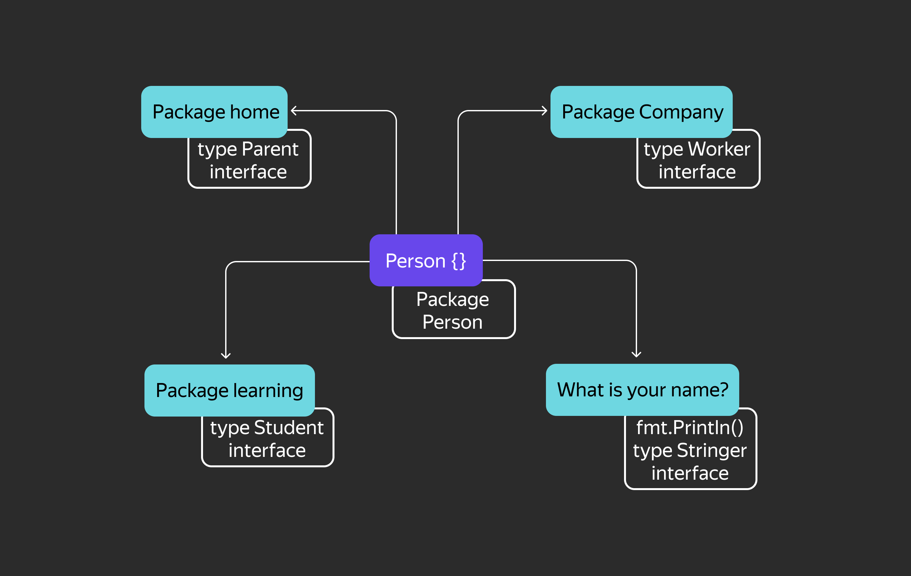
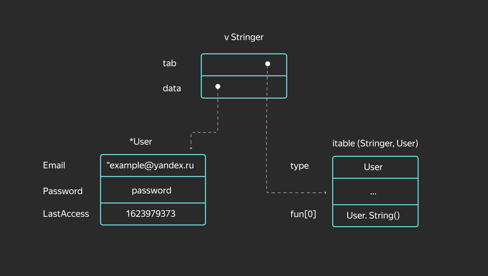
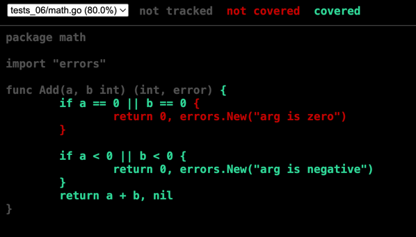
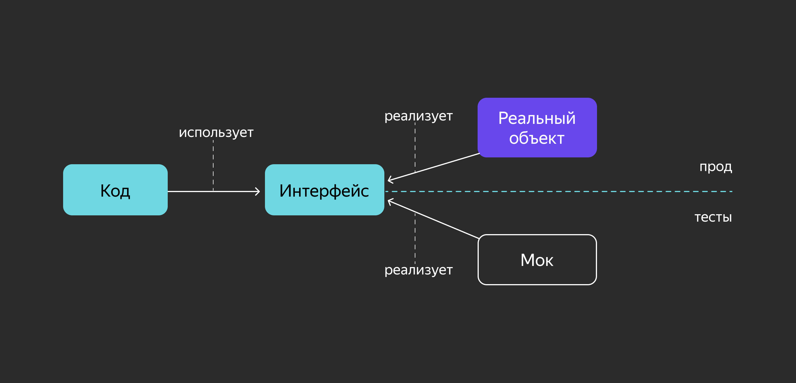

# Базовые типы в Go


## Целые числа
Для представления целочисленных переменных в Go есть ряд типов, различающихся лишь размерностью и отсутствием или наличием знака в них:
- знаковые: int, int8, int16, int32, int64;
- беззнаковые: uint, uint8, uint16, uint32, uint64.

Если размерности int64 недостаточно, можно воспользоваться типом big.Int из пакета math/big.

## Числа с плавающей точкой
Числа с плавающей точкой представлены в двух вариантах: комплексные и вещественные. Как и у целочисленных типов, у них есть разные размерности:
- комплексные: complex64, complex128;
- вещественные: float32, float64.

Двукратную разницу в размерности легко объяснить: переменные типа complex состоят из двух компонентов типа float.

### Арифметические операции
Для числовых типов доступны следующие арифметические операции:
```
+ — сложение,
- — вычитание,
* — умножение,
/ — деление нацело,
% — остаток от деления.
```

Как и в языке С, для этих операций предусмотрена конструкция сокращения a = a + b до a += b:
```go
var a int 
a = 5
a *= 2 // 'a = a * 2'; 10
```

Также доступны операции инкремента и декремента — сокращения a = a + 1 и a = a - 1 соответственно. В отличие, например, от С++, в Go реализованы только постфиксные версии этих операций.
Пример:
```go
var a int
a = 5
a++ // 'a = a + 1'; 6
a-- // 'a = a - 1'; 5 
```

## Булевы значения
Для работы с логическими выражениями в Go представлен базовый тип bool, который принимает значения true и false:
```go
var a bool
a = true
a = false 
```

## Строки
В Go существует встроенный тип string для представления текстовых данных:
```go
var a string
a = "Hello, world!"
```

Строки в Go представляют собой массив из значений типа byte. По этой причине к элементам строки можно обращаться по индексу, а к самим строкам применима встроенная функция len, которая возвращает её длину в байтах:
```go
var a string
a = "abc"
println(len(a)) // 3
``` 

Строка хранится как массив байт, но он неизменяемый:
```go
var a string
a = "abc"
println(a[2]) // выведет значение второго байта 99
// строки в Go неизменяемы, нельзя написать a[2] = 10
a[2] = 10 // здесь будет ошибка
``` 

В данном случае длина строки в байтах равна количеству элементов, но это не всегда так. Дело в том, что Go из коробки поддерживает Unicode, а значит, строки могут содержать символы, не входящие в таблицу ASCII и не умещающиеся в один байт:
```go
var a string
a = "абц"
println(len(a)) // 6 
```

По этой же причине обращение по индексу иногда может возвращать неожидаемое значение:
```go
var a string
a = "абц"
println(a[5]) // 134
```

Для работы с Unicode в Go предусмотрен встроенный тип rune, способный вместить больше одного байта — любой символ таблицы Unicode. Например, с помощью него можно получить корректное количество символов из предыдущего примера:
```go
import "unicode/utf8"
//...
var a string
a = "абц"
println(utf8.RuneCountInString(a)) // 3
```

Строковые значения в Go можно представить ещё одним способом. Если заключить строковое значение в обратные апострофы ``, а не двойные кавычки "", форматирование строки будет автоматически преобразовано в управляющие символы:
```go
var stringFormattedVar string
// следующие выражения равнозначны 
stringFormattedVar = "Hello,\nworld!\n\n\t\t\"quote!\""
stringFormattedVar = `Hello,
world!

        "quote!"`
``` 

## Пользовательские типы
Как и большинство типизированных языков, Go позволяет программисту декларировать собственные типы.
Так, под капотом тип rune определяется как uint32, а byte как uint8:
```go
type rune uint32
type byte uint8
``` 

С помощью определений вы можете создавать новые типы, улучшая читаемость кода.
Из-за строгости типизации вы ограничиваете определениями в том числе применимость функций и конструкций к вашим типам:
```go
type Name string
type Fruit string

var fruit Fruit
var name Name

fruit = "Apple"
name = fruit // ошибка типизации
             // cannot use fruit (variable of type Fruit) as type Name in assignment
```

Чтобы исправить ошибку в этом листинге, нужно явно привести fruit к Name.
Для пользовательских типов можно определять методы (как для классов в ООП, об этом будет позже в курсе).
```go
// декларация пользовательского типа
type MyType string
// декларация метода для пользовательского типа
func (mt MyType) MethodForMyType() {
    //логика метода
} 
```
Определять методы для встроенных типов в Go нельзя.

## Приведение типов

Чтобы привести один тип к другому, в Go используется такой синтаксис: type(variable). Проиллюстрируем на предыдущем примере:
```go
type Name string
type Fruit string

var fruit Fruit
var name Name

fruit = "Apple"
name = Name(fruit) // так, после приведения типов, работает 
```

## Псевдонимы
В Go также есть псевдонимы (aliases) — не путайте с определениями. Псевдонимы позволяют обращаться к типу в коде по другому имени. По синтаксису они похожи на определения:
```go
type MyString = string // MyString здесь — это псевдоним типа string

var a string // можно использовать одно из этих условий для проверки пустой строки
var b MyString
a = b // ошибки нет
```

Можно смешивать псевдонимы и изначальные типы в одном выражении.
Псевдонимы были введены в язык по настоянию Google — для решения задач крупной компании, владельца больших, смежных, пересекающихся code base массивов кода. Применение псевдонимов облегчает масштабный рефакторинг большого объёма уже написанного кода из разных источников. При написании «свежего» кода с чистого листа лучше обходиться без псевдонимов.

## Значения по умолчанию
В отличие от языка C, идейным наследником которого является Go, любая декларация переменной и любая аллокация памяти сопровождаются инициализацией этой памяти. Если в C заявленная переменная может содержать случайное значение, оставшееся в выделенной ей памяти, то в Go переменная сначала гарантированно получает нулевое значение для своего типа.
Все типы имеют значения по умолчанию, которыми автоматически инициируется объявленная переменная, если это не было сделано явно:
- для bool значение по умолчанию — false;
- для числовых типов — 0;
- для ссылочных типов — nil или пустой указатель;
- для string — пустая строка длиной 0.
```go
var str string
// можно использовать одно из этих условий для проверки пустой строки
if str == "" || len(str) == 0 {
...
} 
```


# Переменные и константы

В Go объявление переменной имеет вид: var name type = expression. Можно не указывать тип или оператор присваивания с выражением, но один из них должен присутствовать. Кроме того, существует краткая форма объявления переменной. Рассмотрим все эти варианты:
- Объявление без явного указания типа: var name = expression.
- Длинное объявление с указанием типа: var name type и var name type = expression.
- Короткая нотация: name := expression.
Правил, которые регламентировали бы использование той или иной формы, в Go нет. Можно исходить из личных предпочтений или придерживаться стиля, принятого в вашей компании.

## Объявление без указания типа
Тип переменной можно опускать, если при объявлении происходит инициализация. Тогда тип переменной будет равен типу выражения. Если переменной присваивается число, то компилятор установит тип int или float64.
Опишем в таблице инициализирующие значения и типы, которые компилятор присваивает объявленным переменным:

| Объявление переменной | Тип переменной |
|---|---|
| var i = 10 | int
| var f = 5.0 | float64
| var s = "Hello, world!" | string
| var r = 'Щ' | rune
| var b = true | bool

Множество переменных можно инициализировать через запятую или с помощью вызова функции, которая возвращает несколько значений.
```go
var now = time.Now()  // now равно текущему времени и имеет тип time.Time
var pi, e = 3.1415, 2.7183
var f, err = os.Open("myfile.txt") // os.Open возвращает два значения
```

## Длинное объявление
Если при определении переменной указан только тип, ей будет присвоено нулевое значение этого типа. Если нужно создать несколько переменных одного типа, их можно перечислить через запятую.
```go
var i int // i будет присвоено значение по умолчанию — 0
var s string // s будет равна пустой строке

// определяем три строковых переменных
var name, company, country string 
```

Полная запись с указанием типа и начального значения, как правило, используется тогда, когда тип переменной должен отличаться от типа, который присваивается компилятором по умолчанию.
```go
var id uint32 = 77 
var pi float32 = 3.1415
```

Можно не указывать var перед каждой переменной, а объединять переменные в блоки var (...). Это удобно, когда нужно обозначить схожие по смыслу сущности.
```go
var height int
var length int
var weight float64
var name   string
var company = "Рога и копыта"

// эквивалентно

var (
    height, length int
    weight float64
    name   string
    company = "Рога и копыта"
) 
```

## Короткая нотация
Конструкция с ключевым словом var используется не всегда. В Go есть форма объявления переменной в теле функции с инициализацией. Эту форму принято называть короткой нотацией. Ключевое слово var и тип не указываются, а вместо символа = пишется :=.
```go
i := 10
f := 5.1
doublef := 2*f // doublef имеет тип float64 и равно 10.2

// эквивалентно

var i = 10 
var f = 5.1
var doublef = 2*f  
```

По умолчанию тип переменной равен типу присваиваемого выражения. В случае числовых типов компилятор сам выбирает размерность типа. Это может быть неудобно, когда нужно, например, объявить короткой нотацией переменную типа int64, а не int. Аналогично и с uint.
Проблему решает операция приведения типов:
```go
int64Var := int64(5)
float32Var := float32(101.3)

// эквивалентно

var int64Var int64 = 5 
var floatVar float32 = 101.3
```

Короткая нотация прекрасно работает со множественным объявлением. Но в этом случае хотя бы одна переменная в выражении должна быть новой. В противном случае возникнет ошибка компиляции:
```go
pi, e := 3.1415, 2.7183
// при уточнении значений нельзя использовать :=, так как 
// обе переменных уже определены
pi, e = 3.14159, 2.71828

f, err := os.Open("myfile.txt") 
```

## Константы
Константа — это типизированное значение, которое вычисляется на этапе компиляции и известно компилятору. В отличие от переменной, значение константы не может быть изменено во время работы программы. Вы уже сталкивались с константами ранее — это строковые, булевы и числовые литералы.
```go
var i int = 5 // здесь 5 — безымянная целочисленная константа
s := "Hello " // здесь "Hello" — строковая константа, значением которой
              // инициализирована переменная s
```

Если в коде постоянно используется какое-то число или строка, можно присвоить это значение переменной, но тогда оно не будет защищено от случайного изменения. Для решения этой проблемы Go даёт возможность давать константам имена.


Именованные константы
Ключевое слово const определяет именованную константу, при этом константе можно присвоить результат некоторого выражения. В одном объявлении const можно определить несколько констант.
Именованные константы можно инициализировать выражениями, состоящими из констант или литералов следующих типов:
- числа;
- строки;
- символы (руны);
- булевы значения.

```go
const pi = 3.14159
const doublePi = pi * 2
const version = "1.0.0"

// эквивалентно

const (
   pi = 3.14159
   doublePi = pi * 2
   version = "1.0.0"
)

func main() {
    fmt.Println(version, pi, doublePi)
}
```

Результат:
```
1.0.0 3.14159 6.28318
```

Именованные константы позволяют изменять значение только в одном месте кода. Например, в приведённом примере легко увеличить точность числа пи или изменить номер версии.
## Нетипизированные константы
Именованные константы могут быть разного типа. Тип связан с хранимым значением:
```go
const intConst = 5 
const floatConst = 5.0
const runeConst = 'A'
const strConst = "Hello, world!"
const boolConst = true
```

Может показаться, что если опустить тип при объявлении константы, то компилятор выберет его сам — как в случае с короткой формой объявления переменных. Это так лишь отчасти. В случае с константами отсутствие явного указания типа имеет большее значение.
Например, если вы объявляете константу intConst и присваиваете ей значение 5, то получаете целочисленную константу с неопределённым типом (untyped int). Конкретный тип значения этой константы ещё не определён и в разных контекстах будет интерпретироваться компилятором по-разному. Это позволяет ослабить типизацию для констант, не отказываясь от сильной типизации глобально.
Благодаря этому подходу будет работать следующий пример:
```go
package main

import (
    "fmt"
)

const id = 100

func main() {
    var i int64 = id
    var f float64 = id

    fmt.Println("i=", i, "f=", f)
}
```

Программа выведет:
```go
i = 100 f = 100
```
Если определить id как переменную var id = 100, то возникнут ошибки компиляции при определении переменных i и f:
```
./prog.go:10:16: cannot use id (variable of type int) as type int64 in variable declaration
./prog.go:11:18: cannot use id (variable of type int) as type float64 in variable declaration
```

Если бы константы, как и переменные в Go, всегда имели конкретный тип, то работать с ними было бы сложнее. Более того, Go позволяет смешивать числовые литералы разных типов (untyped int, untyped float), поэтому корректно следующее выражение:
```go
var a float64
a = 5 + 5.0
```

Константы, как и переменные, можно группировать.
```go
const Program = "Моя программа"
const Version = "1.0.0"

// эквивалентно

const (
   Program = "Моя программа"
   Version = "1.0.0"
)
```

Если в группе у константы не указано значение, то оно равно значению предыдущей константы.
```go
const (
    pi = 3.1415
    e
    name = "John Doe"
    fullName
)

func main() {
    fmt.Println("pi =", pi, "e =", e)
    fmt.Println("name =", name, "fullName =", fullName)
}
```

Результатом работы программы будет:
```go
pi = 3.1415 e = 3.1415
name = John Doe fullName = John Doe
``` 

## Типизированные константы
Если при объявлении вы указываете тип константы явным образом, она становится типизированной и подчиняется правилам сильной типизации Go. В этом случае вы работаете с константой как с неизменяемой переменной:
```go
const flag uint8 = 128

func main() {
    var i int = flag
    fmt.Println(i)
}
```

При компиляции этого примера возникнет ошибка cannot use flag (constant 128 of type uint8) as type int in variable declaration, так как у константы flag тип uint8, а у переменной i тип int.

## Ключевое слово iota
Что, если в коде нужно реализовать перечисление (enum)? В Go для этого нет встроенной синтаксической конструкции или специального типа. Однако можно просто объявить ряд констант и работать с ними:
```go
const (
    Black = "black"
    Gray = "gray"
    White = "white"
)

func main() {
    fmt.Println(Black != Gray) // true
}
```

Зачастую в перечислении важна прежде всего возможность различить два элемента. Значения же этих элементов (в данном случае констант) играют второстепенную роль. Это значит, что необязательно использовать строковые константы — вполне подойдут целочисленные:
```go
const (
    Black = 0
    Gray = 1
    White = 2
)

func main() {
    fmt.Println(Black != Gray) // тоже true
}
```

При таком перечислении вручную есть вероятность получить неожиданное поведение — например, если по ошибке присвоить двум константам в перечислении одинаковое целочисленное значение:
```go
const (
    Black = 0
    Gray = 0
)

func main() {
    fmt.Println(Black != Gray) // false
}
```

К тому же при таком подходе не очень удобно объявлять длинные перечисления.
Для удобного объявления и инициализации блоков констант в Go есть автоматический инкремент iota. При объявлении каждого блока const значение iota равно 0 и увеличивается на 1 для каждого следующего элемента:
```go
const (
    Black = iota
    Gray
    White
)

// счётчик обнуляется
const (
    Yellow = iota
    Red
    Green = iota // это присваивание не обнулит iota
    Blue
)

func main() {
    fmt.Println(Black, Gray, White) 
    fmt.Println(Yellow, Red, Green, Blue)
}
```

Программа выведет:
```go
0 1 2
0 1 2 3
```

Данную конструкцию применяют не только для перечислений. Ключевое слово iota можно также использовать в арифметических выражениях, чтобы быстро объявить ряд значений с прогрессией. Следует помнить, что iota увеличивается на единицу для каждой строки, где указано имя константы, даже если той было присвоено конкретное значение.
```go
const (
    _ = iota*10  // обратите внимание, что можно пропускать константы 
    ten
    hundred
    thousand
)

const (
    hello = "Hello, world!"  // iota равна 0
    one = 1                  // iota равна 1

    black = iota   // iota равна 2
    gray
)

func main() {
    fmt.Println(ten, hundred, thousand)
    fmt.Println(black, gray)
}
```

Программа выведет:
```
10 20 30
2 3
```

## Пользовательские типы в константах
Предположим, нужно определить константы для дней недели.
```go
const (
    Monday = iota + 1
    Tuesday
    //...
    Sunday
)
```

Если перечислить их так, то все константы будут иметь нетипизированный числовой тип и могут использоваться в любых выражениях, что может вносить путаницу: var i int = Monday + 1. В подобных случаях стоит определить пользовательский тип и указать его при определении констант.
```go
type Weekday int

const (
    Monday Weekday = iota + 1
    Tuesday
    Wednesday
    Thursday
    Friday
    Saturday
    Sunday
)

func NextDay(day Weekday) Weekday {
    return (day % 7) + 1
}

func main() {
    var today Weekday = Sunday
    tomorrow := NextDay(today)
    fmt.Println("today =", today, "tomorrow =", tomorrow)
}
```

Программа выведет:
```go
today = 7 tomorrow = 1
```

## Литералы
В Go можно использовать различные представления строковых и числовых литералов. Проиллюстрируем на примере целого числа 1000:
```
1000
1000.0
1_000 // можно разделять части числа символом '_' для удобства восприятия
01750 // восьмеричное представление, начинается с 0
0x3e8 // шестнадцатеричное представление
0b001111101000 // бинарное представление
```

Любой из этих литералов может быть использован в выражениях и даст одно и то же значение.


# Область видимости
**Область видимости (scope)** определяет набор правил, по которым осуществляется доступ к объявленным переменным, константам и функциям из различных блоков кода.
В Go область видимости можно охарактеризовать двумя параметрами:
- глобальность/локальность;
- экспортируемость/неэкспортируемость.

## Глобальность/локальность
Объявленные в теле функций переменные, константы и функции характеризуются как **локальные**, то есть их область видимости ограничена тем блоком кода, в котором они объявлены.
В Go локальные переменные можно объявлять ключевым словом var или короткой нотацией :=.
Рассмотрим пример, который иллюстрирует область видимости локальной переменной:
```go
func main() {
    i := 10
    if i == 10 {
        // изменяем значение переменной i
        i += 5 
        if i == 15 {
            // в этом блоке создаётся новая переменная i, которая
            // перекрывает определённую выше переменную с таким же именем
            // следует избегать таких ситуаций на практике
            i := 7
            fmt.Println(i)
            // область видимости этой переменной ограничена блоком
        }
    }
    fmt.Println(i)
}
```

Выведет:
```
7
15
```

Объявленные вне тела функции сущности характеризуются как глобальные и находятся в области видимости всех блоков кода в пакете. То есть глобальные объекты доступны во всех файлах, находящихся в одной директории.

Глобальные переменные нельзя объявлять короткой нотацией :=, необходимо ключевое слово var. Если глобальная переменная не инициализирована, она принимает нулевое значение указанного типа.
```go
// Глобальные константа и переменные.
const program = "Моё приложение"

var name string
var ver = "v1.0.0" // инициализируем глобальную переменную

func main() {
    // изменяем глобальную переменную name
    name = "Вася"
    fmt.Println("Привет, " + name + "!")
    fmt.Println("Добро пожаловать в", program, ver)
}
```

Выведет:
```
Привет, Вася!
Добро пожаловать в Моё приложение v1.0.0
```


## Экспортируемость/неэкспортируемость
Если предыдущее свойство характеризует доступность объекта внутри пакета, то экспортируемость регламентирует доступность из других пакетов.

`Экспортируемыми могут быть только глобальные сущности.`

**Экспортируемые** переменные, константы и функции определённого пакета доступны из тех пакетов, которые импортируют этот пакет ключевым словом `import`.
Доступ к экспортируемым объектам осуществляется конструкцией `<имя пакета>.<Имя сущности>`. Проиллюстрируем на примере `Hello, world!`:
```go
package main

import "fmt"

func main() {
    fmt.Println("Hello, world!")
}
```

Здесь в функции `main` программа обращается к пакету стандартной библиотеки `fmt`, вызывая её экспортируемую функцию `Println`.

`Как Go определяет, что сущность экспортируемая? Если имя переменной, константы или функции начинается с прописной буквы, то она экспортируемая. Если со строчной, то неэкспортируемая.`

К **неэкспортируемым** сущностям нельзя обратиться за пределами пакета. Этот подход — часть того особенного ООП, который реализует в Go сокрытие данных или `инкапсуляцию`.


Проиллюстрируем на примере определение экспортируемых и неэкспортируемых объектов.
```go
package contacts

// Email 
const Email = "support@example.com" // глобальная экспортируемая константа

var support string // глобальная неэкспортируемая переменная

// SetSupport устанавливает значение переменной support.
func SetSupport(s string) { 
    support = s
}

// GetContact возвращает имя и email.
func GetContact() string {
    return fmt.Sprintf("%s <%s>", support, Email)
}
```

Если импортировать этот пакет, то будут доступны константа `Email`, функции `SetSupport` и `GetContact`.
```go
package main

import (
    "fmt"
    "internal/contacts"
)

func main() {
    contacts.SetSupport("Служба поддержки")
    fmt.Println(contacts.GetContact())
    fmt.Println("Email:", contacts.Email)
}
```

Выведет:
```
Служба поддержки <support@example.com>
Email: support@example.com
```


# Операторы ветвления
В ситуациях, когда ход работы программы должен меняться в зависимости от условия, применяют операторы ветвления, или, как их ещё называют, условные операторы. В языке Go есть как стандартные условные операторы, так и специфичные для языка.
Для начала вспомним операторы сравнения (переменных одного типа):
```
> — больше;
< — меньше;
>= — больше или равно;
<= — меньше или равно;
== — равно;
!= — не равно.
```

А также логические операторы:
```
&& — логическое И;
|| — логическое ИЛИ;
! — логическое НЕ.
```

## Условие if — else
```
if a == 1 {
    // сценарий, если условие if выполнено
} else if a == 2 {
    // сценарий, если условие else if выполнено
} else {
    // сценарий, если условие else if не выполнено
} 
```
Это простой пример условной конструкции. Она может состоять только из одного оператора if — тогда блок кода сработает, если условие верно, а если неверно, то ничего не произойдёт.

Опционально можно добавить оператор else. За ним будет следовать блок кода, который выполнится, если исходное условие неверно.

И наконец, если нужно обработать несколько различных условий, используют оператор else if. В код можно добавить много else if, но это не самый «читабельный» вариант — в подобных случаях лучше использовать case, о котором расскажем ниже.

Приведём примеры операторов с различными вариантами условий:
```
// логическое НЕ
// возвращается одна переменная типа bool
a := false
if !a {} 

// логическое И
var a, b int
if a == 1 && b == 2 {}

// исключающее ИЛИ (XOR)
var a, b bool
if (a || b) && !(a && b) {} 
```

### Общие правила для условных операторов:
1. Обязательно использовать фигурные скобки { }, чтобы обозначить область видимости оператора.
2. Необязательно заключать основное условие в круглые скобки ( ), но с ними удобнее читать код.
3. Можно добавлять круглые скобки ( ), чтобы группировать части условия.

В Go применяется «ленивая» проверка условий: она идёт слева направо до первого false и прекращается, потому что проверять дальше нет смысла. Пример «ленивой» проверки:
```
a, b := 1, 0

if a == 1 || b == 2 {
    fmt.Println("Hello")
} 
```
В данном примере выполняется левое условие, поэтому проверки (или выполнения) правой части не последует. Пример будет более показателен, если для правой части условия использовать функциональный литерал (подробнее расскажем в теме «Функции»), который будет просто изменять значение переменной b.
```
a, b := 1, 0

incB := func() bool {
    b = b + 1
    return true
}

if a == 1 || incB() {
    fmt.Println("Hello")
}

fmt.Println(a, b) 
```
```
Hello
1 0
```
Из-за «ленивой» проверки условий функция incB не выполнится — её значение не изменится, то есть функция не изменит значение переменной, потому что выполнение кода прервётся.

Оператор if может состоять из двух компонент: инициализации и основного условия. Такая техника позволяет объявлять локальную переменную, которую используют только в рамках области видимости if. Это может пригодиться, например, когда нужно преобразовать данные для сравнения.
```
a := 0.10000001 // float64
// инициализация и основное условие
if b := float32(a); b > float32(0.1) {
    fmt.Println("Var a is GT float32(0.1)")
} 
```
Условие в данном примере может перестать выполняться, если добавить ещё один ноль: 0.100000001. Тип float32 обеспечивает точность в восемь десятичных чисел, в то время как точность float64 составляет около 15 чисел.

## Условие switch — case
```go
var a int

switch a {
case 1:
    fmt.Println("1")
case 2:
    fmt.Println("2")
case 3, 4:
    fmt.Println("3 or 4")
default:
    fmt.Println("Default case")
} 
```
Конструкция switch — case позволяет избежать дублирования else if. Проверка условий идёт сверху вниз и слева направо, поэтому в примере выше условия будут проверяться в таком порядке: 1, 2, 3, 4.

Наличие блока default необязательно — его можно опустить, если не требуется описывать «стандартное» поведение. Этот блок выполнится, если ни одно из условий не отработало.

Основное условие switch может быть не задано явно:
```go
var a int

switch {
case a == 100:
    fmt.Println("EQ 100")
case a > 0:
    fmt.Println("GT 0 AND NEQ 100")
case a < 0:
    fmt.Println("LT 0 AND NEQ 100")
} 
```
В этом примере важен порядок условий case: если переместить a == 100 в конец, то a > 0 всегда будет срабатывать первым для положительных чисел. Такая форма оператора аналогична множественному else if.

Внутри switch можно объявить локальную переменную, доступную только в пределах области видимости оператора:
```go
a := 6
switch b := a % 5; {
case b == 0:
    fmt.Println("Кратно 5")
default:
    fmt.Printf("Остаток от деления на 5: %d", b)
}
```
Чтобы досрочно прервать выполнение case, используют ключевое слово break. Это бывает полезно, когда внутри case есть условные конструкции. В Go нет необходимости явно указывать break в конце каждого case, так как следующий блок case автоматически не выполнится при совпадении условия.

Когда нужно всё-таки выполнить следующий блок, используют ключевое слово fallthrough. Если указать его в конце блока кода, то после него будет выполнен блок в следующем case или default.
```go
a := -100
switch {
case a > 0:
    if a % 2 == 0 {
        break
    }
    fmt.Println("Odd positive value received")
case a < 0:
    fmt.Println("Negative value received")
    fallthrough
default:
    fmt.Println("Default value handling")
} 
```
У ключевого слова fallthrough есть особенности:
- его можно использовать только в последней строке case, иначе будет ошибка компиляции;
- оно игнорирует условие следующего по порядку case.


# Циклы
Опуская области применения циклов, рассмотрим их формы в языке Go.
В программировании для циклов используют конструкции `for`, `while`, `do — while` и другие.
Создатели Go придерживаются правила «чем проще, тем лучше», поэтому для всех видов цикла в языке есть только одно ключевое слово — `for`.


## Бесконечный цикл
```go
for {
    // код, выполняемый внутри бесконечного цикла
}
```

Такой цикл чаще всего встречается в worker-паттерне: фрагмент кода должен выполняться до завершения процесса или потока, пока не будет прерван внешним событием.

Использовать фигурные скобки `{ }` для обозначения области видимости цикла обязательно.


## Трёхкомпонентный цикл
```go
// создаём переменную
v := 0
// 
for i := 1; i < 10; i++ {
    // наращиваем переменную
    v++
}
// выводим результат на экран
fmt.Println(v)
```

Классическая форма цикла состоит из трёх компонентов:
- `i := 1` — инициализация (pre-действие): выполняется единожды при входе в scope цикла;
- `i < 10` — основное условие: пока условие true, итерации будут продолжаться;
- `i++` — post-действие: выполняется по завершении каждой итерации цикла.

Заполнять каждую компоненту необязательно — можно опускать.

Есть ещё два варианта бесконечного цикла, но в форме трёх компонент:
```go
for ;; {}
for ; true; {}
```

Компоненты цикла могут принимать более комплексный вид:
```go
for a, b := 5, 10; a < 10 && b < 20; a, b = a + 1, b + 2 { 
    // do stuff
}
```

## Цикл while
```go
// создаём переменную
i := 0
// описываем предусловие
for i < 5 {
    // наращиваем переменную
    i++
}
// выводим результат на экран
fmt.Println(i)
```
 
Цикл `while` похож на трёхкомпонентный, но здесь оставлено только основное условие.


## Цикл range
```go
// создаём массив
array := [3]int{1, 2, 3}
// итерируемся
for arrayIndex, arrayValue := range array {
    fmt.Printf("array[%d]: %d\n", arrayIndex, arrayValue)
}
```

Цикл `range` используется для комплексных типов — слайса и мапы (map).
Подробнее об этом цикле расскажем в следующей теме, посвящённой композитным типам.


## Ключевые слова break и continue
Текущую итерацию цикла можно прервать ключевыми словами:
- `break` — выход из цикла;
- `continue` — переход к следующей итерации цикла (вызов post-действия, если оно задано).

Для примера посчитаем сумму всех чётных чисел от 0 до заданного предела:
```go
sum, limit := 0, 100
for i := 0; true; i++ {
    if i % 2 != 0 {
        continue // переход к следующему числу, так как i — нечётное
    }
    
    if sum + i > limit {
        break // выход из цикла, так как сумма превысит заданный предел
    }
    
    sum += i
}
fmt.Println(sum)
``` 

Ключевые слова `break` и `continue` относятся к ближайшему по области видимости циклу.


## Метки
В языке Go есть метки (labels), которые позволяют перемещаться к разным частям кода.

Метку можно указать для операторов:

- `break;`
- `continue;`
- `goto` (безусловный оператор перехода, позволяет перейти в любое место кода).

Приведём пример для `break`:
```go
outerLoopLabel:
    for i := 0; i < 5; i++ {
        for j := 0; j < 5; j++ {
            fmt.Printf("[%d, %d]\n", i, j)
            break outerLoopLabel
        }
    }
    fmt.Println("End")
```
```
[0, 0]
End
```

Здесь `break outerLoopLabel` прерывает выполнение внешнего цикла.

А вот пример для continue:
```go
outerLoopLabel:
    for i := 0; i < 5; i++ {
        for j := 0; j < 5; j++ {
            fmt.Printf("[%d, %d]\n", i, j)
            continue outerLoopLabel
        }
    }
    fmt.Println("End")
```
```
[0, 0]
[1, 0]
[2, 0]
[3, 0]
[4, 0]
End
```

Здесь continue `outerLoopLabel` вызывает переход к следующей итерации внешнего цикла. Если заменить `continue outerLoopLabel` на `break`, результат будет аналогичный.

Ключевые слова `break` и `continue` без указания метки относятся к текущей (ближайшей) области видимости кода.

Посмотрите, как можно вывести чётные числа в диапазоне [0:20] с указанием десятка.
```go
group := 0
for i := 0; i < 20; i++ {
    switch {
    case i % 2 == 0:
        if i % 10 == 0 {
            group++
            break // break относится к ближайшему switch
        }
        fmt.Printf("%02d: %d\n", group, i)
    default:
    }
}
```
```
01: 2
01: 4
01: 6
01: 8
02: 12
02: 14
02: 16
02: 18
```
Использование меток в Go, как и во многих других языках, — тема вечных споров. Считается, что метки делают код неочевидным, превращают в так называемый спагетти-код


# Указатели

Все данные программы, включая переменные, хранятся в памяти компьютера. Нумерация поддерживает порядок в ячейках, и такие номера называются адресами. Каждая переменная имеет адрес в виде целого положительного числа.
Если нужно передать переменную из одной части программы в другую, хватит обычного копирования:
```go
a := 5

var b int
b = a
```

Значение переменной `а` полностью скопировалось в `b`.

В плане удобства это далеко не универсальный способ.
Во-первых, размер переменной `a` может быть очень большим, копирование займёт много времени.
Во-вторых, иногда копии может быть недостаточно и нужно получить саму переменную — к примеру, чтобы изменить её значение.

> Тогда на помощь приходят указатели. Если вы знакомы с языком С, то легко разберётесь и с указателями в Go, в то время как программистам на Python придётся вникать в новую тему.

Итак, если у каждой переменной есть адрес, мы можем передавать его, а не сами данные, хранящиеся в ячейке памяти.
За хранение значения адреса переменной в Go отвечают указатели.
Данные любого типа хранятся в виде двоичных чисел, поэтому для определения конкретного типа данных в ячейке памяти указатель сам имеет соответствующий тип.

Синтаксис переменной типа «указатель» очень простой:
```go
var p *int
```
 
Здесь создали переменную типа «указатель на целое число». В Go можно создать указатель на любой тип данных.

Физически указатель — это ячейка памяти, хранящая адрес ячейки, на которую «смотрит» указатель.
После создания указатель не «смотрит» ни на одну ячейку памяти в компьютере и имеет нулевое значение.
Оно выглядит как `nil`.

Для того чтобы присвоить указателю значение (адрес какой-либо переменной), используется операция взятия адреса `&`:
```go
var a int = 5
p := &a

fmt.Println(a,p) //a=5 p=0xc0000b2008
```

Значение указателя на 64-битном компьютере — это 64-битное число.
Именно размер указателя на данной системе задаёт характеристику битности компьютера.

На разных платформах значение указателя `p` будет разным.
Именно поэтому значение указателя не имеет смысла за пределами программы.

Чтобы получить значение указателя, в памяти должна быть переменная, на которую он «смотрит». Такое значение называется адресуемым (adressable). С константами сложнее — у них забрать адрес не получится.
```go
const c = 5
p1 := &"abc" // ошибка компиляции
p2 := &с // ошибка компиляции
```
 
Тип переменной, на которую создаётся указатель, должен соответствовать типу указателя.
```go
var p *int
var a int = 5
var b string = "abc"
p = &a 
p = &b // ошибка компиляции
```

Литералы композитных типов создают в памяти переменную соответствующего типа, поэтому указатель можно создать вот так:
```go
type A struct {
  IntField int
}
// Литерал А{} создаёт в памяти переменную типа А. Затем от неё берётся указатель
p := &A{ 
  IntField: 10,
}
```

А ещё в Go есть встроенная функция `new()`. В качестве параметра ей передаётся тип, а возвращается указатель на новую переменную соответствующего типа.
```go
type A struct {
    IntField int
}

p := new(A) //  то же самое, что и &A{}
```

Указатели ведут себя так же, как и обычные переменные. Их можно копировать, присваивая другим переменным тип указателя, передавать и возвращать в функции, а также создавать указатели уже на них.

Тип указателя на указатель описывается как `**T`, например `**int`.

Чтобы получить или изменить значение, хранящееся по указателю, применяют оператор **разыменования (dereference)** `*`.
```go
i := 42
p := &i
fmt.Println(*p) // читаем значение переменной i через указатель p
*p = 21         // записываем в переменную i значение 21 через указатель p
```

Вызов оператора разыменования на `nil`-указателе приведёт к панике на этапе исполнения кода, и программа откажется работать дальше.
```go
var p *int
fmt.Println(*p) // panic: runtime error: invalid memory address or nil pointer dereference
``` 


## Указатели и структуры
Для указателей на структуры в Go есть возможность неявного разыменования при доступе к полям структуры.
```go
type A struct {
    IntField int
}

p := &A{}
p.IntField = 42 // вместо (*p).IntField = 42 
```


## Сравнение указателей
Для указателей определены операторы сравнения (`==`, `!=`).
Два указателя равны, если они указывают на один и тот же объект в памяти либо если оба равны `nil`.


## Когда стоит использовать указатели
- Когда нужно изменить значение переменной из вызываемой функции. Если передать переменную по значению, все модификации внутри функции применятся к локальной копии и оставят исходную переменную неизменной.
    ```go
    incrementCopy := func(i int) {
      i++
    }
    
    increment := func(i *int) {
      (*i)++
    }
    
    i := 42
    
    incrementCopy(i)
    fmt.Println(i) // 42
    
    increment(&i)
    fmt.Println(i) // 43
    ```
   
- Когда нужно подчеркнуть, что значение может отсутствовать.
  Например, есть функция, которая возвращает запись о пользователе `type User struct{...}` по его идентификатору. Результат-указатель даёт понять, что не по всем идентификаторам может быть найден пользователь. Пример функции с такой сигнатурой:
    ```go
    func FindUser(id UserID) *User
    ```

- Когда вы работаете с ресурсами вроде файловых дескрипторов или сокетов. 
  Копирование таких переменных может быть связано с исчерпанием системных ресурсов или вообще не производиться.
- Когда вы работаете с большими переменными и на копирование по стеку затрачивается больше ресурсов, чем на сборку мусора от указателей.


## Когда не стоит использовать указатели
- Когда хочется ускорить приложение и кажется, что копирование структур — слишком дорогая операция.
  До тех пор, пока нет тестов, однозначно показывающих, что указатели повышают производительность, лучше не пытаться оптимизировать.
  Вероятнее всего, напрасно потратите силы или снизите производительность системы, увеличив расходы на сборку мусора.
- Задумываться о замене передачи по значению на передачу по указателю стоит, когда размер структуры достигает порядка сотен байт.
- Когда множество указателей в памяти сильно нагружают сборщик мусора.
  Такое может произойти, к примеру, при создании собственной `in-memory` базы данных.


## Сравнение указателей в Go и C/С++
Синтаксис указателей в Go идентичен побратимам из С, как и многие другие параметры.
Однако есть пара важных различий.

Указатели в Go не имеют адресной арифметики.
Несмотря на то что указатель хранит адрес, который является числом, к нему нельзя применять арифметические операции.
Это не относится к недостаткам, потому что было сознательно убрано для повышения безопасности кода.

Указатель может «смотреть» не на любой участок памяти — только на существующий и соответствующий типу указателя.

По сути указатель близок к иммутабельности — его можно создать и присвоить адреса существующих переменных.
В С это реализовано гораздо шире.

Сборщик мусора, одна из ключевых фишек Go, не сможет удалить переменную, пока на неё «смотрит» какой-либо указатель.
Поэтому можно обойтись без ручного высвобождения памяти операцией `free`.


## Пример работы с указателями
Представим некоторую структуру, которая описывает пользователя:
```go
type Person struct {
  Name string
  Age int
  lastVisited time.Time
}  
```

В поле `LastVisited` нужно сохранять дату последнего посещения.
Напрямую сделать это нельзя, ведь поле неэкспортируемое.
Без указателей функция выглядела бы примерно так:
```go
func GetPersonWithLastVisited(p Person) Person {
    return Person{
        Name:        p.Name,
        Age:         p.Age,
        lastVisited: time.Now(), // time.Now() возвращает текущее время
    }
}

p := Person{
  Name: "Alex",
  Age: 25,
  lastVisited: time.Time{}, // пустое значение времени — пользователь ещё не посещал наш сервис
}

p = GetPersonWithLastVisited(p) 
```

У такого подхода много недостатков.
Структура сначала копируется в функцию, потом создаётся новая структура, в неё копируются поля старой, а затем результат должен быть скопирован в старую структуру.
Кроме того, изменения в структуре потребуют изменений в коде функции, даже если логически её это не касается.

C указателями всё становится проще:
```go
func UpdatePersonWithLastVisited (p *Person )  {
  p.lastVisited = time.Now() 
} 

p := Person{
  Name: "Alex",
  Age: 25,
  lastVisited: time.Time{},
}

UpdatePersonWithLastVisited(&p)
```
 
Здесь в функцию был передан указатель на переменную, что позволило изменить её поле без лишнего копирования.
Такая функция работает быстрее, а код становится проще.

В следующих уроках подробнее расскажем о функциях-методах, которые позволяют решить эту задачу более изящно.
Само собой, при участии указателей.


## Дополнительные материалы
[Подробная статья о том, как Go работает с памятью](https://medium.com/eureka-engineering/understanding-allocations-in-go-stack-heap-memory-9a2631b5035d)
[How large should a struct be before you should pass by reference for performance?](https://www.reddit.com/r/golang/comments/rcnyhr/how_large_should_a_struct_be_before_you_should/)
[Наглядное разъяснение указателей](https://dave.cheney.net/2017/04/26/understand-go-pointers-in-less-than-800-words-or-your-money-back)


# Массивы
**Массив** — это последовательность фиксированной длины, состоящая из элементов одного типа. 
Массивы используются для работы с набором элементов, количество которых не изменяется, и там, где нужно иметь набор однотипных элементов известной длины.

Представим, что у нас есть задача хранить набор значений: например, среднесуточную температуру за каждый день недели (всегда 7 дней).
Тогда здесь можно объявить массив:
```go
var lastWeekTemp [7]int
```

Число в скобках определяет длину массива, а литерал после скобок — тип элементов.

В Go количество элементов в массиве — это часть типа, то есть массивы `[3]int` и `[5]int` относятся к разным типам.

Чтобы определить в коде такую переменную, компилятор выделит в памяти область, размер которой будет определяться количеством элементов, умноженным на размер элементов.
Каждый элемент будет проинициализирован значением по умолчанию.

Все элементы в памяти расположатся последовательно, поэтому доступ к ним будет иметь константную сложность O(1).
Для обращения к элементам массива используются квадратные скобки `[]`:
```go
tempOnWednesday := lastWeekTemp[2]
``` 

В Go индексация массивов начинается с нуля, как и в большинстве других языков программирования.
Довольно часто встречается ситуация, когда при объявлении массива требуется задать значения массива сразу. 
В Go можно совместить объявление и инициализацию в одной конструкции.

Инициализация производится с помощью литерала массива:
```go
thisWeekTemp := [7]int {-3,5,7} // [-3 5 7 0 0 0 0]
rgbColor := [3]uint8 {255,255,128} // [255 255 128]
```

Здесь указывается сначала тип массива `[7]int`, а затем в фигурных скобках через запятую — элементы массива, то есть список инициализации.

Для компилятора тип массива в приоритете: если вы указали массив из семи элементов, но в списке инициализации всего три, то оставшиеся элементы будут проинициализированы значениями по умолчанию.

Компилятор следит за размером списка инициализации, и уже такую конструкцию скомпилировать не получится:
```go
rgbColor := [3]uint8{1, 2, 3, 4} // array index 3 out of bounds [0:3]
```

Количество элементов в массиве может быть выведено автоматически по длине списка инициализации. 
Для этого используется следующая конструкция:
```go
rgbColor := [...]uint8{255,255,128} // [255 255 128] len = 3
rgbaColor := [...]uint8{255,255,128,1} // [255 255 128 1] len = 4
```

Три точки указывают компилятору, что размер массива должен быть выведен исходя из размера списка инициализации.

Иногда возникает необходимость указать в списке инициализации только один или несколько элементов массива, а другие не трогать.

Если бы вам понадобилось указать значение среднесуточной температуры в воскресенье, код вряд ли порадовал бы своей утончённостью:
```go
thisWeekTemp := [7]int {0,0,0,0,0,0,11} // [0 0 0 0 0 0 11] 
```

Для больших массивов это превратилось бы в нечитаемую конструкцию:
```go
var thisWeekTemp [7]int // [0 0 0 0 0 0 0]
thisWeekTemp[6] = 11 // [0 0 0 0 0 0 11] 
```

Однако в списке инициализации можно указать только нужные элементы и их индексы. 
Индекс и значение указываются через двоеточие.
```go
thisWeekTemp := [7]int {6:11, 2:3} // [0 0 3 0 0 0 11] 
```

Размер массива может быть получен встроенной функцией len. 
Так как размер массива известен на этапе компиляции, то вычисление этой функции при компиляции подменяется конкретным значением.

Если попытаться обратиться к элементу массива за пределами его размера, то сработает механизм защиты памяти в Go и начнётся паника.
В отличие от языка C, компилятор и рантайм Go контролируют выход за пределы массива, не позволяя обратиться к недопустимым областям памяти. 


## Многомерные массивы
**Многомерные массивы** создаются так же, как и одномерные. 
Каждая размерность массива указывается в отдельных квадратных скобках.
```go
var thisMonthTemp [4][7]int // массив из четырёх недель, каждая из которых — массив из семи дней  
```

Многомерные массивы удобно представлять себе как массив массивов:
```go
var rgbImage [1080][1920][3]uint8 // изображение — это массив из 1080 строк длиной в 1920 пикселей. Каждый пиксель — массив из трёх байт
            // 1080 — размер массива
            // [1920][3]uint8 — тип элемента 
```

Доступ к элементам многомерного массива осуществляется через квадратные скобки:
```go
line := rgbImage [2] // 3-я строка в изображении
pixel := rgbImage[2][3] // 4-й пиксель в третьей строке изображения
red :=  rgbImage[2][3][1] // значение синей компоненты (второй байт) 4-го пикселя в третьей строке изображения 
```


## Обход значений массива
Для работы с массивами часто используются циклы. Например, когда нужно посчитать среднюю температуру (округлённо) в течение недели:
```go
var weekTemp = [7]int{5,4,6,8,11,9,5} 

sumTemp := 0

for i:= 0; i < len(weekTemp); i++ {
    sumTemp += weekTemp[i]
}

average := sumTemp/len(weekTemp)
```

Здесь вводится дополнительная переменная `i`, которая увеличивается на каждом шаге.
В Go есть более удобная конструкция `for range`, которая позволяет обойти элементы массива последовательно, не используя дополнительные переменные:
```go
var weekTemp = [7]int{5, 4, 6, 8, 11, 9, 5} 

sumTemp := 0

for _, temp := range weekTemp {
    sumTemp += temp
}

average := sumTemp/len(weekTemp)
```

Оператор `range` на каждой итерации возвращает индекс и значение следующего элемента в массиве.

> Обратите внимание на следующий важный момент: конструкция `_, temp := range weekTemp` создаёт новую переменную `temp`, тип которой будет определяться типом элемента массива.

Этой переменной на каждой итерации цикла будет присваиваться следующее значение из массива.
Если изменить значение переменной `temp`, то это не повлияет на значения в массиве.

Чтобы получить доступ к элементу массива, понадобится индекс:
```go
var weekTemp = [7]int{5, 4, 6, 8, 11, 9, 5} 
// weekTemp [5 4 6 8 11 9 5]
for _, temp := range weekTemp {
   temp = 0 
}
// weekTemp [5 4 6 8 11 9 5] ! — значения не изменились
// если значение элемента не используется, можно опустить вторую переменную
for i := range weekTemp {
   weekTemp[i] = 0 
}
// weekTemp [0 0 0 0 0 0 0] ! — значения изменились
```

Переменные массивов можно присваивать друг другу, однако у них должен быть одинаковый тип, причём количество и тип элементов должны совпадать.

В процессе присваивания выполняется полное копирование массива, и если программа обрабатывает достаточно большие массивы данных, то эти копирования могут существенно замедлить работу программы и увеличить потребление памяти.

**Передача массива** (как и переменной любого другого типа) в функцию — это копирование его значения в переменную аргумента функции. Здесь тоже будет полное копирование.

> С циклом `for range` связан ещё один важный момент — операнд `range` копируется во временную переменную, которая уже используется для обхода.

Это также может замедлить выполнение программы для массивов, поэтому следует использовать взятие указателя, чтобы не простаивать:
```go
for _, temp := range &weekTemp {
   temp = 0 
}
```

Об указателях подробно рассказано в соответствующем уроке.


## Преимущества применения массивов
1. Элементы массива всегда располагаются в памяти последовательно, этому радуется процессор и ускоряет выполнение программы.
2. Массивы имеют фиксированную длину, поэтому выделение памяти под массив происходит ровно один раз в момент его объявления.
3. Время доступа к элементам массива минимальное.
4. Go проверяет выход за пределы массива на этапе компиляции, если может вычислить значение индекса элемента на этапе компиляции, и во время исполнения программы. В первом случае будет ошибка компиляции, а во втором — паника. Панику лучше не допускать.


## Недостатки применения массивов
1. Массивы могут быть только фиксированной длины: если количество элементов нам заранее неизвестно, память придётся выделять с запасом.
2. Массивы передаются и присваиваются с полным копированием элементов, что грозит внезапным ухудшением производительности и увеличенным расходом памяти.
3. Для обработки массивов разных габаритов придётся писать разные функции (если не используются дженерики).

Массивы следует применять крайне обдуманно, когда размеры вашего массива точно известны на этапе компиляции.
Это позволяет ускорить работу программы.

Для того чтобы исправить недостатки массивов, в Go введены слайсы, которые будут рассмотрены ниже.

## Слайсы
Раз длина массива — это часть его типа, то массивы не подходят для хранения коллекций данных динамического размера.
Эту задачу решает другой тип данных, который гораздо чаще используется на практике, — **слайс (от англ. slice)**, или срез.
Кроме того, слайс избавит нас от проблемы копирования массивов для присваивания.

**Слайс** — это последовательность переменной длины, состоящая из элементов одного типа.
Тип слайса записывается как тип массива без указания размера.
Можно инициализировать переменную типа «слайс» значениями, но, в отличие от массива, переменная без инициализации равна nil.
```go
var mySlice []int
```
 
Слайс очень похож на `list` в языке Python, но имеет свои особенности.

Слайс — это обёртка над указателем массива, и в Go слайс используется как структура следующего вида:
- указатель на первый элемент базового массива — `ptr`;
- длина слайса — `len`, количество элементов в слайсе;
- ёмкость слайса — `cap`, количество элементов в массиве.


Параметры слайса `len` и `cap` могут быть получены с помощью вызова соответствующих встроенных функций `len()` и `cap()`.

Если просто объявить такую структуру, то она будет равна `nil`.

Для создания слайса используется встроенная функция `make()`:
```go
mySlice := make([]TypeOfelement, LenOfslice, CapOfSlice)
mySlice := make([]int,0) // слайс [], базовый массив []
mySlice := make([]int,5) // слайс [0 0 0 0 0], базовый массив [0 0 0 0 0]
mySlice := make([]int,5,10) // слайс [0 0 0 0 0], базовый массив [0 0 0 0 0 0 0 0 0 0]
```

Аргументы функции `make`:
1. Тип слайса (пустые квадратные скобки и тип элемента слайса).
2. Длина слайса. Если не передана, то по умолчанию равна нулю.
3. Ёмкость слайса — размер базового массива. Если значение не передано, то по умолчанию равна длине слайса.

Функция `make` создаёт массив длиной `cap` и записывает указатель на него в структуру слайса.
Также она заполняет поля `len` и `cap` в этой структуре и возвращает её в виде переменной типа «слайс».

Даже если `len` и `cap` переданы как нулевые, сама структура уже не будет равна `nil`.
Она будет выделена в памяти, и указатель на базовый массив получит значение, отличное от `nil`.

Если передать в функцию `make` параметр `cap` меньше `len`, то будет вызвана ошибка компиляции или паника во время исполнения.

Слайс может быть создан из композитного литерала так же, как и массив. Единственное отличие — не указываем размер массива:
```go
s = []int{1, 2, 3}  // [1 2 3]
```

Длина и ёмкость слайса будут равны композитному литералу.

Новый слайс может быть создан на основе уже существующего слайса или массива.
Для этого используется операция взятия слайса.
Она выполняется с помощью двух скобок с двоеточием `[i:j]`, где `i` — индекс первого элемента нового слайса, а `j` — индекс следующего элемента, не входящего в новый слайс.

Допускается не указывать `i` и `j` — в таком случае `i` по умолчанию будет равен 0, `j` — равен длине массива или слайса.

Таким образом, `[:]` вернёт слайс всего массива, `[:k]` — от начала и до k-го элемента, `[k:]` — от k-го элемента до конца массива.

`i` и `j` должны быть неотрицательны и меньше `len`, иначе будет вызвана ошибка компиляции или паника.

Рассмотрим пример с массивом среднесуточных температур из раздела про массивы.
```go
weekTempArr := [7]int{1,2,3,4,5,6,7}
workDaysSlice := weekTempArr[:5]
weekendSlice := weekTempArr[5:]
fromTuesdayToThursDaySlice := weekTempArr[1:4] 
weekTempSlice := weekTempArr[:]

fmt.Println(workDaysSlice, len(workDaysSlice), cap(workDaysSlice)) // [1 2 3 4 5] 5 7
fmt.Println(weekendSlice, len(weekendSlice), cap(weekendSlice)) // [6 7] 2 2 
fmt.Println(fromTuesdayToThursDaySlice, len(fromTuesdayToThursDaySlice), cap(fromTuesdayToThursDaySlice)) // [2 3 4] 3 6 
fmt.Println(weekTempSlice, len(weekTempSlice), cap(weekTempSlice)) // [1 2 3 4 5 6 7] 7 7 
```

### Задание 3 для самопроверки
> Попробуйте изменить какой-либо элемент в одном из этих слайсов через операцию []. 
> Убедитесь, что значения изменились и в других слайсах.
> Все слайсы в этом примере действительно смотрят на один и тот же базовый массив.
> Обратите внимание на ёмкость — она равна размеру базового массива, кроме первых элементов.

> В слайс workDaysSlice взяли элементы с 0 по 4, однако 5 и 6 по-прежнему остаются в массиве.


## Изменение размеров слайса
Как вы уже знаете, слайс — последовательность элементов динамического размера.

Уменьшение размера слайса производится через операцию взятия слайса.
Результат взятия можно присвоить этому же слайсу:
```go
s := []int{1,2,3} // [1 2 3]
s = s[:len(s)-1] // [1 2]
```

Ёмкость массива при этом не изменяется.

Для увеличения размера слайса используется встроенная функция `append`.
Она принимает переменную типа «слайс» и одну или несколько переменных типа элемента слайса, затем возвращает новый слайс, который состоит из копии переданного слайса и переданных в него элементов.

> Внимание: `append` не изменяет переданный ей слайс, а создаёт новый на основе переданного.

Рассмотрим пример:
```go
a := []int{1, 2, 3}
fmt.Println(a, len(a), cap(a)) // [1 2 3] 3 3
b := append(a, 4)
fmt.Println(a, len(a), cap(a)) // [1 2 3] 3 3
fmt.Println(b, len(b), cap(b)) // [1 2 3 4] 4 6
``` 

После выполнения `append` значение `a` не изменилось, зато `b` увеличилось на один элемент, и его длина стала равна 4, а ёмкость 6.

Дело в механике `append`: если ёмкость слайса позволяет разместить добавляемые элементы — то есть разница между длиной слайса и его ёмкостью больше или равна количеству размещаемых элементов, — то `append` создаёт новый слайс, используя тот же базовый массив, а новые элементы записываются в него сразу после имеющихся элементов слайса.

Если же ёмкость слайса не позволяет разместить эти элементы, то создаётся новый базовый массив вдвое больше существующего, в него копируются все элементы переданного слайса и добавляются новые.
Именно поэтому в нашем примере ёмкость слайса увеличилась с 3 до 6.

Такой алгоритм работы применяется не только в Go, но и в Python, С++ и многих других языках программирования.
Это связано с тем, что выделение нового участка памяти во время работы программы — достаточно дорогостоящая операция с точки зрения затрат вычислительных ресурсов, и выгоднее держать немного памяти про запас.
Ёмкость базового массива как раз и задаёт такой запас.

Чтобы соединить два слайса, нужно распаковать слайс `append(a,b...)`.
Функция принимает некоторое количество отдельных элементов и преобразует слайс в список через распаковку.

Рассмотрим ещё несколько примеров.
```go
s := make([]int, 4, 7) // [0 0 0 0], len = 4 cap = 7
// 1. Создаём слайс s с базовым массивом на 7 элементов. 
// Четыре первых элемента будут доступны в слайсе.

slice1 := append(s[:2], 2, 3, 4)  
fmt.Println(s, slice1) // [0 0 2 3] [0 0 2 3 4]
// 2. Берём слайс из первых двух элементов s и добавляем к ним три элемента.
// Так как суммарная длина полученного слайса (len == 5) меньше ёмкости s[:2] (cap == 7), 
// то базовый массив остаётся прежним.
// Слайс s тоже изменился, но его длина осталась прежней

slice2 := append(s[1:2], 7) 
fmt.Println(s, slice1, slice2) // [0 0 7 3] [0 0 7 3 4] [0 7]
// 3. Здесь также базовый массив остаётся прежним, изменились все три слайса

slice3 := append(s, slice1[1:]...)
fmt.Println(len(slice3), cap(slice3))  // 8 14
// 4. Длина s и slice1[1:] равна 4, длина нового слайса будет равна 8,  
// что больше ёмкости базового массива.
// Будет создан новый базовый массив ёмкостью 14,
// ёмкость нового базового массива подбирается автоматически 
// и зависит от текущего размера и количества добавленных элементов

// 5. Легко проверить, что slice3 ссылается на новый базовый массив
s[1] = 99
fmt.Println(s, slice1, slice2, slice3) 
// [0 99 7 3] [0 99 7 3 4] [99 7] [0 0 7 3 0 7 3 4] 
Так этот процесс выглядит на картинке:
```

Так этот процесс выглядит на картинке:


Здесь не очень понятно, будут ли новые слайсы ссылаться на тот же базовый массив или отправят свои копии в новый массив.
Поэтому на практике функцию `append` рекомендуют лишь для присвоения слайса самому себе: `s = append(s, b)`.

> Чтобы использовать слайсы, нужно понимать механизм их работы.
> В противном случае вы будете получать ошибки, которые очень трудно найти.
> Старайтесь избегать ситуаций, когда на базовый массив ссылается несколько слайсов и происходит добавление или изменение элементов.

Операция взятия слайса поддерживает и третий параметр: `[low:high:max]` — третьим параметром указывается ёмкость базового массива, необходимая для создания нового слайса.
При этом `max` должна быть меньше или равна ёмкости базового массива или слайса.
Вряд ли вы встретите аналогичный пример на практике, но знать про него будет полезно.


## Присваивание слайса и передача в функции
Присвоение друг другу переменных слайса даже самого внушительного размера не потребляет больших вычислительных мощностей, потому что сама по себе структура слайса всегда содержит всего три поля: `ptr`, `len` и `cap`.
Однако надо держать в уме, что эти переменные ссылаются на один и тот же массив, поэтому изменение в данных одного слайса может повлечь за собой изменение другого.

При передаче слайса в аргументы функции структура слайса копируется в локальную переменную внутри функции.
Это позволяет изменить данные внутри слайса, переданного в функцию.
Но если нужно добавить или удалить элементы из слайса, то эти изменения затронут только локальную переменную слайса.

Для примера возьмём пару функций из стандартной библиотеки:
```go
s := []int{5, 4, 1, 3, 2}
sort.Ints(s)
fmt.Println(s) // [1 2 3 4 5]
```

Функция `sort.Ints` сортирует полученный слайс целых чисел по возрастанию.
Она не меняет размер и ёмкость слайса, поэтому может спокойно работать с ним.
```go
    // Пример взят из стандартной библиотеки
    import (
    "bytes"
    "fmt"
)

func main() {
    bSlice := []byte(" \t\n a lone gopher \n\t\r\n")
    fmt.Printf("%s", bytes.TrimSpace(bSlice)) // a lone gopher
    fmt.Printf("%s", bSlice)  // \t\n a lone gopher \n\t\r\n 
    
}
```
 
Функция `bytes.TrimSpace` принимает _**слайс байт**_ и возвращает новый слайс байт, откуда были удалены начальные и конечные пробельные символы.
Размер слайса должен измениться, а значит, `bSlice` останется нетронутым. В итоге `bytes.TrimSpace` подарит нам новый слайс.


## Копирование слайсов
Для копирования элементов из одного слайса в другой применяется функция `copy([]T dest, []T src)`, где `dest` — это слайс-приёмник, а `src` — слайс-источник.
Эта функция только перезаписывает элементы, поэтому количество скопированных элементов будет равно меньшей длине из двух слайсов.
```go
var dest []int
dest2, dest3 := make([]int, 3),  make([]int, 5)
src := []int{1, 2, 3, 4}
copy(dest, src)
copy(dest2, src)
copy(dest3, src)
fmt.Println(dest, dest2, dest3, src ) // [] [1 2 3] [1 2 3 4 0] [1 2 3 4]
```

## Обход слайсов и доступ к элементам
Обход слайсов и доступ к элементам слайса происходят точно так же, как и для массивов.
Чтобы добраться до элементов по индексу, используются квадратные скобки `[]`, циклы `for` и `for range`.


## Полезные приёмы для работы со слайсами
В отличие от других языков программирования, Go не щеголяет обилием функций для работы со слайсами.
Гоферы выкрутились и придумали несколько приёмов, которые позволяют решать частые задачи.

#### Удаление последнего элемента слайса:
```go
s := []int{1, 2, 3}
if len(s) != 0 { // защищаемся от паники
    s = s[:len(s)-1]
}
fmt.Println(s) // [1 2]
```

#### Удаление первого элемента слайса:
```go
s := []int{1,2,3}
if len(s) != 0 { // защищаемся от паники
    s = s[1:]
} 
fmt.Println(s) // [2 3]
```

#### Удаление элемента слайса с индексом `i`:
```go
s := []int{1,2,3,4,5}
i := 2

if len(s) != 0 && i < len(s)-1  { // защищаемся от паники
    s = append(s[:i], s[i+1:]...)
} 
fmt.Println(s) // [1 2 4 5]
```

#### Сравнение двух слайсов:
```go
s1 := []int{1,2,3}
s2 := []int{1,2,4}
s3 := []string{"1","2","3"}
s4 := []int{1,2,3}

fmt.Println(reflect.DeepEqual(s1,s2)) // false
fmt.Println(reflect.DeepEqual(s1,s3)) // false
fmt.Println(reflect.DeepEqual(s1,s4)) // true
```

## Заключение
Слайсы широко применяются в Go для реализации коллекций однотипных элементов, но требуют грамотного применения: без понимания их устройства вы можете нарваться на каверзные ошибки.

## Дополнительные материалы
[Go Slice Tricks Cheat Sheet](https://ueokande.github.io/go-slice-tricks/)
[Digital Ocean. Массивы и срезы в Go](https://www.digitalocean.com/community/tutorials/understanding-arrays-and-slices-in-go-ru)


# Мапы
**Словарь, ассоциативный массив, хеш-таблица** — распространённая в программировании структура данных, которая во многих языках встроена в базовый синтаксис, а в остальных реализована на уровне библиотек.

**Ассоциативный массив** — это набор пар вида «ключ-значение». Ключу можно присвоить значение `Map[key] = value`, а потом извлечь это значение `value = Map[key]` по ключу. Ключи уникальны: одному ключу соответствует только одно значение. 


На рисунке приведено сравнение ассоциативного и обычного массивов.
Если для обычного массива можно получить значение по индексу, то для ассоциативного значение добывается через ключ.

В простом массиве значение элемента можно получить по целочисленному индексу этого элемента.
В ассоциативном массиве индексом элемента может служить не только целое число или порядковый номер, но и, например, строка.

Адрес значения для ключа, как правило, вычисляется хеш-функцией, поэтому такую структуру данных ещё называют **хеш-таблицей (hash table, hash map)**.

**Хеш-функция** — это любая функция, которая может однозначно перевести любое переданное значение в некоторое множество ограниченных значений.
Удобство применения хеш-функций в том, что из неограниченного множества значений можно получить значения из конечного множества.
Их можно использовать, например, для адресов массивов.

В различных языках программирования реализация ассоциативного массива различается:
- С++ — библиотечный класс `std::map`.
- Python — встроенный тип `dict()`.
- PHP — класс `Ds\Map`.
- Lua — `table`.


В Go такой тип данных встроен в базовый синтаксис и называется map.

Пример кода:
```go
m := make(map[string]string)    // создаём map — о применении функции make для создания переменных типа map будет рассказано ниже
m["foo"] = "bar"        // заполняем парами «ключ-значение»
m["ping"] = "pong"        
fmt.Println(m)            // печатаем
```

Выведет:
```go
map[foo:bar ping:pong]
```

Теперь разберём подробнее.

## Объявление map
Декларируется тип map так:
```go
var m map[KeyType]ValueType
```

Ключи должны быть одного типа, значения — тоже.
При этом тип ключей может не совпадать с типом значений.

В языке Go `map` — **ссылочный тип (reference type)**, поэтому одного объявления типа `map` недостаточно.

К примеру, такой код скомпилируется:
```go
var m map[string]string
m["foo"] = "bar"
```

Но выдаст ошибку во время исполнения ([run-time panic](https://golang.org/ref/spec#Run_time_panics)):
```commandline
panic: assignment to entry in nil map
```

Чтобы объект ссылочного типа можно было использовать, его нужно сначала создать (инициализировать) встроенной функцией [make()](https://golang.org/ref/spec#Making_slices_maps_and_channels):
```go
type MyMap map[string] string

var m1 MyMap
m1 = make(MyMap, 5)

// объект готов
m1["foo"] = "bar"
```


## Сложный литерал (composite literal)
Вы можете не декларировать тип переменной, например `string`, а просто задать значение литерально:
```go
MyString := "Это моя строка" 
```

Компилятор сам назначит переменной тип, сконструирует объект и присвоит значение.

Такая нотация работает и для сложных типов.

Для `map` composite literal выглядит так:
```go
MyMap := map[KeyType]ValueType{key1: value1, key2: value2, ... , keyN: valueN,}
// например
MyStringMap := map[string]string{"first": "первый", "second": "второй",}
```

В данном случае композитный литерал создаёт `map` без использования функции `make` и уже с инициализированными парами «ключ-значение».


## Ограничения для типов ключей
Для ключей должны быть определены операторы `==` и `!=`, поэтому ключ не может быть функцией, хеш-таблицей или слайсом.

Если вы попробуете сделать так,
```go
var MyMap map[[]byte]string
```

то получите ошибку компиляции:
```commandline
./prog.go:6:12: invalid map key type []byte
```

На тип значений не накладывается никаких ограничений.


## Синтаксис map
Значения для ключей устанавливаются оператором присваивания:
```go
m[key] = value
```

А извлекаются индексным выражением:
```go
v, ok = m[k]
v, ok := m[k]
var v, ok = m[k]
```

Можно использовать простую форму индексного выражения:
```go
v = m[k]
```

В такой форме выражение обязательно возвращает:
- значение, привязанное к ключу k, если такое существует;
- в противном случае — нулевое значение типа.

Если сделать `m := make(map[int]int)`, не заполнить данными и всё же запросить значение ключа 100 `v :=  m[100]`, запрос будет отработан и вернёт значение 0 (нулевое значение для типа `int`).

Если присвоить значение ключу 50 `m[50] = 0` и запросить его `v := m[50]`, ответ будет таким же — `0`.

Это два разных случая:
- ключу не назначено значение;
- ключу назначено нулевое значение.

Чтобы различать их, лучше пользоваться полной формой индексного выражения: `v, ok = m[k]`.
Тогда переменная `ok` примет значение `true`, если ключ найден, и `false` в противном случае.

Сокращённые формы арифметических операторов здесь будут работать:
```go
m[k] += 2
// или
m[k]++
```

Взять ссылку на элемент `map` не получится.

Такой код
```go
addr := &m[k]
```

вызовет ошибку компиляции:
```commandline
cannot take the address of m[k]
```


## Встроенные функции для типа map
В Go для операций с map предусмотрены встроенные функции.

Функция `len(m)` возвращает количество элементов в таблице.
Её можно применять и к неинициализированной таблице, для которой ещё не использовали конструктор `make()`, — тогда `len(m)` возвращает `0`.
```go
var m1 map[int]int
m2 := map[int]int{1: 10, 2: 20, 3: 30}
fmt.Println(len(m1), len(m2))
```

Получим:
```commandline
0 3
```

Функция `len()` не даёт гарантии, что `map` инициализирована.
Чтобы удостовериться, избежав run-time panic, можно сравнить таблицу с `nil` — нулевым значением для типа `map`.
И `nil` — единственное значение, с которым можно сравнивать `map`. Сравнивать map друг с другом нельзя, так как оператор `==` не определён.
```go
var m map[string]string
if m != nil {            // если не проверить это условие,
    m["foo"] = "bar"    // то здесь можно получить panic
}
```

Функция `delete(m, k)` удаляет из таблицы `m` элемент с ключом `k`.
Если таблица не инициализирована или такого ключа в ней нет, run-time panic не будет, просто no-op.
```go
m := map[int]string{1: "first"}
v, ok := m[1]
fmt.Println(v, ok)
delete(m, 1)
v, ok = m[1]
fmt.Println(v, ok)
```

Выведет:
```commandline
first true
false
```


## Использование в циклах range
`map` можно использовать в цикле `for` c итератором `range`.

Для этого предусмотрен удобный синтаксис:
```go
m := make(map[string]string)
m["foo"] = "bar"
m["bazz"] = "yup"
for k, v := range m {
    // k будет перебирать ключи,
    // v — соответствующие этим ключам значения
    fmt.Printf("Ключ %v, имеет значение %v \n", k, v)
}
```

Если запустить цикл на неинициализированной `map`, будет сделано `0` итераций.

Если нужно изменить значения в цикле, то стоит помнить, что так не сработает:
```go
for k, v := range m {
    v = "here key "+k
}
```

В цикле переменной `v` итеративно присваиваются значения из таблицы.
Любое присваивание в Go имеет семантику pass-by-value, то есть значения из таблицы копируются в переменную `v`, а сама таблица не меняется.

Если нужна модификация таблицы, лучше сделать так:
```go
for k, v := range m {
    m[k] = "here key "+k    // применяем к таблице индексное выражение
                // и модифицируем её прямым доступом к ячейкам  
}
```

Go позволяет добавлять и удалять значения в `map` прямо внутри цикла, в процессе итерации.
Удалённые ключи гарантированно не попадут в последующие итерации.
С добавленными ключами таких гарантий нет
Новый ключ может попасть в последующие итерации, а может и не попасть.

Такой вариант возможен, но считается плохой практикой:
```go
for k, _ := range m { // обратите внимание на подчёркивание _
    delete(m, k)
}
```

Переменная _ используется в Go, когда оператор присваивания устанавливает несколько значений, но не все из них нужны разработчику.
Однако предоставлять переменную для значения придётся, иначе будет синтаксическая ошибка, которую не пропустит компилятор.
Разработчик предоставляет переменную `_`, чем сообщает компилятору, что значение ему не потребуется и его можно не вычислять.

В случае `for range map` допустимо писать `for k := range m`, то есть предоставить только одну переменную итерации.
Можно и вовсе не предоставлять ни одной: `for range m`.

`map` — неупорядоченный контейнер, в случае с которым порядок обхода ключей в цикле `for` не гарантируется и может различаться в циклах одной и той же таблицы.
К тому же `map` нельзя отсортировать.


## Конкурентный (concurrent) доступ
Go — многопоточный язык.
Многопоточность заложена в базовый синтаксис.
При запуске горутин помните, что ни один встроенный тип в Go (кроме `chan`) не защищён для доступа из нескольких потоков, и `map` не исключение.

> Для безопасного использования `map` из нескольких потоков должны применяться механизмы защиты, иначе возможно повреждение данных или состояние гонки.
> Недавно в стандартной библиотеке появился потокобезопасный вариант ассоциативного массива, эквивалент `map`, которым можно пользоваться в многопоточной среде.
> Механизмы защиты в этот тип уже встроены.


## Пример кода
Посчитаем и выведем количество вхождений для всех символов, которые встречаются в указанном предложении.
```go
// предложение
sentence := "Πολύ λίγα πράγματα συμβαίνουν στο σωστό χρόνο, και τα υπόλοιπα δεν συμβαίνουν καθόλου"
// инициализируем map
// ключами будут знаки, а значениями — количество вхождений
frequency := make(map[rune]int)
// пройдёмся по знакам в предложении
for _, v := range sentence {
    frequency[v]++    // встреченному знаку увеличиваем частоту
}
// печатаем
for k, v := range frequency {
    fmt.Printf("Знак %c встречается %d раз \n", k, v)
}
```

Выведет:
```commandline
Знак σ встречается 5 раз 
Знак β встречается 2 раз 
Знак δ встречается 1 раз 
Знак θ встречается 1 раз 
Знак Π встречается 1 раз 
Знак ο встречается 7 раз 
Знак   встречается 12 раз 
Знак ω встречается 1 раз 
Знак χ встречается 1 раз 
Знак κ встречается 2 раз 
Знак λ встречается 4 раз 
Знак ύ встречается 1 раз 
Знак ά встречается 1 раз 
Знак τ встречается 4 раз 
Знак ό встречается 4 раз 
Знак , встречается 1 раз 
Знак ε встречается 1 раз 
Знак ί встречается 3 раз 
Знак ρ встречается 2 раз 
Знак π встречается 3 раз 
Знак μ встречается 3 раз 
Знак υ встречается 6 раз 
Знак ν встречается 6 раз 
Знак ι встречается 2 раз 
Знак γ встречается 2 раз 
Знак α встречается 9 раз
```


# Структуры
Структура в Go представляет собой тип данных с заданным набором атрибутов (полей), использующийся для описания составных объектов.
Структура имеет близкие аналоги в других языках программирования:
- C — `struct`;
- С++ — `class`, `struct`;
- Python — `class`, `tuple`;
- PHP — `class`;
- Lua — `table`.

Посмотрите, как выглядит описание типа `Person`:
```go
type Person struct {
    Name        string
    Email       string
    dateOfBirth time.Time
}
```

Здесь описан тип структуры, отображающий информацию о некотором человеке: его имя, электронную почту, дату рождения.
Поля структуры могут быть любого типа, доступного в языке.

Могут быть и указателями на саму структуру. Классический пример — структура данных «дерево»:
```go
type Tree struct {
    Value      int
    LeftChild  *Tree
    RightChild *Tree
}
```


## Инициализация
Существует несколько подходов к созданию экземпляра объекта.
### 1. Пустой объект
```go
p := Person{}
// или
var p Person
```

Все поля структуры при таком подходе принимают значения по умолчанию.

Подход применяют:
- когда экземпляр не требует специальной инициализации и может быть использован дальше по коду;
- когда для инициализации полей нужны дополнительные условия и данные, то есть выставление значений конкретных полей будет следовать ниже по коду.

### 2. Неявное указание значений полей
```go
date := time.Date(2000, 12, 1, 0, 0, 0, 0, time.UTC)
p := Person{ "Иван", "ivan@yandex.ru", date }
```

При таком подходе перечисляют значения для всех полей структуры, используя литералы либо значения внешних переменных.

Требования:
- Нужно перечислить все поля объекта.
- Порядок следования аргументов инициализатора должен совпадать с порядком описания полей структуры. Если поставить поле `Email` на первое место в описании type `Person struct`, инициализация экземпляра выше будет некорректна (с точки зрения логики, но не компилятора).

Подход применяют:
- когда нужно явно указать значения всех полей объекта;
- когда вы уверены, что спецификация типа не будет меняться часто, иначе придётся вносить правки для каждого инициализатора объекта в коде.

### 3. Явное указание значений полей
```go
p := Person{ Name: "Иван", Email: "ivan@yandex.ru" }
```

При таком подходе явно указывают имена полей и их значения.

Особенности:
- этот подход отличается от первого опциональным указанием полей;
- порядок указания полей не важен;
- значения полей, которые не были использованы в инициализаторе (**dateOfBirth** в примере), примут значения по умолчанию.

Для повышения читабельности кода такую инициализацию часто описывают в несколько строк, что справедливо и для второго подхода:
```go
p := Person{
    Name: "Иван",
    Email: "ivan@yandex.ru",
}
```

> Обратите внимание, что последняя строка в многострочной записи литерала тоже заканчивается запятой.
> Это делается для того, чтобы можно было вставлять и удалять строки, не заботясь о запятой в конце.

Подход применяют:
- почти всегда, так как он лишён ограничений, описанных выше.

На практике обычно применяется явное указание имён, потому что оно снижает количество возможных ошибок.

Рассмотрим пример, когда в коде, возможно в другом пакете или даже репозитории, у нас указана структура `Person` со следующими полями:
```go
type Person struct {
    // Имя
    Name string
    // Возраст
    Age int
}
```

Структура очень простая, и Go инициализирует её следующим образом:
```go
man := Person{"Alex", 30}

fmt.Printf ("Man %#v", man) // 
```

Затем описание структуры изменяется:
```go
type Person struct {
    // Имя
    Name string
    // Количество детей 
    NumChild int
    // Возраст
    Age int
}
```

Компилятор подсказывает, что для инициализации недостаточно полей, тогда добавляем ещё значение:
```go
man := Person{"Alex", 30, 2}

fmt.Printf ("Man %#v", man) // И получаем работающую (хоть и неправильно) программу 
```
Вполне вероятно, что количество детей у человека особо не влияет на код.
Однако нам потребовалось внести правки в наш код из-за внешних изменений.

При использовании явного указания полей проблемы бы не возникли:
```go
man := Person{Name:"Alex", Age: 30}
// Будет корректно работать с любыми структурами, включающими эти поля
```

### 4. Конструктор
Учитывая тонкости при инициализации сложного объекта, разработчики применяют конструкторы.

В Go нет синтаксиса конструкторов и деструкторов, но часто можно встретить аналог:
```go
func NewPerson(name, email string, dobYear, dobMonth, dobDate int) Person {
   return Person{
       Name:        name,
       Email:       email,
       dateOfBirth: time.Date(dobYear, time.Month(dobMonth), dobDate, 0, 0, 0, 0, time.UTC),
   }
}
```

Вот некоторые правила, одобренные Go-сообществом:
- имя функции конструктора пишут с префиксом New;
- если конструктор производит валидацию аргументов, функция должна возвращать ошибку последним аргументом.

Можем вернуться к нашему примеру, чтобы добавить проверку корректности `email` и числовых компонент даты — тогда декларация функции примет вид:
```go
func NewPerson(name, email string, dobYear, dobMonth, dobDate int) (Person, error) {}
```

Подход применяют:
- когда нужно производить валидацию аргументов, чтобы построить логически правильный объект;
- когда построение экземпляра объекта требует дополнительных действий, например подключения к базе данных.

> Пример выше не идеален, так как изменение спецификации `Person` потребует изменения прототипа конструктора или создания новой версии (скажем, `NewPersonWithPhone()`).
> Идиоматичные Go-подходы к созданию объектов рассмотрим в следующих темах.


## Доступ к полям
Для доступа к полям структуры используется точка (p.Name):
```go
p := NewPerson("Иван", "ivan@yandex.ru", 2000, 12, 1)
fmt.Println(p.Name, p.Email)

p.Name = "Пётр"
fmt.Println(p.Name) 
```
```go
Иван ivan@yandex.ru
Пётр
```


## Область видимости
Как вы уже знаете, в Go есть понятия **экспортируемых** и **неэкспортируемых** типов.
Код разделяется на пакеты, и, чтобы тип, функция или глобальная переменная были доступны в другом пакете, их имена должны начинаться с заглавной буквы.
Это же правило работает для полей и методов структуры.


В примере выше `Person` — экспортируемый тип (публичный). 
Другие пакеты могут создавать экземпляры этого типа и иметь доступ к публичным полям `Name` и `Email`. А поле `dateOfBirth` — неэкспортируемое (приватное).

> Неэкспортируемый тип можно использовать в другом пакете, если есть соответствующий конструктор типа и экспортируемая функция конструктора.
> Такой трюк встречается в Go-коде, однако чаще всего для сокрытия реализации используют интерфейсы. 
> О них будет рассказано в соответствующей главе нашего курса.

Приведём пример экспортирования приватного типа:
```go
package foo

// privateFoo — неэкспортируемый тип
type privateFoo struct {
    Value string
}

// NewPrivateFoo — конструктор типа privateFoo
// Функция публичная, то есть может быть вызвана из других пакетов
func NewPrivateFoo() privateFoo {
    return privateFoo{Value: "some data"}
}
```
```go
package main

import "github.com/the_greatest_coder/hello_go/foo"

func main() {
    // f := foo.privateFoo{} // ошибка компиляции
    f := foo.NewPrivateFoo()
    fmt.Println(f.Value) // поле Value экспортируемое, то есть его можно использовать
}
```
```go
some data
```


## Теги
У каждого поля структуры может быть набор аннотаций, которые называются тегами (tags):
```go
type GetUserRequest struct {
    UserId string `json:"user_id" yaml: "user_id" format:"uuid" example:"2e263a90-b74b-11eb-8529-0242ac130003"`
    IsDeleted *bool `json:"is_deleted,omitempty" yaml:"is_deleted"`
}
```

Теги не влияют на представление или работу с данными напрямую, но могут использоваться пакетами для получения дополнительной информации о конкретном поле.

Набор тегов с их значениями можно представить как набор ключей и значений, где ключи разделяются пробелами, а значения ключей — запятой.

В примере выше встречаются следующие теги:
- `json` — используется пакетом encoding/json для сериализации/десерилизации структур в JSON;
- `yaml` — похож на `json`, но используется внешними библиотеками для работы с форматом YAML;
- `format` и `example` — могут быть как подсказкой для разработчика, так и аннотацией для генерации Swagger-описания (к примеру, библиотекой swag).

Применяемые аннотации чаще всего зависят от используемой библиотеки.
Возможные ключи и значения стоит искать в документации пакета (в худшем случае — в коде).

Разработчик может вводить свои теги и работать с ними через пакет reflect стандартной библиотеки.


## Анонимные структуры
Анонимные структуры объявляются и используются непосредственно в коде. 
Отдельный тип для них не описывают, потому что анонимные структуры применяются однократно, и описание имеет смысл только для конкретной части кода: например, при сериализации/десериализации сообщений. 
Чаще всего анонимные структуры используют в тестах для описания тестовых структур.

Проще всего понять концепцию анонимных структур из следующего соображения:
```go
type Person struct {
    Name string 
}
```

Конструкция `type Person ...` на самом деле не описывает, а создаёт тип на основе существующего и называет его.
То есть по факту тип создаёт именно конструкция `struct{}`.

Получив такой анонимный тип, можно сразу же создать переменную этого типа.

Приведём пример использования анонимной структуры при построении REST-запроса:
```go
req := struct {
    NameContains string `json:"name_contains"`
    Offset       int    `json:"offset"`
    Limit        int    `json:"limit"`
}{
    NameContains: "Иван",
    Limit:        50,
}

reqRaw, _ := json.Marshal(req)
fmt.Println(string(reqRaw)) 
```
```go
{"name_contains":"Иван","offset":0,"limit":50}
```

Здесь мы описали анонимную структуру, инициализировали её экземпляр, произвели JSON-сериализацию и вывели результат в виде строки.


## struct{}
```go
var c struct{}
// или
c := struct{}{}

fmt.Println(unsafe.Sizeof(c))
fmt.Println(unsafe.Pointer(&c)) 
```
```commandline
0
0x11d46e8
```

Размер `struct{}` равен `0`, при этом объект `c` имеет адрес.
Такую лазейку можно использовать для оптимизации кода по памяти, а в дальнейшем разберём это на практике.

## Сравнение структур и их аналогов в популярных языках программирования
В таблице приведены особенности структур языка Go в сравнении с другими языками.


# Функции
К концу 60-х годов прошлого века программисты успели написать столько кода, что начали путаться и повторяться.
Напрашивалось решение, которое было бы проще поддерживать и использовать многократно.
Именно тогда нидерландский учёный Эдсгер Вибе Дейкстра придумал «структурное программирование» и опубликовал свои идеи в работе «О вреде оператора goto».

Принцип 4 методологии структурного программирования гласит: «Повторяющиеся фрагменты программы можно оформить в виде подпрограмм (процедур и функций)».

**Функция** — это логически целостный участок кода с одним входом и одним выходом в потоке управления. Этот участок можно использовать многократно, обращаясь к нему по имени.

Смысловая нагрузка у функции в программировании примерно такая же, как у функции в математике.
У функции есть название и определение. Ей можно передать значения переменных и получить результат.

Сначала нужно определить функцию:
```go
func Cube(x int) int{ // декларация функции
    return x*x*x  // тело функции
}
```

И только затем её можно использовать:
```go
result := Cube(5) // вызов функции
```


## Декларация функции в Go
Декларацию функции часто называют сигнатурой (signature).
```go
func MyFunction(arg1 arg1type, arg2 arg2type) resultType{
    // тело функции
}
```

Здесь:
- `MyFunction` — имя функции.
- `arg1 arg1type` — параметр функции и его тип. Типы параметров должны быть заявлены при декларации, потому что Go — статически типизированный язык.
- `resultType` — тип возвращаемого значения.

Результат функции тоже можно именовать:
```go
func Divide(x int) (half int) {
    half = x/2
    return // тогда в инструкции return имя можно не указывать
}
```

> Обратите внимание, что нельзя декларировать функцию внутри другой функции.
> Это ограничение языка, связанное с особенностями компиляции.


## Параметры
Аргументы передаются функции путём копирования значения, то есть функции не могут изменять переданные им переменные.

Для примера напишем такой код:
```go
func increment(x int) {
    // x — локальная переменная для этой функции
    x++ 
}

func main() {
    n := 5
    // n копируется в переменную x
    increment(n) // значение n не изменится
    fmt.Println(n)
}
```

Получим:
```commandline
5
```
 
Если параметры одного типа, можно сократить код:
```go
func Sum(x, y int) int{
    return x + y
}
```

> В Go есть специальный синтаксис для функций, которые можно вызывать с переменным количеством аргументов (**variadic functions**).
> Параметр, принимающий такие аргументы, нужно поставить последним в списке, а перед его типом — многоточие.

```go
func Sum(x ...int) int
```

Внутри функции этот параметр рассматривается как `нумерованная последовательность аргументов (slice)`.
```go
func Sum(x ...int) (res int) {
    for _, v := range x {
        res += v
    }
    return
}
```

Вызывают такую функцию обычным образом, со списком аргументов через запятую:
```go
sum := Sum(2, 3, 5, 1, 2, 57)
```
 
Если вызвать эту функцию без аргументов `Sum()`, параметр `x` примет значение `nil`. Тогда цикл не пройдёт ни одной итерации, и функция вернёт `0`.


## Возвращаемые значения
Функция необязательно возвращает значение.
Она может использоваться исключительно ради побочных эффектов, производимых ею в среде исполнения.
Например, `fmt.Println()`.

Также функция может возвращать не одно, а несколько значений разных типов.
```go
func foo()(int, int, string)
```

При вызове такой функции должны быть предоставлены переменные, которым надо все эти значения присвоить.
```go
x, y, z := foo()
```

А если некоторые значения не нужны, можно воспользоваться переменной `_`.
```go
_, y, _ := foo()
```

В функции, которая возвращает значение, обязательно должна быть инструкция `return`.

Список возвращаемых значений имеет тот же синтаксис, что и список параметров. Например, можно написать коротко:
```go
func foo() (x, y, z int)
```

Обратите внимание, что здесь возвращаемые значения имеют имена.
В теле функции они могут использоваться как обычные переменные.
При входе в функцию они будут инициализированы значениями по умолчанию для данного типа.

Если функция содержит именованные возвращаемые значения, то необязательно указывать список возвращаемых значений оператором `return`.
В таком случае будут возвращены значения переменных, которые они имеют к этому моменту.

Вот функция, которая находит индекс буквы в строке и возвращает вторым аргументом `false`, если буква не найдена:
```go
func Index(st string, a rune) (index int, ok bool) {
  for i, c := range st {
    if c == a {
      return i, true
    }
  }
    return // вернутся значения по умолчанию
}
```

Если количество и тип возвращаемых функцией значений
```go
func foo()(int, int)
```

в точности соответствуют параметрам другой функции,
```go
func bar(x int, y int)
```

то допускается такой синтаксис вызова:
```go
bar(foo())
```


## Рекурсивные функции
В Go можно декларировать рекурсивную функцию — вызывающую саму себя.

Вот хрестоматийный пример рекурсивного вычисления `n!`, факториала числа:
```go
func fact(n int) int {
    if n == 0 {    // терминальная ветка — то есть условие выхода из рекурсии
        return 1
    } else {    // рекурсивная ветка 
        return n * fact(n-1)
    }
}
```

А вот числа Фибоначчи:
```go
func Fib(n int) int {
    switch {
    case n <= 1:    // терминальная ветка 
        return n
    default:        // рекурсивная ветка
        return Fib(n-1) + Fib(n-2)
    }
}
```

Всё как обычно.

Следует помнить, что в Go вызов функции имеет определённую вычислительную стоимость, а также затраты по памяти, ведь как минимум нужно скопировать аргументы.
Поэтому множество вложенных вызовов функции может привести к снижению производительности программы и переполнению памяти.

Итеративные алгоритмы будут работать быстрее. Для сравнения приведём итеративную реализацию (на основе циклов) вышеуказанных примеров:
```go
func fact(n int) int {
    res := 1
    for n > 0 {
        res *= n
        n--
    }
    return res
}
```
```go
func Fib(n int) int {
    a, b := 0, 1
    for n > 0 {
        a, b = b, a+b
        n--
    }
    return a
}
```

Тем не менее это не означает, что рекурсивные алгоритмы неприменимы.
В ряде случаев они могут быть полезнее, проще и делать код нагляднее.

Приведём пример работы с рекурсивным обходом всех файлов в данной директории, причём директория может содержать вложенные поддиректории:
```go
func main() {
    PrintAllFiles(".")
}

func PrintAllFiles(path string) {
    // получаем список всех элементов в папке (и файлов, и директорий)
    files, err := ioutil.ReadDir(path)
    if err != nil {
        fmt.Println("unable to get list of files", err)
        return
    }
    //  проходим по списку
    for _, f := range files {
        // получаем имя элемента
        // filepath.Join — функция, которая собирает путь к элементу с разделителями
        filename := filepath.Join(path, f.Name())
        // печатаем имя элемента
        fmt.Println(filename)
        // если элемент — директория, то вызываем для него рекурсивно ту же функцию
        if f.IsDir() {
            PrintAllFiles(filename)
        }
    }
}
```

Итеративная реализация данного алгоритма была бы куда сложнее.


## Функция первого класса
Функции в Go ничем не уступают другим классам объектов.
У функции есть тип и значение.
Функцию можно присвоить переменной, можно передать аргументом другой функции.
Функция может возвращать в качестве значения другую функцию.

Тип функции виден в её сигнатуре, то есть определяется как набор типов и количества аргументов, возвращаемых значений.

Например, эта функция
```go
func Say(animal string) (v string) {
    switch animal {
    default:
        v = "heh"
    case "dog":
        v = "gav"
    case "cat":
        v = "myau"
    case "cow":
        v = "mu"
    }
    return
}
```

имеет тип:
```go
func(string) string 
```

Можно присвоить её переменной такого типа:
```go
var voice func(string) string
voice = Say
```

Можно написать функцию высшего порядка с параметром такого типа:
```go
func Print(who string, how func(string) string){
    fmt.Println(how(who))
}
```

И передать ей функцию аргументом:
```go
Print("dog", Say)
```

Для функции есть литеральная форма синтаксиса.
Функцию можно создать по месту, не декларируя и не именуя в блоке деклараций.
```go
f := func(s string) string { return s }
```

Можно даже использовать литерал в качестве аргумента при вызове:
```go
Print("dog", func(s string) string { return s }) 
```

Это то, что ещё называют анонимной или лямбда-функцией.

Можно написать функцию, которая возвращает функции значениями:
```go
func Do(say bool) func(string) string {
    if say {
        return Say
    }
    return func(s string) string { return s }
}
```

И вызывать вот так:
```go
Print("dog", Do(true))
```


## Замыкания
Go — язык с **лексической областью видимости (lexically scoped)**.
Это значит, что переменные, определённые в окружающих блоках видимости (например, глобальные переменные), доступны функции всегда, а не только на время вызова.
Можно считать, что функция их запоминает.

Лексическая область видимости и анонимные функции позволяют реализовать **замыкания (closure)**.

Вот классический пример итератора чётных чисел, построенного на замыкании:
```go
func Generate(seed int) func() {
    return func() {
        fmt.Println(seed) // замыкание получает внешнюю переменную seed
        seed += 2 // переменная модифицируется
    }
    
}

func main() {
    iterator := Generate(0)
    iterator()
    iterator()
    iterator()
    iterator()
    iterator()
}
```

Замыкание привязывает к себе внешнюю переменную.
После выхода из внешней функции `Generate` она не уничтожается, а остаётся привязанной к функции замыкания, причём её значение сохраняется между вызовами функции.

Получаем:
```bash
0
2
4
6
8
```

А вот и упоминавшиеся числа Фибоначчи, но теперь написанные с применением замыкания:
```go
func fib() func() int {
    x1, x2 := 0, 1
    // возвращаемая функция замыкает x1, x2
    return func() int {
        x1, x2 = x2, x1+x2
        return x1
    }
}

func main() {
    f := fib() // получили функцию-замыкание. f() — захватила x1, x2. x1 = 0, x2 = 1
    fmt.Println(f()) // x1 = 1, x2 = 1
    fmt.Println(f()) // x1 = 1, x2 = 2
    fmt.Println(f()) // x1 = 2, x2 = 3
    fmt.Println(f()) // x1 = 3, x2 = 5
    fmt.Println(f()) // x1 = 5, x2 = 8
    fmt.Println(f()) // x1 = 8, x2 = 13

}
```

Получаем:
```bash
1
1
2
3
5
8
13
```

Такие функции иногда называют **генераторами**.
Они выдают новое значение какой-либо последовательности при каждом вызове.

Замыкания довольно полезные.
Они позволяют просто и изящно реализовать определённые паттерны проектирования.
Тем не менее, чтобы эффективно использовать замыкания, надо представлять, как они работают.

Приведём более практичный пример использования замыкания.
Создадим две функции-обёртки, одна из которых будет подсчитывать количество вызовов, а вторая — время исполнения функции.
```go
// countCall — функция-обёртка для подсчёта вызовов
func countCall(f func(string)) func(string) {
    cnt := 0
    // получаем имя функции. Подробнее об этом вызове будет рассказано в следующем курсе
    funcname := runtime.FuncForPC(reflect.ValueOf(f).Pointer()).Name()
    return func(s string) {
        cnt++
        fmt.Printf("Функция %s вызвана %d раз\n", funcname, cnt)
        f(s)
    }
}

// metricTimeCall — функция-обёртка для замера времени
func metricTimeCall(f func(string)) func(string) {
    return func(s string) {
        start := time.Now() // получаем текущее время
        f(s)
        fmt.Println("Execution time: ", time.Now().Sub(start)) // получаем интервал времени как разницу между двумя временными метками
    }
}

func myprint(s string) {
    fmt.Println(s)
}

func main() {

    countedPrint := countCall(myprint)
    countedPrint("Hello world")
    countedPrint("Hi")

    // обратите внимание, что мы оборачиваем уже обёрнутую функцию, а значение счётчика вызовов при этом сохраняется
    countAndMetricPrint := metricTimeCall(countedPrint)
    countAndMetricPrint("Hello")
    countAndMetricPrint("World")

}
// Результат

Функция main.myprint вызвана 1 раз
Hello world
Функция main.myprint вызвана 2 раз
Hi
Функция main.myprint вызвана 3 раз
Hello
Execution time:  3.147µs
Функция main.myprint вызвана 4 раз
World
Execution time:  3.16µs
```

Вот ещё интересный пример применения замыкания.
Вспомним функцию `PrintAllFilesWithFilter`, с которой мы недавно работали.
Её недостаток в том, что параметр `filter` передаётся при каждом рекурсивном вызове.
От этого можно избавиться, используя анонимную функцию в качестве замыкания.
```go
func PrintAllFilesWithFilterСlosure(path string, filter string) {
    // создаём переменную, содержащую функцию обхода
    // мы создаём её заранее, а не через оператор :=, чтобы замыкание могло сослаться на него
    var walk func(string)
    walk = func(path string) {
        // получаем список всех элементов в папке (и файлов, и директорий)
        files, err := ioutil.ReadDir(path)
        if err != nil {
            fmt.Println("unable to get list of files", err)
            return
        }
        //  проходим по списку
        for _, f := range files {
            // получаем имя элемента
            // filepath.Join — функция, которая собирает путь к элементу с разделителями
            filename := filepath.Join(path, f.Name())
            // печатаем имя элемента, если путь к нему содержит filter, который получим из внешнего контекста
            if strings.Contains(filename, filter) {
                fmt.Println(filename)
            }
            // если элемент — директория, то вызываем для него рекурсивно ту же функцию
            if f.IsDir() {
                walk(filename)
            }
        }
    }
    // теперь вызовем функцию walk
    walk(path)
}
```
 
Теперь неизменяющийся параметр не копируется на каждом шаге рекурсии.
Замыкание просто ссылается на его значение, повышая скорость работы программы и снижая вероятность ошибки.

> Такой подход часто применяется в веб-разработке на Go, когда группа функций-обработчиков объединяется в цепочки, разделяя между собой ответственность за определённые действия.


## Особенные функции
Точка входа в программу — функция `main()`.
Она обязательно должна существовать в единственном виде и в любой исполняемой программе на Go.
`main()` не принимает аргументов и не возвращает значений.

В Go есть встроенные функции, например: `make()`, `new()`, `len()`, `cap()`, `delete()`, `close()`, `append()`, `copy()`, `panic()`, `recover()`.
Это не библиотечные функции.
Они не вполне подчиняются правилам для функций пользователя.
У них может не быть сигнатуры, а их использование документировано в спецификации языка — основополагающем для Go документе.

В базовом синтаксисе языка также описана вот эта функция:
```go
func init() { … }
```

В пакете и даже в одном файле можно декларировать несколько таких функций.
Они будут вызваны один раз при инициализации пакета, после присвоения глобальных переменных, в том порядке, в котором они предоставлены компилятору (встречаются в исходном тексте).
Прямой вызов функции `init()` в коде программы не предусмотрен.

Служат эти функции для создания окружения, необходимого пакету для корректной работы.

Вот простой пример:
```go
var name, surname string

func init() {
    name = "John"
}
func init() {
    if surname == "" {
        surname = "Doe"
    }
}
func main() {
    fmt.Println("Hello " + name + " " + surname)
}
```


## Задание 5 с самопроверкой
Напишем конструктор типа с начальными значениями и удобными опциями.
Воспользуемся подходом, который предложил Роб Пайк в статье [Self-referential functions and the design of options](https://commandcenter.blogspot.com/2014/01/self-referential-functions-and-design.html).

В Go нет конструкторов в классическом ООП-понимании.
Есть встроенные аллокаторы `make()` и `new()`, которые инициализируют поля в их нулевые значения.
Необходимые параметры устанавливаются литерально, присваиванием.
```go
type Person struct {
    Name string
    Surname string
    Age int
}

john := Person{Name: "John", Surname: "Doe", Age: 21}
john.Age = 27 
```

Это не очень технологично. 
Предположим, нам нужно инициализировать однотипные элементы значениями по умолчанию, но с возможностью задать некоторые параметры.
```go
type Item struct {
    NoOption string
    Parameter1 string
    Parameter2 int
}
```

Сделаем свой конструктор с опциями.
```go
func NewItem(opts ...option) *Item {
    // инициализируем типовыми значениями
    i := &Item{
        NoOption: "usual",
        Parameter1: "default",
        Parameter2: 42,
    }
    // применяем опции в том порядке, в котором они были заявлены
    for _, opt := range opts {
        opt(i)
    }
    return i
}
```

Здесь опции — это функции, применяемые к объекту.
За это подход получил название **funcopts**.
```go
type option func(*Item)
```
Чтобы устанавливать параметры, будем использовать функции высшего порядка, возвращающие значениями функции `option`.
```go
func Option1(option1 string) option {
    return func(i *Item) {
        i.Parameter1 = option1
    }
}
func Option2(option2 int) option {
    return func(i *Item) {
        i.Parameter2 = option2
    }
}
```
Тогда инициализация объекта конструктором будет выглядеть так:
```go
func main() {
    // с параметрами по умолчанию
    item1 := NewItem()
    // с применением одной опции
    item2 := NewItem(Option2(70))
    // или двух
    item3 := NewItem(Option1("unusual"), Option2(99))
    // опции можно заявлять в разном порядке
    item4 := NewItem(Option2(88), Option1("rare"))
}
```


# Оператор отложенного вызова
Открывая доступ к ресурсу (файлу, сокету, сетевому соединению), программист думает, как бы потом не забыть его закрыть.
И забывает.

Под ресурсом понимаем любой объект, который может быть открыт (получаем доступ) и закрыт (отдаём доступ).
Если наш код возьмёт доступ и не отдаст — будет не очень.

> Обычно в языках ООП такое решается с помощью контекстных менеджеров (Python) или деструкторов (C++, Java).
> Однако в Gо это происходит по-другому — через механизм отложенного вызова.

В Go есть оператор, который позволяет запланировать отложенный вызов, — это инструкция `defer`.
Мы рассматривали его кратко в уроке «Особенности языка», а сейчас разберём в подробностях.
```go
resource := System.Acquire("resourceID")
defer System.Close(resource) 
```

Оператор `defer` часто применяется на практике, вот только для начинающих не всегда очевидно, как он работает и какие есть подводные камни.

Оператор `defer` используют внутри функций, а его `операндом` служит выражение вызова функции.
Будем называть эти функции «отложившая» и «отложенная», чтобы избежать путаницы.

Инструкция `defer` вычисляет аргументы для вызова, но вызов не делает.
Вызов выполняется непосредственно перед тем, как отложившая его функция вернёт управление.
```go
func EvaluationOrder(){
    defer fmt.Println("deferred")
    fmt.Println("evaluated")
}
```

Выведет:
```bash
evaluated
deferred
```
 
1. Работу оператора можно описать следующим образом.
2. Идёт обычное выполнение программы.
3. Наступает очередь выполнения оператора `defer`.
3. Вычисляются операнды отложенной функции, если такие есть.
4. Вызов функции вместе со значениями откладывается в специальный стек.
5. Выполнение функции продолжается. Если встречается оператор `defer`, то повторяем пункты 3 и 4.
6. Если встречается оператор `return`, то функция вычисляет его операнды и сохраняет значение в буфер.
7. Если стек отложенных вызовов не пустой, то извлекаем из него вызов функции и выполняем его.
8. Повторяем пункт 7, пока стек не опустеет.
9. Выходим из функции, возвращая значение из буфера.

Важно понимать, что результат функции вычисляется до выполнения отложенных вызовов.

Отложенных вызовов может быть несколько. Тогда они выполняются в обратном порядке, то есть начиная с того, который был отложен последним, так как вызовы складывались в стек.
```go
fmt.Println("Hello")
for i := 1; i <= 3; i++ {
    defer fmt.Println(i)
}
fmt.Println("World")
```

Выведет:
```bash
Hello
World
3
2
1
```

Отложенная функция может возвращать значение, которое не используется.
Действительно, его вернуть просто некуда.
Создатели языка решили не накладывать ограничений на отложенные функции, что удобно, ведь иначе пришлось бы писать что-нибудь такое:
```go
func VeryImportantFunc(s string, x, y, z int) (a int, b bool) {
    ...
}

//...

defer func (s string, x, y, z int)  {
    _,_ = VeryImportanttFunc(s,x,y,z)
}(s,x,y,z)
```

Этот код валиден, громоздок, подвержен ошибкам, но не несёт никакой смысловой нагрузки.
К счастью, Go позволяет написать:
```go
defer VeryImportanttFunc(s,x,y,z)
```

Также отложенная функция может быть анонимной и заданной литерально.
Напомним, что анонимной называется функция, задаваемая литералом по месту использования.
Анонимная функция в таком случае задаётся сразу вместе с вызовом.

В таком случае ей могут быть доступны переменные отложившей функции.
Произойдёт **замыкание (closure)**.
Например, если у отложившей функции есть именованное возвращаемое значение, отложенная функция может его изменить.
```go
func unintuitive() (value string){
    defer func() {value = "На самом деле"}() // круглые скобки в конце означают, что функция вызывается
    return "Казалось бы"
}
```

Обратите внимание, это работает только с именованными возвращаемыми значениями.
Следующий код выведет "Казалось бы":
```go
func intuitive() (string){
    value := "Казалось бы"
    defer func() {value = "На самом деле"}()
    return value
}
```

В чём разница?
В первом случае функция возвращает переменную `value`.
При вычислении операнда `return` ей действительно присваивается значение `"Казалось бы"`, но эта переменная захвачена замыканием и изменяется в нём.
После чего она и возвращается из функции.

Во втором случае у нас есть некоторая скрытая переменная `ret1`, в которую при вызове оператора `return` копируется значение её операнда.
После любые действия с `value` уже не будут важны.

Также распространённой ошибкой является предположение, что операнды отложенной функции будут вычислены во время её выполнения.
Это не так, они вычисляются при выполнении оператора `defer`:
```go
func SimeFunc() {
    a := "some text"
    defer func(s string){
        fmt.Println(s)    
    }(a)
    a = "another text"
}
```

Функция напечатает `"some text"`.
Оператор `defer` чаще всего можно увидеть с парными функциями `Open()`/`Close()`, `Lock()`/`Unlock()`.
Его ставят сразу после захвата ресурса, чтобы точно не забыть.

Вот классический пример:
```go
// открываем файл
file, err := os.OpenFile("file.txt", os.O_APPEND|os.O_CREATE|os.O_WRONLY, 0644)
if err != nil {
    log.Fatal(err)
}
// не забываем закрыть файл
defer file.Close()
// работаем с файлом
_, err = file.WriteString("")
if err != nil {
    log.Fatal(err)
}
```


## Пример применения
Реализуем на основе функции `defer` замер времени выполнения функции.

Для начала создадим функцию, которая будет измерять время выполнения и выводить его на экран.
```go
func metricTime (start time.Time) {
    // функция Now() возвращает текущее время, а функция Sub возвращает разницу между двумя временными метками
    fmt.Println(time.Now().Sub(start))
}
```

Теперь применим её внутри какой-нибудь функции.
```go
func VeryLongTimeFunction () {
    defer     metricTime(time.Now()) // передаём в функцию metricTime значение текущего времени и откладываем её вызов до возврата
    // Какие-то долгие вычисления
}
```


## defer и panic
Во время выполнения программы могут возникнуть различные непредвиденные обстоятельства, из-за которых дальнейшая работа функции будет невозможна.
В таком случае выполнение функции немедленно прекращается, паника передаётся вызывающей функции и затем вверх по стеку, пока выполнение программы не завершится.

Однако этот процесс меняется, если паникующая функция имеет отложенные вызовы.
Они будут исполнены после выхода из функции и могут понять, что произошла паника.

Это похоже на механизм исключений в С++ и Python, однако крайне не рекомендуется использовать `panic` для обычной работы.
Вызывать панику следует лишь тогда, когда выполнение программы действительно не может продолжаться и она должна быть завершена.
```go
func PanicingFunc () {
    defer func(){
        if r := recover(); r != nil {  // встроенная функция recover останавливает панику и возвращает описание произошедшего
            fmt.Println("Panic is caught", r)    
        } 
    }()
    /// 
    /// 
    
    panic("Мне здесь совсем ничего не нравится!") 
    // встроенная функция panic () вызывает панику у функции. 
    // в качестве аргумента ей принято передавать причину паники. Именно она будет возвращена функцией recover
}
```

Без применения оператора `defer` остановить панику было бы невозможно.
Он позволяет вклиниться в стек вызовов функций и остановить её.
Заметьте, что не всякую панику можно восстановить.
Иногда возникают особые ситуации, когда `recover` не срабатывает. 
О них будет рассказано в следующих курсах.


# Пакеты и импорт
Чем сложнее программа и чем больше людей над ней работают, тем важнее правильная организация исходного кода и понятная для всех архитектура проекта.

Любую крупную задачу можно разбить на подзадачи и реализовать их в виде пакетов.
Грамотное разделение проекта на пакеты и размещение их в соответствующих директориях позволяет:
- подключать к работе больше людей, так как разработчики могут реализовывать пакеты независимо друг от друга;
- тестировать и отлаживать компоненты (пакеты) сразу после их образования, создавая тесты внутри пакета;
- поддерживать и вносить изменения в дальнейшем, так как нужный код легко найти.


## Пакет
**Пакет** — это единица компиляции, пространства имён и импорта.
Весь код на языке Go находится в каком-либо пакете.

Проще говоря, пакет — это набор файлов с исходным кодом, который находится в одной папке проекта.
Пакеты позволяют логически разделить ваш проект на компоненты.
Все элементы кода (типы, константы, переменные, функции) доступны внутри пакета, как если бы они были объявлены в одном файле.
В каждом файле исходный код на языке Go должен начинаться с объявления пакета: ключевого слова `package` и имени пакета.
```go
package main

import "fmt"

func main() {
    fmt.Println(`Hello, world!`)
}
```

В директории у всех файлов должно быть одинаковое имя пакета, потому что компилятор будет обрабатывать сразу все файлы директории (если не указать на конкретный) и при разных именах пакетов возникнет ошибка.
Однако из этого правила есть исключение — файлы, название которых заканчивается на `_test.go`, могут иметь другое имя пакета, так как они игнорируются при сборке программы.

Подход «одна директория — один пакет» упрощает работу и дальнейшую поддержку программ.
Строго рекомендуется, чтобы название пакета совпадало с именем папки, так как с ними будет проще работать.

Если нужно создать исполняемый файл, у пакета должно быть имя `main` и одноимённая функция в одном из файлов.
В остальных случаях, если пакет будет использоваться как библиотека, желательно, чтобы имя пакета отражало его назначение.

## Как лучше называть пакет и его элементы
Чем создавать большой универсальный пакет, старайтесь разбивать код на мелкие пакеты и присваивать каждому из них понятное имя.

Записывайте имя пакета строчными буквами.
Хорошо, если оно будет коротким, но информативным: другим программистам должно быть понятно, что делает этот пакет.

Подбирайте пакету уникальное имя в рамках репозитория.
В противном случае при импорте нескольких пакетов с одинаковыми именами придётся использовать алиасы.

Не пишите в имени пакета общие слова: `util`, `base`, `tools`, `lib`, `common`.
Обычно эти имена ничего не рассказывают о реальном назначении пакета и только засоряют пространства имён.
Помните, что имя пакета будет использоваться в коде.

Не используйте множественное число.
Пакеты `strings`, `bytes`, `errors` в стандартной библиотеке Go названы так, чтобы избежать конфликта с типами.

> Когда будете называть элементы пакета, помните главное правило: при импорте пакета доступны только те определения, имена которых начинаются с заглавной буквы.
> В примере ниже при импорте пакета можно вызвать `mypkg.Process()`, но не `mypkg.calculate()`.
> Это правило относится к функциям, методам, константам, типам и глобальным переменным.

```go
package mypkg

func Process() {
    ...
}

func calculate() {
    ...
}
```

Не используйте слова из названия пакета при именовании экспортируемых объектов.
Например, если есть пакет `md` для работы с форматом Markdown, функцию конвертации в HTML можно так и назвать — `HTML`.
Не стоит называть функцию `MarkdownToHTML`: имя пакета уже указывает на то, с чем вы работаете.


## Пути пакета
Кроме имени пакета, важно правильно выбрать директорию, где он будет храниться.
Компилятор пойдёт по этому пути, чтобы произвести импорт.

Раньше все исходные файлы должны были находиться в поддиректории `GOPATH\src`. 
Здесь `GOPATH` — это переменная окружения, которая определяет рабочее пространство, где хранятся исходники и двоичные файлы.
По умолчанию она равна директории установки Go: если при импорте указан пакет `company\pkg`, он должен находиться в `GOPATH\src\company\pkg`.

Сейчас такой подход признан устаревшим, поэтому рекомендуется использовать модули (modules).
Подробнее о работе с модулями расскажем в следующих уроках, а здесь будет краткая версия: **модуль** — это законченная библиотека или приложение, которое может содержать внутренние пакеты и импортировать внешние.
Модуль вы можете разместить в любой директории, независимо от пути установки Go.
Если ваш пакет представляет собой отдельную библиотеку или приложение, оформляйте его в виде модуля и размещайте, где вам удобно.

Cтрогих правил по организации директорий нет, но лучше начать путь с домена или имени автора, чтобы избежать конфликтов имён при публичном использовании пакетов.
Например, вы можете создать директорию `golang` и размещать там все Go-проекты, для личных закрытых проектов создать отдельную поддиректорию, а публичные размещать сразу в поддиректории соответствующего репозитория.
В этом случае пакеты с GitHub будут расположены в поддиректориях вида `github.com/author/packagename`.


## Экспорт
Как было сказано выше, все элементы кода доступны внутри пакета.
Но как сделать их доступными извне?
Для этого в Go существует концепция экспорта.

> Любой элемент (тип, константа, переменная, функция) является экспортируемым, то есть доступным внешним пакетам для импорта, если его имя начинается с большой буквы.
> В противном случае такой элемент доступен только внутри пакета. 
> Это сродни модификаторам `public` и `private` из С++/Java или `static` из С++.

Пример экспортируемых элементов:
```go
var ParsedString string

func Print (s string){}

const Red = 3

type MyStruct struct{
    a int
}
```

И неэкспортируемые:
```go
func someTestFunc()

const green = 5
```

Экспортируемые элементы представляют собой внешний интерфейс вашего пакета.
Пусть он будет минималистичным.
Если элемент не нужен вне пакета, лучше сделать его неэкспортируемым.

Также с особой осторожностью следует относиться к экспорту переменных: возможно, будет лучше сделать функции, меняющие ваши переменные, чтобы код не становился негибким и опасным.
Вам будет труднее делать изменения в коде пакета, если внешний код использует переменные из вашего пакета.


## Импорт
Чтобы один пакет мог использовать другой, его надо импортировать.
Импорт пакета чем-то похож на аналогичный процесс в Python.
Он выполняется с помощью ключевого слова `import`.

Указывать `import` можно для каждого пакета, но чаще перечисляют все пакеты внутри круглых скобок.
`import` должен идти сразу после объявления package.
```go
package main

import "fmt"
import (
    "encoding/json"
    "strings"

    "github.com/yuin/goldmark"
    "golang.org/x/crypto/bcrypt"
    "gopkg.in/yaml.v2"
)
```

> Пакеты можно разбивать пустыми строками на группы: например, стандартная библиотека, внутренние пакеты и внешние пакеты.
> При этом пакеты внутри группы лучше отсортировать по алфавиту. 
> Подключите автоматический вызов стандартной утилиты форматирования `gofmt` к своей IDE, чтобы исправлять подобные недочёты. 
> Если у пакета несколько версий, можно указывать нужную версию после имени пакета.

Как было сказано выше, импортируются только экспортируемые переменные. 
Если пакеты при импорте образуют цикл, то есть импортируют друг друга напрямую или через другие пакеты, компилятор выдаст ошибку. 
Например, если у нас есть три пакета, то такая последовательность импорта недопустима — компилятор просто впадёт в цикл, обходя пакеты:
```go
package A

import "B" 
```
```go
package B

import "C"
```
```go
package C

import "A" 
```

При обращении к импортируемым объектам нужно указывать через точку имя пакета и имя элемента: `fmt.Println(...)`, `yaml.Marshal(...)`.


## Переименование импорта
Может возникнуть ситуация, когда понадобится импортировать два пакета с одинаковыми именами: например, `crypto/rand` и `math/rand`.
Тогда нужно для одного из пакетов указать другое имя (алиас). Кроме этого случая, альтернативное имя при импорте бывает полезным, если у пакета длинное имя.
Что касается нового имени пакета, то оно указывается через пробел перед полным именем.
```go
import (
    hl "github.com/yuin/goldmark-highlighting"
)
```

Согласитесь, вызов `hl.NewHighlighting(...)` не загромождает код, в отличие от `goldmark-highlighting.NewHighlighting(...)`.
Однако не стоит увлекаться переименованиями без явной нужды.


## Рассмотрим подробнее, как выполняется импорт пакетов.
При компиляции программы компилятор начинает с пакета main.
1. Если в `main` есть импорты каких-либо пакетов, то он переходит к ним и компилирует их, до тех пор пока не скомпилируются все необходимые пакеты для сборки программы.
2. Затем компилятор компилирует пакет `main` и собирает основное приложение, а далее в процессе выполнения программы произойдёт следующее:
   1. В том порядке, в котором пакеты были проимпортированы, будут инициализироваться переменные пакета. 
   2. После будут выполнены функции `init()` внутри каждого пакета. Функций `init()` может быть несколько, и они выполнятся в том порядке, в котором были объявлены.
   3. И после их выполнения наступит очередь функции `main`.
   
Таким образом, часть кода по инициализации может быть выполнена ещё до запуска основной программы.
Это очень удобная особенность, и в процессе работы вы, скорее всего, с ней столкнётесь.


## Пустой импорт
Если импортировать пакет, но не использовать его внутри файла, компилятор выдаст ошибку.
Однако бывают ситуации, когда нужно, чтобы импортируемый пакет вызвал функцию `init` для инициализации данных.
В этом случае указывается знак подчёркивания `_` вместо альтернативного имени импортируемого пакета.

В качестве примера можно привести очень удобный пакет `embed` из стандартной библиотеки.
Он позволяет инициировать значения строковых переменных содержимыми файла.
```go
import _ "embed"

//go:embed insert.sql
var queryInsert string
```

В первом случае можем получить пустой импорт, когда пакет не используется напрямую, не вызываются функции из него, а импортируются только аннотации в комментариях.

Второй случай — применение в процессе разработки.
Go запрещает компилировать код, в котором есть неиспользованные импорты, но иногда при отладке импорт нужно оставлять.
Тогда он может быть помечен как пустой.
Естественно, этот код используется только в отладочных целях и стоит держать его подальше от вашей кодовой базы.


## Организация кода
Go не накладывает ограничений на структуру проекта и расположение пакетов.
Можно организовывать файлы в проекте как угодно, но есть рекомендации, придерживаясь которых вы сделаете свой проект понятным для других программистов.

Существует подход, который называется **Standard Go Project Layout**.
В нём код проекта организуется в виде следующих директорий:

### cmd
Если в проекте будет несколько бинарных файлов, создайте для них поддиректории в `cmd`. Имена поддиректорий должны соответствовать именам исполняемых файлов.
```
- cmd
    - client
        main.go
    - server
        main.go
```

Если в проекте один исполняемый файл, исходные файлы можно разместить прямо в директории проекта.
Старайтесь использовать один-два исходных файла.
Остальной код нужно вынести в отдельные пакеты.

### internal
Директория `internal` содержит внутренние пакеты Go-проекта.
На уровне компилятора запрещён импорт таких пакетов извне родительской директории `internal`.
Например, пакет `.../root/client/internal/a/b` можно импортировать только в файле дерева директорий, которые начинаются с `.../root/client`, и нельзя в `.../root/server` или другом репозитории.

Рекомендуется размещать в директории `internal` весь основной исходный код программы, разбитый на поддиректории с соответствующими пакетами.
В зависимости от сложности проекта пакеты могут иметь разный уровень вложенности.

### pkg
Директорию `pkg` определите для пакетов, которые можно использовать в других проектах.
Предпочтительнее для публичных проектов заводить отдельные репозитории.

### vendor
Директория `vendor` содержит внешние пакеты.
C появлением в Go модулей все зависимости хранятся в кеше модуля.
Поэтому директорию `vendor` можно использовать на старых версиях Go или в том случае, если вы хотите быть уверены, что все зависимости находятся внутри директории проекта.

### test
Как правило, в каждом пакете есть один или несколько тестовых файлов `name_test.go`.
Директорию `test` можно использовать для комплексного тестирования с привлечением дополнительных инструментов.

### docs
Директория `docs` предназначена для ведения документации по проекту.
Это может быть документация для пользователей или дополнение к документации, которую автоматически генерирует `godoc`.


## Прочие директории
Вот ещё варианты директорий, которые встречаются в Go-проектах:
- `api` — дополнительные файлы для сервисов с API.
- `assets` — дополнительные файлы-ресурсы. Например, картинки.
- `build` — файлы для упаковки и непрерывной интеграции.
- `configs` — файлы конфигураций.
- `deployments/deploy` — файлы конфигураций и шаблоны для сервисов, операционных систем и контейнеров.
- `examples` — примеры использования приложений и библиотек.
- `sсripts` — скрипты для установки, настройки и других действий с проектом.
- `tools` — инструменты для поддержки проекта. Могут быть написаны на Go c использованием пакетов проекта.
- `website` — директория с файлами для веб-сайта проекта.

Это неполный список.
Можно создавать директории с другими именами.
Старайтесь давать такие имена, которые раскрывали бы назначение директории.


## Задание с самопроверкой
Создайте пакет для базовых математических вычислений со слайсами.
В итоге проект будет содержать два пакета main и тот, который разработали вы.
Расположение папок и структура проекта остаются на ваше усмотрение.

Пакет должен реализовывать следующие математические операции:
- `func SumSlice(s []int) int` возвращает сумму слайса.
- `func MapSlice(s []int, op func ( int) int)` применяет функцию, переданную во втором аргументе к слайсу.
- `func FoldSlice(s []int, op func ( int, int) int, init int) int` сворачивает слайс.

То есть применяют операцию по цепочке сначала к `init` и `s[]`, потом результат и полученное значение — к следующему и так далее.
Итоговый результат возвращается функцией, которая не должна изменять слайс.

Импортируйте ваш проект в свою программу и протестируйте:
```go
package mathslice

type Slice []Element

type Element int

// SumSlice — возвращает сумму элементов
func SumSlice(slice Slice) (res Element) {
    for _, s := range slice {
        res += s
    }
    return
}

// MapSlice — применяет функцию op к каждому элементу
func MapSlice(slice Slice, op func(Element) Element) {
    for i, s := range slice {
        slice[i] = op(s)
    }
}

// FolвSlice — сворачивает слайс.
func FoldSlice(slice Slice, op func(Element, Element) Element, init Element) (res Element) {
    res = op(init, slice[0])
    for i := 1; i < len(slice); i++ {
        res = op(res, slice[i])
    }
    return
}
```

```go
package main

import (
    "exercise/mathslice"
    "fmt"
)

func main() {

    s := mathslice.Slice{1, 2, 3}
    fmt.Println(s)
    fmt.Println("Сумма слайса: ", mathslice.SumSlice(s))

    mathslice.MapSlice(s, func(i mathslice.Element) mathslice.Element {
        return i * 2
    })

    fmt.Println("Слайс, умноженный на два: ", s)

    fmt.Println("Сумма слайса: ", mathslice.SumSlice(s))

    fmt.Println("Свёртка слайса умножением ",
        mathslice.FoldSlice(s,
            func(x mathslice.Element, y mathslice.Element) mathslice.Element {
                return x * y
            },
            1))

    fmt.Println("Свёртка слайса сложением ",
        mathslice.FoldSlice(s,
            func(x mathslice.Element, y mathslice.Element) mathslice.Element {
                return x + y
            },
            0))

}
```


## Дополнительные материалы
- [Style guideline for Go packages](https://rakyll.org/style-packages/)
- [Practical Go: Real world advice for writing maintainable Go programs](https://dave.cheney.net/practical-go/presentations/qcon-china.html)
- [Standard Go Project Layout](https://github.com/golang-standards/project-layout/blob/master/README_ru.md)


## Примечание - вызов локального пакета
[Мануал](https://go.dev/doc/tutorial/call-module-code)
1. Представим, что у нас следующая структура каталогов (`greetings` будет вспомогательным модулем, который мы будем вызывать из модуля `hello`):
    ```
    <home>/
     |-- greetings/
     |-- hello/
    ```
2. Вызовем в директории `greetings` команду `go mod init example.com/greetings`
3. Вызовем в директории `hello` команду `go mod init example.com/hello`
4. Пропишем `import` в коде модуля `hello`
5. Вызовем в директории `hello` команду `go mod edit -replace example.com/greetings=../greetings`
6. Вызовем в директории `hello` команду `go mod tidy`
7. Файл `go.mod` в директории `hello` должен получиться примерно следующим:
```
module example.com/hello

go 1.16

replace example.com/greetings => ../greetings

require example.com/greetings v0.0.0-00010101000000-000000000000
```


# Связь пакетов и файловой системы
В прошлом уроке вы узнали, что пакеты в Go — это директории с исходниками.
В этом расскажем, каким образом положение исходников в файловой системе определяет пути для импорта.

Если не пользоваться модулями (о них пойдёт речь в следующем уроке), то **путь для импорта пакета** — это путь к директории пакета относительно `${GOPATH}/src`.

При установке компилятора он создаёт переменную окружения `GOPATH`, которая указывает путь к папке установки.

> Напомним, что переменные окружения — это переменные, которые хранятся в вашей операционной системе и доступны программам.
> Посмотреть список переменных окружения можно командой `go env`, какую-то конкретную — например, `go env GOPATH`, а изменить переменную окружения — через команду `go env -w <Имя переменной>=<новое значение>`.

Допустим, нужно создать пакет для какого-нибудь финансового проекта. Назовём его `finance`.

По мере написания кода этого пакета выясняется, что в разных местах требуются одни и те же математические функции.
Тогда выносим их в отдельный подпакет `finmath`, после чего дерево пакетов в файловой системе будет выглядеть примерно так (названия файлов могут быть другие):
```
finance
├── money_calculation.go
└── finmath
    └── arithmetics.go
```

Если считать от `GOPATH`, то вот так:
```
GOPATH
└── src
    └── finance
        ├── money_calculation.go
        └── finmath
            └── arithmetics.go
```

Теперь можно импортировать пакеты `finance` и `finmath` по путям `"finance"` и `"finance/finmath"` соответственно:
```go
package main

import (
    "fmt"

    "finance"
    "finance/finmath"
)

func main() {
    fmt.Println(finance.GetMostRecentBill())
    fmt.Println(finmath.Add(1, 2))
}
```

Путь к пакетам, которые хостятся в системах контроля версий, обычно имеет вид `${GOPATH}/src/<VCS_URL>/<USER_NAME>/<REPO_NAME>`, а что касается, например, библиотеки тестирования [testify](https://github.com/stretchr/testify), то `${GOPATH}/src/github.com/stretchr/testify`.

>В Go на уровне компилятора запрещены циклические импорты.
> Если несколько пакетов зациклились друг на друга, нужно либо перекладывать проблемный код в отдельные пакеты, либо пересматривать логику работы приложения.
> Циклический импорт — это сигнал о том, что в приложении есть архитектурная проблема.
> Если архитектура приложения выстроена правильно, то циклические импорты не должны возникать.

О том, как правильно выстраивать архитектуру приложения, вы можете узнать на других наших курсах.

### Задание
Напишите функцию сложения целых чисел `AddInts(a, b int) int`.
Разместите файл с этой функцией в локальной файловой системе так, чтобы приведённый ниже код успешно отработал.
Изменять приведённый код нельзя.
```go
package main

import (
    "fmt"

    "toppackage/middlepackage/bottompackage/mathxxx"
)

func main() {
    if sum := mathxxx.AddInts(3, 2); sum != 5 {
        panic(fmt.Sprintf("sum must be equal 5; got %d", sum))
    }

    fmt.Println("Well done!")
}
```

### Правильный ответ
Нужно создать файл `GOPATH/src/toppackage/middlepackage/bottompackage/mathxxx/math.go` (имя файла может быть другим) со следующим содержимым:
```go
package mathxxx

func AddInts(a, b int) int {
    return a + b
}
```


# Модули
В этом уроке вы узнаете:
- что такое модули и почему с ними лучше, чем без них;
- как создать свой первый локальный модуль и запустить программу.

Начнём с подхода, при котором в системе может быть установлена только одна версия пакета, а его положение в файловой системе будет однозначно определено путём импорта.

У этого подхода есть существенные недостатки:
- Нельзя устанавливать несколько версий одной и той же библиотеки, так как у них будет одинаковый путь импорта и Go не сможет их различить. Без работы с разными версиями библиотеки не обойтись, если на каком-то этапе её развития была нарушена обратная совместимость. Например, наше приложение может работать правильно только с определённой версией пакета, который используют другие приложения. Они могут захотеть что-нибудь изменить в этом пакете, и разрешение таких конфликтов обернётся настоящей катастрофой.
- Нельзя свободно перемещать код по файловой системе. Если целевая директория находится за пределами GOPATH/src, код становится недоступен.

Сейчас такой подход применяется только для стандартных библиотек.

> Эти и многие другие проблемы (например, невозможность хранить в проекте список его зависимостей, по аналогии с `package.json` в npm JavaScript или `requirements.txt` для pip в Python) решают модули.
> После выхода Go 1.16 модули стали способом разрешения зависимостей по умолчанию.

По [официальной документации](https://golang.org/ref/mod#modules-overview), модуль — это коллекция пакетов с общими версионированием и релизным циклом.
Модули могут загружаться либо напрямую из систем контроля версий, либо с модульных прокси-серверов.
О том, как устанавливать модули из внешних источников, поговорим в следующем уроке.

Проще говоря, это группа пакетов, которые хранятся и обновляются вместе.
Даже ваше приложение будет являться модулем.

Метаинформация о модуле содержится в файле `go.mod` в корневой директории модуля.
Полный список всех директив этого файла можно также найти в [документации](https://golang.org/ref/mod#modules-overview).

Метаинофрмация о модуле говорит о том, как он будет собираться, экспортироваться и какие будет использовать внешние зависимости.

В этом уроке разберём несколько базовых директив на примере создания локальных модулей, то есть расположенных в нашей файловой системе.
Другие виды модулей рассмотрим в следующем уроке.
Пример базируется на Go 1.17, поэтому в других версиях некоторые моменты могут отличаться.


## Создание модуля
Создадим новую директорию `ypmodule`:
```bash
mkdir ypmodule
cd ypmodule
```

Инициализируем модуль внутри директории стандартной утилитой `go mod`:
```bash
go mod init ypmodule
```

В директории создался файл `go.mod`, содержащий:
```
module ypmodule

go 1.17
```

Строка `module ypmodule` содержит путь импорта модуля — это префикс, относительно которого будут импортироваться все пакеты этого модуля.
Например, чтобы импортировать пакет `somepackage` из модуля `ypmodule`, надо добавить в код строку:
```go
import "ypmodule/somepackage"
```
 
Следует отметить, что в большинстве случаев файл `go.mod` не редактируется вручную, а изменяется с помощью `go mod`.

В примере путь импорта — это одно слово `ypmodule`.
Но путь может быть и полноценным URL. Например, `github.com/someuser/somerepo`.
Такие пути будут рассмотрены далее.

Строка `go 1.17` указывает на версию Go, использованную при создании этого модуля.

Создадим в модуле пакет `calc` для работы с числами и поместим в него файл `math.go` с функцией сложения целых чисел.
```go
package calc

func AddInts(a, b int) int {
    return a + b
}
```

В примере для модуля `calc` создана отдельная директория.
Но если не предполагается добавлять в модуль больше одного пакета, можно писать код прямо в директории с файлом `go.mod`.

Чтобы протестировать функциональность модуля, создадим рядом с `ypmodule` ещё один модуль — `main`.
Файловая структура будет выглядеть так:
```
.
├── main
└── ypmodule
    ├── calc
    │   └── math.go
    └── go.mod 
```

Для создания нового модуля выполним в `main` команду:
```bash
go mod init main
```

Создадим в новом модуле файл `main.go`, содержащий:
```go
package main

import (
    "fmt"

    "ypmodule/calc"
)

func main() {
    fmt.Println(calc.AddInts(1, 2))
}
```

Попробуем запустить функцию `main`. И получим ошибку:
```bash
main.go:6:2: package ypmodule/calc is not in GOROOT (/usr/local/go/src/ypmodule/calc)
```

> Дело в том, что в файле `main/go.mod` не описано, где искать модуль `ypmodule`.
> Сначала Go пошёл в `GOROOT` и не обнаружил его.
> Затем Go увидел, что `ypmodule` не похож на URL, поэтому искать этот пакет в сети нет смысла.

Поскольку сейчас работаем с локальным модулем (то есть его код лежит только на нашей файловой системе), для определения его положения на локальном диске нужно воспользоваться директивой [replace](https://golang.org/ref/mod#go-mod-file-replace).
После её добавления файл `main/go.mod` будет выглядеть так:
```
module main

go 1.17

// директивой replace указываем положение корня 
// модуля ypmodule относительно main/go.mod
replace ypmodule => ../ypmodule
```

> Так как `ypmodule` содержит внутри себя другие пакеты и зависимости, их тоже нужно указать.
> Можно не знать о зависимостях и структуре этого модуля, но инструментарий в Go придёт на помощь.

Выполним команду `go get ypmodule`:
```
go get ypmodule

go get: added ypmodule v0.0.0-00010101000000-000000000000
```

В `go.mod` появилась строка:
```
require ypmodule v0.0.0-00010101000000-000000000000 // indirect
```
 
Она указывает, какую конкретно версию модуля `ypmodule` будет использовать `main` при сборке.
Комментарий `// indirect` подсказывает, что сам пакет `ypmodule` в коде не импортируется, только `calc`.

Запустим `main` ещё раз.
Ура, всё заработало!
Первые локальные модули успешно нашли друг друга.


## Когда нужно применять модули?
На практике — всегда.
Модули дают разработчику очень много возможностей по управлению зависимостями программы.
Преимущество модулей станет более понятным через один урок.
Не стоит опасаться лишней сложности выполнения, так как почти всю работу по настройке модуля за вас может сделать среда разработки и инструментарий Go.


## Задание
Есть два модуля, которые расположены относительно друг друга следующим образом:
```
├── main
│   ├── go.mod
│   └── main.go
└── somemodule
    ├── somepackage
    │   └── file.go
    └── go.mod
```

Файл `main.go` имеет вид:
```go
package main

import (
    "fmt"

    "workspace/user/repo/somepackage"
)

func main() {
    somepackage.Func()
    fmt.Println("OK")
}
```

Напишите файл `main/go.mod` так, чтобы код отработал без ошибок.
Подсказка: используйте `go mod` и `go get`.

### Ответ
```
module main

go 1.17

replace workspace/user/repo => ../somemodule

require somemodule v0.0.0-00010101000000-000000000000 // indirect
```

За исключением директивы replace, всю работу за нас сделал инструментарий Go.


# Внешние зависимости
Сейчас вы узнаете, как работать с внешними зависимостями в своём проекте и какими критериями руководствоваться при выборе таких зависимостей.

**Внешними зависимостями** называются пакеты, не входящие в состав стандартной библиотеки.

Кроме пакетов, хранящихся в локальной файловой системе, нужно работать с пакетами из внешних источников.
Например, вам может понадобиться какой-нибудь фреймворк или специфичный пакет.

В Go есть два способа загрузить пакеты:
- вручную установить утилитой `go get` (подробную документацию можно найти [здесь](https://golang.org/pkg/cmd/go/internal/get/));
- использовать список зависимостей в `go.mod`.

Рассмотрим оба варианта, но в дальнейшем будем пользоваться только `go.mod`, так как в проектах лучше выбирать второй способ.
Это позволит хранить описание зависимостей локально и облегчит установку другим разработчикам.


## Установка пакетов вручную утилитой `go get`
В случае использования go get установка стороннего пакета выглядит так:
```bash
go get github.com/username/packagename
```

Утилита `go get` сходит на `https://github.com/username/packagename` и скачает требуемый пакет, если он был найден по переданному URL.
Если система контроля версий поддерживает несколько протоколов, Go по очереди попробует все.
Например, в случае гита он попробует `https://` и `git+ssh://`.

После этого скачанные данные будут помещены в `GOPATH/src/username/packagename`.


## Установка зависимостей из `go.mod`
Из прошлого урока вы знаете, что система модулей позволяет явно прописать список зависимостей проекта.
Для этого используется директива [require](https://golang.org/ref/mod#go-mod-file-require).
После запуска кода Go автоматически скачает пакеты, перечисленные в блоке `require`, и закеширует их в директории `$GOPATH/pkg/mod`.

Например, если в модуле есть единственная зависимость от библиотеки `github.com/stretchr/testify`, то `go.mod` будет иметь вид:
```
module somemodule

go 1.16

require github.com/stretchr/testify v1.7.0
```

Также будет создан специальный файл `go.sum`, обеспечивающий стопроцентную воспроизводимость запусков.
Он содержит хеш-суммы всех модулей и тем самым гарантирует воспроизводимую установку модулей на разных окружениях.
Подробнее можно прочитать [здесь](https://github.com/golang/go/wiki/Modules#is-gosum-a-lock-file-why-does-gosum-include-information-for-module-versions-i-am-no-longer-using).

> Зачастую не нужно вручную прописывать зависимости в `go.mod`.
> Go может автоматически обновить список зависимостей в `go.mod` при запуске программы (имеется в виду вызов `go run`, `go build`, `go test`), если путь импорта библиотеки — это URL до репозитория с кодом и не требуется версия библиотеки, отличная от актуальной.

Но что делать, если нужна не самая свежая версия библиотеки?
В этом случае можно указать в директиве `require` требуемую версию.
В примере это была `v1.7.0`.


## Версионирование
В Go используется [семантическое версионирование](https://semver.org/spec/v2.0.0.html) (Semantic Versioning, или semver).

Семантическое версионирование — это общепринятый формат нумерации релизов (пакетов, модулей, библиотек и т. д.).
Версия пишется в формате `vX.Y.Z`, где:
- `X` — мажорная версия (major),
- `Y` — минорная версия (minor),
- `Z` — патч-версия (patch).

Например, у пакета с версией `v1.2.3` есть мажорная версия `1`, минорная `2` и патч-версия `3`.
- Патч-версию стоит изменять в случае небольших исправлений в пакете.
- Минорная версия меняется в случае добавления новой функциональности.
- Мажорная версия меняется в случае поломки обратной совместимости с предыдущей версией кода.

Увеличение старшего разряда должно происходить с одновременным обнулением младших разрядов.
То есть увеличение мажорной версии обнуляет минорную и патч-версию, а увеличение минорной версии обнуляет только патч-версию.

У семантической версии может быть пререлизный суффикс через дефис. Например, `v1.2.3-beta`.

В случае работы с Git версия пакета определяется тегом релиза (подробнее о тегах можно прочитать [здесь](https://git-scm.com/book/ru/v2/%D0%9E%D1%81%D0%BD%D0%BE%D0%B2%D1%8B-Git-%D0%A0%D0%B0%D0%B1%D0%BE%D1%82%D0%B0-%D1%81-%D1%82%D0%B5%D0%B3%D0%B0%D0%BC%D0%B8)).
Теги — это просто метаданные.
Есть два типа тегов — легковесные и аннотированные.
Первые просто помечают коммит версией, вторые содержат дополнительно кучу информации — имя автора, дату создания, контрольную сумму и так далее.

Если требуется увеличить версию пакета до некоторого значения (например, `v1.2.3`), нужно выполнить следующие команды:
```bash
git tag v1.2.3
git push --tags
```


## Подмена зависимостей
Иногда нужно подменить библиотеку в коде её форком (копией), но при этом не менять все пути импорта.
Например, в ситуации, когда в библиотеке обнаружен критичный баг, PR отправлен, но нет времени ждать, когда его зальют.

На помощь приходит директива [replace](https://golang.org/ref/mod#go-mod-file-replace).
В прошлом уроке её использовали, чтобы определить положение локального модуля в файловой системе.
Но эта директива также позволяет заменить один внешний модуль (или определённую его версию) на другой.

Это можно сделать так:
```
replace (
    golang.org/x/net v1.2.3 => example.com/fork/net v1.4.5
    golang.org/x/net => example.com/fork/net v1.4.5
)
```


## Сохранение зависимостей
Итак, модули позволяют исчерпывающе описать, от каких библиотек зависит пакет, и разработчики получают возможность скачать все требуемые зависимости.

Но что, если код зависит от репозитория, который внезапно был удалён или стал приватным?

Если надо каждый раз ходить за ним в соответствующие репозитории систем контроля версий, это [проблема](https://qz.com/646467/how-one-programmer-broke-the-internet-by-deleting-a-tiny-piece-of-code/). Репозиторий может быть недоступен из-за блокировок, либо это может быть локальный репозиторий, к которому нужно подключаться через proxy, либо меинтейнер может просто удалить свой репозиторий по каким-то своим причинам.

Есть два решения: вендоринг и `go proxy`.


## Вендоринг
Вендоринг — это практика, при которой исходный код зависимостей хранится прямо в модуле.

> В Go завендоренные библиотеки должны храниться в папке `vendor` рядом с файлом `go.mod`.
> Чтобы завендорить все используемые библиотеки, нужно выполнить команду `go mod vendor`.

Но у вендоринга есть недостатки:
- Папка `vendor` не используется по умолчанию, если при запуске программы не выставлен флаг `-mod=vendor`.
- В случае больших монореп эта папка растёт бесконтрольно, что замедляет клонирование репозитория (а это происходит постоянно при прогонах автотестов и прочего CI/CD).
- Пулл-реквесты, на 99% состоящие из завендоренных файлов, сложно ревьюить.
Большую часть этих проблем можно решить прокси-серверами модулей.


## Прокси-серверы модулей
Прокси-сервер модулей — это выделенный сервер для хранения модулей в скачанном и скомпилированном виде.

Использование прокси-сервера модулей имеет ряд преимуществ:
- Папка `vendor` больше не нужна. Следовательно, в репозитории нет лишних файлов, на ревью они не будут загрязнять диф.
- Прокси-сервера позволяют [сильно ускорить](https://twitter.com/sajma/status/1155006281263923201?s=21) загрузку по сравнению с клиентами систем контроля версий.


## Использование прокси-серверов
Адрес прокси-сервера модулей задаётся переменной окружения `GOPROXY`.
Значение этой переменной — перечисленные через запятую адреса прокси-серверов или специальное значение `direct`. 
Например:
```
GOPROXY=https://proxy.golang.org/,direct
```

При скачивании зависимостей `go get` идёт по URL из этой переменной и пытается скачать требуемую зависимость.
Если ни на одном сервере нет нужной зависимости или было встречено специальное значение `direct`, то `go get` отправится прямо в репозиторий соответствующей системы контроля версий.

Прокси-сервер по умолчанию — `proxy.golang.org`.
Этот публичный прокси-сервер поддерживается компанией Google и непрерывно кеширует все скачиваемые через него модули.


## Checksum
В файле `sum.go` хранится информация для стопроцентной воспроизводимости билдов.
Но есть проблема: на момент первого билда нет информации о контрольных суммах модулей, и в этот момент злонамеренный прокси-сервер в состоянии отправить нам модифицированный код.
Контрольные суммы — это просто хеши, по которым можно определить, изменилось ли содержимое модуля.

> Для решения этой проблемы в экосистеме Go есть база данных контрольных сумм модулей — [checksum](https://go.googlesource.com/proposal/+/master/design/25530-sumdb.md).

При скачивании нового модуля Go сходит в сконфигурированную базу контрольных сумм и проверит, совпадает ли контрольная сумма скачанного кода с той, что хранится в базе.
Если это не так, Go выдаст ошибку и закончит работу.

А если в файле `go.sum` уже есть контрольная сумма скачиваемого модуля, то `checksum` использоваться не будет.

Адрес используемой `checksum` определяется переменной окружения `GOSUMDB` (по умолчанию — `sum.golang.org`).

Также можно полностью выключить использование `checksum`, установив `GOSUMDB=off`.


## Приватные зависимости
Часто в разрабатываемом коде используются как публичные, так и приватные модули.
И нужно, чтобы приватные модули не утекли в публичный прокси-сервер зависимостей.
Например, вы разрабатываете модуль для внутренних нужд компании и не хотите передавать код конкурентам.

Есть несколько вариантов, как этого можно избежать:
- Поднять свой приватный прокси ([раз](https://github.com/gomods/athens), [два](https://github.com/goproxy/goproxy), [три](https://thumbai.app/)).
- Установить `GOPROXY` в значение `direct`, чтобы всегда ходить в обход прокси-серверов.
- Установить переменную `GOPRIVATE`. Значение этой переменной равно маске путей импорта модулей (например, `GOPRIVATE=*.internal.company.com`), для которых не нужно использовать прокси-серверы зависимостей, а нужно ходить напрямую в системы контроля версий.


## Как искать подходящие зависимости
Вот несколько советов о том, как среди множества похожих пакетов выбрать тот, который стоит использовать:
- Чем больше звёзд у проекта, тем лучше.
- Чем больше контрибьюторов, тем меньше вероятность, что проект умрёт.
- Чем дольше не было коммитов, тем больше вероятность, что их уже не будет и баги в либе придётся чинить самим.
- Чем лучше покрытие библиотеки тестами, тем меньше вероятность словить баг в зависимости.
- Если репозиторий фигурирует в известном списке репозиториев, скорее всего ему можно доверять (в случае Go можно обращаться, например, к [https://github.com/avelino/awesome-go](https://github.com/avelino/awesome-go)).
- Чем лучше проект документирован, тем больше вероятность, что не придётся искать ответы на свои вопросы в исходниках.

В следующем уроке поговорим о публикации собственных пакетов в сети и о том, как сделать так, чтобы другим разработчикам было удобно ими пользоваться.


## Задание
Есть модуль `main`, состоящий из одного файла `main.go`:
```go
package main

import (
    "fmt"

    "yourpackage" // ваш пакет
)

func main() {
    if sum := yourpackage.Add(1, 2); sum != 3 {
        panic(fmt.Sprintf("sum expected to be 3; got %d", sum))
    }

    fmt.Println("Well done!")
}
```

Создайте собственный модуль и используйте его в данном примере вместо `yourpackage`.

Для выполнения этого задания нужно:
- Опубликовать на GitHub свой модуль, в котором определена функция func Add(a, b int) int.
- Создать файл main/go.mod, где будут прописаны все необходимые зависимости.
- Заменить строчку yourpackage на настоящий путь импорта созданного модуля.

### Правильный ответ
```go
// File: mymath/go.mod
module github.com/username/mymath

go 1.16

// File: mymath/addition.go
package mymath

func Add(a, b int) int {
    return a + b
}

// File: main/go.mod
module main

go 1.16

require (
    github.com/username/mymath latest
)

// File: main/main.go
package main

import (
    "fmt"

    "github.com/username/mymath"
)
```


# Правила хорошего тона при поддержке собственных модулей
В двух предыдущих уроках вы узнали, что такое модули, и разобрались, как работать с локальными и внешними зависимостями. В этом уроке поговорим о том, как публиковать собственные модули в сети, вписывать их в экосистему Go и делать так, чтобы другим разработчикам было удобно ими пользоваться.

Заодно кратко расскажем о некоторых стандартных утилитах из мира Go, потому что подробный разбор ждёт вас в платной версии курса «Продвинутый Go-разработчик» во время работы над реальным проектом.

Начнём с форматирования кода.

## Форматирование кода и gofmt
Код, написанный в одном стиле, удобно и приятно читать. 
Сравните сами:

**Плохо отформатированный код:**
```go
func Add(a, b ArrInt) ArrInt 

{
length := len(a)
if length-len(b) > 0 
    {
length = len(b) }
c := make(ArrInt, length)

for i := 0; i <length; i++ 
    {
    c[i]=a[i]+b[i]
    }

    return c }
```

**Хорошо отформатированный код:**
```go
func Add(a, b ArrInt) ArrInt {
    length := len(a)
    if length-len(b) > 0 {
        length = len(b)
    }
    c := make(ArrInt, length)
    for i := 0; i < length; i++ {
        c[i] = a[i] + b[i]
    }
    return c
}
```

В разных языках вопрос с форматированием решается по-разному.
Например, в Python есть официальный стандарт [PEP 8](https://www.python.org/dev/peps/pep-0008/), а в C++ — несколько популярных стилей.

> Go решает этот вопрос необычным образом: весь код должен быть отформатирован стандартной утилитой `gofmt` или её расширенной версией `goimports`.
> Утилита `goimports` делает то же самое, что и `gofmt`, но ещё автоматически оптимизирует и сортирует импорты.

Такая утилита позволяет не запоминать, что нужно использовать при выравнивании кода — табы или пробелы, сколько оставлять пустых строк между двумя соседними функциями и прочие мелочи, с которыми машины справляются гораздо лучше людей.
Пользуйтесь ею перед публикацией всех своих пакетов — и другие программисты скажут вам спасибо.

Форматирование — далеко не единственное, что определяет качество кода.
Разработчики по невнимательности могут употреблять конструкции вроде `a = append(a,)` или `fmt.Printf("Here must be number %d")`.
В этом случае могут помочь линтеры.


## Линтеры и go vet
В экосистеме Go наиболее распространённый линтер — [vet](https://golang.org/cmd/vet/).

В отличие от форматера кода gofmt, линтер не даёт стопроцентной гарантии правильности своей работы — могут быть ложноположительные и ложноотрицательные срабатывания.
Скорее всего, придётся немного поколдовать с настройками, прежде чем линтер начнёт корректно работать в каждом проекте.

Манипуляции с настройкой и подключением линтера к системам CI/CD окупят себя, когда вы сэкономите время на этапе код-ревью.


## Документация и godoc
В экосистеме Go есть стандартная утилита для создания документации на основе комментариев в коде — это godoc.
Запустите `go install golang.org/x/tools/...@latest`, чтобы установить все пакеты и утилиты `golang.org/x/tools`, в том числе `godoc`.

Документация к любой сущности (функции, структуре, переменной или пакету) — это комментарий, который предшествует декларации этой сущности.
Например:
```go
// Foo выполняет очень важную роль в проекте — ничего не делает :)
func Foo() {}

// описывает новый тип данных «никнейм» на основе стандартного строкового типа
type nickname string
``` 

На основе таких комментариев godoc может сгенерировать документацию в формате HTML, `man pages` и т. д.

Документирование публичного API разрабатываемых пакетов позволяет сторонним разработчикам получить ответы на вопросы относительно функционала без чтения исходников.
Документируйте свои пакеты — и жизнь пользователей станет лучше.


## Тестирование кода
Как известно, [код без тестов по определению сломан](https://www.slideshare.net/ericholscher/testing-slides-1387499/22-Code_without_tests_is_broken).
Поэтому тестирование кода — обязательная часть разработки.

Подробный разбор тестирования запланирован в следующих уроках.
Сейчас лишь подчеркнём, что пакетом с хорошим покрытием тестами пользоваться значительно приятнее, чем пакетом, в котором работоспособность кода зависит исключительно от внимательности автора.


## Версионирование без неожиданностей
В предыдущем уроке рассматривалась концепция семантического версионирования и говорилось о том, когда стоит менять версию пакета: патчевую, минорную или мажорную.
Этих правил нужно придерживаться, особенно в случае поломки обратной совместимости.
Ведь при разработке своего проекта никто не хочет внезапно узнать, что с сегодняшнего дня исчезла какая-нибудь функция, о существовании которой он и не подозревал, но из-за которой развалилась компиляция очень важной библиотеки.

Чтобы защититься от возмущений со стороны пользователей вашей библиотеки, не забывайте инкрементировать мажорную версию каждый раз, когда ломаете в библиотеке обратную совместимость.


# ООП
В этой теме вы расширите знания о возможностях структур в языке Go:
* познакомитесь с синтаксисом описания их методов;
* узнаете, как «вкладывать» одну структуру в другую;
* выясните, относится ли Go к объектно-ориентированным языкам программирования.

Фундамент ООП выполнен из следующих компонентов:
* **Абстракция** — возможность определить свойства и методы объекта, которые полностью описывают его характеристики, задают границы применения и позволяют использовать объект как составную часть системы.
* **Инкапсуляция** — возможность связать данные объекта и его поведение вместе.
* **Сокрытие** — возможность скрыть реализацию объекта, предоставив пользователю некую спецификацию (интерфейс) взаимодействия с ним (спрятать что-нибудь «под капотом»).
* **Наследование** — возможность создать производные от родительских объектов, которые будут расширять или изменять свойства и поведение родителя (базового класса).
* **Полиморфизм** — возможность по-разному реализовать объекты с одинаковой спецификацией.

Рассмотрим, как каждый из этих механизмов ООП реализуется в Go и существует ли он там в принципе.


# Методы
Метод представляет собой функцию, привязанную к конкретному типу.
Методы позволяют связывать поведение и данные типа в самом типе, обеспечивая инкапсуляцию.
Если вы знакомы с программированием на Python или С++/C#/Java, то методы в Go будут похожи на методы классов, за некоторыми исключениями.

> В Python, например, объект класса передаётся в метод через явно указанную первую переменную `self`.
> В Go для этого реализован отдельный синтаксис — метод должен быть объявлен в том же пакете, что и тип, к которому он привязывается.
> В Python же метод определяется в теле класса.
> С++ требует явного указания, к какому классу принадлежит метод, однако указатель на объект класса, для которого вызван метод, передаётся неявно через переменную this.

```go
// объявление типа
  type MyType int 
// объявление метода
func (m MyType) String() string{
      return fmt.Sprintf("MyType: %d", m)      
}
// вызов метода
var m MyType = 5
var s string = m.String()
```

Синтаксис метода типа похож на синтаксис обычной функции, но добавляется **получатель (receiver)** после ключевого слова `func`.
Можно сказать, что получатель — это ещё один аргумент функции.

Методы могут быть не только у типа данных «структура», что удивит людей, ранее писавших на других языках ООП.
Так как методы определяются в том же пакете, что и тип, то методам доступны все неэкспортируемые элементы в этом пакете.

Важно отметить, что, по сути, методы не предоставляют механизма сокрытия.
Если мы определим два типа в одном пакете, то неэкспортируемые поля и методы одного типа будут доступны методам другого типа.
Сокрытие реализуется через неэкспортируемые элементы пакета.

Приведём пример каноничной для Go реализации перечисления (enum) с минимальным набором методов:
```go
// DeliveryState — статус доставки и обработки сообщения.
type DeliveryState string

// Возможные значения перечисления DeliveryState.
const (
    DeliveryStatePending   DeliveryState = "pending"      // сообщение отправлено
    DeliveryStateAck       DeliveryState = "acknowledged" // сообщение получено
    DeliveryStateProcessed DeliveryState = "processed"    // сообщение обработано успешно
    DeliveryStateCanceled  DeliveryState = "canceled"     // обработка сообщения прервана
)

// IsValid проверяет валидность текущего значения типа DeliveryState.
func (s DeliveryState) IsValid() bool {
    switch s {
    case DeliveryStatePending, DeliveryStateAck, DeliveryStateProcessed, DeliveryStateCanceled:
        return true
    default:
        return false
    }
}

// String возвращает строковое представление типа DeliveryState.
func (s DeliveryState) String() string {
    return string(s)
}
```

Тип `DeliveryState` эквивалентен типу `string`, поэтому можно получить его экземпляр простым преобразованием типов.
Приведём пример такого преобразования и применения функции валидации:
```go
func HandleMsgDeliveryStatus(status DeliveryState) error {
    // проверка корректности enum-значения через вызов метода типа DeliveryState
    if !status.IsValid() {
        return fmt.Error("status: invalid")
    }

    // код обработки сообщения

    return nil
}

func main() {
    // приводим строку "fake" к типу DeliveryState
    if err := HandleMsgDeliveryStatus(DeliveryState("fake")); err != nil {
        panic(err)
    }
}
```


## Методы структур
Приведём ещё один пример использования методов.
Методы определяются для пользовательских типов данных, и чаще всего в этой роли выступают структуры.
В целом методы структур явно не отличаются от методов других типов, но есть нюансы, которые стоит разобрать.

Определим тип кольцевой буфер с минимальным набором методов и приведём пример кода:
```go
// CircularBuffer реализует структуру данных «кольцевой буфер» для значений float64.
type CircularBuffer struct {
    values  []float64 // текущие значения буфера
    headIdx int       // индекс головы (первый непустой элемент)
    tailIdx int       // индекс хвоста (первый пустой элемент)
}

// GetCurrentSize возвращает текущую длину буфера.
func (b CircularBuffer) GetCurrentSize() int {
    if b.tailIdx < b.headIdx {
        return b.tailIdx + cap(b.values) - b.headIdx
    }

    return b.tailIdx - b.headIdx
}

// GetValues возвращает слайс текущих значений буфера, сохраняя порядок записи.
func (b CircularBuffer) GetValues() (retValues []float64) {
    for i := b.headIdx; i != b.tailIdx; i = (i + 1) % cap(b.values) {
        retValues = append(retValues, b.values[i])
    }

    return
}

// AddValue добавляет новое значение в буфер.
func (b *CircularBuffer) AddValue(v float64) {
    b.values[b.tailIdx] = v
    b.tailIdx = (b.tailIdx + 1) % cap(b.values)
    if b.tailIdx == b.headIdx {
        b.headIdx = (b.headIdx + 1) % cap(b.values)
    }
}

// NewCircularBuffer — конструктор типа CircularBuffer.
func NewCircularBuffer(size int) CircularBuffer {
    return CircularBuffer{values: make([]float64, size+1)}
}

func main() {
    buf := NewCircularBuffer(4)
    for i := 0; i < 6; i++ {
        if i > 0 {
            buf.AddValue(float64(i))
        }
        fmt.Printf("[%d]: %v\n", buf.GetCurrentSize(), buf.GetValues())
    }
}
```
```
[0]: []
[1]: [1]
[2]: [1 2]
[3]: [1 2 3]
[4]: [1 2 3 4]
[4]: [2 3 4 5]
```

В примере выше показано, что у метода может быть два варианта получателя: 1. Получатель по значению (`b CircularBuffer`). 2. Получатель по указателю (`b* CircularBuffer`).


### Получатель по значению
> Вызов в обоих случаях одинаков.
> Однако при `b.Method()` для получателей по указателю компилятор фактически создаёт такой вызов `(&b).Method()`, то есть в метод передаётся указатель на объект, для которого вызывается метод.

У типа `CircularBuffer` есть два метода с получателем по значению (**value receiver**): `GetCurrentSize`, `GetValues`.
Для этих методов получатель принимает вид `func (b CircularBuffer)`.

Оба метода не изменяют состояние объекта с точки зрения логики типа.
С точки зрения языка методы с таким получателем не могут изменить состояние объекта, который вызвал данный метод.

Переменная `b` (получатель метода) содержит копию экземпляра `CircularBuffer`, поэтому любое изменение полей `b` приведёт к изменению локальной (для метода) копии объекта.
Если поле структуры имеет ссылочный тип, то изменение этого поля в локальной копии отразится на оригинальной переменной.
Для примера добавим метод, который явно устанавливает значение элемента буфера (слайса `values`) по индексу:
```go
// ForceSetValueByIdx выставляет значение буфера по индексу.
func (b CircularBuffer) ForceSetValueByIdx(idx int, v float64) {
    // лучше не использовать такой приём на практике, когда параметр метода
    // не указатель, а значение
    b.values[idx] = v
}

func main() {
    buf := NewCircularBuffer(4)
    buf.ForceSetValueByIdx(0, -1.0)
    buf.ForceSetValueByIdx(1, -2.0)
    fmt.Println(buf.values)
}
```
```
[-1 -2 0 0 0]
```

Почему так происходит? Если поле — это указатель или имеет ссылочный тип (`map`, `chan`, `slice`), то оно будет ссылаться на те же самые объекты и в копии переменной.

### Получатель по указателю
У типа `CircularBuffer` есть один метод с получателем по указателю (**pointer receiver**): `AddValue`.
Получатель такого типа принимает вид `func (b *CircularBuffer)`.
Функция метода получает указатель на экземпляр типа и, как следствие, может изменять его поля.

Важно отметить, что методы с получателем по указателю могут быть не только у структур, но и у любых других пользовательских типов:
```go
type IntSlice []int

func (s *IntSlice) Add(v int) {
    *s = append(*s, v)
}

func main() {
    s := make(IntSlice, 0)
    s.Add(1)
    s.Add(2)
    fmt.Println(s)
}
```
```
[1 2]
```

### Подведём итог.
Метод с получателем по значению получает копию объекта, для которого он был вызван, поэтому такой метод не может поменять значение вызывающего объекта.
Однако если среди полей объекта есть ссылочные типы, то их изменение повлияет на исходный объект.
Метод с получателем по указателю получает указатель на объект, для которого он был вызван, и работает с указателем.

Вызов метода с получателем по значению для указателя на объект будет эквивалентен вызову `(*b).Method()`.

Вызов метода с получателем по указателю для значения объекта будет эквивалентен вызову `(&b).Method()`.


## ООП и методы
Как было показано выше, методы отвечают за инкапсуляцию в реализации парадигмы ООП в Go и действительно позволяют связать поведение и данные в одном типе.

> **Обратите внимание**: так как функция в Go является объектом первого порядка, получаем некоторые возможности для расширения возможностей программирования и получения более изящного кода.

### Функция как поле структуры
Для примера создадим структуру следующего вида:
```go
type MyStruct struct {
    A int
    Log func (s string) 
}

var s MyStruct{
    A : 1, 
    Print : func (s string) { fmt.Println(s)},
}

s.Log("some string")
```

Вызов функции-поля внешне не отличается от вызова метода, однако есть существенные особенности:
1. Функция-поле не имеет доступа к вызвавшему её объекту, если он не передан в неё явно.
2. Функция-поле может быть динамически переопределена во время работы программы. Это позволяет использовать, например, функции из других пакетов.
3. Функция-поле может быть пустой. Тогда её вызов создаст панику.

Функция как поле структуры может использоваться для изменения поведения объекта на лету.

### Передача метода как аргумента функции
Мы уже знаем, что функция в Go может быть передана в качестве аргумента в другую функцию.
Методы работают аналогичным образом.

Рассмотрим пример.
У нас есть некоторая функция-обработчик, которая принимает число и функцию:
```go
func Handle(num float64,  add func(float64)) {
  add(num)
}
```
Создадим новый кольцевой буфер из примера выше:
```go
buf := NewCircularBuffer(4)

// Теперь вызовем
Handle(1.0, buf.AddValue)
Handle(2.0, buf.AddValue)
Handle(3.0, buf.AddValue)
Handle(4.0, buf.AddValue)
fmt.Printf("[%d]: %v\n", buf.GetCurrentSize(), buf.GetValues())
```

Здесь показан очень важный момент — метод был передан как функция в функцию-обработчик.
При этом он сохранил привязку к конкретному экземпляру структуры, методом которой он является.

**Тип аргумента обработчика** — это тип функции, и получатель этой функции может быть любым.
То есть типы методов совпадают, если совпадают их аргументы и возвращаемые значения.
Тип получателя при этом не учитывается.
Такой подход часто применяется при построении серверов, где методы регистрируются как обработчики входящих запросов.

Обратите внимание, у типа `CircularBuffer` есть методы с получателями и по значению, и по указателю.
Такое смешивание разных типов методов допускается стандартом языка, но не принято в Go-сообществе.
Придерживайтесь соглашений, которым следует ваша команда разработчиков.

Если у объекта все методы только с получателем по значению и все поля неэкспортируемые, можно сказать, что этот объект **неизменяем (immutable)**.
И наоборот, объект **изменяем (mutable)**, если все методы с получателем по указателю или одно из полей экспортируемое.
Это сильно облегчает жизнь пользователям вашего типа, если вы разрабатываете библиотеку с десятками тысяч ⭐ на GitHub.

Наличие методов по указателю не обязывает вас создавать его экземпляры через указатель:
```go
type MyType struct {
    value int
}

func (t *MyType) SetValue(v int) {
    t.value = v
}

func (t MyType) String() string {
    return fmt.Sprintf("Value: %d", t.value)
}

func main() {
    t := MyType{}
    // или
    t := &MyType{}

    t.SetValue(100)
    fmt.Println(t)
}
```
```
Value: 100
```

Таким образом, методы с получателем по указателю и по значению работают практически одинаково, за исключением того, что передаётся в функцию-метод — значение или указатель.

Методы — это один из основных и, можно сказать, наиболее используемый инструмент в Go для построения сложных программ.
При этом методы не являются членами класса, как в Python, и могут быть созданы для любого типа данных.
Доступ к переменным из метода осуществляется через получателя.


# Эмбеддинг
Наследование является одним из основных принципов ООП и описывает отношение между классами по принципу того, кто/что представляет собой.
Например, утка является птицей.
Птица — это животное, то есть строится иерархия наследования к максимально абстрактному объекту.

Можно сказать, наследование должно подразумевать, что все утки — это птицы.
При этом обратное неверно, ведь не все птицы утки.

Однако в Go вместо наследования используется композиция.
Структуры могут в себя включать другие структуры и типы.

**Композиция** — это отношение, которое что-либо включает в себя.
Например, утка состоит из клюва, туловища и лап. Клюв даёт ей возможность крякать, значит, утка может крякать.
Не всё, что имеет клюв — это утка. Но все утки имеют клюв.

Эмбеддинг, то есть встраивание — это реализация композиции в Go.

В общем случае встраивание выглядит так:
```go
type OuterStruct struct {
    EmbeddedType
    A int
    B int
}
```

Все поля и методы `EmbeddedType` будут переданы в структуру `OuterStruct`, как если бы она сама их содержала.
Это позволяет переиспользовать код сложных структур, встраивая одни в другие.

Рассмотрим на примере.
Создадим две структуры `Person` и `Student`.
При этом `Student` будет включать в себя `Person`.
Это похоже на наследование, но есть существенные отличия.
Структура `Student` не является `Person`, можно сказать, что она включает её в себя.

Объект `Student` не может быть приведён к типу `Person` с помощью приведения типов.
Здесь имеется в виду классическое приведение типов в ООП языках, где экземпляр производного класса может выступать в качестве экземпляра базового класса.

Условно говоря такой конструкции, как `person := Student(person)` для встроенных типов в Go нет.
```go
package main

import (
    "fmt"
)

// Person — структура, описывающая человека.
type Person struct {
    Name string
    Year int
}

// NewPerson возвращает новую структуру Person.
func NewPerson(name string, year int) Person {
    return Person{
        Name: name,
        Year: year,
    }
}

// String возвращает информацию о человеке.
func (p Person) String() string {
    return fmt.Sprintf("Имя: %s, Год рождения: %d", p.Name, p.Year)
}

// Print выводит информацию о человеке.
func (p Person) Print() {
    fmt.Println(p.String())
}

// Student описывает студента с использованием вложенной структуры Person. То есть структура Student описывает.  
type Student struct {
    Person // вложенный объект Person
    Group  string
}

func NewStudent(name string, year int, group string) Student {
    return Student{
        Person: NewPerson(name, year), // Явно создаём структуру Person 
        Group:  group,
    }
}

// String возвращает информацию о студенте. 
func (s Student) String() string {
    return fmt.Sprintf("%s, Группа: %s", s.Person, s.Group)
}

func main() {
    s := NewStudent("John Doe", 1980, "701")
    s.Print()
    fmt.Println(s)
    fmt.Println(s.Name, s.Year, s.Group)
}
```
```
Имя: John Doe, Год рождения: 1980
Имя: John Doe, Год рождения: 1980, Группа: 701
John Doe 1980 701
```

В примере тип `Student` наследует все поля и методы объекта `Person`.
Так как метод `Print` определён только для типа `Persons`, то он выводит только имя и год рождения.
При вызове функции `fmt.Println` используется метод `String()`, который определён для типа `Student`, поэтому выводится вся информация о студенте.


## Доступ к полям вложенных структур
Если вложенный тип описан в другом пакете, то использующий его тип имеет доступ только к экспортируемым (публичным) методам и полям.
Есть несколько способов обеспечить доступ к полям вложенных структур.
Покажем их, добавив `Debug()`-метод для типа `Student`:
```go
func (s *Student) Debug() {
    // доступ к методам объекта Person
    s.Print()
    // или
    s.Person.Print()

    // доступ к полю 'Name' объекта Person
    s.Name = "Mark Smith"
    // или
    s.Person.Name = "Mark Smith"

    // вызовется метод String объекта Student
    fmt.Println(s.String())
    // вызовется метод String объекта Person
    fmt.Println(s.Person.String())
}
```

Метод структуры, в которую встроен другой тип, не переопределяется, а затеняется.
То есть при вызове метода с таким же именем Go сначала попытается найти метод среди методов структуры `Student`, затем ищет его среди вложенных типов.
Если несколько вложенных типов имеют одинаковые методы, происходит конфликт.

Обращаться к полям (или методам) вложенной структуры можно как с указанием типа объекта (`s.Person.Print()`), так и без (`s.Print()`).
Для `String`-метода объекта `Person` требуется явно указывать тип, так как метод переопределён типом `Student`.

Фактически структура имеет поле с именем, совпадающим с именем типа.
Однако при вызове метода вложенной структуры в неё передаётся не переменная, которая её вызвала, а это поле.
При необходимости можно явно обратиться к методу вложенной структуры.

Есть два правила разрешения конфликтов имён полей и методов:
1. Именованное поле (метод) структуры скрывает поле (метод) с тем же именем для вложенных структур. 
Имя верхнего уровня доминирует над именами более низких уровней.
Например, вызов метода `student.String()` вызывает метод структуры `Student`, а не структуры `Person`.
2. Если имя поля (метода) встречается на том же уровне вложенности (дупликация имён), и оно использовано в коде, это ошибка.
Если дупликация имён существует, но это имя не используется в коде, компилятор не выдаст ошибку.
Например, если тип `Student` имел бы ещё одну вложенную структуру `Faculty` с методом `Print()`, то тогда при вызове метода необходимо указывать имя вложенного типа `s.Person.Print()` или `s.Faculty.Print()`.
Например:
```go
type Faculty string

func (f Faculty) String() string {
    return string(f)    
}

func (f Faculty) Print() { 
    fmt.Println(f)
}


type Student struct {
    Person 
    Faculty
    Group  string
}

func main {
//    s.Print()  
    fmt.Println(s)
}
```

Если в примере выше расскомментировать строку `s.Print()`, то получим ошибку компиляции.
`ambiguous selector s.Print` компилятор не может определить точно, пытается сообразить, какой же метод выбрать от `Faculty` или от `Person`.
И выдает ошибку.

При этом метод `String()`, который вызывается в `Println()`, скрывает все методы `String()` у вложенных типов.
И ошибки не возникает.

Следует отменить, что эти же правила действуют не только для методов, но и для полей структур.

Можно переписать пример без использования вложенных структур и работать с нужными объектами, как с обычными полями:
```go
type Student struct {
    Person Person
    Group  string
}
```

В этом случае тип Person уже не будет вложенным и необходимо явно указывать `s.Person.Print()`, `s.Person.Name` и т.д.

Механизм embedding находится в отрыве от Go-интерфейсов, о которых подробнее расскажем в следующей теме.
Он воспринимается как синтаксический сахар, но становится полезным, когда нужно, чтобы объект соответствовал определённым интерфейсам.
Если тип имеет вложенный тип, то он реализует все интерфейсы этого типа.
Про синтаксический сахар можно прочитать [тут](https://thecode.media/sugar).


## Встраивание указателей на тип
В структуру может быть встроен указатель на тип. Рассмотрим на примере:
```go
type Student struct {
    *Person
    Group  string  
}
```

Внешние отличия небольшие, но встраивание указателя может быть удобно, если вы встраиваете в вашу структуру какую-то большую структуру и затем передаёте её по значению.
Это может повысить производительность за счёт того, что копируется не вся структура, а только указатель на неё.
Важно отметить, что в таком случае встроенная структура может быть изменена:
```go
// принимает структуру по значению
func ChangeName( s Student, name string) {
    s.Name = name
}

s := Student{&Person{Name: "alex"}, "021"}
ChangeName(s, "teodor")
fmt.Println(s.Name) // "teodor"
```

Эта функция изменит имя студента, если поле `Person` встроено как указатель.
Если встроить просто `Person`, то имя не изменится:
```go
type Student struct {
    Person
    Group  string
}

func ChangeName( s Student, name string) {
    s.Name = name
}

s := Student{Person{Name: "alex"}, "021"}
ChangeName(s, "teodor") 
fmt.Println(s.Name) // "alex"
```


## Ограничения на встроенные типы
Согласно спецификации Go, не все типы данных могут быть встроены в структуры.
Могут быть встроены типы или указатели на типы.
При этом, если встраивается указатель на тип, то сам тип не может быть указателем.
То есть можно встроить, например, тип `Person` и тип ``*Person``, но нельзя встроить тип `**Person`.


## Применение
Ещё одно применение встраивания — это расширение возможностей внешних типов.
Хочется иметь все возможности, которые представляет тип, находящийся во внешнем пакете, но не можем изменить сам пакет.
В таком случае можно создать свой тип, встроить в него внешний и добавить необходимые методы и поля.
Полученный тип будет содержать методы встроенного типа.

Часто разработчики библиотек предполагают, что предоставляемый библиотекой тип будет встраиваться в структуру пользователя, а не использоваться самостоятельно.
В дальнейшем в нашем курсе вы познакомитесь с такими библиотеками.

Возьмём из предыдущего урока тип `CircularBuffer` и добавим метод, который может добавлять в наш буфер сразу несколько значений.
Представим, что нельзя изменить его код (такое очень часто бывает в промышленной разработке):
```go
// MovingMedian — «наследник» типа CircularBuffer, реализующий добавление нескольких элементов
type ExtendedCircularBuffer struct {
    CircularBuffer
}

func (cb * ExtendedCircularBuffer) AddValues(vals... float64)  {
    for _,val := range vals {
        cb.Addvalues(val)    
    }
}

func NewExtendedCircularBuffer (size int) ExtendedCircularBuffer {
    return ExtendedCircularBuffer{
        CircularBuffer : NewCircularBuffer(size),    
    }
}


func main() {
    buffer := NewExtendedCircularBuffer(5)
    buffer.Addvalues(1,2,3,4,5)
    fmt.Printf("[%d]: %v\n", buffer.GetCurrentSize(), buffer.GetValues())        
}
```
```
[5]: [1 2 3 4 5]
```


## Задание 5
Каждый уважающий себя разработчик должен написать свой логгер 😁.

В стандартной библиотеке Go уже есть логгер — в пакете [log](https://golang.org/pkg/log/).
У этой реализации отсутствует параметр **уровня лога (log level)**, то есть для вывода есть только метод `log.Println` и `log.Printf`.
Предлагаем расширить этот объект следующими методами:
* SetLogLevel(logLvl LogLevel);
* Infoln(msg string);
* Warnln(msg string);
* Errorln(msg string).

`LogLevel` — перечисление с такими возможными значениями:
* Info;
* Warning;
* Error.

Логгер можно писать долго, прикручивая множество нужных фич, но стоит остановиться на простом расширении типа.
Функции `Infoln`, `Warnln` и `Errorln` должны оборачивать метод `log.Println`, добавляя соответствующий префикс.

Пример работы:
```go
func main() {
    logger := NewLogExtended()
    logger.SetLogLevel(LogLevelWarning)
    logger.Infoln("Не должно напечататься")
    logger.Warnln("Hello")
    logger.Errorln("World")
    logger.Println("Debug")
}
```
```
2021/05/19 23:04:14 WARN Hello
2021/05/19 23:04:14 ERR World
2021/05/19 23:04:14 Debug
```

### Примечание
Просто вызов `log.Println()` обращается к глобальной переменной `std` пакета `log` (загляните в реализацию).
Но нужно создать свой объект типа `LogExtended`, то есть расширить тип `log.Logger`.

Обратите внимание на конструктор типа `log.Logger`:
```go
func New(out io.Writer, prefix string, flag int) *Logger
```

Конструктор возвращает указатель, поэтому тип должен выглядеть так:
```go
type LogExtended struct {
    *log.Logger
    logLevel LogLevel // LogLevel это enum
}
```

### Ответ
```go
package main

import (
    "log"
    "os"
)

type LogLevel int

func (l LogLevel) IsValid() bool {
    switch l {
    case LogLevelInfo, LogLevelWarning, LogLevelError:
        return true
    default:
        return false
    }
}

const (
    LogLevelError LogLevel = iota
    LogLevelWarning
    LogLevelInfo
)

type LogExtended struct {
    *log.Logger
    logLevel LogLevel
}

func (l *LogExtended) SetLogLevel(logLvl LogLevel) {
    if !logLvl.IsValid() {
        return
    }
    l.logLevel = logLvl
}

func (l *LogExtended) Infoln(msg string) {
    l.println(LogLevelInfo, "INFO ", msg)
}

func (l *LogExtended) Warnln(msg string) {
    l.println(LogLevelWarning, "WARN ", msg)
}

func (l *LogExtended) Errorln(msg string) {
    l.println(LogLevelError, "ERR ", msg)
}

func (l *LogExtended) println(srcLogLvl LogLevel, prefix, msg string) {
    if l.logLevel < srcLogLvl {
        return
    }

    l.Logger.Println(prefix + msg)
}

func NewLogExtended() *LogExtended {
    return &LogExtended{
        Logger:   log.New(os.Stderr, "", log.LstdFlags),
        logLevel: LogLevelError,
    }
}

func main() {
    logger := NewLogExtended()
    logger.SetLogLevel(LogLevelWarning)
    logger.Infoln("Не должно напечататься")
    logger.Warnln("Hello")
    logger.Errorln("World")
}
```


## Резюме
Вспомните все механизмы ООП и подумайте, есть ли у них аналоги в Go:

✔️ Абстракция
Структуры с полями и методами позволяют описать объект как логически завершённую единицу.
Этот механизм даёт возможность строить более сложные абстракции из составных частей.

✔️ Инкапсуляция
Методы структуры с возможностью задать их область видимости (публичные/приватные) позволяют спрятать реализацию под капот, упрощая взаимодействие пользователя с объектом.
В Go нет понятия «конструктор объекта», и это может доставить некоторые неудобства пользователю типа.
Если тип объекта экспортируемый, пользователь может создать его вручную, минуя написанный «конструктор» `NewMyType()`, и получить корректный с точки зрения компилятора объект, но невалидный с точки зрения логики приложения.

✔️ Полиморфизм
Концепция полиморфизма в Go реализуется с помощью интерфейсов. Они позволяют задавать спецификацию типа без привязки к её реализации.
Интерфейсы будут рассмотрены в следующей теме.

✖️ Наследование
Вложенные структуры не позволяют полностью реализовать механизм наследования.
Стандартными средствами (без рефлексии) нельзя проверить, есть ли связь «потомок-родитель» для двух объектов.
В Go нет аналога «абстрактного класса», поэтому нельзя взять указатель на базовый тип потомка (к примеру, если функция требует на вход именно базовый тип).
Описанные ограничения можно обойти, используя интерфейсы, которые позволяют проверять, реализует ли объект какую-либо спецификацию.

В Go своё видение стандартных механизмов ООП.
Упомянутые особенности реализации не ограничивают Go-разработчиков в написании кода — скорее требуют взглянуть на стандарты ООП с другого ракурса.


# Интерфейсы
В этой теме вы:
* изучите синтаксис определения и реализации интерфейсов;
* узнаете несколько рекомендаций по использованию интерфейсов.

# Концепция интерфейсов и их реализация
В языке Go интерфейс — это набор методов, которые могут быть реализованы типом.
Иными словами, интерфейс — описание того, что может сделать тип.

Если тип имеет методы, описанные в интерфейсе, то этот тип удовлетворяет интерфейсу.

Синтаксис интерфейса очень простой.
Вот пример некоторого интерфейса.
Обратите внимание, что интерфейс описываем как тип:
```go
type MyInterface interface {
    Method1(int) int
    Method2(a string) string 
    //.... может быть ещё много методов
}
```

В фигурных скобках указывается имя метода, список его аргументов и возвращаемых значений.
Названия аргументов могут быть опущены, поэтому достаточно указать тип.
Но для лучшего понимания кода их лучше писать: описание метода `Create(id int, name string, email string) bool` более понятно, чем `Create(int, string, string) bool`, хотя формально эти методы идентичны.

Интерфейс описывает контракт между различными частями программы.
Передавая некоторую переменную в разные части программы, описываем, какие методы ожидаем от этой переменной.

Основное назначение интерфейсов — реализация полиморфизма: с одной стороны, тип может реализовывать несколько интерфейсов в разных контекстах применения, с другой стороны, у нас есть возможность написания алгоритмов, работающих с разными типами данных.

Приведём простой пример.
Представим, что у нас есть некоторая структура `Person`, описывающая человека.
В различных областях жизни (и нашей программы) человек может выступать в разных ролях: например, быть студентом, работником, родителем и кем-нибудь ещё.
Для конкретной области не имеет значения, кем он является в других.
На работе от него ждут работы, в обучении — сдачи домашних работ.
Как родитель он может сообщить информацию о детях.
А ещё он может сообщать информацию о себе.

Опишем эти отношения в коде:
```go
package person
// структура, описывающая человека
type Person struct {
    name string
    homework string
    children []*Person
}

// DoHomework — делает домашнюю работу 
func (p Person) DoHomework() string {
    return p.homework
}

// Children — сообщает информацию о детях
func (p Person) Children() []*Person {
    return p.children
}
 
// Work — выполняет поручения на работе
func (p Person) Work( tasks []string ) string {
    s := p.name + " work:"
    for _,task :=  range tasks {
        s += "\n I do " + task    
    }   
    return s
}

// String — сообщает информацию о себе
func (p Person) String() string {
    return p.name
}
```



Естественно, не требуется одновременное наличие этих методов в разных участках программы.
Более того, их вызов может нарушить нормальную работу программы.

Для примера опишем другой пакет, представляющий собой место работы:
```go
package company

// Worker — интерфейс работника компании 
type Worker interface {
    // всё, что он должен уметь делать, — это работать
    Work(tasks []string) string
}

// Company — структура компании 
type Company struct {
    // personal — сотрудники компании
    // обратите внимание, мы создали слайс сотрудников компании, то есть слайс переменных интерфейсного типа Worker
    personal [] Worker
}


// Hire — наём нового сотрудника
// Сотрудник может быть любого типа: человек, робот или сторожевая собака. Главное, чтобы он умел работать, то есть удовлетворял интерфейсу Worker
// Go ещё на этапе компиляции проверяет, соответствует ли интерфейсу переданная переменная
func (с* Company) Hire( newbie Worker ) {
    с.personal = append(с.personal, newbie) 
}

// Process — работа конкретного сотрудника 
func (с Company) Process ( id int,  tasks []string) (res string) {
    return c.personal[id].Work(tasks)
}
```

> #### Важно
> Обратите внимание, что для `Person` явно не указывается, что он реализует интерфейс `Worker`.
> Снова вспоминаем утиную типизацию: если что-то выглядит как утка, плавает как утка и крякает как утка, то это утка.

В этом и есть суть полиморфизма.company может работать с разными сущностями, единственное требование к которым — уметь работать.
Это требование и описывается через интерфейс.

Теперь соединим эти пакеты вместе.
```go
package main

import (
    "company"
    "person"
)

func main() {
    pers := person.Person{}
    comp := company.Company{}
    
    comp.Hire(pers) // мы передаём переменную типа Person в функцию, аргументом которой является переменная Worker! 
}
```

На этапе компиляции компилятор проверяет, можно ли `person` присвоить переменной типа `Worker`.
Для этого проверяется, что тип `Person` имеет все методы интерфейса `Worker`.
В нашем случае они есть, всё работает.

C помощью интерфейсов можно написать код, абстрагированный от внешних модулей: при изменениях в них ничего не нужно переделывать в своём коде, и наоборот.

Интерфейсы добавляют гибкости и снижают связность кода. Пакеты person и company ничего не знают друг о друге, но могут успешно взаимодействовать.

Продолжим рассматривать наш пример.

Предположим, что мы решили добавить в нашу программу роботов, которые могут работать так же, как и люди:
```go
package robot

import "fmt"

// Robot — тип робота
type Robot struct {
    model       string
    serialId    int
    workCounter int
}

func (r Robot) String() string {
    return fmt.Sprintf("Robot %s serialID %d", r.model, r.serialId)
}

// Work — робот выполняет работы и запоминает количество выполненных задач. Поэтому получатель метода — по указателю
func (r *Robot) Work(tasks []string) string {
    res := fmt.Sprintf("%s work:", r)
    for _, task := range tasks {
        res += "\n I do " + task
    }
    r.workCounter += len(tasks)
    return res
}
```

> #### Важно
> С точки зрения Go типы `Robot` и `*Robot` (указатель) — разные.
> В примере метод `Work` привязан именно к `*Robot`.
> Так как формально тип `Robot` не реализует интерфейс `Worker`, такой код не скомпилируется: `go`
> `robo := Robot{};`
> `comp.Hire(robo);`

Поэтому будем использовать указатель на робота.
Действительно, в этом есть логика.
Раз работа в компании изменяет внутреннее состояние робота, то нужно передать указатель именно на неё.
```go
robo := &Robot{};
comp.Hire(robo);
``` 
Такой код скомпилируется нормально.
Обратите внимание, что в самой компании ничего не пришлось менять.
Мы просто создали роботов, которые удовлетворяют всем её требованиям к сотрудникам.
Если бы компания работала со структурами, то нам бы пришлось создавать отдельные методы работы в ней с роботами и с людьми.


## Интерфейсы и код внешних библиотек
Теперь, когда вы знаете синтаксис описания и реализации интерфейсов, рассмотрим практики их использования.

Раз в Go не нужно явно указывать, что тип реализует интерфейс, можно писать свои интерфейсы и к библиотечному коду.

Допустим, вы пользуетесь готовой библиотекой, которая посылает сетевые запросы к API:
```go
type BigAPIClient struct {
    // пропустим код
}

func (c *BigAPIClient) Connect() error {
    // ...
}

func (c *BigAPIClient) Close() error {
    // ...
}

func (c *BigAPIClient) FetchMessages() ([]Message, error) {
    // ...
}

func (c *BigAPIClient) SendMessage(email string, message string) error {
    // ...
}

func (c *BigAPIClient) SendStatus(status string) error {
    // ...
}
```

Допустим, вашему коду хватит двух методов.
Если вы хотите протестировать интеграцию с этой библиотекой, вам в ней ничего не нужно исправлять.
В Go можно легко заменить вызовы методов типа на вызовы методов интерфейса:
```go
type Client interface {
    FetchMessages() ([]Message, error)
    SendMessage(email string, message string) error
}

func MyFunc(client Client) {
    // в параметрах вместо типа *BigAPIClient принимаем интерфейс Client
    // код функции и вызывающий код остаются без изменений

    messages, err := client.FetchMessages() 
    if err != nil {
        // ...
    }

    // ...
}

func main() {
    client := &BigAPIClient{}
    MyFunc(client)
}
```

Напишем тестовую заглушку, чтобы протестировать интеграцию.
```go
type MockClient struct {
}

func (c *MockClient) FetchMessages() ([]Message, error) {
    return []Message{{Text: "привет"}, {Text: "тестовый пример"}}
}

func (c *MockClient) SendMessage(email string, message string) error {
    // ...
}
```

Теперь функция одинаково работает как c библиотечными методами, так и с подменёнными тестовыми методами:
```go
func main() {
    realClient := &BigAPIClient{}
    MyFunc(realClient)

    mockClient := &MockClient{}
    MyFunc(mockClient)
}
```

> #### Важно
> В коде библиотек можно встретить такую конструкцию:
> 
> `var _ Client = (*MockClient)(nil)`
>
> Эта строчка добавляет явную проверку — реализует ли тип `MockClient` интерфейс `Client`.
> Если данный тип не соответствует спецификации интерфейса, код не скомпилируется.
> Такая конструкция позволяет сделать проверку до того, как появится код, использующий этот тип.


## Интерфейсы должны быть компактными
В Go принято делать интерфейсы по возможности маленькими.
Чем проще интерфейс, тем легче воспринимать код.
Если в интерфейсе больше 5–10 методов, значит, пора его делить.

Хорошая практика — объявлять интерфейс даже с одним методом.
Часто такие интерфейсы называют по имени метода и добавляют суффикс `-er`.
```go
type Stringer interface {
    String() string
}
```


## Композиция интерфейсов
В описании интерфейса можно не только перечислять методы, но и встраивать уже существующие интерфейсы — их можно комбинировать:
```go
type Reader interface {
    Read(p []byte) (n int, err error)
}

type Writer interface {
    Write(p []byte) (n int, err error)
}

type FileHandle interface {
    Reader
    Writer
    Close() error
}
```

В итоге интерфейс `FileHandle` будет содержать три метода: `Read`, `Write` и `Close`.

Композиция интерфейсов — очень важная и удобная в применении вещь.
Она позволяет встроить в интерфейс требования другого интерфейса, включая интерфейсы из других пакетов.
Например, если компания планирует отправлять всех своих сотрудников на обучение, то она может просто встроить интерфейс `Student` в интерфейс `Worker`.
Компания может не знать, какие требования задаёт интерфейс `Student`, но перекладывает ответственность за это на сотрудников.


## Ключевые мысли
* Интерфейс — это тип языка Go, который описывает не структуру переменной, а её поведение.
* Реализация интерфейса — это создание такого типа, который реализует поведение, описанное интерфейсом.
* Переменной типа интерфейс может быть присвоен объект любого типа, если он удовлетворяет этому интерфейсу.
* С точки зрения языка типы `T` и `*T` — разные.
* Интерфейс описывается в том же пакете, в котором применяется, и является частью его контракта для внешних пакетов, которые его реализуют.
* Интерфейсы позволяют снизить связность кода.
* Интерфейсы позволяют реализовать полиморфизм и сокрытие в парадигме ООП.
* Интерфейсы можно комбинировать.
* Можно писать свои интерфейсы и к библиотечному коду.


# Интерфейсы в стандартной библиотеке
В предыдущем уроке вы познакомились с интерфейсами в Go.
Среди них были `Stringer`, `Reader` и `Writer`, уже находящиеся в стандартной библиотеке, поэтому в продакшен-код их достаточно импортировать, чтобы не писать с нуля.
О других популярных интерфейсах из стандартной библиотеки расскажем ниже.

## fmt.Stringer
```go
type Stringer interface {
    String() string
}
```

Этот интерфейс часто используется, когда нужно одной строчкой залогировать сложный объект.
Определение интерфейса лежит в пакете [fmt](https://golang.org/pkg/fmt/#Stringer).

Для примера возьмём структуру `User` и допишем к ней реализацию интерфейса `fmt.Stringer`:
```go
type User struct {
    Email        string
    PasswordHash string
    LastAccess   time.Time
}

func (u User) String() string {
    return "user with email " + u.Email
}

func main() {
    u := User{Email: "example@yandex.ru"}
    fmt.Printf("Hello, %s", u)
}
```

Код выведет:
```
Hello, user with email example@yandex.ru
```

Функция `fmt.Printf` использовала реализацию интерфейса.


## Пакет io
Пакет `io` предназначен для реализации средств ввода-вывода, однако в нём есть несколько удобных интерфейсов, которые применяются и для других целей.

### io.Reader
```go
type Reader interface {
    Read(p []byte) (n int, err error)
}
```

Этот интерфейс описывает чтение из любого потока данных: сети, файловой системы или буфера.
Определение интерфейса лежит в пакете io.

Метод `Read` считывает в переданный слайс байт данные из источника.
В качестве источника могут выступать любые данные, которые описаны в типе.
То есть считываем их структуры и записываем в байты.
Количество считанных байт неявно задаётся размером буфера — длиной слайса.

Объясним возможности интерфейса на примере.
Есть буфер — и нужно прочитать байты из него.
В пакете [strings](https://golang.org/pkg/strings/#Reader) лежит функция `strings.NewReader`, которая оборачивает обычную строку в структуру `strings.Reader`.
Эта структура имеет метод `Read`, значит, она реализует интерфейс `io.Reader`:
```go
s := `Hodor. Hodor hodor, hodor. Hodor hodor hodor hodor hodor. Hodor. Hodor! 
Hodor hodor, hodor; hodor hodor hodor. Hodor. Hodor hodor; hodor hodor - hodor, 
hodor, hodor hodor. Hodor, hodor. Hodor. Hodor, hodor hodor hodor; hodor hodor; 
hodor hodor hodor! Hodor hodor HODOR! Hodor hodor... Hodor hodor hodor...`

// обернём строчку в strings.Reader
r := strings.NewReader(s)

// создадим буфер на 16 байт
b := make([]byte, 16)

for {
    // strings.Reader скопирует 16 байт в b
    //
    // в структуре запоминается последний указатель,  
    // то есть следующий вызов скопирует следующую порцию из 16 байт
    //
    // также метод возвращает количество прочитанных байт n и ошибку err
    //
    // когда дойдём до конца строки, метод отдаст ошибку io.EOF
    n, err := r.Read(b)

    // при работе с интерфейсом io.Reader нужно в первую очередь проверять
    // n > 0, затем err != nil
    //
    // могут быть ситуации, когда часть данных получилось прочитать
    // и сохранить в буфер, а затем произошла ошибка 
    //
    // в таком случае будут одновременно n > 0 и err != nil
    if n > 0 {
        // выведем на экран содержимое буфера
        fmt.Printf("%v\n", b)
    }

    if err != nil {
        // если дочитали до конца, выходим из цикла
        if errors.Is(err, io.EOF) {
            break
        }

        // обрабатываем ошибку чтения
        fmt.Printf("error: %v\n", err)
    }
}
```

Удобство применения `io.Reader` в том, что его пользователь может вообще не знать, откуда берутся данные: из файла, сети или генерируются на лету.
Интерфейс описывает унифицированный метод работы с ними.

Для закрепления реализуем генератор случайных данных:
```go
package randbyte

import (
    "io"
    "math/rand"
)

type generator struct {
    rnd rand.Source // Генератор случайных чисел. Вообще rand.Rand уже реализует интерфейс io.Reader, но для примера мы реализуем его самостоятельно.
}

// New — обратите внимание, что мы возвращаем generator, присвоенный интерфейсу io.Reader, сама структура generator неэкспортируемая.
// Мы скрыли внутри пакета все детали.
func New(seed int64) io.Reader {
    return &generator{
        rnd: rand.NewSource(seed),
    }
}

// Read — реализация io.Reader
func (g *generator) Read(bytes []byte) (n int, err error) { // error — это тип ошибки, подробнее мы рассмотрим его в следующем разделе.
    for i := range bytes {
        randInt := g.rnd.Int63()  // функция возвращает положительное число в пределах от 0 до 2^63
        randByte := byte(randInt) // приводим к типу byte
        bytes[i] = randByte
    }
    return len(bytes), nil
}
```
```go
package main

import (
    "example/randbyte"
    "fmt"
    "time"
)

func main() {

    // создаём генератор случайных чисел
    generator := randbyte.New(time.Now().UnixNano()) // в качестве затравки передаём ему текущее время, и при каждом запуске оно будет разным.

    buf := make([]byte, 16)

    for i := 0; i < 5; i++ {
        n, _ := generator.Read(buf) // единственный доступный метод, но он нам и нужен.
        fmt.Printf("Generate bytes: %v size(%d)\n", buf, n)
    }

}
```

Мы реализовали простой генератор случайных байт.


### io.Writer
```go
type Writer interface {
    Write(p []byte) (n int, err error)
}
```

Этот интерфейс означает запись в любой возможный поток данных: сетевой сокет, файл или буфер.
Определение интерфейса лежит в пакете [io](https://golang.org/pkg/io/#Writer).

C этим интерфейсом ситуация, обратная `io.Reader`.
Он позволяет записать переданный ему слайс байт куда-то.
Куда именно — определяется реализацией.

Для примера соберём большую строку из подстрок, вот только не через оператор `+=`, потому что тогда на каждую итерацию будет лишняя копия всей строки.
В пакете [strings](https://golang.org/pkg/strings/#Reader) есть структура `strings.Builder` для сборки строки без избыточного копирования.
Эта структура имеет метод `Write`, значит, она реализует интерфейс `io.Writer`:
```go
// создаём strings.Builder
w := strings.Builder{}

for i := 0; i < 50; i++ {
    // функция fmt.Fprintf принимает аргументом io.Writer
    // благодаря этому можно записывать форматированный вывод
    fmt.Fprintf(&w, "%v", math.NaN())
}

w.Write([]byte("... BATMAN!"))

// выводим собранную строку
fmt.Printf("%s\n", &w)
```

Приведём пример реализации интерфейса `Write`.
Предположим, что мы хотим посчитать хеш от некоторого массива байт или наборов массивов.
Для простоты возьмём упрощённую функцию хеширования:
```go
package hashbyte

import "io"

type Hasher interface {
    io.Writer // мы встроили интерфейс io.Writer в наш интерфейс, чтобы задать требование по наличию метода Write
    Hash() byte
}

type hash struct {
    result byte
}

func New(_init byte) Hasher {
    return &hash{
        result: _init,
    }
}

// Write — сюда может быть записан массив байт любой длины, для которой будет подсчитываться хэш.
func (h *hash) Write(bytes []byte) (n int, err error) {
    // обновляем хеш для каждого байта, записанного в хешер
    for _, b := range bytes {
        h.result = (h.result^b)<<1 + b%2 
    }
    return len(bytes), nil
}

func (h hash) Hash() byte {
    return h.result
}
```

Теперь используем её в нашей программе:
```go
func main() {

    // создаём генератор случайных чисел
    generator := randbyte.New(time.Now().UnixNano()) // в качестве затравки передаём ему текущее время — при каждом запуске оно будет разным

    buf := make([]byte, 16)

    for i := 0; i < 5; i++ {
        n, _ := generator.Read(buf)
        fmt.Printf("Generate bytes: %v size(%d)\n", buf, n)
    }

    hasher := hashbyte.New(0)
    hasher.Write(buf)
    fmt.Printf("Hash: %v \n", hasher.Hash())
}
```


## Функции-утилиты для io.Reader и io.Writer
### io.Copy
```go
func Copy(dst Writer, src Reader) (written int64, err error)
```

Функция копирует все байты из `io.Reader` в `io.Writer`.

Данные будут считываться до тех пор, пока функция `Read` не вернёт вторым аргументом ошибку.
Если в качестве ошибки будет возвращено значение `io.EOF`, то выполнение функции закончится без ошибок.
Также будет возвращено количество байт.

**io.EOF** происходит от end of frame (конец файла) — исторически так назывался специальный символ, который означал конец файла.

Приведём простой пример. Напишем функцию, копирующую содержимое одного файла в другой:
```go
func CopyFile(srcFileName, dstFileName string) error {
    srcFile, err := os.Open(srcFileName)
    if err != nil {
        return err
    }
    dstFile, err := os.Create(dstFileName)
    if err != nil {
        return err
    }
    n, err := io.Copy(dstFile, srcFile)
    if err != nil {
        return err
    }
    fmt.Printf("Copied %d bytes from %s to %s", n, srcFileName, dstFileName)
    return nil
}
```

Структура типа `os.File` реализует интерфейсы `io.Reader` и `io.Writer`.

Было бы просто считать весь исходный файл в память и затем скопировать его в новый.
Но если исходный файл занимает сотни гигабайт?
`io.Copy` работает умнее, считывая и записывая данные небольшими кусочками, поэтому для подобных операций рекомендуется использовать именно её.

### io.CopyN
```go
func CopyN(dst Writer, src Reader, n int64) (written int64, err error)
```

Функция копирует все байты из `io.Reader` в `io.Writer`, но не более `n` байт.
То же самое, что и `Copy`, но с ограничением — можно использовать с источниками данных, которые слишком большие или вообще бесконечные.
Например, напишем функцию, которая будет сохранять данные из нашего генератора случайных чисел в файл.
```go
// Dump — сохраняет вычисленные данные в файл
func (g generator) Dump(n int64, dst *os.File) error {
    _, err := io.CopyN(g, dst, n)
    return err
}
```

Если бы мы использовали `Copy`, то программа продолжила бы работать до переполнения диска.

### io.ReadAll
```go
func ReadAll(r Reader) ([]byte, error)
```

Функция считывает все байты из `io.Reader`.
Чтение закончится, когда `io.Reader` вернёт `io.EOF`.

### io.ReadAtLeast
```go
func ReadAtLeast(r Reader, buf []byte, min int) (n int, err error)
```

Функция считывает байты из `io.Reader` c ограничением: если прочитанных байт оказалось меньше, чем `n`, вернётся ошибка `io.ErrUnexpectedEOF`.
Это используется при парсинге бинарных данных, чтобы гарантировать, что нужное минимальное количество байт будет вычитано.

### Другие интерфейсы пакета io
Мы привели примеры основных методов работы с функциями и интерфейсами ввода-вывода.
Кроме них, в пакете осталось ещё много интересного.
Рекомендуем открыть [документацию пакета `io`](https://golang.org/pkg/io/), чтобы посмотреть на определения остальных интерфейсов.
`io.Reader` и `io.Writer` — основные интерфейсы, но могут пригодиться и другие.

### Задание 2
В пакете `io` есть функция `LimitReader(r io.Reader, n int64) io.Reader.О` на ограничивает количество байт, которое можно вычитать из `io.Reader`.

Запрограммируйте подобную функцию самостоятельно:
```go
package main

import (
    "io"
    "log"
    "os"
    "strings"
)

func LimitReader(r io.Reader, n int) io.Reader {
    // ...
}

func main() {
    r := strings.NewReader("some io.Reader stream to be read\n")
    lr := LimitReader(r, 4)

    _, err := io.Copy(os.Stdout, lr)
    if err != nil {
        log.Fatal(err)
    }
}
```

Код должен вывести подстроку `some`.

**Подсказка**: подумайте, как можно ограничить чтение.
Нужно как-то подсчитывать и запоминать количество байт, оставшихся для чтения из `reader`.

Ответ:
```go
package main

import (
    "io"
    "log"
    "os"
    "strings"
)

type LimitedReader struct {
    reader io.Reader
    //  запоминаем количество считанных байт
    left   int
}

func LimitReader(r io.Reader, n int) io.Reader {
    return &LimitedReader{reader: r, left: n}
}

func (r *LimitedReader) Read(p []byte) (int, error) {
    if r.left == 0 {
        return 0, io.EOF
    }
    if r.left < len(p) {
        p = p[0:r.left]
    }
    n, err := r.reader.Read(p)
    r.left -= n
    return n, err
}

func main() {
    r := strings.NewReader("some io.Reader stream to be read\n")
    lr := LimitReader(r, 4)

    _, err := io.Copy(os.Stdout, lr)
    if err != nil {
        log.Fatal(err)
    }
}
```


# Пустой интерфейс и приведение типов
В предыдущих уроках в определениях функций и структур использовались интерфейсы.
Но бывают ситуации, когда не всегда можно указать конкретные типы переменных.
Например, если получаем JSON-документ от пользователя, то структура этого документа может быть любой.

Разрешить функции принимать произвольный параметр можно с помощью **пустого интерфейса** — интерфейса без методов.

Действительно, так как интерфейс является набором требований к типу, то пустой интерфейс ничего от типа не требует.
Он может быть чем угодно.
Однако и использовать переменную типа пустого интерфейса невозможно.
```go
func PassAnyType(v interface{}) {
    // ...
}
```

> В Go 1.18 у типа `interface{}` появился более короткий и понятный псевдоним `any` (от англ. any — любой).

Но с переменной `v` нельзя ничего сделать.
Нужно привести её к определённому типу оператором `v.(Тип)`.

Оператор приведения типа приводит переменную интерфейсного типа к конкретному типу или другому интерфейсу.
```go
func PassAnyType(v interface{}) {
    i := v.(int)     // если v не число, то будет паника, то есть программа не сможет работать и прекратит выполнение

    i, ok := v.(int) // альтернативный формат: если v не число, то будет false
                     // паники не будет 
    if ok {
        // ...
    }
}
```

Второй вариант использования более предпочтителен.

Оператором `switch` можно лаконично запрограммировать логику относительно каждой проверки типа.
Для примера напишем свою реализацию функции `fmt.Printf`:
```go
func Printf(v interface{}) {
    switch v2 := v.(type) {
    case int:
        fmt.Print("Это число " + strconv.FormatInt(v2, 10))
    case string:
        fmt.Print("Это строка " + v2)
    case Stringer:
        fmt.Print("Это тип, реализующий Stringer, " + v2.String())
    default:
        fmt.Print("Неизвестный тип")
    }
} 
```

### Задание 1 из 4
Попробуйте реализовать обобщение операции умножения для чисел и строк.
Если первый аргумент функции — строка, то повторить её b раз, а если число, то вернуть a*b.
```go
func Mul(a interface{}, b int) interface{} {
    
}
```

Ответ:
```go
func Mul(a interface{}, b int) interface{} {
    switch va := a.(type) {
    case int:
        return va * b
    case string:
        return strings.Repeat(va, b)
    case fmt.Stringer:
        return strings.Repeat(va.String(), b)
    default :
        return nil
    }
}
```

## Внутреннее устройство интерфейсов
Чтобы понять, каким образом интерфейсы приводятся к другим типам, следует разобраться, как устроен интерфейс изнутри.

Соединим примеры из предыдущего и текущего уроков:
```go
type User struct {
    Email      string
    Password   string
    LastAccess time.Time
}

func (u User) String() string {
    return "user with email " + u.Email
}

func Printf(v Stringer) {
    fmt.Print("Это тип, реализующий Stringer, " + v.String())
}

func main() {
    u := User{Email: "example@yandex.ru"}
    Printf(u)
}
```

Вот какие данные будут храниться в переменной v Stringer:



То, что изображено на схеме, можно посмотреть подробнее в [src/runtime/runtime2.go](https://github.com/golang/go/blob/3b304ce7fe35b9d1e8cf0b0518ed2550c361a010/src/runtime/runtime2.go#L202).

На схеме видно, что интерфейс состоит из двух указателей: на метаданные типа и на сами данные.
При приведении типа используются эти метаданные, чтобы вычислить, какой конкретный тип представляет этот интерфейс и как правильно разыменовать указатель на данные.

Почему так устроено? Всё дело в том, что переменной интерфейсного типа могут быть присвоены данные разного размера.
Например, интерфейсу `Stringer` может удовлетворять и большая сложная структура, и пользовательский `int`.
Поэтому сохраняем данные по указателю.
А вот в `itable` храним метаинформацию о типе, который там содержится.

Когда присваиваем переменную конкретного типа, происходит следующее:
```go
// Компилятор создаёт в программе метаданные со списком методов интерфейса
type Stringer interface {
    String() string
}

// Компилятор создаёт в памяти структуру с описанием типа User, его полей
type User struct {
    
} 

var user Stringer // Объявляется переменная интерфейса — её значение пока что равно nil, в памяти выделяется два машинных слова под указатели tab и data  

// Переменной присваивается конкретное значение. Проверяется, удовлетворяет ли тип переменной интерфейсу. 
// При этом в tab записывается указатель на структуру itable, связывающий информацию о типе User и Stringer,
// а в data — указатель на User{}
user := User{}

// Интересно, что связывание типа и интерфейса происходит не на этапе компиляции, иначе размер программы был бы слишком большим, а на этапе выполнения. Эта операция кешируется, так что выполняется всего один раз и не влияет на производительность.

// Проверяем, что в tab у нас лежит действительно тип User — и если да, то ok true, а в переменную u копируется значение data.   
// Если типы не совпадают, то ok — false
u, ok := user.(User)
```

> Интерфейсная переменная по природе относится к ссылочному типу.
> Если передать её в функцию, то она скопируется, но, так как указатели будут указывать на ту же исходную переменную, изменение переменной через вызов методов может изменить данные.

В Go есть особенность, связанная с `nil`.
Посмотрите ещё раз на схему: интерфейс может быть `nil`, а может быть с `nil`-указателем на данные.
Покажем пример, где эта особенность приводит к ошибке:
```go
// Собственный тип для ошибок. Аналогичен стандартному error
type Error interface {
    Error() string
}

// MyError — структура, реализующая нашу ошибку
type MyError struct {
    // ...
}

// Error — метод для удовлетворения интерфейсу Error
func (e *MyError) Error() string {
    return "..."
}


// переменная типа ошибки — указатель на пустую структуру
var ErrFriday13 = &MyError{}

func CheckTodayIsOkay() Error {
    var err *MyError // указатель на переменную типа Error
    // получаем текущее время
    t := time.Now()
    // если день недели пятница и число месяца 13, то вернём ошибку  
    if t.Weekday() == time.Friday && t.Day() == 13 {
        err = ErrFriday13
    }
    // вернём ошибку ... указатель же nil
    return err
}

func main() {
    err := CheckTodayIsOkay()
    // проверяем err на nil — и внезапно всегда не nil 
    if err != nil {
        fmt.Println("error is not nil")
        return
    }

    fmt.Println("error is nil")
}
```

Код выведет строчку `"error is not nil"`, потому что Go обернёт `nil`-указатель `*MyError` в не-`nil`-интерфейс `Error`.

То есть мы присвоили переменной типа `interface{}` переменную определённого типа.
Это значит, что метаданные непустые.
Исправить проблему можно так:
```go
func CheckTodayIsOkay() Error {
    var err Error

    t := time.Now()
    if t.Weekday() == time.Friday && t.Day() == 13 {
        err = ErrFriday13
    }

    return err
}
```

В этом случае код выведет строчку `"error is nil"`, потому что сам интерфейс `Error` будет `nil`.

## Сравнение интерфейсов
Сравнение интерфейсных типов имеет одну особенность, которую важно знать, так как она может привести к неочевидным ошибкам.
Рассмотрим следующий пример:
```go
type Stringer interface {
    String string
}

// создадим свой собственный тип на основе map 
type MyMap map[string]string

func (m MyMap) String () string {
    return fmt.Sprintf("%v", m)
}

// И ещё один тип на основе int
type MyInt int

func (m MyInt) String () string {
    return fmt.Sprintf("%v", m)
}

func main () {
    var mm MyMap
    var mi MyInt
    
    mm = MyMap{}
    mi = MyInt(5)
    
    fmt.Println(mm == mi) // false 
    fmt.Println(mm == mm) // Паника!
}
```

На первый взгляд, в программе творится нечто странное: с одной стороны, мы сравнили без ошибок мапу и целое, с другой — получили ошибку при сравнении переменной с самой собой.

Всё дело в том, что интерфейсы сравниваются по цепочке.
Сначала сравнивается тип: если типы переменных внутри разные, то вернётся false; если одинаковые, то сравниваются уже сами данные.
А `map` сравнивать между собой нельзя, и получаем панику.


## Ключевые мысли
* Интерфейсные переменные по своей природе динамичны.Их можно преобразовать к переменным другого типа через операцию приведения типа `a.(type)`.
* Интерфейс изнутри представляет собой два указателя — на обёрнутую переменную и на информацию о её типе. Преобразование типа изменяет информацию о типе либо возвращает обёрнутую переменную.
* Операция приведения типа — это не то же самое, что преобразование типа.
* Интерфейс, равный `nil`, и интерфейс, оборачивающий `nil`, — разные вещи.
* Сравнение интерфейсов необходимо делать аккуратно.
* Наилучшим вариантом использования интерфейса является всё же использование не пустого, а конкретного интерфейса и обращение к его методам. Однако иногда без них не обойтись.


# Рефлексия
## Что такое рефлексия
**Рефлексией** в программировании называют возможность получить информацию о типе из переменной этого типа.
Проще говоря, рефлексия позволяет получать информацию о коде программы и менять его во время выполнения.

Рефлексия обычно применяется для работы с данными, тип которых неизвестен при компиляции.
Например, по сети могут приходить какие-то данные, которые должны быть уложены в структуры.
Однако можно не знать, что это за данные, поэтому в таких случаях напрашивается возможность создавать структуры данных на лету.

Следует отметить, что в большинстве задач, стоящих перед разработчиком, рефлексия не применяется.
Тем не менее она используется в популярном пакете `encoding/json` и многих других.
Это хороший аргумент, чтобы изучить рефлексию и понять, как она работает.

> Для работы с рефлексией в языке Go есть пакет [reflect](https://golang.org/pkg/reflect/) из стандартной библиотеки.

В этом уроке вы познакомитесь с некоторыми возможностями пакета `reflect`.
Функции пакета работают с произвольными статическими типами (`interface{}`) и позволяют получать метаинформацию о них.
С помощью этого пакета можно динамически создавать типы в ходе выполнения приложения (в runtime).


## DeepEqual
Иногда возникает потребность сравнить две переменные одного типа по значению, и бывают случаи, что простой подход с использованием `==` не срабатывает.
Тогда нужно заглянуть глубже, сравнить все значения, лежащие в слайсах и мапах, под указателями.

Рассмотрим простой пример наивного подхода:
```go
type MyType struct {
    IntField   int
    StrField   string
    PtrField   *float64
}

func (mt MyType) IsEqual(mt2 MyType) bool {
    return mt == mt2
}

func main() {
    floatValue1, floatValue2 := 10.0, 10.0
    a := MyType{IntField: 1, StrField: "str", PtrField: &floatValue1}
    b := MyType{IntField: 1, StrField: "str", PtrField: &floatValue2}

    fmt.Printf("Равенство a и b: %v\n", a.IsEqual(b))
}
```
```
Равенство a и b: false
``` 

Получаем `false`, хотя внешне содержимое этих переменных кажется равным.
В чём подвох?

В примере определены тип `MyType` и метод для сравнения двух экземпляров типа `IsEqual`.

Выполнение этого сниппета выводит в консоль `false`, хотя значения всех полей объектов `a` и `b` равны.
Это происходит потому, что прямое сравнение указателей (поле `PtrField`) сопоставляет адреса, но не значения.
Если оба указателя будут иметь значения `nil`, то код выведет `true`.

Изменим спецификацию типа:
```go
type MyType struct {
    IntField   int
    StrField   string
    PtrField   *float64
    SliceField []int
}
```

Компиляция такого кода выведет ошибку, так как для типа `SliceField` не определена операция `==`.
Добавление в структуру поля ссылочного типа (или в поле вложенной структуры) приводит к тому, что использовать оператор `==` для её прямого сравнения невозможно.
Это справедливо не только для структур, но и для всех пользовательских типов, например `type MySlice []int`.

> Одно из решений — изменить код метода `IsEqual` и добавить туда несколько `if`.
> Написание метода или функции сравнения — распространённая практика в Go, так как язык не позволяет перегружать операторы (`==` в данном случае).

Пакет reflect предлагает следующее решение:
```go
func (mt MyType) IsEqual(mt2 MyType) bool {
    return reflect.DeepEqual(mt, mt2)
}

func main() {
    floatValue1, floatValue2 := 10.0, 10.0
    a := MyType{IntField: 1, StrField: "str", PtrField: &floatValue1, SliceField: []int{1}}
    b := MyType{IntField: 1, StrField: "str", PtrField: &floatValue2, SliceField: []int{1}}

    fmt.Printf("Равенство a и b: %v\n", a.IsEqual(b))
}
```
```
Равенство a и b: true
```

Функция сравнивает значения всех элементов типа, включая вложенные.
В [документации](https://golang.org/pkg/reflect/#DeepEqual) можно ознакомиться со всеми критериями для сравнения функции `DeepEqual`.

На практике `DeepEqual` используется нечасто, так как вызов этой функции рекурсивно пробегает по всем элементам типа, на что уходит много времени процессора.
Чаще всего `IsEqual` пишут вручную, ограничивая область сравнения требуемой логикой приложения.

`DeepEqual` позволяет сравнить две переменные одного типа по значению, даже если эти переменные имеют сложную структуру данных, например содержат ссылки на другие переменные.


## Value и ValueOf()
В прошлом уроке мы обсуждали приведение интерфейсов.
Интерфейс одного типа можно попробовать привести к другому типу.
Однако что, если мы не знаем, к какому типу нужно привести переданный объект?

Пакет `reflect` представляет расширенные возможности по работе с приведением типов и их исследованию во время исполнения программы.

Представьте, что мы пишем некую библиотеку, которая должна работать с разнообразными типами данных.
В качестве примера можно привести пакет `encoding/json`, который умеет принимать и сериализировать любые структуры.

Одного приведения здесь явно недостаточно, ведь перед разработчиком зачастую встают, например, такие вопросы:
* Сколько полей у структуры?
* Какой у них тип?
* Как они называются? Хочется получить эти названия в виде строки.

В то же время структура передаётся в нашу библиотеку, завёрнутой в пустой интерфейс.

Именно на эти вопросы призвана ответить рефлексия.

Каждое значение, вне зависимости от типа, можно привести к универсальному типу `reflect.Value`.
Делается это через вызов `reflect.ValueOf(v inteface()) Value`. Эта функция принимает некоторое значение и возвращает `Value`.
У самого же `Value` много методов, которые позволяют получить информацию как о типе, так и о значении.

Рассмотрим некоторые из них.


## Type и Kind
Метод `Type()` возвращает тип объекта.

Метод `Kind()` возвращает базовый тип объекта, то есть не пользовательский тип, а один из встроенных в язык Go: структуру, канал, слайс, функцию, массив и другие.
```go
var varBool *bool
fmt.Println(reflect.ValueOf(varBool).Kind()) // ptr — указатель
fmt.Println(reflect.ValueOf(varBool).Type()) // *bool — указатель на bool

var varFloat float32
fmt.Println(reflect.ValueOf(varFloat).Kind()) // float32
fmt.Println(reflect.ValueOf(varFloat).Type()) // float32

var varMap map[string]int
fmt.Println(reflect.ValueOf(varMap).Kind()) // map  
fmt.Println(reflect.ValueOf(varMap).Type()) // map[string]int

varStruct := struct{Value int}{}
fmt.Println(reflect.ValueOf(varStruct).Kind()) // struct
fmt.Println(reflect.ValueOf(varStruct).Type()) // struct { Value int }
```

Тип `reflect.Type` содержит описание Go-типа.
Тип `reflect.Kind` задаёт множество базовых типов Go: структуру, канал, слайс, функцию, массив и другие.
То есть `Type` описывает, каким конкретно типом является значение, а `Kind` — каким видом типа он является.

Довольно полезная вещь, чтобы понять, что нам передали: структуру, массив или просто целое число.


## Проверка на nil
В прошлом уроке мы затрагивали сравнение интерфейсов с `nil` и выяснили, что `nil`, может быть как значением самого интерфейса, так и значением величины, на которую он указывает.

Попробуем реализовать наивную реализацию сравнения.
```go
type MyType struct{}

func NaiveIsNil(obj interface{}) bool {
    return obj == nil
}

func main() {
    var t *MyType
    fmt.Printf("Проверка типа (%v) на nil: %v\n", reflect.TypeOf(t), NaiveIsNil(t)) // TypeOf возвращает тип переданного объекта. 
}
```
```
Проверка типа (*main.MyType) на nil: false
```

Что-то явно пошло не так.
Мы передали в функцию `nil` и ожидали `true`.
Переменная `t` — указатель на тип `MyType`.
При таком объявлении переменной не задаётся значение указателя, и технически он пуст, но прямое сравнение с `nil` выдаёт `false`.
Причина была рассмотрена в предыдущем уроке, поэтому сейчас не будем останавливаться на этом подробно.
Используя пакет `reflect`, напишем универсальное решение для подобной проверки:
```go
func IsNil(obj interface{}) bool {
    if obj == nil {
        return true
    }

    objValue := reflect.ValueOf(obj)
    // проверяем, что тип значения ссылочный, то есть в принципе может быть равен nil
    if objValue.Kind() != reflect.Ptr {
        return false
    } 
    // проверяем, что значение равно nil 
    //  важно, что IsNil() вызывает панику, если value не является ссылочным типом. Поэтому всегда проверяйте на Kind() 
    if  objValue.IsNil() {
        return true
    }

    return false
}
```

Вот ещё несколько полезных методов:
```go
varInt := 100
varIntValue := reflect.ValueOf(varInt)
fmt.Println(varIntValue.IsZero()) // false
fmt.Println(varIntValue.Int())    // 100

var varPtr *int
varPtrValue := reflect.ValueOf(varPtr)
fmt.Println(varPtrValue.IsNil())  // true
fmt.Println(varPtrValue.IsZero()) // true
```

Метод `IsZero()` сравнивает значение со значением по умолчанию (для `int` — 0, для указателя — `nil` и т. д.).

Метод `IsNil()` сравнивает значение с `nil` и применим только к типам, которые поддерживают `nil` (`chan`, `slice`, `map` и т. д.).

Как и с другими типами пакета, с `Value` нужно обращаться осторожно, потому что неверное использование его методов приведёт к панике.
Например:
```go
var varBool *bool
varBoolValue := reflect.ValueOf(varBool)
fmt.Println(varBoolValue.IsNil())        // true
fmt.Println(varBoolValue.IsZero())       // true
fmt.Println(varBoolValue.Elem().Bool())  // panic: попытка получить значение для пустого Value
```

Метод `Elem()` возвращает значение (тоже тип `Value`), которое описывается интерфейсом `Value` (`varBoolValue` в данном случае).

По сути, метод `Elem()` — это разыменование: возвращается значение, на которое указывает `Value`, бывший указателем.

Исправим предыдущий пример и покажем, как выставить значение для указателя через рефлексию:
```go
var varBool *bool
fmt.Println(reflect.ValueOf(varBool).IsNil())  // true

trueVal := true
reflect.ValueOf(&varBool).Elem().Set(reflect.ValueOf(&trueVal))

fmt.Println(reflect.ValueOf(varBool).IsNil())       // false
fmt.Println(reflect.ValueOf(varBool).Elem().Bool()) // true — получить значение через рефлексию
fmt.Println(*varBool)                               // true — получить значение без рефлексии 
```

Выставляем значение переменной `varBool`, используя метод `Set(val reflect.Value)` и передавая в него подходящее по типу `Value`.


## Fields и NumFields — итерация по полям структуры
Если вы когда-либо писали на низкоуровневом С, то наверняка вам приходилось работать со структурами как с массивами байт.
Просто брали указатель на структуру и двигались по ней этим указателем, получая доступ к полям.
Процесс крайне опасный и неудобный, однако, надо признать, крайне эффективный в части производительности.

> В Python тоже есть возможность получить доступ к элементам объекта класса как к словарю.
> В Go тоже хотелось бы иметь такую возможность.
> Пакет `reflect` её также предоставляет, однако следует отметить, что производительность такого решения ниже, чем обычного доступа к полям структур.

Рассмотрим на примере:
```go
package main

import "reflect"

//
func ExtendedPrint(v interface{}) {
    val := reflect.ValueOf(v)
    //  проверяем, а не передали ли нам указатель на структуру
    switch val.Kind() {
    case reflect.Ptr:
        if val.Elem().Kind() != reflect.Struct {
            fmt.Printf("Pointer to %v : %v", val.Elem().Type(), val.Elem())
            return
        }
        // если всё-таки это указатель на структуру, дальше будем работать с самой структурой
        val = val.Elem()

    case reflect.Struct: // работаем со структурой
    default:
        fmt.Printf("%v : %v", val.Type(), val)
        return
    }

    fmt.Printf("Struct of type %v and number of fields %d:\n", val.Type(), val.NumField())
    for fieldIndex := 0; fieldIndex < val.NumField(); fieldIndex++ {
        field := val.Field(fieldIndex) // field — тоже Value
        fmt.Printf("\tField %v: %v - val :%v\n", val.Type().Field(fieldIndex).Name, field.Type(), field)
        // имя поля мы получаем не из значения поля, а из его типа. 
    }
}

func main() {
    s := MyStruct{
        A: 3,
        B: "some",
        C: false,
    }
    s1 := &MyStruct{
        A: 7,
        B: "text",
        C: true,
    }

    ExtendedPrint(s)
    ExtendedPrint(s1)
    ExtendedPrint(struct {
        E int
        C string
    }{2, "other text"})
    ExtendedPrint("some string")
}
```
 
Вывод будет таким:
```
Struct of type main.MyStruct and number of fields 3:
  Field A: int - val :3
  Field B: string - val :some
  Field C: bool - val :false
Struct of type main.MyStruct and number of fields 3:
  Field A: int - val :7
  Field B: string - val :text
  Field C: bool - val :true
Struct of type struct { E int; C string } and number of fields 2:
  Field E: int - val :2
  Field C: string - val :other text
string : some string
```

Получаем довольно удобную и интересную особенность, которая часто используется для исследования переданных структур.
Если вам нужно получить доступ к одному из полей переданной структуры по имени, используйте полезные функции:

* FieldByName(name string) — возвращает Value поля структуры по имени.
* FieldByIndex(i int) — возвращает поле структуры по индексу.

Для методов типа есть аналогичные функции.


## Изменение поля структуры
С помощью рефлексии можно изменить переданный объект.

Однако не всякий объект может быть изменён.
Чтобы узнать, можно ли изменить `Value`, используется метод `CanSet()`.

Например, реализуем функцию, которая определяет, есть ли у входной структуры поле с именем.
И если такое поле есть, она его изменит.
```go
func ChangeFieldByName(v interface{}, fname string, newval int) {
    val := reflect.ValueOf(v)
    if val.Kind() == reflect.Ptr {
        val = val.Elem()
    }
    if val.Kind() != reflect.Struct {
        return
    }

    field := val.FieldByName(fname)
    if field.IsValid() {
        if field.CanSet() {
            switch field.Kind() {
            case reflect.Int:
                field.SetInt(int64(newval))
            case reflect.String:
                field.SetString(strconv.Itoa(newval))
            }
        }
    }
}
```

> **Важно**
> `CanSet` проверяет, отразится ли изменение `Value` на переданной ей переменной.
> Если переменная передана в `ValueOf` по значению, то функция не сработает.
> Ещё один важный момент: изменить значение можно только для экспортируемых полей.


## Динамическая информация о типе (парсинг тегов)
Для каждого поля структуры можно задать теги — строку с дополнительной информацией по этому полю.
Например, можно указать настройки сериализации в формат JSON.
Теги задаются в формате `key:value`, причём может быть задано несколько тегов, разделённых пробелами.
При парсинге тегов они преобразуются в набор пар «ключ-значение».

Обычно теги используются тогда, когда недостаточно информации о поле структуры, полученной через рефлексию.
К примеру, хотелось бы иметь точное название поля структуры для сериализации.

Используя пакет `reflect`, напишем функцию `GetStructTags`, которая вернёт информацию обо всех заданных тегах структуры и их значениях:
```go
type (
    // FieldsInfo содержит информацию о полях структуры (ключ: имя поля).
    FieldsInfo map[string]FieldInfo

    // FieldInfo содержит информацию о поле структуры.
    FieldInfo struct {
        // тип поля
        Type     string     `json:"type"`
        // теги
        Tags     TagsInfo   `json:"tags,omitempty"`
        // информация по полям вложенной структуры
        Embedded FieldsInfo `json:"embedded,omitempty"`
    }

    // TagsInfo содержит информацию о тегах (ключ: имя тега).
    TagsInfo map[string][]string
)

// String возвращает строковую репрезентацию типа FieldsInfo.
func (f FieldsInfo) String() string {
    bz, _ := json.MarshalIndent(f, "", "   ")
    return string(bz)
}

// GetStructTags возвращает информацию по каждому полю структуры.
func GetStructTags(obj interface{}) (retInfos FieldsInfo) {
    retInfos = make(FieldsInfo)

    // получаем описание типа переданного объекта
    // далее по коду явно передаём в функцию тип `reflect.Type`, поддержим здесь этот случай рекурсивного вызова
    var objType reflect.Type
    if t, ok := obj.(reflect.Type); ok {
        objType = t
    } else {
        objType = reflect.ValueOf(obj).Type()
    }

    // чиним вход: если передали указатель, получим описание типа под указателем
    if objType.Kind() == reflect.Ptr {
        objType = objType.Elem()
    }

    // проверка входа: если объект не структура, искать теги не нужно
    if objType.Kind() != reflect.Struct {
        return
    }

    // итерируемся по всем полям структуры
    // NumField() — возвращает количество полей в структуре
    for fieldIdx := 0; fieldIdx < objType.NumField(); fieldIdx++ {
        field := objType.Field(fieldIdx) // получаем поле структуры
        retInfos[field.Name] = FieldInfo{
            Type:     field.Type.String(), // тип структуры
            Tags:     parseTagString(string(field.Tag)), // теги структуры
            Embedded: GetStructTags(field.Type), // рекурсивно вызываем для каждого поля эту же функцию; если поле — структура, то пройдёмся и по ней.
        }
    }

    return
}

// parseTagString десериализует тег-строку поля структуры.
// Дедупликация имён тегов: первый по порядку (слева направо).
// Ограничения: значение тега не может содержать символы ':' и '"'.
func parseTagString(tagRaw string) (retInfos TagsInfo) {
    retInfos = make(TagsInfo)

    // пример строки: json:"name" pg:"nullable,sortable"
    for _, tag := range strings.Split(tagRaw, " ") {
        if tag = strings.TrimSpace(tag); tag == "" {
            continue
        }

        tagParts := strings.Split(tag, ":")
        if len(tagParts) != 2 {
            continue
        }

        tagName := strings.TrimSpace(tagParts[0])
        if _, found := retInfos[tagName]; found {
            continue
        }

        tagValuesRaw, _ := strconv.Unquote(tagParts[1])
        tagValues := make([]string, 0)
        for _, value := range strings.Split(tagValuesRaw, ",") {
            if value := strings.TrimSpace(value); value != "" {
                tagValues = append(tagValues, value)
            }
        }

        retInfos[tagName] = tagValues
    }

    return
}
```

Пример выполнения:
```go
type (
    TestStruct struct {
        Id        string `json:"id" format:"uuid" example:"68b69bd2-8db6-4b7f-b7f0-7c78739046c6"`
        Name      string `json:"name" example:"Bob"`
        Group     Group  `json:"group"`
        CreatedAt int64  `json:"created_at" format:"unix" example:"1622647813"`
    }

    Group struct {
        Id             uint64   `json:"id"`
        PermsOverrides []string `json:"overrides" example:"USERS_RW,COMPANY_RWC"`
    }
)

func main() {
    var s *TestStruct
    fmt.Println(GetStructTags(s))
}
```
```
{
   "CreatedAt": {
      "type": "int64",
      "tags": {
         "example": [
            "1622647813"
         ],
         "format": [
            "unix"
         ],
         "json": [
            "created_at"
         ]
      }
   },
   "Group": {
      "type": "main.Group",
      "tags": {
         "json": [
            "group"
         ]
      },
      "embedded": {
         "Id": {
            "type": "uint64",
            "tags": {
               "json": [
                  "id"
               ]
            }
         },
         "PermsOverrides": {
            "type": "[]string",
            "tags": {
               "example": [
                  "USERS_RW",
                  "COMPANY_RWC"
               ],
               "json": [
                  "overrides"
               ]
            }
         }
      }
   },
   "Id": {
      "type": "string",
      "tags": {
         "example": [
            "68b69bd2-8db6-4b7f-b7f0-7c78739046c6"
         ],
         "format": [
            "uuid"
         ],
         "json": [
            "id"
         ]
      }
   },
   "Name": {
      "type": "string",
      "tags": {
         "example": [
            "Bob"
         ],
         "json": [
            "name"
         ]
      }
   }
}
```


## Ключевые мысли урока
Мы рассмотрели основные возможности применения рефлексии в языке Go.
Рефлексия позволяет на основе переданной переменной узнать тип и значение этой переменной.
Благодаря этому можно создавать гибкий код, работающий с очень широким набором типов входных данных.
Однако следует помнить, что рефлексия замедляет работу программы.
По возможности следует использовать другие подходы, так как работать такая программа будет крайне медленно.

Кроме того, мы исследовали:
* Определение типа переменной.
* Определение имён и количества полей структуры, а также доступ к ним по индексу.
* Изменение переменной через рефлексию.
* Использование тегов.


## Задание 2
Представьте, что вы разрабатываете многопользовательскую игру.
Игровая логика обсчитывается на сервере, реализованном на Go.
В какой-то момент от дизайнеров поступает запрос на внедрение для игроков массовых заклинаний.
То есть заклинание должно действовать на множество объектов, имеющих разнообразные структуры и типы.
Тут вы понимаете, что переписывать все типы и реализовывать для каждого интерфейс `CastReceiver` — слишком сложная задача.

Реализуйте применение заклинаний с помощью рефлексии.
Каждое заклинание удовлетворяет интерфейсу `Spell` — можно узнать, на какую характеристику объекта и на какую величину оно влияет.
```go
package main

import (
    "fmt"
    "log"
    "reflect"
)

type Spell interface {
    // название заклинания
    Name() string
    // характеристика, на которую воздействует
    Char() string
    // количественное значение
    Value() int
}

// CastReceiver — если объект удовлетворяет этом интерфейсу, то заклинание применяется через него
type CastReceiver interface {
    ReceiveSpell(s Spell)
}

func CastToAll(spell Spell, objects []interface{}) {
    for _, obj := range objects {
        CastTo(spell, obj)
    }
}

func CastTo(spell Spell, object interface{}) {
    // реализуйте эту функцию.
}

type spell struct {
    name string
    char string
    val  int
}

func newSpell(name string, char string, val int) Spell {
    return &spell{name: name, char: char, val: val}
}

func (s spell) Name() string {
    return s.name
}

func (s spell) Char() string {
    return s.char
}

func (s spell) Value() int {
    return s.val
}

type Player struct {
    name   string
    health int
}

func (p Player) ReceiveSpell(s Spell) {
    if s.Char() == "Health" {
        p.health += s.Value()
    }
}

type Zombie struct {
    Health int
}

type Daemon struct {
    Health int
}

type Orc struct {
    Health int
}

type Wall struct {
    Durability int
}

func main() {

    player := &Player{
        name:   "Player_1",
        health: 100,
    }

    enemies := []interface{}{
        &Zombie{Health: 1000},
        &Zombie{Health: 1000},
        &Orc{Health: 500},
        &Orc{Health: 500},
        &Orc{Health: 500},
        &Daemon{Health: 1000},
        &Daemon{Health: 1000},
        &Wall{Durability: 100},
    }

    CastToAll(newSpell("fire", "Health", -50), append(enemies, player))
    CastToAll(newSpell("heal", "Health", 190), append(enemies, player))

    fmt.Println(player)
}
```

Ответ:
```go
func CastTo(spell Spell, object interface{}) {
    if recv, ok := object.(CastReceiver); ok {
        recv.ReceiveSpell(spell)
        return
    }

    val := reflect.ValueOf(object)

    // проверяем, что переданный объект — указатель на структуру
    if val.Kind() != reflect.Ptr || val.Elem().Kind() != reflect.Struct {
        return
    }

    // ищем в структуре нужную характеристику
    field := val.Elem().FieldByName(spell.Char())
    // не нашли
    if !field.IsValid() {
        return
    }

    // нашли, но изменить её нельзя
    if !field.CanSet() {
        return
    }

    // тип найденного поля — не целое число
    if field.Kind() != reflect.Int && field.Kind() != reflect.Int8 &&
        field.Kind() != reflect.Int16 && field.Kind() != reflect.Int32 &&
        field.Kind() != reflect.Int64 {
        return
    }

    field.SetInt(field.Int() + int64(spell.Value()))

    log.Printf("Casted spell %s to %#v", spell.Name(), object)
}
```


# Ошибки
В этой теме вы познакомитесь с типом `error` и научитесь:
* обрабатывать ошибки;
* определять свои типы ошибок и генерировать ошибки при возникновении аварийных ситуаций;
* «упаковывать» ошибки;
* создавать panic ошибки и восстанавливать работу программы.

При выполнении любой программы могут возникать ошибки.
В одних случаях — из-за неверных входных данных или отсутствия доступа к системным ресурсам.
В других — из-за плохо написанного кода, способствующего аварийным ситуациям и прекращению работы программы.

Рассмотрим на примере.
Предположим, программа запрашивает у пользователя два числа и делит одно на другое.
Очевидно, нужно проверить, не равен ли делитель нулю.
Если такая проверка есть и пользователь вводит ноль, достаточно попросить его ввести другое число.
Если проверки нет, работа программы завершится аварийной ситуацией.

Ни один язык программирования не гарантирует, что ошибок не возникнет, поэтому в любом языке найдутся инструменты для их обработки.
Например, один из подходов — использование механизма исключений.
Можно перехватывать ошибки в любом месте программы и решать, что делать с ними дальше.

> В Go подход к обработке ошибок отличается.
> Программа получает ошибку в момент возникновения и должна сразу её обработать.
> Это требует дополнительного кода, но уменьшает количество аварийных ситуаций.


## Тип error
Ранее мы уже упоминали тип `error` вскользь.
Действительно, конструкция `if err != nil {}` является чуть ли не визитной карточкой языка и встречается в каждой программе на Go.

Тип `error` — это интерфейсный тип:
```go
type error interface {
    Error() string //  Этот метод должен возвращать текст ошибки. 
}
```

Благодаря тому, что функции могут возвращать несколько значений, ошибки легко попадают в их ряды.
Использование `error` в последнем возвращаемом значении функции — очень распространённый в Go паттерн.
Если возвращаемое значение ошибки равно `nil`, то функция завершилась корректно.
В противном случае остальные значения функции использовать нельзя и нужно обработать ошибку.

Рассмотрим пример:
```go
if data, err := os.ReadFile(`nothing.txt`); err != nil {
    // будет вызван метод 'Error() string', который преобразует ошибку в строку
    fmt.Println(err)
} else {
    fmt.Println(string(data))
}
```

Обычно в Go используется паттерн «ранний выход», поэтому код выше лучше использовать так:
```go
func ReadTextFile() (string,error) {
    if data, err := os.ReadFile(`nothing.txt`); err != nil {
        // будет вызван метод 'Error() string', который преобразует ошибку в строку
        fmt.Println(err)
        return err
    }   
    fmt.Println(string(data))
    return string(data), nil 
    
}
```

Если возникла ошибка, то, скорее всего, продолжать нет смысла, и лучше завершить работу как можно раньше.
Кроме того, это не замусоривает код лишними `else` и фигурными скобками, делает его более идиоматичным.

Если запустить такой код с отсутствующим файлом `nothing.txt`, программа выведет `open nothing.txt: no such file or directory`.
Возвращаемое значение `data` никак не обрабатывается.

В стандартной библиотеке Go есть пакет `errors` для работы с ошибками.
Чтобы создать переменную типа `error`, нужно вызвать функцию `New`, которая принимает в параметре строку.
Например, в коде выше можем создать собственную ошибку, а не возвращать полученную из функции.
```go
func ReadTextFile()  (string, error) {
    if data, err := os.ReadFile(`nothing.txt`); err != nil {
        // будет вызван метод 'Error() string', который преобразует ошибку в строку
        fmt.Println(err)
        return errors.New("some_file_process_func: read file error")
    }   
    fmt.Println(string(data))
    return string(data), nil

}
```

Однако такой подход имеет свои недостатки.
В пакете несколько функций могут возвращать одинаковые ошибки.
Кроме того, вызов функции формирования ошибки будет происходить каждый раз при её использовании, и переменная ошибки будет пересоздаваться многократно.

Поэтому наиболее часто используется создание ошибок статически, на этапе инициализации модуля:
```go
// Статически создаем ошибку.
var ErrFileReading = errors.New("read_text_file: read file error") //  хорошей практикой является начинать текст ошибки с названия пакета, где она объявлена, так будет проще найти ее

func ReadTextFile() (string, error) {
    data, err := os.ReadFile(`nothing.txt`)
    if err != nil {
        // будет вызван метод 'Error() string', который преобразует ошибку в строку
        fmt.Println(err)
        "", return ErrFileReading
    }   
    fmt.Println(string(data))
    return string(data), nil
}
```

Если нужно сформировать ошибку с использованием дополнительной информации, можно применять функцию `fmt.Errorf`, которая работает как `fmt.Sprintf`, но возвращает вместо строки ошибку.
В Go принято начинать текст ошибок со строчной буквы, так как ошибки могут объединяться друг с другом.
```go
func ReadTextFileByName(filename string) (string, error) {
    data, err := os.ReadFile(filename)
    if err != nil {
        // вернём ошибку на русском языке
        return ``, fmt.Errorf(`не удалось прочитать файл (%s): %v`, filename, err)
    }
    return string(data), nil
} 
```


## Сравнение ошибок
Практически любая функция может вернуть разные ошибки.
Хотелось бы уметь их анализировать и понимать, что происходит, для последующей работы.
Например, база данных может возвращать ошибку `NoRows`, если искомые данные не найдены, однако это не всегда является нарушением логики работы программы.

Ошибки можно сравнивать так же, как и другие переменные:
```go
data, err := ReadTextFile()
// Проверяем, что была возвращена ошибка
if err != nil {
    if err == ErrFileReading {
        fmt.Println("unable read file")
        return 
    }
    fmt.Println("unknown error")
    return
}
```

Однако, нельзя сравнивать ошибку ни с чем, кроме как с `nil`, если она была сформирована динамически.

Далее узнаем, как разрешить эту проблему.


## Обёртывание ошибок
В предыдущем разделе мы увидели два подхода к созданию ошибок: статический и динамический.
Оба подхода имеют недостатки.

**Статические** ошибки быстро обрабатываются и легко читаются, их просто сравнивать, но они теряют гибкость, если нужно добавить в ошибку дополнительную информацию.
**Динамические** ошибки создаются в процессе работы программы, они более медленные, и их трудно сравнивать.

Начиная с версии 1.13, Go даёт возможность «упаковывать», или «обёртывать», ошибки (**wrapping error**).
Это означает, что можно создавать новую ошибку поверх старой, но сохранять возможность восстановить оригинальную ошибку.
Это может понадобиться для создания собственных типов ошибок на основе уже существующих.
Ниже приводится пример.


Вспомните пример с чтением файла конфигурации, где происходит замена одной ошибки на другую.
Текст оригинальной ошибки остаётся, но восстановить её тип невозможно.
Чтобы обернуть ошибку, нужно использовать спецификатор `%w` для функции `Errorf`.

Исправим `%v` на `%w` в функции `ReadTextFile`:
```go
func ReadTextFile(filename string) (string, error) {
    data, err := os.ReadFile(filename)
    if err != nil {
        // возвратим ошибку на русском языке
        return "", fmt.Errorf(`не удалось прочитать файл (%s): %w`, filename, err)
    }
    return string(data), nil
}
```

В этом случае можно восстановить оригинальную ошибку, используя функцию `errors.Unwrap`, и добавить дополнительные проверки.

Кроме того, в пакете `github.com/pkg/errors` есть функции `Wrap` и `Wrapf`, которые создают обёрнутую ошибку.

Для чего нужно оборачивать ошибки?
Дело в том, что с помощью обёртывания можно создать некоторую иерархию ошибок:
```go
// Статически создаём ошибку.
var ErrFileReading = errors.New("read_text_file: read file error") 

func ReadTextFileByName(filename string) (string, error) {
    if data, err := os.ReadFile(filename); err != nil {
        // будет вызван метод 'Error() string', который преобразует ошибку в строку
        fmt.Println(err)
        return errors.Wrapf(ErrFileReading, "file not exist %s", filename)
    }   
    fmt.Println(string(data))
    return string(data), nil
}
```

А теперь в месте вызова нашей функции сравним:
```go
if errors.Is(err, ErrFileReading) {
    // что-то делаем
    
}
```

Функция `Is` сравнивает ошибки, причём даже обёрнутые!
Благодаря этому можно обрабатывать обёрнутые ошибки и передавать в них какую-то дополнительную информацию.

Хорошим тоном для архитектуры считается, чтобы пакет возвращал только свои ошибки.
Набор ошибок пакета является частью контракта по работе с ним.
Пробрасывая полученные ошибки из других пакетов, увеличиваем связность пакетов.
Ведь тогда стороне, обрабатывающей ошибки, придётся обрабатывать не только ошибки нашего пакета, но и пакетов, от которых зависим.


## Cобственные типы ошибок
Иногда в ошибке, кроме текста, нужно передать дополнительную информацию.
Разберём пример, в котором вместе с текстом ошибки будем возвращать время её возникновения:
```go
import (
    "fmt"
    "time"
)
// Создадим собственный тип, который удовлетворяет интерфейсу error
// TimeError — тип для хранения времени и текста ошибки.
type TimeError struct {
    Time time.Time
    Text string
}

// Error добавляет поддержку интерфейса error для типа TimeError.
func (te TimeError) Error() string {
    return fmt.Sprintf("%v: %v", te.Time.Format(`2006/01/02 15:04:05`), te.Text)
}

// NewTimeError возвращает переменную типа TimeError c текущим временем.
func NewTimeError(text string) TimeError {
    return TimeError{
        Time: time.Now(),
        Text: text,
    }
}

func testFunc(i int) error {
    // несмотря на то что NewTimeError возвращает тип TimeError,
    // у testFunc тип возвращаемого значения равен error
    if i == 0 {
        return NewTimeError(`параметр в testFunc равен 0`)
    }
    return nil
}

func main() {
    if err := testFunc(0); err != nil {
        fmt.Println(err)
    }
}
```

Получим примерно следующее:
```
2021/05/28 11:33:00: Параметр в testFunc равен 0
```

Если ошибкой может выступать переменная любого интерфейсного типа `error`, значит, можно использовать операцию **утверждения типа (type assertion)** для конвертации ошибки в конкретный базовый тип.
Про интерфейсы вы узнаете в следующем спринте.
```go
if err := testFunc(0); err != nil {
    if v, ok := err.(TimeError); ok {
        fmt.Println(v.Time, v.Text)
    } else {
        fmt.Println(err)
    }
}
```

Если ошибки могут быть разных типов, логично использовать конструкцию выбора типа:
```go
if err := testFunc(0); err != nil {
    switch v := err.(type) {
    case TimeError:
        fmt.Println(v.Time, v.Text)
    case *os.PathError:
        fmt.Println(v.Err)
    default:
        fmt.Println(err)
    }
}
```

Но лучше применить функцию `As` пакета `errors`, так как она, в отличие от `type assertion`, работает с «обёрнутыми» ошибками, которые разберём ниже.
`As` находит первую в цепочке ошибку `err`, устанавливает тип, равным этому значению ошибки, и возвращает `true`.
```go
if err := testFunc(0); err != nil {
    var te TimeError
    if ok := errors.As(err, &te); ok { //  Сравниваем полученную и контрольную ошибки. Сравнение идёт по типу ошибки.
        fmt.Println(te.Time, te.Text)
    } else {
        fmt.Println(err)
    }
}
```

Возвращение ошибки не всегда означает, что ситуация критическая.
Ошибка может сообщать о статусе или состоянии какого-то действия или ресурса.
Например, при проверке наличия файла нужно дополнительно проверить полученную ошибку функцией `os.IsNotExist`.
Другой пример — чтение из источника должно продолжаться до получения ошибки `io.EOF`, которая сигнализирует о том, что все данные прочитаны.
```go
if _, err := os.Stat(filename); err == nil {
    // файл существует
} else if os.IsNotExist(err) {
    // файл не существует
} else {
    // в этом случае непонятно, что случилось, и нужно смотреть текст ошибки
}
```
```go
func main() {
    if data, err := ReadTextFile(`myconfig.yaml`); err != nil {
        if os.IsNotExist(errors.Unwrap(err)) {
            fmt.Println(`Файл не существует!`)
        }
    } else {
        fmt.Println(data)
    }
}
```

В данном примере можно использовать функцию `Is(err, target error) bool` из пакета `errors`, которая определяет, содержит ли цепочка ошибок конкретную ошибку.
```go
func main() {
    data, err := ReadTextFile("myconfig.yaml")
    if errors.Is(err, os.ErrNotExist) {
        fmt.Println("Файл не найден")
        return
    }
    fmt.Println(data)
}
```


## Дополнительные материалы
[Хабр. Почему ранний возврат из функций так важен?](https://habr.com/ru/post/348074/)


## Задание 4
Напишите функцию `MyCheck(input string) error`, которая должна проверять строку на соответствие следующим параметрам:
* Строка не должна содержать цифр (`found numbers`).
* Длина должна быть меньше 20 символов (`line is too long`).
* Строка должна иметь два пробела (`no two spaces`).

В скобках приведены тексты возвращаемых ошибок.

Функция должна находить все возможные ошибки за один вызов.
Результат должен содержать слайс ошибок, по которым строка не прошла проверку, или быть `nil`.
Подсказка: определите свой тип для слайса ошибок.

```go
package main

import (
    "bufio"
    "errors"
    "fmt"
    "os"
    "strings"
)

// 1) вставьте определение типа для []error
// 2) определите метод Error для вашего типа, который будет выводить
//    все ошибки слайса
// 3) реализуйте функцию MyCheck
//
// ...

func main() {
    for {
        fmt.Printf("Укажите строку (q для выхода): ")
        reader := bufio.NewReader(os.Stdin)
        ret, err := reader.ReadString('\n')
        if err != nil {
            fmt.Println(err)
            continue
        }
        ret = strings.TrimRight(ret, "\n")
        if ret == `q` {
            break
        }
        if err = MyCheck(ret); err != nil {
            fmt.Println(err)
        } else {
            fmt.Println(`Строка прошла проверку`)
        }
    }
}
```

Ответ:
```go
type SliceError []error

func (errs SliceError) Error() string {
    var out string
    for _, err := range errs {
        out += err.Error() + ";"
    }
    return strings.TrimRight(out, `;`)
}

func MyCheck(input string) error {
    var (
        err      SliceError
        spaces   int
        hasDigit bool
    )
    if len([]rune(input)) >= 20 {
        err = SliceError{errors.New(`line is too long`)}
    }
    for _, ch := range input {
        if ch == ' ' {
            spaces++
        } else if ch >= '0' && ch <= '9' {
            hasDigit = true
        }
    }
    if hasDigit {
        err = append(err, errors.New(`found numbers`))
    }
    if spaces != 2 {
        err = append(err, errors.New(`no two spaces`))
    }
    if len(err) == 0 {
        return nil
    }
    return err
}
```


# Функции panic и recover
Теперь вы точно знаете, что во время выполнения программы могут возникать ошибки.

* Иногда ошибки не несут большой проблемы — к примеру, пользователь передал неправильные данные. В таком случае достаточно сделать запись в логах.
* Иногда ошибки могут создать проблемы, когда не удаётся получить информацию от внешних ресурсов. В таком случае можно уведомить пользователя или попробовать получить информацию ещё раз.
* Иногда ошибки могут быть такими, что дальнейшее продолжение программы нецелесообразно и даже опасно. Например, не удалось подключиться к базе данных, возникли ошибки в конфигурационных файлах.

Последние ситуации считаются аварийными и требуют немедленного завершения работы программы.
Это делается с помощью механизма паники.
С ним вы уже знакомы: программа вызывает панику, например, при разыменовании `nil`-указателя или неуспешном приведении типа.
В этой главе рассмотрим панику детальнее.

В аварийной ситуации программа останавливает работу, вызываются отложенные функции `defer` и выводится сообщение об ошибке.
В этом сообщении, кроме текста, указывается состояние стека вызовов функций.

Чтобы создать аварийную ситуацию, нужно вызвать встроенную функцию `panic`.
В аргументе при вызове `panic` можно передать значение любого типа:
```go
import (
    "fmt"
    "os"
)

func myfunc() {
    if _, err := os.ReadFile(`test.txt`); err != nil {
        panic(err)
    }
}

func main() {
    fmt.Println("Старт")
    myfunc()
    fmt.Println("Финиш")
}
```

Если запустить этот код, программа завершит работу с такой ошибкой и стеком:
```
Старт
panic: open test.txt: no such file or directory

goroutine 1 [running]:
main.myfunc(...)
    /tmp/sandbox910916036/prog.go:10
main.main()
    /tmp/sandbox910916036/prog.go:16 +0x11e
```

Программа не дошла до печати строки `"Финиш"`.
Сразу можно увидеть не только причину ошибки, но и номер строки, где эта ошибка произошла.

Кроме функции `panic`, аварийные ситуации может генерировать среда выполнения Go по таким сценариям, как деление на ноль, разыменование нулевого указателя, обращение по индексу за границами массива или слайса.
Подобные ошибки могут возникнуть в любой функции.
Например, нерационально проверять выход за границы массива или равенство указателя `nil` при каждой операции:
```go
import "fmt"

func mypanic() {
    var slice []string
    fmt.Println(slice[0])
}

func main() {
    mypanic()
}
```

Если запустить этот фрагмент, программа завершит работу с таким текстом ошибки:
```
panic: runtime error: index out of range [0] with length 0

goroutine 1 [running]:
main.mypanic()
    /tmp/sandbox852111250/prog.go:7 +0x18
main.main()
    /tmp/sandbox852111250/prog.go:11 +0x25 
```

Паника возникла в строке номер 7, в функции, которая была вызвана в строке 11.

> Не рекомендуется использовать функцию `panic` для обработки всех ошибок.
> Стоит избегать `panic` в библиотеках.
> Если такая функция всё-таки необходима, нужно обязательно это задокументировать.

`pаnic` — ресурсозатратный механизм, который не всегда можно остановить.
Именно поэтому паника не рекомендуется к применению.

Вот пример описания для функции `MustCompile` стандартного пакета `regexp`:
```
func MustCompile(str string) *Regexp
```
```
MustCompile is like Compile but panics if the expression cannot be parsed. It simplifies safe initialization of global variables holding compiled regular expressions.
```

Создание аварийной ситуации возможно, когда непонятно, как программа будет выполняться дальше и лучше завершить процесс сейчас, чем получить более серьёзные проблемы.
Например, паника уместна в тестах и сюжетах, когда программа на старте не может прочитать файл конфигурации.
Ещё `panic` часто встречается в конструкциях `switch — case`, если значение переменной не соответствует ни одному варианту.
```go
switch srvType {
case LocalHost:
    // ...
case RemoteHost:
    // ...
default:
    panic(fmt.Sprintf(`Unknown type of the server %d`, srvType))
}
```

Рекомендуется логировать каждый случай паники и подключать систему оповещений разработчиков для быстрого информирования о проблеме.

Чем аварийная ситуация отличается от штатного завершения программы?
В Go есть ещё одна функция — `recover`, которая позволяет восстановить выполнение программы в случае паники.
Если на момент вызова `recover` произошла аварийная ситуация, то `recover` завершает её и возвращает значение ошибки (аргумент при вызове `panic`).
Если аварийной ситуации не было, `recover` ничего не делает и возвращает `nil`.

> Не передавайте `nil` при вызове `panic` — если recover вернёт его, вы не поймёте, что была аварийная ситуация.

Где вызвать функцию `recover`, если программа остановила своё выполнение?
Так как при возникновении аварийной ситуации вызываются функции `defer`, вставим вызов `recover` туда.

Напомним, что `defer`-вызовы будут вызваны в любом случае, даже если произошла паника.
Мы рассматривали это подробно в разделе, посвящённом `defer`:
```go
import "fmt"

func mypanic() {
    defer func() {
        if p := recover(); p != nil {
            fmt.Println(`Возникла паника: `, p)
        }
    }()
    panic(`aварийная ситуация`)
}

func main() {
    fmt.Println("Старт")
    mypanic()
    // функция main продолжит работу, так как использовали recover
    fmt.Println("Финиш")
}
```
```
// Cтарт
// Возникла паника: aварийная ситуация
// Финиш
```

Связка функций `panic` и `recover` напоминает механизм исключений `try — catch` в других языках.
Но если стандартная работа с ошибками не требует дополнительных ресурсов, то вызов `panic` приводит к раскручиванию стека, а это затратная операция.

Несмотря на то что функция `recover` позволяет продолжить выполнение программы, её следует применять лишь в оправданных ситуациях.
Например, стандартный веб-сервер использует `recover`, чтобы паника в одном обработчике не завершила весь процесс.

Также стоит помнить о возможных утечках памяти и неопределённых значений глобальных переменных после выхода из аварийной ситуации, что может привести к новым конфликтам.
Существуют ситуации, когда паника не может быть отловлена, и программа однозначно завершается.
Это, например, ситуации, связанные с конкурентностью или тем, что на компьютере закончилась память.

## Задание 3
Напишите рекурсивную функцию, которая преобразует параметры следующим образом: `f(a,b,i)` → `f(b,a/b,i-1)`.

`a`, `b` — произвольные целые числа, `i` — счётчик шагов.
При `i`, равном 0, нужно вызвать панику.

Преобразуйте аварийную ситуацию в ошибку, которая сообщает, какая аварийная ситуация произошла: паника или деление на ноль.
Проверьте работу на следующих вариантах `(a,b,i)`:
* (10, 5, 3),
* (100, 7, 10),
* (1, 1, 1000).

```go
package main

import "fmt"

type input struct {
    a       int
    b       int
    counter int
}

// 1) добавьте функцию f
// 2) добавьте функцию test(a, b, counter int) (err error), 
// которая преобразует панику в ошибку
// ...

func main() {
    for _, pars := range []input{
        {10, 5, 3},
        {100, 7, 10},
        {1, 1, 1000},
    } {
        fmt.Printf("(%d, %d, %d) => %v\r\n", pars.a, pars.b, pars.counter,
            test(pars.a, pars.b, pars.counter))
    }
}
```

Программа должна вывести:
```
(10, 5, 3) => counter equals 0
(100, 7, 10) => runtime error: integer divide by zero
(1, 1, 1000) => counter equals 0
```

### Ответ:
```go
func f(a, b, counter int) {
    if counter == 0 {
        panic(`counter equals 0`)
    }
    f(b, a/b, counter-1)
}

func test(a, b, counter int) (err error) {
    defer func() {
        if p := recover(); p != nil {
            err = fmt.Errorf("%v", p)
        }
    }()
    f(a, b, counter)
    return nil
}
```

## Ключевые мысли
1. Паника прерывает нормальное исполнение программы, поэтому применима только в аварийных ситуациях.
2. Паника вызывает непредвиденные расходы по ресурсам, связанные с раскруткой стека.
3. Отложенные вызовы `defer` вызываются всегда. Именно там стоит ловить панику функцией `recover`.
4. Не всякую панику можно восстановить.
5. Даже если в пакете приходится вызывать панику, то её не следует выпускать за пределы пакета.


# Тестирование
В этой теме вы познакомитесь с базовыми возможностями для тестирования в экосистеме Go, а также поработаете с самой популярной библиотекой для тестов — testify.

Вы узнаете:
* что такое юнит-тестирование;
* как создавать и запускать тесты для Go-пакетов;
* как определять процент покрытия кода тестами;
* какие существуют паттерны тестирования;
* зачем нужны и как использовать моки (заглушки).


## Юнит-тесты и покрытие кода
В этом уроке расскажем о том, как тестировать Go-код стандартными утилитами.

Существует множество видов функциональных и нефункциональных тестов:
* Юнит-тесты — тестируют минимальную часть функциональности (функцию или методы) в полной изоляции от внешних зависимостей. По сути, тестируются отдельные небольшие кусочки кода.
* Интеграционные тесты — тестируют взаимодействие нескольких крупных частей приложения, например систем оформления заказов и оплаты.
* End-to-end-тесты — тестируют работоспособность всей системы.
* Мутационные тесты — тестируют код на устойчивость к случайным изменениям.
* Нагрузочные тесты — используются для определения максимальной нагрузки, которую система способна выдержать с допустимым уровнем деградации.

> Напомним, что функциональные тесты проверяют работоспособность разработанного кода, то есть соответствие функциональным требованиям.
> Нефункциональные (например, нагрузочные) определяют соответствие кода требованиям надёжности, качества, сопровождения и т. п.

Сконцентрируемся на юнит-тестах, потому что:
* Это самый простой для анализа вид тестов.
* При правильном подходе к тестированию таких тестов в кодовой базе будет большинство.
* Техники и приёмы, которые будут продемонстрированы на их примере, можно использовать и в других типах функциональных тестов.

Инструментарий языка Go, поставляемый вместе с компилятором, включает в себя обширные средства тестирования. Будем рассматривать именно их.


## Где размещаются юнит-тесты в Go?
В Go все тесты должны располагаться в файлах с суффиксом `_test.go`: например, `user_test.go`.
Юнит-тесты принято располагать рядом с тестируемым кодом.
Файлы `user.go` и `user_test.go` обычно лежат в одной и той же директории.

Файлы `*_test.go` не участвуют в компиляции финальной сборки проекта, поэтому можно не бояться импортировать в них большие библиотеки вроде `stretchr/testify`.

Тем не менее при компиляции тестов, как и основного кода, запрещены циклические импорты.
Однако при написании тестов они могут возникать часто, поскольку в тестах может понадобиться код, который зависит от тестируемого кода.
В таком случае тесты будут зависеть от тестируемого кода и, следовательно, импортировать сами себя.
Поэтому для тестов сделали единственное исключение из правила «одна директория — один пакет».
Тестовые файлы могут располагаться в пакете с суффиксом `_test` — и этой возможностью лучше пользоваться.

Также в пакете `_test` стоит располагать код, нужный исключительно для тестов.
Допустим, надо сделать приватный тип публичным или добавить класс вспомогательных методов.
Вспомогательный файл (часто его называют `harness_test.go` или `common_test`) может выглядеть так:
```go
package user

import "context"

type UserDAO = userDAO

func (p *userProvider) ResetAllCaches(ctx context.Context) error {
    // сбрасываем кеши провайдера
}
```


## Тесты в Go
Теперь, когда вы знаете, где и как хранить тестовый код, поговорим о том, как именно писать тесты на Go.

В Go все тесты — это функции вида:
```go
func TestXxx(t *testing.T)
```

Префикс `Test` обязателен.
В качестве `Xxx` обычно указывают название тестируемой функции.
У каждой тестируемой функции может быть несколько тестов, и тогда нужно указать дополнительную информацию по конкретному тесту.

Для примера протестируем функцию `Add`, которая должна сложить два числа при условии, что они положительные.
Если одно или оба числа равны нулю, функция должна вернуть ошибку.

Файл `add.go`:
```go
package math

import "errors"

func Add(a, b int) (int, error) {
    if a == 0 || b ==  0 {
        return 0, errors.New("arg is zero")
    }
    
    if a < 0 || b < 0 {
        return 0, errors.New("arg is negative")
    } 
    return a + b, nil
}
```

Файл `add_test.go`:
```go
package math

import "testing"

func TestAddPositive(t *testing.T) {
    sum, err := Add(1, 2)
    if err != nil {
        t.Error("unexpected error")
    }
    if sum != 3 {
        t.Errorf("sum expected to be 3; got %d", sum)
    }
}


func TestAddNegative(t *testing.T) {
    _, err := Add(-1, 2)
    if err == nil {
        t.Error("first arg negative - expected error not be nil" )
    }
    _, err = Add(1, -2)
    if err == nil {
        t.Error("second arg negative - expected error not be nil" )
    }
    _, err = Add(-1, -2)
    if err == nil {
        t.Error("all arg negative - expected error not be nil" )
    }
}
```

Объект `*testing.T` предоставляет доступ к нескольким базовым методам:
* `Error`, `Errorf` — записывает сообщение в `error`-лог и помечает тест как непройденный. Исполнение теста продолжается.
* `Fatal`, `Fatalf` — делает то же самое, но исполнение теста немедленно завершается. Этот метод часто используется в рабочих проектах при обработке ошибок. Очень удобен при отладке, когда тестируется какой-то конкретный участок кода.
* `Skip`, `Skipf` — позволяет пропустить тест с сообщением. Используется, когда окружение для теста не задано. Типичный сценарий — прогон интеграционных тестов с внешним сервисом только на CI, где к нему есть доступы.
* `Log`, `Logf` — позволяет выводить лог-сообщения внутри теста. Преимущество перед методами пакета `fmt` в том, что из лога сразу видно, к какому тесту относится сообщение.
* `Run(name string, testf func(t *testing.T))` — запускает функцию в качестве теста, что удобно при выполнении нескольких запусков теста, например, с разными именами.


## go test
Теперь разберём запуск написанных тестов.
Для этого в экосистеме Go используется стандартная утилита [go test](https://golang.org/cmd/go/#hdr-Test_packages).
Она позволяет запускать тесты следующими способами:
1. Тесты на основании положения кода в директории. Чтобы запустить все тесты в директории, достаточно перейти в неё и выполнить команду `go test` или `go test -v`. Флаг `-v` перенаправляет на `stdout` всё, что тесты логируют в `stdout` и `stderr`.
2. Все тесты пакета. Чтобы запустить все тесты в пакете, утилите `go test` надо передать пути импорта этих пакетов, разделённые пробелами. Например: `go test math github.com/username/packagename github.com/username/packagename2`.
3. Тесты, подходящие под регулярное выражение. Также есть возможность протестировать некоторое подмножество тестов пакета. Для этого используется флаг `-run` утилиты `go test`.

Например, если нужно протестировать все тест-кейсы с префиксом `TestFunc` в пакете `github.com/ytuser/ytpackage`, вызов команды `go test` будет выглядеть так:
```bash
go test github.com/ytuser/ytpackage -run ^TestFunc
``` 

В качестве аргумента передаётся регулярное выражение, под которое должны подходить названия тестов.
Вот только регулярные выражения выходят за пределы темы урока, и если вы не знакомы с ними, то лучше сперва прочитать эту [статью](https://habr.com/ru/post/545150/).


## Кеширование тестов
Если повторно запустим команду `go test <PACKAGE_NAME>`, то увидим, что вывод команды изменился.
В случае с пакетом `math` получим:
```bash
ok      math    (cached)
```

Дело в том, что в режиме тестирования пакета `go test` кеширует результат прогона тестов и, если код и тесты не были изменены, использует закешированный результат.

Отключить кеширование можно двумя способами:
* Передать флаг `-count 1`, который определяет, сколько раз нужно запустить каждый тест (по умолчанию — один). Соответственно, `-count 1` не изменяет количество запусков — если сравнивать со значением по умолчанию, — но выключает кеширование.
* Запустить команду `go test clear`, очищающую кеш.


## Дополнительные настройки тестирования
* `-cpu 1,2,4` — позволяет прогнать все тесты несколько раз с использованием разного количества потоков. Пригодится, если нужно протестировать параллельный код и убедиться, что на машинах с разным количеством ядер он будет работать корректно.
* `-list regexp` — вместо того чтобы запускать тесты, `go test` выведет в консоль имена тестов, подходящих под переданное регулярное выражение.
* `-parallel n` — позволяет параллельно выполнять тесты, которые в теле вызывают `t.Parallel`.
* `-run regexp` — позволяет запускать конкретные тесты.
* `-short` — если этот флаг передан, то `t.Short() == true`. В этом случае можно либо пропустить длительные тесты, либо урезать их функционал.
* `-v` — подробное логирование. Даже в случае успешного прохождения тестов весь их лог будет выведен в консоль.


## Покрытие кода
Одна из важнейших метрик качества кода — **степень покрытия тестами (test coverage)**.
В Go для вычисления этой метрики используется флаг `-cover` утилиты `go test`, подробнее о котором можно почитать в [официальном блоге Go](https://blog.golang.org/cover).

Например, если вы хотите узнать степень покрытия тестами пакета `math` из стандартной библиотеки, надо вызвать команду `go test math -cover`:
```bash
ok      math    0.003s    coverage: 86.8% of statements
```

Определим покрытие тестами функции `Add` из примера выше:
```bash
% go test -cover
PASS
coverage: 80.0% of statements
ok      tests_06        0.233s
```

Но знания одной только метрики зачастую не хватает, и нужно выяснить, какие именно строки кода не были задействованы при прогоне тестов.
Этот функционал тоже идёт «из коробки» в виде флага `-coverprofile` утилиты `go test` и специальной утилиты [go cover](https://golang.org/cmd/cover/) для анализа профиля покрытия тестами.

Итак, если вы хотите узнать, какой именно код пакета `math` не был покрыт тестами, надо сделать следующее:
1. Запустить на нём утилиту `go test` и сохранить файл профиля покрытия тестами. Путь к файлу с профилем — это значение флага `-coverprofile`. В данном случае сохраним его в файл `coverage.out` текущей директории:
```bash
go test . -coverprofile=coverage.out
```
2. Проанализировать полученный файл утилитой `cover`. Например, по собранному профилю можно получить HTML-представление исходного кода с дополнительной разметкой, связанной с покрытием тестами:
```bash
go tool cover -html=coverage.out
```

После выполнения автоматически запустится браузер, где будет отображена информация по покрытию.




## Задание 3
Допишите тесты в `math_test`, чтобы добиться стопроцентного покрытия кода.

### Решение
```go
func TestAddZero(t *testing.T) {
    _, err := Add(0, 2)
    if err == nil {
        t.Error("first arg is zero  - expected error not be nil")
    }
    _, err = Add(1, 0)
    if err == nil {
        t.Error("second arg is zero  - expected error not be nil")
    }
    _, err = Add(0, 0)
    if err == nil {
        t.Error("all arg negative - expected error not be nil")
    }
}
```


## Удобное тестирование
Можно тестировать код, используя только `*testing.T`, но он не предоставляет доступ к функциям вроде проверки на равенство, проверки на возврат ошибки или проверки на наличие паники при вызове переданного колбэка.

> Этот пробел заполняют сторонние библиотеки, среди которых самая популярная — [testify](https://github.com/stretchr/testify).
> Следует отметить, что они не являются заменой стандартного `testing`, а расширяют и дополняют его.

* [testify](https://github.com/stretchr/testify) — это швейцарский нож в мире тестирования Go-кода. Поэтому поговорим про часто используемые пакеты из этого репозитория отдельно.
* [assert](https://pkg.go.dev/github.com/stretchr/testify/assert){target="_blank"} — пакет, в котором собрано множество удобных функций с говорящими названиями: вроде `assert.Equal` или `assert.Nil`. Предназначен для использования внутри обычных Go-тестов вида `func TestXxx(t *testing.T)` (про необычные поговорим, когда доберёмся до suite).
* [require](https://pkg.go.dev/github.com/stretchr/testify/require) — то же самое, что assert, но в случае, если проверки из этого пакета падают, выполнение теста останавливается. То есть внутри используется `Fatal` вместо `Error`.
* [suite](https://pkg.go.dev/github.com/stretchr/testify/suite) — пакет, который вводит концепцию тест-сьюта (**test suite**). Если вы работали с тестами на Java или Python, то, скорее всего, она вам знакома.

**Сьют** — это объект, содержащий сами тесты в виде методов, а также некоторый набор переменных, доступный всем тестам.
Кроме того, сьют даёт возможность определить код, который будет вызван перед и/или после исполнения теста.
Эта функция полезна, например, для очистки базы данных между тестами (в случае интеграционных тестов).

Типичный пример работы со suite из официальной документации выглядит так:
```go
import (
    "testing"
    "github.com/stretchr/testify/suite"
)

// ExampleTestSuite — это тестовый сьют, который создан путём эмбеддинга suite.Suite.
type ExampleTestSuite struct {
    suite.Suite
    VariableThatShouldStartAtFive int
}

// SetupTest заполняет переменную VariableThatShouldStartAtFive перед началом теста.
func (suite *ExampleTestSuite) SetupTest() {
    suite.VariableThatShouldStartAtFive = 5
}

func (suite *ExampleTestSuite) TestExample() { // все тесты должны начинаться со слова Test
    suite.Equal(5, suite.VariableThatShouldStartAtFive)
}

func TestExampleTestSuite(t *testing.T) {
    // чтобы go test смог запустить сьют, нужно создать обычную тестовую функцию
    // и вызвать в ней suite.Run
    suite.Run(t, new(ExampleTestSuite))
}
```


## Паттерны тестирования
Есть несколько рекомендаций, как стоит и не стоит писать тесты.
Они не специфичны для Go, поэтому их можно применить для тестирования на любом языке.

### Каждый тест должен тестировать что-то одно
Например, если вы тестируете функцию `func Divide(a, b int) (int, error)`, не стоит писать такой код:
```go
func TestDivision(t *testing.T) {
    result, err := Divide(0, 1)
    require.NoError(t, err)
    assert.Equal(t, 0, result)

    result, err = Divide(4, 2)
    require.NoError(t, err)
    assert.Equal(t, 2, result)

    _, err = Divide(1, 0)
    require.Error(err)
}
```

Он будет падать при любой проблеме в тестируемой функции.
Лучше разбить его на три теста (или три подтеста внутри этого теста), каждый из которых тестирует свой специфический сценарий:
```go
func TestDivision(t *testing.T) {
    t.Run("ZeroNumerator", func(t *testing.T) {
        result, err := Divide(0, 1)
        require.NoError(t, err)
        assert.Equal(t, 0, result)
    })

    t.Run("BothNonZero", func(t *testing.T) {
        result, err = Divide(4, 2)
        require.NoError(t, err)
        assert.Equal(t, 2, result)
    })

    t.Run("ZeroDenominator", func(t *testing.T) {
        _, err = Divide(1, 0)
        require.Error(err)
    })
}
```

### Тесты не должны зависеть друг от друга
Если один тест опирается на глобальное состояние, устанавливаемое другими тестами, — это проблема.
Тестовая архитектура такого типа приводит к неприятным ошибкам, когда локально тесты проходят, а на CI/CD иногда падают, потому что время от времени порядок выполнения тестов меняется.

Эта же рекомендация относится к тестам внутри одного сьюта.
При написании каждого теста нужно исходить из того, что ему на вход передаётся состояние после вызова подготовительного метода `SetupTest`.

### Результат работы теста — это не лог
При написании теста стоит считать, что при успешном прохождении теста никто на его логи смотреть не будет.
Все контракты, которые фиксирует тест, должны быть прописаны в виде проверок.
В этом случае можно безопасно гонять тесты на CI/CD без участия человека.


### Table-driven-тесты
В примерах выше мы видели, что тесты содержат много повторяющегося кода, и это неспроста.
Существует паттерн тестирования, который называется **table-driven**, или, говоря по-русски, «табличное тестирование».
Он реализуется не только в Go, но и в других языках программирования.

Суть паттерна в отделении тестовых данных от выполнения самих тестов.
Для коротких тестов паттерн может показаться избыточным, однако он позволяет эффективно организовать и расширять тесты, если тестовых наборов требуется несколько.

> В Go есть пакет генерации шаблонов тестов именно в стиле table-driven, поэтому для рассмотрения примера будем использовать генерацию кода.

---
Если вы используете GoLand или VS Code с плагинами, то инструменты генерации уже встроены в IDE.
Если нет, то потребуется немного дополнительных действий.

Установите пакет `github.com/cweill/gotests`:
```bash
$ go get -u github.com/cweill/gotests/...
``` 
---

Вернёмся к нашей функции `Add`.
Сгенерируем для неё заготовку теста:
```bash
gotests -only Add .
```

В файл `math_test.go` добавился следующий код.
Мы добавили к нему комментарии, чтобы было понятнее, что он делает.
```go
func TestAdd(t *testing.T) {
    // args — описывает аргументы тестируемой функции
    type args struct {
        a int
        b int
    }
    // описывает структуру тестовых данных и сами тесты
    tests := []struct {
        name    string // название теста
        args    args // аргументы 
        want    int // ожидаемое значение
        wantErr bool // должна ли функция вернуть ошибку 
    }{
        // TODO: Add test cases.
        // сюда добавляем тестовые случаи (testcases)
    }
    // вызываем тестируемую функцию для каждого тестового случая  
    for _, tt := range tests {
        t.Run(tt.name, func(t *testing.T) {
            got, err := Add(tt.args.a, tt.args.b)
            if (err != nil) != tt.wantErr {
                t.Errorf("Add() error = %v, wantErr %v", err, tt.wantErr)
                return
            }
            if got != tt.want {
                t.Errorf("Add() = %v, want %v", got, tt.want)
            }
        })
    }
}
```

Добавим тестовые случаи в место, указанное в //TODO:
```go
  {
      name: "Test Positive",
      args: args{
          a: 1,
          b: 2,
      },
      want:    3,
      wantErr: false,
  },
  {
      name: "Test Negative 1",
      args: args{
          a: -1,
          b: 2,
      },
      want:    0,
      wantErr: true,
  },
  {
      name: "Test Negative 2",
      args: args{
          a: 1,
          b: -2,
      },
      want:    0,
      wantErr: true,
  },

  {
      name: "Test Negative all",
      args: args{
          a: -1,
          b: -2,
      },
      want:    0,
      wantErr: true,
  },
```

И запустим тесты.

Удобство такого подхода в том, что не требуется добавлять вызов и проверки, чтобы добавить ещё несколько случаев.
Достаточно описать аргументы и желаемое поведение.

## Задание
Напишите набор тестов для функции `EstimateValue(value int) string`:
```go
func EstimateValue(value int) string {
    switch {
    case value < 10:
        return "small"

    case value < 100:
        return "medium"

    default:
        return "big"
    }
}
```

Постарайтесь добиться 100%-го покрытия функции тестами.
Рекомендуем использовать библиотеку `testify`.

### Ответ
```go
package main

import (
    "github.com/stretchr/testify/assert"
    "testing"
)

func TestEstimateValue(t *testing.T) {
    t.Run("Small", func(t *testing.T) {
        assert.Equal(t, "small", EstimateValue(9))
    })

    t.Run("Medium", func(t *testing.T) {
        assert.Equal(t, "medium", EstimateValue(99))
    })

    t.Run("Big", func(t *testing.T) {
        assert.Equal(t, "big", EstimateValue(100))
    })
}
```

Table-driven test:
```go
func TestEstimateValue(t *testing.T) {
	type args struct {
		value int
	}
	tests := []struct {
		name string
		args args
		want string
	}{
		{
            name: "small",
            args: args{
                value: 5,
            },
            want: "small",
        },
        {
            name: "medium",
            args: args{
                value: 23,
            },
            want: "medium",
        },
        {
            name: "big",
            args: args{
                value: 537,
            },
            want: "big",
        },
	}
	for _, tt := range tests {
		t.Run(tt.name, func(t *testing.T) {
			if got := EstimateValue(tt.args.value); got != tt.want {
				t.Errorf("EstimateValue() = %v, want %v", got, tt.want)
			}
		})
	}
}
```

## Ключевые мысли
* В Go инструменты тестирования обеспечивают всё необходимое для проведения юнит-тестирования.
* Код тестов определяется компилятором и не компилируется в конечную сборку.
* Необходимые инструменты можно получить из сторонних библиотек. Особенно полезны `testify`, `suite`, `gotests`.
* **Table-driven test** — удобный способ организации тестов, который часто встречается на практике.


## Интерфейсы в тестировании
В предыдущих уроках вы изучили различные подходы и методики в тестировании программного продукта.
В этом вы узнаете, как работает тестирование с использованием **моков (mock)**, или заглушек, и зачем оно нужно.

При работе с моками создаётся объект, который доступен извне так же, как настоящий, но разработчик полностью контролирует его поведение.
Именно этот объект и называется mock.

> В языке Go мок-тестирование особенно удобно благодаря концепции интерфейсов.
> По сути, всё, что нужно для создания объекта-заглушки, — это удовлетворить интерфейсу реального объекта.
> В других ООП-языках — вроде Python или Java — мок-тестирование также существует, однако может быть сложнее в случае сложной иерархии наследования.

Это бывает полезно, когда:
* нужно протестировать только работу бизнес-логики;
* процессы занимают много времени и его можно сэкономить при тестировании;
* нельзя или нежелательно при тестировании выполнять какую-то операцию, например отправку email или уведомлений;
* невозможно развернуть копию БД или она представляет собой чёрный ящик;
* сложно тестировать необходимые состояния во внешних источниках данных и проще установить нужные граничные условия на моках.



Проще всего понять принцип работы с моками на примере.

Предположим, есть БД, которую нельзя использовать для тестирования, но надо проверить, правильно ли работает написанный код для работы с ней.
Возьмём простейший случай: пакет для работы с БД имеет тип `DB` и метод для проверки существования пользователя по его email.
Метод `UserExists` возвращает `true`, если пользователь с указанным адресом существует, и `false`, если нет.
```go
func (db *DB) UserExists(email string) bool 
```

В прошлых темах рассматривалось понятие интерфейсного типа, в котором описывается только поведение (методы) какого-то объекта.
При этом структура и его внутренняя реализация не имеют значения — можно описать набор методов для работы с БД в виде интерфейса.

В продакшене будем использовать тип, который подключается к базе данных и отправляет запросы, а для тестирования создадим тип с такими же методами, при вызове которых сможем сравнить результаты с эталонными значениями.
```go
type DBStorage interface {
    UserExists(email string) bool
}


// обратите внимание, что DBStorage передаётся в функцию в качестве параметра, таким образом мы можем при тестировании подменить реальную БД тестовой заглушкой.
func NewUser(db DBStorage, email string) error {
    if db.UserExists(email) {
        return fmt.Errorf(`user with '%s' email already exists`, email)
    }
    // добавляем запись
    return nil
}
```

Здесь определены интерфейсный тип `DBStorage` и функция `NewUser`, в которой происходит проверка на существование пользователя с таким же почтовым ящиком.
В продакшене эту функцию будем вызывать для переменной типа `DB`, а сейчас напишем для неё тест.

Если есть много вариантов для проверки, то для тестирования лучше использовать таблицы (**table-driven tests**) с входящими данными и ожидаемыми результатами:
```go
import (
    "github.com/stretchr/testify/require"
)

// тип объекта-заглушки
type DBMock struct {
    emails map[string]bool
}

// для удовлетворения интерфейсу DBStorage реализуем  
func (db *DBMock) UserExists(email string) bool {
    return db.emails[email]
}
// вспомогательный метод, для подсовывания тестовых данных
func (db *DBMock) addUser(email string) {
    db.emails[email] = true
}

func TestNewUser(t *testing.T) {
    errPattern := `user with '%s' email already exists`
    tbl := []struct {
        name    string
        email   string
        preset  bool
        wanterr bool
    }{
        {`want success`, `gregorysmith@myexampledomain.com`, false, false},
        {`want error`, `johndoe@myexampledomain.com`, true, true},
    }
    for _, item := range tbl {
        t.Run(item.name, func(t *testing.T) {
            // создаём объект-заглушку 
            dbMock := &DBMock{emails: make(map[string]bool)}
            if item.preset {
                dbMock.addUser(item.email)
            }
             // выполняем наш код, передавая объект-заглушку
            err := NewUser(dbMock, item.email)
            if !item.wanterr {
                require.NoError(err)
            } else {
                require.EqualError(t, err, fmt.Sprintf(errPattern, err.email))
            }
        })
    }
}
```

В тестовой функции `TestNewUser` проверяем, какой результат возвращает функция `NewUser` в зависимости от того, существует пользователь с таким email или нет.
Таким образом можно протестировать поведение своей функции без обращения к реальной базе данных.
В примере на каждую итерацию создаём мок и при необходимости добавляем туда email, чтобы проверить различные варианты.

Моки можно использовать не только для подмены операций, но и для получения детальной информации, например количества вызовов функции, контроля параметров и т. д.
Для этого достаточно добавить нужные поля в структуру заглушки и изменять их при каждом вызове интерфейсного метода:
```go
type DBMock struct {
    emails  map[string]bool
    counter int
}

func (db *DBMock) UserExists(email string) bool {
    db.counter++
    return db.emails[email]
}
```

Итак, мы разобрались с общими принципами работы моков, которые дают дополнительные возможности для тестирования ПО.
В простых случаях можно самостоятельно создавать подобные тесты, а на практике лучше использовать готовые библиотеки для тестирования с использованием моков:
* [testify/mock](https://github.com/stretchr/testify);
* [golang/mock](https://github.com/golang/mock);
* [vektra/mockery](https://github.com/vektra/mockery).

Дополнительные материалы
* [GoMock vs. Testify: Mocking frameworks for Go](https://blog.codecentric.de/2019/07/gomock-vs-testify/)
* [Mock Solutions for Golang Unit Test](https://laiyuanyuan-sg.medium.com/mock-solutions-for-golang-unit-test-a2b60bd3e157)

## Задание
Определена API со следующим интерфейсом:
```go
type APIClient interface {
    GetData(query string) (Response, error)
}

type Response struct {
    Text       string
    StatusCode int
}
```

Реализуйте тип `Mock` с интерфейсом `MockAPIClient`:
```go
type MockAPIClient interface {
    APIClient
    SetResponse(resp Response, err error)
}
```
