# Базовые типы в Go
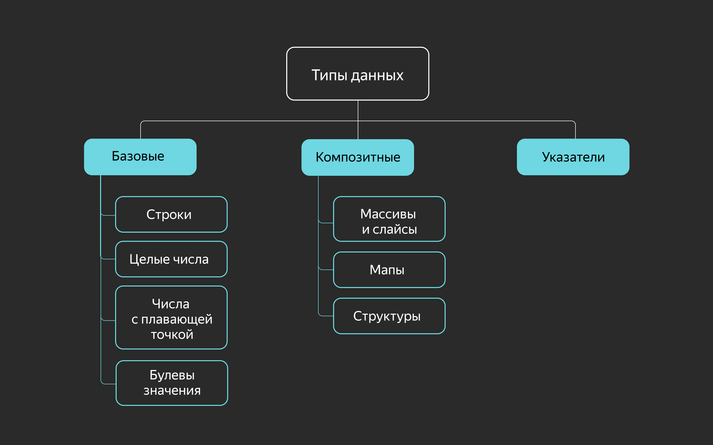

## Целые числа
Для представления целочисленных переменных в Go есть ряд типов, различающихся лишь размерностью и отсутствием или наличием знака в них:
- знаковые: int, int8, int16, int32, int64;
- беззнаковые: uint, uint8, uint16, uint32, uint64.

Если размерности int64 недостаточно, можно воспользоваться типом big.Int из пакета math/big.

## Числа с плавающей точкой
Числа с плавающей точкой представлены в двух вариантах: комплексные и вещественные. Как и у целочисленных типов, у них есть разные размерности:
- комплексные: complex64, complex128;
- вещественные: float32, float64.

Двукратную разницу в размерности легко объяснить: переменные типа complex состоят из двух компонентов типа float.

### Арифметические операции
Для числовых типов доступны следующие арифметические операции:
```
+ — сложение,
- — вычитание,
* — умножение,
/ — деление нацело,
% — остаток от деления.
```

Как и в языке С, для этих операций предусмотрена конструкция сокращения a = a + b до a += b:
```go
var a int 
a = 5
a *= 2 // 'a = a * 2'; 10
```

Также доступны операции инкремента и декремента — сокращения a = a + 1 и a = a - 1 соответственно. В отличие, например, от С++, в Go реализованы только постфиксные версии этих операций.
Пример:
```go
var a int
a = 5
a++ // 'a = a + 1'; 6
a-- // 'a = a - 1'; 5 
```

## Булевы значения
Для работы с логическими выражениями в Go представлен базовый тип bool, который принимает значения true и false:
```go
var a bool
a = true
a = false 
```

## Строки
В Go существует встроенный тип string для представления текстовых данных:
```go
var a string
a = "Hello, world!"
```

Строки в Go представляют собой массив из значений типа byte. По этой причине к элементам строки можно обращаться по индексу, а к самим строкам применима встроенная функция len, которая возвращает её длину в байтах:
```go
var a string
a = "abc"
println(len(a)) // 3
``` 

Строка хранится как массив байт, но он неизменяемый:
```go
var a string
a = "abc"
println(a[2]) // выведет значение второго байта 99
// строки в Go неизменяемы, нельзя написать a[2] = 10
a[2] = 10 // здесь будет ошибка
``` 

В данном случае длина строки в байтах равна количеству элементов, но это не всегда так. Дело в том, что Go из коробки поддерживает Unicode, а значит, строки могут содержать символы, не входящие в таблицу ASCII и не умещающиеся в один байт:
```go
var a string
a = "абц"
println(len(a)) // 6 
```

По этой же причине обращение по индексу иногда может возвращать неожидаемое значение:
```go
var a string
a = "абц"
println(a[5]) // 134
```

Для работы с Unicode в Go предусмотрен встроенный тип rune, способный вместить больше одного байта — любой символ таблицы Unicode. Например, с помощью него можно получить корректное количество символов из предыдущего примера:
```go
import "unicode/utf8"
//...
var a string
a = "абц"
println(utf8.RuneCountInString(a)) // 3
```

Строковые значения в Go можно представить ещё одним способом. Если заключить строковое значение в обратные апострофы ``, а не двойные кавычки "", форматирование строки будет автоматически преобразовано в управляющие символы:
```go
var stringFormattedVar string
// следующие выражения равнозначны 
stringFormattedVar = "Hello,\nworld!\n\n\t\t\"quote!\""
stringFormattedVar = `Hello,
world!

        "quote!"`
``` 

## Пользовательские типы
Как и большинство типизированных языков, Go позволяет программисту декларировать собственные типы.
Так, под капотом тип rune определяется как uint32, а byte как uint8:
```go
type rune uint32
type byte uint8
``` 

С помощью определений вы можете создавать новые типы, улучшая читаемость кода.
Из-за строгости типизации вы ограничиваете определениями в том числе применимость функций и конструкций к вашим типам:
```go
type Name string
type Fruit string

var fruit Fruit
var name Name

fruit = "Apple"
name = fruit // ошибка типизации
             // cannot use fruit (variable of type Fruit) as type Name in assignment
```

Чтобы исправить ошибку в этом листинге, нужно явно привести fruit к Name.
Для пользовательских типов можно определять методы (как для классов в ООП, об этом будет позже в курсе).
```go
// декларация пользовательского типа
type MyType string
// декларация метода для пользовательского типа
func (mt MyType) MethodForMyType() {
    //логика метода
} 
```
Определять методы для встроенных типов в Go нельзя.

## Приведение типов

Чтобы привести один тип к другому, в Go используется такой синтаксис: type(variable). Проиллюстрируем на предыдущем примере:
```go
type Name string
type Fruit string

var fruit Fruit
var name Name

fruit = "Apple"
name = Name(fruit) // так, после приведения типов, работает 
```

## Псевдонимы
В Go также есть псевдонимы (aliases) — не путайте с определениями. Псевдонимы позволяют обращаться к типу в коде по другому имени. По синтаксису они похожи на определения:
```go
type MyString = string // MyString здесь — это псевдоним типа string

var a string // можно использовать одно из этих условий для проверки пустой строки
var b MyString
a = b // ошибки нет
```

Можно смешивать псевдонимы и изначальные типы в одном выражении.
Псевдонимы были введены в язык по настоянию Google — для решения задач крупной компании, владельца больших, смежных, пересекающихся code base массивов кода. Применение псевдонимов облегчает масштабный рефакторинг большого объёма уже написанного кода из разных источников. При написании «свежего» кода с чистого листа лучше обходиться без псевдонимов.

## Значения по умолчанию
В отличие от языка C, идейным наследником которого является Go, любая декларация переменной и любая аллокация памяти сопровождаются инициализацией этой памяти. Если в C заявленная переменная может содержать случайное значение, оставшееся в выделенной ей памяти, то в Go переменная сначала гарантированно получает нулевое значение для своего типа.
Все типы имеют значения по умолчанию, которыми автоматически инициируется объявленная переменная, если это не было сделано явно:
- для bool значение по умолчанию — false;
- для числовых типов — 0;
- для ссылочных типов — nil или пустой указатель;
- для string — пустая строка длиной 0.
```go
var str string
// можно использовать одно из этих условий для проверки пустой строки
if str == "" || len(str) == 0 {
...
} 
```


# Переменные и константы

В Go объявление переменной имеет вид: var name type = expression. Можно не указывать тип или оператор присваивания с выражением, но один из них должен присутствовать. Кроме того, существует краткая форма объявления переменной. Рассмотрим все эти варианты:
- Объявление без явного указания типа: var name = expression.
- Длинное объявление с указанием типа: var name type и var name type = expression.
- Короткая нотация: name := expression.
Правил, которые регламентировали бы использование той или иной формы, в Go нет. Можно исходить из личных предпочтений или придерживаться стиля, принятого в вашей компании.

## Объявление без указания типа
Тип переменной можно опускать, если при объявлении происходит инициализация. Тогда тип переменной будет равен типу выражения. Если переменной присваивается число, то компилятор установит тип int или float64.
Опишем в таблице инициализирующие значения и типы, которые компилятор присваивает объявленным переменным:

| Объявление переменной | Тип переменной |
|---|---|
| var i = 10 | int
| var f = 5.0 | float64
| var s = "Hello, world!" | string
| var r = 'Щ' | rune
| var b = true | bool

Множество переменных можно инициализировать через запятую или с помощью вызова функции, которая возвращает несколько значений.
```go
var now = time.Now()  // now равно текущему времени и имеет тип time.Time
var pi, e = 3.1415, 2.7183
var f, err = os.Open("myfile.txt") // os.Open возвращает два значения
```

## Длинное объявление
Если при определении переменной указан только тип, ей будет присвоено нулевое значение этого типа. Если нужно создать несколько переменных одного типа, их можно перечислить через запятую.
```go
var i int // i будет присвоено значение по умолчанию — 0
var s string // s будет равна пустой строке

// определяем три строковых переменных
var name, company, country string 
```

Полная запись с указанием типа и начального значения, как правило, используется тогда, когда тип переменной должен отличаться от типа, который присваивается компилятором по умолчанию.
```go
var id uint32 = 77 
var pi float32 = 3.1415
```

Можно не указывать var перед каждой переменной, а объединять переменные в блоки var (...). Это удобно, когда нужно обозначить схожие по смыслу сущности.
```go
var height int
var length int
var weight float64
var name   string
var company = "Рога и копыта"

// эквивалентно

var (
    height, length int
    weight float64
    name   string
    company = "Рога и копыта"
) 
```

## Короткая нотация
Конструкция с ключевым словом var используется не всегда. В Go есть форма объявления переменной в теле функции с инициализацией. Эту форму принято называть короткой нотацией. Ключевое слово var и тип не указываются, а вместо символа = пишется :=.
```go
i := 10
f := 5.1
doublef := 2*f // doublef имеет тип float64 и равно 10.2

// эквивалентно

var i = 10 
var f = 5.1
var doublef = 2*f  
```

По умолчанию тип переменной равен типу присваиваемого выражения. В случае числовых типов компилятор сам выбирает размерность типа. Это может быть неудобно, когда нужно, например, объявить короткой нотацией переменную типа int64, а не int. Аналогично и с uint.
Проблему решает операция приведения типов:
```go
int64Var := int64(5)
float32Var := float32(101.3)

// эквивалентно

var int64Var int64 = 5 
var floatVar float32 = 101.3
```

Короткая нотация прекрасно работает со множественным объявлением. Но в этом случае хотя бы одна переменная в выражении должна быть новой. В противном случае возникнет ошибка компиляции:
```go
pi, e := 3.1415, 2.7183
// при уточнении значений нельзя использовать :=, так как 
// обе переменных уже определены
pi, e = 3.14159, 2.71828

f, err := os.Open("myfile.txt") 
```

## Константы
Константа — это типизированное значение, которое вычисляется на этапе компиляции и известно компилятору. В отличие от переменной, значение константы не может быть изменено во время работы программы. Вы уже сталкивались с константами ранее — это строковые, булевы и числовые литералы.
```go
var i int = 5 // здесь 5 — безымянная целочисленная константа
s := "Hello " // здесь "Hello" — строковая константа, значением которой
              // инициализирована переменная s
```

Если в коде постоянно используется какое-то число или строка, можно присвоить это значение переменной, но тогда оно не будет защищено от случайного изменения. Для решения этой проблемы Go даёт возможность давать константам имена.
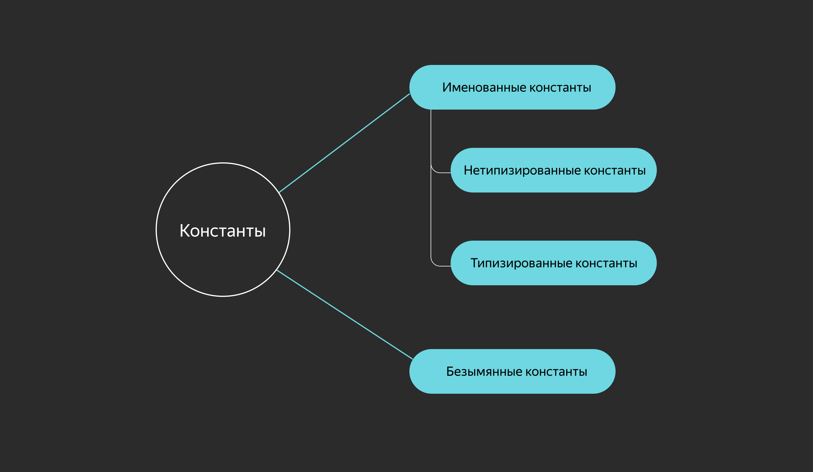

Именованные константы
Ключевое слово const определяет именованную константу, при этом константе можно присвоить результат некоторого выражения. В одном объявлении const можно определить несколько констант.
Именованные константы можно инициализировать выражениями, состоящими из констант или литералов следующих типов:
- числа;
- строки;
- символы (руны);
- булевы значения.

```go
const pi = 3.14159
const doublePi = pi * 2
const version = "1.0.0"

// эквивалентно

const (
   pi = 3.14159
   doublePi = pi * 2
   version = "1.0.0"
)

func main() {
    fmt.Println(version, pi, doublePi)
}
```

Результат:
```
1.0.0 3.14159 6.28318
```

Именованные константы позволяют изменять значение только в одном месте кода. Например, в приведённом примере легко увеличить точность числа пи или изменить номер версии.
## Нетипизированные константы
Именованные константы могут быть разного типа. Тип связан с хранимым значением:
```go
const intConst = 5 
const floatConst = 5.0
const runeConst = 'A'
const strConst = "Hello, world!"
const boolConst = true
```

Может показаться, что если опустить тип при объявлении константы, то компилятор выберет его сам — как в случае с короткой формой объявления переменных. Это так лишь отчасти. В случае с константами отсутствие явного указания типа имеет большее значение.
Например, если вы объявляете константу intConst и присваиваете ей значение 5, то получаете целочисленную константу с неопределённым типом (untyped int). Конкретный тип значения этой константы ещё не определён и в разных контекстах будет интерпретироваться компилятором по-разному. Это позволяет ослабить типизацию для констант, не отказываясь от сильной типизации глобально.
Благодаря этому подходу будет работать следующий пример:
```go
package main

import (
    "fmt"
)

const id = 100

func main() {
    var i int64 = id
    var f float64 = id

    fmt.Println("i=", i, "f=", f)
}
```

Программа выведет:
```go
i = 100 f = 100
```
Если определить id как переменную var id = 100, то возникнут ошибки компиляции при определении переменных i и f:
```
./prog.go:10:16: cannot use id (variable of type int) as type int64 in variable declaration
./prog.go:11:18: cannot use id (variable of type int) as type float64 in variable declaration
```

Если бы константы, как и переменные в Go, всегда имели конкретный тип, то работать с ними было бы сложнее. Более того, Go позволяет смешивать числовые литералы разных типов (untyped int, untyped float), поэтому корректно следующее выражение:
```go
var a float64
a = 5 + 5.0
```

Константы, как и переменные, можно группировать.
```go
const Program = "Моя программа"
const Version = "1.0.0"

// эквивалентно

const (
   Program = "Моя программа"
   Version = "1.0.0"
)
```

Если в группе у константы не указано значение, то оно равно значению предыдущей константы.
```go
const (
    pi = 3.1415
    e
    name = "John Doe"
    fullName
)

func main() {
    fmt.Println("pi =", pi, "e =", e)
    fmt.Println("name =", name, "fullName =", fullName)
}
```

Результатом работы программы будет:
```go
pi = 3.1415 e = 3.1415
name = John Doe fullName = John Doe
``` 

## Типизированные константы
Если при объявлении вы указываете тип константы явным образом, она становится типизированной и подчиняется правилам сильной типизации Go. В этом случае вы работаете с константой как с неизменяемой переменной:
```go
const flag uint8 = 128

func main() {
    var i int = flag
    fmt.Println(i)
}
```

При компиляции этого примера возникнет ошибка cannot use flag (constant 128 of type uint8) as type int in variable declaration, так как у константы flag тип uint8, а у переменной i тип int.

## Ключевое слово iota
Что, если в коде нужно реализовать перечисление (enum)? В Go для этого нет встроенной синтаксической конструкции или специального типа. Однако можно просто объявить ряд констант и работать с ними:
```go
const (
    Black = "black"
    Gray = "gray"
    White = "white"
)

func main() {
    fmt.Println(Black != Gray) // true
}
```

Зачастую в перечислении важна прежде всего возможность различить два элемента. Значения же этих элементов (в данном случае констант) играют второстепенную роль. Это значит, что необязательно использовать строковые константы — вполне подойдут целочисленные:
```go
const (
    Black = 0
    Gray = 1
    White = 2
)

func main() {
    fmt.Println(Black != Gray) // тоже true
}
```

При таком перечислении вручную есть вероятность получить неожиданное поведение — например, если по ошибке присвоить двум константам в перечислении одинаковое целочисленное значение:
```go
const (
    Black = 0
    Gray = 0
)

func main() {
    fmt.Println(Black != Gray) // false
}
```

К тому же при таком подходе не очень удобно объявлять длинные перечисления.
Для удобного объявления и инициализации блоков констант в Go есть автоматический инкремент iota. При объявлении каждого блока const значение iota равно 0 и увеличивается на 1 для каждого следующего элемента:
```go
const (
    Black = iota
    Gray
    White
)

// счётчик обнуляется
const (
    Yellow = iota
    Red
    Green = iota // это присваивание не обнулит iota
    Blue
)

func main() {
    fmt.Println(Black, Gray, White) 
    fmt.Println(Yellow, Red, Green, Blue)
}
```

Программа выведет:
```go
0 1 2
0 1 2 3
```

Данную конструкцию применяют не только для перечислений. Ключевое слово iota можно также использовать в арифметических выражениях, чтобы быстро объявить ряд значений с прогрессией. Следует помнить, что iota увеличивается на единицу для каждой строки, где указано имя константы, даже если той было присвоено конкретное значение.
```go
const (
    _ = iota*10  // обратите внимание, что можно пропускать константы 
    ten
    hundred
    thousand
)

const (
    hello = "Hello, world!"  // iota равна 0
    one = 1                  // iota равна 1

    black = iota   // iota равна 2
    gray
)

func main() {
    fmt.Println(ten, hundred, thousand)
    fmt.Println(black, gray)
}
```

Программа выведет:
```
10 20 30
2 3
```

## Пользовательские типы в константах
Предположим, нужно определить константы для дней недели.
```go
const (
    Monday = iota + 1
    Tuesday
    //...
    Sunday
)
```

Если перечислить их так, то все константы будут иметь нетипизированный числовой тип и могут использоваться в любых выражениях, что может вносить путаницу: var i int = Monday + 1. В подобных случаях стоит определить пользовательский тип и указать его при определении констант.
```go
type Weekday int

const (
    Monday Weekday = iota + 1
    Tuesday
    Wednesday
    Thursday
    Friday
    Saturday
    Sunday
)

func NextDay(day Weekday) Weekday {
    return (day % 7) + 1
}

func main() {
    var today Weekday = Sunday
    tomorrow := NextDay(today)
    fmt.Println("today =", today, "tomorrow =", tomorrow)
}
```

Программа выведет:
```go
today = 7 tomorrow = 1
```

## Литералы
В Go можно использовать различные представления строковых и числовых литералов. Проиллюстрируем на примере целого числа 1000:
```
1000
1000.0
1_000 // можно разделять части числа символом '_' для удобства восприятия
01750 // восьмеричное представление, начинается с 0
0x3e8 // шестнадцатеричное представление
0b001111101000 // бинарное представление
```

Любой из этих литералов может быть использован в выражениях и даст одно и то же значение.


# Область видимости
**Область видимости (scope)** определяет набор правил, по которым осуществляется доступ к объявленным переменным, константам и функциям из различных блоков кода.
В Go область видимости можно охарактеризовать двумя параметрами:
- глобальность/локальность;
- экспортируемость/неэкспортируемость.

## Глобальность/локальность
Объявленные в теле функций переменные, константы и функции характеризуются как **локальные**, то есть их область видимости ограничена тем блоком кода, в котором они объявлены.
В Go локальные переменные можно объявлять ключевым словом var или короткой нотацией :=.
Рассмотрим пример, который иллюстрирует область видимости локальной переменной:
```go
func main() {
    i := 10
    if i == 10 {
        // изменяем значение переменной i
        i += 5 
        if i == 15 {
            // в этом блоке создаётся новая переменная i, которая
            // перекрывает определённую выше переменную с таким же именем
            // следует избегать таких ситуаций на практике
            i := 7
            fmt.Println(i)
            // область видимости этой переменной ограничена блоком
        }
    }
    fmt.Println(i)
}
```

Выведет:
```
7
15
```

Объявленные вне тела функции сущности характеризуются как глобальные и находятся в области видимости всех блоков кода в пакете. То есть глобальные объекты доступны во всех файлах, находящихся в одной директории.

Глобальные переменные нельзя объявлять короткой нотацией :=, необходимо ключевое слово var. Если глобальная переменная не инициализирована, она принимает нулевое значение указанного типа.
```go
// Глобальные константа и переменные.
const program = "Моё приложение"

var name string
var ver = "v1.0.0" // инициализируем глобальную переменную

func main() {
    // изменяем глобальную переменную name
    name = "Вася"
    fmt.Println("Привет, " + name + "!")
    fmt.Println("Добро пожаловать в", program, ver)
}
```

Выведет:
```
Привет, Вася!
Добро пожаловать в Моё приложение v1.0.0
```
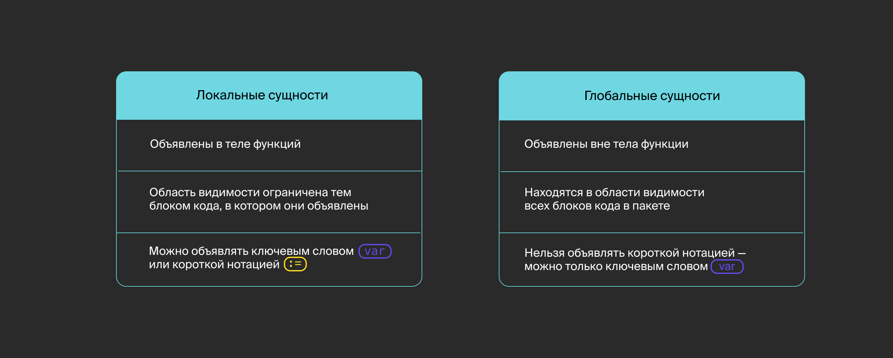


## Экспортируемость/неэкспортируемость
Если предыдущее свойство характеризует доступность объекта внутри пакета, то экспортируемость регламентирует доступность из других пакетов.

`Экспортируемыми могут быть только глобальные сущности.`

**Экспортируемые** переменные, константы и функции определённого пакета доступны из тех пакетов, которые импортируют этот пакет ключевым словом `import`.
Доступ к экспортируемым объектам осуществляется конструкцией `<имя пакета>.<Имя сущности>`. Проиллюстрируем на примере `Hello, world!`:
```go
package main

import "fmt"

func main() {
    fmt.Println("Hello, world!")
}
```

Здесь в функции `main` программа обращается к пакету стандартной библиотеки `fmt`, вызывая её экспортируемую функцию `Println`.

`Как Go определяет, что сущность экспортируемая? Если имя переменной, константы или функции начинается с прописной буквы, то она экспортируемая. Если со строчной, то неэкспортируемая.`

К **неэкспортируемым** сущностям нельзя обратиться за пределами пакета. Этот подход — часть того особенного ООП, который реализует в Go сокрытие данных или `инкапсуляцию`.
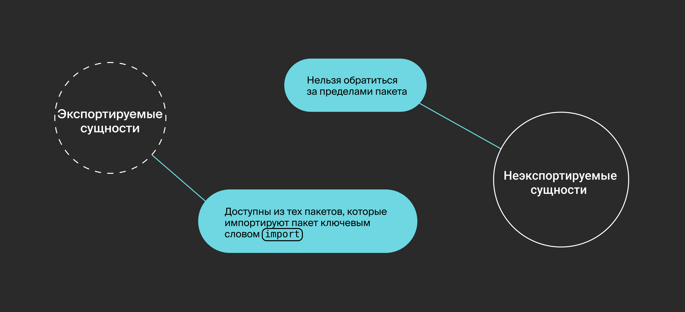

Проиллюстрируем на примере определение экспортируемых и неэкспортируемых объектов.
```go
package contacts

// Email 
const Email = "support@example.com" // глобальная экспортируемая константа

var support string // глобальная неэкспортируемая переменная

// SetSupport устанавливает значение переменной support.
func SetSupport(s string) { 
    support = s
}

// GetContact возвращает имя и email.
func GetContact() string {
    return fmt.Sprintf("%s <%s>", support, Email)
}
```

Если импортировать этот пакет, то будут доступны константа `Email`, функции `SetSupport` и `GetContact`.
```go
package main

import (
    "fmt"
    "internal/contacts"
)

func main() {
    contacts.SetSupport("Служба поддержки")
    fmt.Println(contacts.GetContact())
    fmt.Println("Email:", contacts.Email)
}
```

Выведет:
```
Служба поддержки <support@example.com>
Email: support@example.com
```


# Операторы ветвления
В ситуациях, когда ход работы программы должен меняться в зависимости от условия, применяют операторы ветвления, или, как их ещё называют, условные операторы. В языке Go есть как стандартные условные операторы, так и специфичные для языка.
Для начала вспомним операторы сравнения (переменных одного типа):
```
> — больше;
< — меньше;
>= — больше или равно;
<= — меньше или равно;
== — равно;
!= — не равно.
```

А также логические операторы:
```
&& — логическое И;
|| — логическое ИЛИ;
! — логическое НЕ.
```

## Условие if — else
```
if a == 1 {
    // сценарий, если условие if выполнено
} else if a == 2 {
    // сценарий, если условие else if выполнено
} else {
    // сценарий, если условие else if не выполнено
} 
```
Это простой пример условной конструкции. Она может состоять только из одного оператора if — тогда блок кода сработает, если условие верно, а если неверно, то ничего не произойдёт.

Опционально можно добавить оператор else. За ним будет следовать блок кода, который выполнится, если исходное условие неверно.

И наконец, если нужно обработать несколько различных условий, используют оператор else if. В код можно добавить много else if, но это не самый «читабельный» вариант — в подобных случаях лучше использовать case, о котором расскажем ниже.

Приведём примеры операторов с различными вариантами условий:
```
// логическое НЕ
// возвращается одна переменная типа bool
a := false
if !a {} 

// логическое И
var a, b int
if a == 1 && b == 2 {}

// исключающее ИЛИ (XOR)
var a, b bool
if (a || b) && !(a && b) {} 
```

### Общие правила для условных операторов:
1. Обязательно использовать фигурные скобки { }, чтобы обозначить область видимости оператора.
2. Необязательно заключать основное условие в круглые скобки ( ), но с ними удобнее читать код.
3. Можно добавлять круглые скобки ( ), чтобы группировать части условия.

В Go применяется «ленивая» проверка условий: она идёт слева направо до первого false и прекращается, потому что проверять дальше нет смысла. Пример «ленивой» проверки:
```
a, b := 1, 0

if a == 1 || b == 2 {
    fmt.Println("Hello")
} 
```
В данном примере выполняется левое условие, поэтому проверки (или выполнения) правой части не последует. Пример будет более показателен, если для правой части условия использовать функциональный литерал (подробнее расскажем в теме «Функции»), который будет просто изменять значение переменной b.
```
a, b := 1, 0

incB := func() bool {
    b = b + 1
    return true
}

if a == 1 || incB() {
    fmt.Println("Hello")
}

fmt.Println(a, b) 
```
```
Hello
1 0
```
Из-за «ленивой» проверки условий функция incB не выполнится — её значение не изменится, то есть функция не изменит значение переменной, потому что выполнение кода прервётся.

Оператор if может состоять из двух компонент: инициализации и основного условия. Такая техника позволяет объявлять локальную переменную, которую используют только в рамках области видимости if. Это может пригодиться, например, когда нужно преобразовать данные для сравнения.
```
a := 0.10000001 // float64
// инициализация и основное условие
if b := float32(a); b > float32(0.1) {
    fmt.Println("Var a is GT float32(0.1)")
} 
```
Условие в данном примере может перестать выполняться, если добавить ещё один ноль: 0.100000001. Тип float32 обеспечивает точность в восемь десятичных чисел, в то время как точность float64 составляет около 15 чисел.

## Условие switch — case
```go
var a int

switch a {
case 1:
    fmt.Println("1")
case 2:
    fmt.Println("2")
case 3, 4:
    fmt.Println("3 or 4")
default:
    fmt.Println("Default case")
} 
```
Конструкция switch — case позволяет избежать дублирования else if. Проверка условий идёт сверху вниз и слева направо, поэтому в примере выше условия будут проверяться в таком порядке: 1, 2, 3, 4.

Наличие блока default необязательно — его можно опустить, если не требуется описывать «стандартное» поведение. Этот блок выполнится, если ни одно из условий не отработало.

Основное условие switch может быть не задано явно:
```go
var a int

switch {
case a == 100:
    fmt.Println("EQ 100")
case a > 0:
    fmt.Println("GT 0 AND NEQ 100")
case a < 0:
    fmt.Println("LT 0 AND NEQ 100")
} 
```
В этом примере важен порядок условий case: если переместить a == 100 в конец, то a > 0 всегда будет срабатывать первым для положительных чисел. Такая форма оператора аналогична множественному else if.

Внутри switch можно объявить локальную переменную, доступную только в пределах области видимости оператора:
```go
a := 6
switch b := a % 5; {
case b == 0:
    fmt.Println("Кратно 5")
default:
    fmt.Printf("Остаток от деления на 5: %d", b)
}
```
Чтобы досрочно прервать выполнение case, используют ключевое слово break. Это бывает полезно, когда внутри case есть условные конструкции. В Go нет необходимости явно указывать break в конце каждого case, так как следующий блок case автоматически не выполнится при совпадении условия.

Когда нужно всё-таки выполнить следующий блок, используют ключевое слово fallthrough. Если указать его в конце блока кода, то после него будет выполнен блок в следующем case или default.
```go
a := -100
switch {
case a > 0:
    if a % 2 == 0 {
        break
    }
    fmt.Println("Odd positive value received")
case a < 0:
    fmt.Println("Negative value received")
    fallthrough
default:
    fmt.Println("Default value handling")
} 
```
У ключевого слова fallthrough есть особенности:
- его можно использовать только в последней строке case, иначе будет ошибка компиляции;
- оно игнорирует условие следующего по порядку case.


# Циклы
Опуская области применения циклов, рассмотрим их формы в языке Go.
В программировании для циклов используют конструкции `for`, `while`, `do — while` и другие.
Создатели Go придерживаются правила «чем проще, тем лучше», поэтому для всех видов цикла в языке есть только одно ключевое слово — `for`.
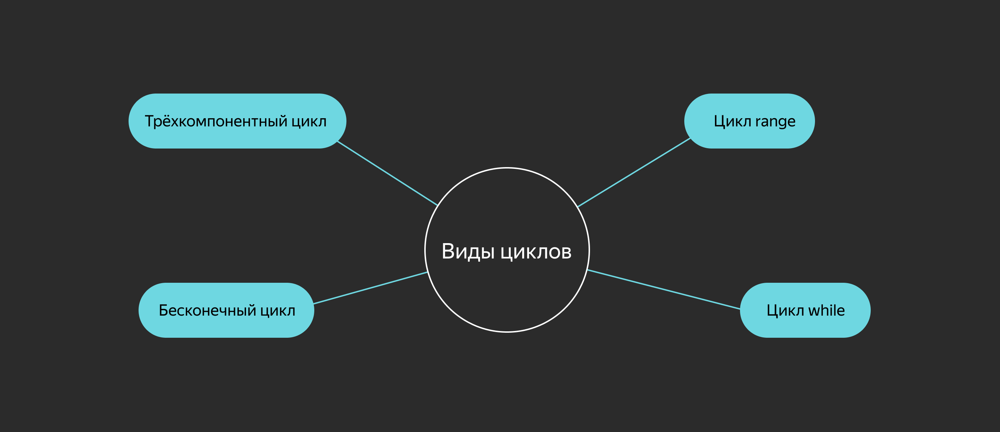

## Бесконечный цикл
```go
for {
    // код, выполняемый внутри бесконечного цикла
}
```

Такой цикл чаще всего встречается в worker-паттерне: фрагмент кода должен выполняться до завершения процесса или потока, пока не будет прерван внешним событием.

Использовать фигурные скобки `{ }` для обозначения области видимости цикла обязательно.


## Трёхкомпонентный цикл
```go
// создаём переменную
v := 0
// 
for i := 1; i < 10; i++ {
    // наращиваем переменную
    v++
}
// выводим результат на экран
fmt.Println(v)
```

Классическая форма цикла состоит из трёх компонентов:
- `i := 1` — инициализация (pre-действие): выполняется единожды при входе в scope цикла;
- `i < 10` — основное условие: пока условие true, итерации будут продолжаться;
- `i++` — post-действие: выполняется по завершении каждой итерации цикла.

Заполнять каждую компоненту необязательно — можно опускать.

Есть ещё два варианта бесконечного цикла, но в форме трёх компонент:
```go
for ;; {}
for ; true; {}
```

Компоненты цикла могут принимать более комплексный вид:
```go
for a, b := 5, 10; a < 10 && b < 20; a, b = a + 1, b + 2 { 
    // do stuff
}
```

## Цикл while
```go
// создаём переменную
i := 0
// описываем предусловие
for i < 5 {
    // наращиваем переменную
    i++
}
// выводим результат на экран
fmt.Println(i)
```
 
Цикл `while` похож на трёхкомпонентный, но здесь оставлено только основное условие.


## Цикл range
```go
// создаём массив
array := [3]int{1, 2, 3}
// итерируемся
for arrayIndex, arrayValue := range array {
    fmt.Printf("array[%d]: %d\n", arrayIndex, arrayValue)
}
```

Цикл `range` используется для комплексных типов — слайса и мапы (map).
Подробнее об этом цикле расскажем в следующей теме, посвящённой композитным типам.


## Ключевые слова break и continue
Текущую итерацию цикла можно прервать ключевыми словами:
- `break` — выход из цикла;
- `continue` — переход к следующей итерации цикла (вызов post-действия, если оно задано).

Для примера посчитаем сумму всех чётных чисел от 0 до заданного предела:
```go
sum, limit := 0, 100
for i := 0; true; i++ {
    if i % 2 != 0 {
        continue // переход к следующему числу, так как i — нечётное
    }
    
    if sum + i > limit {
        break // выход из цикла, так как сумма превысит заданный предел
    }
    
    sum += i
}
fmt.Println(sum)
``` 

Ключевые слова `break` и `continue` относятся к ближайшему по области видимости циклу.


## Метки
В языке Go есть метки (labels), которые позволяют перемещаться к разным частям кода.

Метку можно указать для операторов:

- `break;`
- `continue;`
- `goto` (безусловный оператор перехода, позволяет перейти в любое место кода).

Приведём пример для `break`:
```go
outerLoopLabel:
    for i := 0; i < 5; i++ {
        for j := 0; j < 5; j++ {
            fmt.Printf("[%d, %d]\n", i, j)
            break outerLoopLabel
        }
    }
    fmt.Println("End")
```
```
[0, 0]
End
```

Здесь `break outerLoopLabel` прерывает выполнение внешнего цикла.

А вот пример для continue:
```go
outerLoopLabel:
    for i := 0; i < 5; i++ {
        for j := 0; j < 5; j++ {
            fmt.Printf("[%d, %d]\n", i, j)
            continue outerLoopLabel
        }
    }
    fmt.Println("End")
```
```
[0, 0]
[1, 0]
[2, 0]
[3, 0]
[4, 0]
End
```

Здесь continue `outerLoopLabel` вызывает переход к следующей итерации внешнего цикла. Если заменить `continue outerLoopLabel` на `break`, результат будет аналогичный.

Ключевые слова `break` и `continue` без указания метки относятся к текущей (ближайшей) области видимости кода.

Посмотрите, как можно вывести чётные числа в диапазоне [0:20] с указанием десятка.
```go
group := 0
for i := 0; i < 20; i++ {
    switch {
    case i % 2 == 0:
        if i % 10 == 0 {
            group++
            break // break относится к ближайшему switch
        }
        fmt.Printf("%02d: %d\n", group, i)
    default:
    }
}
```
```
01: 2
01: 4
01: 6
01: 8
02: 12
02: 14
02: 16
02: 18
```
Использование меток в Go, как и во многих других языках, — тема вечных споров. Считается, что метки делают код неочевидным, превращают в так называемый спагетти-код


# Указатели

Все данные программы, включая переменные, хранятся в памяти компьютера. Нумерация поддерживает порядок в ячейках, и такие номера называются адресами. Каждая переменная имеет адрес в виде целого положительного числа.
Если нужно передать переменную из одной части программы в другую, хватит обычного копирования:
```go
a := 5

var b int
b = a
```

Значение переменной `а` полностью скопировалось в `b`.

В плане удобства это далеко не универсальный способ.
Во-первых, размер переменной `a` может быть очень большим, копирование займёт много времени.
Во-вторых, иногда копии может быть недостаточно и нужно получить саму переменную — к примеру, чтобы изменить её значение.

> Тогда на помощь приходят указатели. Если вы знакомы с языком С, то легко разберётесь и с указателями в Go, в то время как программистам на Python придётся вникать в новую тему.

Итак, если у каждой переменной есть адрес, мы можем передавать его, а не сами данные, хранящиеся в ячейке памяти.
За хранение значения адреса переменной в Go отвечают указатели.
Данные любого типа хранятся в виде двоичных чисел, поэтому для определения конкретного типа данных в ячейке памяти указатель сам имеет соответствующий тип.

Синтаксис переменной типа «указатель» очень простой:
```go
var p *int
```
 
Здесь создали переменную типа «указатель на целое число». В Go можно создать указатель на любой тип данных.

Физически указатель — это ячейка памяти, хранящая адрес ячейки, на которую «смотрит» указатель.
После создания указатель не «смотрит» ни на одну ячейку памяти в компьютере и имеет нулевое значение.
Оно выглядит как `nil`.

Для того чтобы присвоить указателю значение (адрес какой-либо переменной), используется операция взятия адреса `&`:
```go
var a int = 5
p := &a

fmt.Println(a,p) //a=5 p=0xc0000b2008
```

Значение указателя на 64-битном компьютере — это 64-битное число.
Именно размер указателя на данной системе задаёт характеристику битности компьютера.

На разных платформах значение указателя `p` будет разным.
Именно поэтому значение указателя не имеет смысла за пределами программы.

Чтобы получить значение указателя, в памяти должна быть переменная, на которую он «смотрит». Такое значение называется адресуемым (adressable). С константами сложнее — у них забрать адрес не получится.
```go
const c = 5
p1 := &"abc" // ошибка компиляции
p2 := &с // ошибка компиляции
```
 
Тип переменной, на которую создаётся указатель, должен соответствовать типу указателя.
```go
var p *int
var a int = 5
var b string = "abc"
p = &a 
p = &b // ошибка компиляции
```

Литералы композитных типов создают в памяти переменную соответствующего типа, поэтому указатель можно создать вот так:
```go
type A struct {
  IntField int
}
// Литерал А{} создаёт в памяти переменную типа А. Затем от неё берётся указатель
p := &A{ 
  IntField: 10,
}
```

А ещё в Go есть встроенная функция `new()`. В качестве параметра ей передаётся тип, а возвращается указатель на новую переменную соответствующего типа.
```go
type A struct {
    IntField int
}

p := new(A) //  то же самое, что и &A{}
```

Указатели ведут себя так же, как и обычные переменные. Их можно копировать, присваивая другим переменным тип указателя, передавать и возвращать в функции, а также создавать указатели уже на них.

Тип указателя на указатель описывается как `**T`, например `**int`.

Чтобы получить или изменить значение, хранящееся по указателю, применяют оператор **разыменования (dereference)** `*`.
```go
i := 42
p := &i
fmt.Println(*p) // читаем значение переменной i через указатель p
*p = 21         // записываем в переменную i значение 21 через указатель p
```

Вызов оператора разыменования на `nil`-указателе приведёт к панике на этапе исполнения кода, и программа откажется работать дальше.
```go
var p *int
fmt.Println(*p) // panic: runtime error: invalid memory address or nil pointer dereference
``` 


## Указатели и структуры
Для указателей на структуры в Go есть возможность неявного разыменования при доступе к полям структуры.
```go
type A struct {
    IntField int
}

p := &A{}
p.IntField = 42 // вместо (*p).IntField = 42 
```


## Сравнение указателей
Для указателей определены операторы сравнения (`==`, `!=`).
Два указателя равны, если они указывают на один и тот же объект в памяти либо если оба равны `nil`.


## Когда стоит использовать указатели
- Когда нужно изменить значение переменной из вызываемой функции. Если передать переменную по значению, все модификации внутри функции применятся к локальной копии и оставят исходную переменную неизменной.
    ```go
    incrementCopy := func(i int) {
      i++
    }
    
    increment := func(i *int) {
      (*i)++
    }
    
    i := 42
    
    incrementCopy(i)
    fmt.Println(i) // 42
    
    increment(&i)
    fmt.Println(i) // 43
    ```
   
- Когда нужно подчеркнуть, что значение может отсутствовать.
  Например, есть функция, которая возвращает запись о пользователе `type User struct{...}` по его идентификатору. Результат-указатель даёт понять, что не по всем идентификаторам может быть найден пользователь. Пример функции с такой сигнатурой:
    ```go
    func FindUser(id UserID) *User
    ```

- Когда вы работаете с ресурсами вроде файловых дескрипторов или сокетов. 
  Копирование таких переменных может быть связано с исчерпанием системных ресурсов или вообще не производиться.
- Когда вы работаете с большими переменными и на копирование по стеку затрачивается больше ресурсов, чем на сборку мусора от указателей.


## Когда не стоит использовать указатели
- Когда хочется ускорить приложение и кажется, что копирование структур — слишком дорогая операция.
  До тех пор, пока нет тестов, однозначно показывающих, что указатели повышают производительность, лучше не пытаться оптимизировать.
  Вероятнее всего, напрасно потратите силы или снизите производительность системы, увеличив расходы на сборку мусора.
- Задумываться о замене передачи по значению на передачу по указателю стоит, когда размер структуры достигает порядка сотен байт.
- Когда множество указателей в памяти сильно нагружают сборщик мусора.
  Такое может произойти, к примеру, при создании собственной `in-memory` базы данных.


## Сравнение указателей в Go и C/С++
Синтаксис указателей в Go идентичен побратимам из С, как и многие другие параметры.
Однако есть пара важных различий.

Указатели в Go не имеют адресной арифметики.
Несмотря на то что указатель хранит адрес, который является числом, к нему нельзя применять арифметические операции.
Это не относится к недостаткам, потому что было сознательно убрано для повышения безопасности кода.

Указатель может «смотреть» не на любой участок памяти — только на существующий и соответствующий типу указателя.

По сути указатель близок к иммутабельности — его можно создать и присвоить адреса существующих переменных.
В С это реализовано гораздо шире.

Сборщик мусора, одна из ключевых фишек Go, не сможет удалить переменную, пока на неё «смотрит» какой-либо указатель.
Поэтому можно обойтись без ручного высвобождения памяти операцией `free`.


## Пример работы с указателями
Представим некоторую структуру, которая описывает пользователя:
```go
type Person struct {
  Name string
  Age int
  lastVisited time.Time
}  
```

В поле `LastVisited` нужно сохранять дату последнего посещения.
Напрямую сделать это нельзя, ведь поле неэкспортируемое.
Без указателей функция выглядела бы примерно так:
```go
func GetPersonWithLastVisited(p Person) Person {
    return Person{
        Name:        p.Name,
        Age:         p.Age,
        lastVisited: time.Now(), // time.Now() возвращает текущее время
    }
}

p := Person{
  Name: "Alex",
  Age: 25,
  lastVisited: time.Time{}, // пустое значение времени — пользователь ещё не посещал наш сервис
}

p = GetPersonWithLastVisited(p) 
```

У такого подхода много недостатков.
Структура сначала копируется в функцию, потом создаётся новая структура, в неё копируются поля старой, а затем результат должен быть скопирован в старую структуру.
Кроме того, изменения в структуре потребуют изменений в коде функции, даже если логически её это не касается.

C указателями всё становится проще:
```go
func UpdatePersonWithLastVisited (p *Person )  {
  p.lastVisited = time.Now() 
} 

p := Person{
  Name: "Alex",
  Age: 25,
  lastVisited: time.Time{},
}

UpdatePersonWithLastVisited(&p)
```
 
Здесь в функцию был передан указатель на переменную, что позволило изменить её поле без лишнего копирования.
Такая функция работает быстрее, а код становится проще.

В следующих уроках подробнее расскажем о функциях-методах, которые позволяют решить эту задачу более изящно.
Само собой, при участии указателей.


## Дополнительные материалы
[Подробная статья о том, как Go работает с памятью](https://medium.com/eureka-engineering/understanding-allocations-in-go-stack-heap-memory-9a2631b5035d)
[How large should a struct be before you should pass by reference for performance?](https://www.reddit.com/r/golang/comments/rcnyhr/how_large_should_a_struct_be_before_you_should/)
[Наглядное разъяснение указателей](https://dave.cheney.net/2017/04/26/understand-go-pointers-in-less-than-800-words-or-your-money-back)


# Массивы
**Массив** — это последовательность фиксированной длины, состоящая из элементов одного типа. 
Массивы используются для работы с набором элементов, количество которых не изменяется, и там, где нужно иметь набор однотипных элементов известной длины.

Представим, что у нас есть задача хранить набор значений: например, среднесуточную температуру за каждый день недели (всегда 7 дней).
Тогда здесь можно объявить массив:
```go
var lastWeekTemp [7]int
```

Число в скобках определяет длину массива, а литерал после скобок — тип элементов.

В Go количество элементов в массиве — это часть типа, то есть массивы `[3]int` и `[5]int` относятся к разным типам.

Чтобы определить в коде такую переменную, компилятор выделит в памяти область, размер которой будет определяться количеством элементов, умноженным на размер элементов.
Каждый элемент будет проинициализирован значением по умолчанию.

Все элементы в памяти расположатся последовательно, поэтому доступ к ним будет иметь константную сложность O(1).
Для обращения к элементам массива используются квадратные скобки `[]`:
```go
tempOnWednesday := lastWeekTemp[2]
``` 

В Go индексация массивов начинается с нуля, как и в большинстве других языков программирования.
Довольно часто встречается ситуация, когда при объявлении массива требуется задать значения массива сразу. 
В Go можно совместить объявление и инициализацию в одной конструкции.

Инициализация производится с помощью литерала массива:
```go
thisWeekTemp := [7]int {-3,5,7} // [-3 5 7 0 0 0 0]
rgbColor := [3]uint8 {255,255,128} // [255 255 128]
```

Здесь указывается сначала тип массива `[7]int`, а затем в фигурных скобках через запятую — элементы массива, то есть список инициализации.

Для компилятора тип массива в приоритете: если вы указали массив из семи элементов, но в списке инициализации всего три, то оставшиеся элементы будут проинициализированы значениями по умолчанию.

Компилятор следит за размером списка инициализации, и уже такую конструкцию скомпилировать не получится:
```go
rgbColor := [3]uint8{1, 2, 3, 4} // array index 3 out of bounds [0:3]
```

Количество элементов в массиве может быть выведено автоматически по длине списка инициализации. 
Для этого используется следующая конструкция:
```go
rgbColor := [...]uint8{255,255,128} // [255 255 128] len = 3
rgbaColor := [...]uint8{255,255,128,1} // [255 255 128 1] len = 4
```

Три точки указывают компилятору, что размер массива должен быть выведен исходя из размера списка инициализации.

Иногда возникает необходимость указать в списке инициализации только один или несколько элементов массива, а другие не трогать.

Если бы вам понадобилось указать значение среднесуточной температуры в воскресенье, код вряд ли порадовал бы своей утончённостью:
```go
thisWeekTemp := [7]int {0,0,0,0,0,0,11} // [0 0 0 0 0 0 11] 
```

Для больших массивов это превратилось бы в нечитаемую конструкцию:
```go
var thisWeekTemp [7]int // [0 0 0 0 0 0 0]
thisWeekTemp[6] = 11 // [0 0 0 0 0 0 11] 
```

Однако в списке инициализации можно указать только нужные элементы и их индексы. 
Индекс и значение указываются через двоеточие.
```go
thisWeekTemp := [7]int {6:11, 2:3} // [0 0 3 0 0 0 11] 
```

Размер массива может быть получен встроенной функцией len. 
Так как размер массива известен на этапе компиляции, то вычисление этой функции при компиляции подменяется конкретным значением.

Если попытаться обратиться к элементу массива за пределами его размера, то сработает механизм защиты памяти в Go и начнётся паника.
В отличие от языка C, компилятор и рантайм Go контролируют выход за пределы массива, не позволяя обратиться к недопустимым областям памяти. 


## Многомерные массивы
**Многомерные массивы** создаются так же, как и одномерные. 
Каждая размерность массива указывается в отдельных квадратных скобках.
```go
var thisMonthTemp [4][7]int // массив из четырёх недель, каждая из которых — массив из семи дней  
```

Многомерные массивы удобно представлять себе как массив массивов:
```go
var rgbImage [1080][1920][3]uint8 // изображение — это массив из 1080 строк длиной в 1920 пикселей. Каждый пиксель — массив из трёх байт
            // 1080 — размер массива
            // [1920][3]uint8 — тип элемента 
```

Доступ к элементам многомерного массива осуществляется через квадратные скобки:
```go
line := rgbImage [2] // 3-я строка в изображении
pixel := rgbImage[2][3] // 4-й пиксель в третьей строке изображения
red :=  rgbImage[2][3][1] // значение синей компоненты (второй байт) 4-го пикселя в третьей строке изображения 
```


## Обход значений массива
Для работы с массивами часто используются циклы. Например, когда нужно посчитать среднюю температуру (округлённо) в течение недели:
```go
var weekTemp = [7]int{5,4,6,8,11,9,5} 

sumTemp := 0

for i:= 0; i < len(weekTemp); i++ {
    sumTemp += weekTemp[i]
}

average := sumTemp/len(weekTemp)
```

Здесь вводится дополнительная переменная `i`, которая увеличивается на каждом шаге.
В Go есть более удобная конструкция `for range`, которая позволяет обойти элементы массива последовательно, не используя дополнительные переменные:
```go
var weekTemp = [7]int{5, 4, 6, 8, 11, 9, 5} 

sumTemp := 0

for _, temp := range weekTemp {
    sumTemp += temp
}

average := sumTemp/len(weekTemp)
```

Оператор `range` на каждой итерации возвращает индекс и значение следующего элемента в массиве.

> Обратите внимание на следующий важный момент: конструкция `_, temp := range weekTemp` создаёт новую переменную `temp`, тип которой будет определяться типом элемента массива.

Этой переменной на каждой итерации цикла будет присваиваться следующее значение из массива.
Если изменить значение переменной `temp`, то это не повлияет на значения в массиве.

Чтобы получить доступ к элементу массива, понадобится индекс:
```go
var weekTemp = [7]int{5, 4, 6, 8, 11, 9, 5} 
// weekTemp [5 4 6 8 11 9 5]
for _, temp := range weekTemp {
   temp = 0 
}
// weekTemp [5 4 6 8 11 9 5] ! — значения не изменились
// если значение элемента не используется, можно опустить вторую переменную
for i := range weekTemp {
   weekTemp[i] = 0 
}
// weekTemp [0 0 0 0 0 0 0] ! — значения изменились
```

Переменные массивов можно присваивать друг другу, однако у них должен быть одинаковый тип, причём количество и тип элементов должны совпадать.

В процессе присваивания выполняется полное копирование массива, и если программа обрабатывает достаточно большие массивы данных, то эти копирования могут существенно замедлить работу программы и увеличить потребление памяти.

**Передача массива** (как и переменной любого другого типа) в функцию — это копирование его значения в переменную аргумента функции. Здесь тоже будет полное копирование.

> С циклом `for range` связан ещё один важный момент — операнд `range` копируется во временную переменную, которая уже используется для обхода.

Это также может замедлить выполнение программы для массивов, поэтому следует использовать взятие указателя, чтобы не простаивать:
```go
for _, temp := range &weekTemp {
   temp = 0 
}
```

Об указателях подробно рассказано в соответствующем уроке.


## Преимущества применения массивов
1. Элементы массива всегда располагаются в памяти последовательно, этому радуется процессор и ускоряет выполнение программы.
2. Массивы имеют фиксированную длину, поэтому выделение памяти под массив происходит ровно один раз в момент его объявления.
3. Время доступа к элементам массива минимальное.
4. Go проверяет выход за пределы массива на этапе компиляции, если может вычислить значение индекса элемента на этапе компиляции, и во время исполнения программы. В первом случае будет ошибка компиляции, а во втором — паника. Панику лучше не допускать.


## Недостатки применения массивов
1. Массивы могут быть только фиксированной длины: если количество элементов нам заранее неизвестно, память придётся выделять с запасом.
2. Массивы передаются и присваиваются с полным копированием элементов, что грозит внезапным ухудшением производительности и увеличенным расходом памяти.
3. Для обработки массивов разных габаритов придётся писать разные функции (если не используются дженерики).

Массивы следует применять крайне обдуманно, когда размеры вашего массива точно известны на этапе компиляции.
Это позволяет ускорить работу программы.

Для того чтобы исправить недостатки массивов, в Go введены слайсы, которые будут рассмотрены ниже.

## Слайсы
Раз длина массива — это часть его типа, то массивы не подходят для хранения коллекций данных динамического размера.
Эту задачу решает другой тип данных, который гораздо чаще используется на практике, — **слайс (от англ. slice)**, или срез.
Кроме того, слайс избавит нас от проблемы копирования массивов для присваивания.

**Слайс** — это последовательность переменной длины, состоящая из элементов одного типа.
Тип слайса записывается как тип массива без указания размера.
Можно инициализировать переменную типа «слайс» значениями, но, в отличие от массива, переменная без инициализации равна nil.
```go
var mySlice []int
```
 
Слайс очень похож на `list` в языке Python, но имеет свои особенности.

Слайс — это обёртка над указателем массива, и в Go слайс используется как структура следующего вида:
- указатель на первый элемент базового массива — `ptr`;
- длина слайса — `len`, количество элементов в слайсе;
- ёмкость слайса — `cap`, количество элементов в массиве.

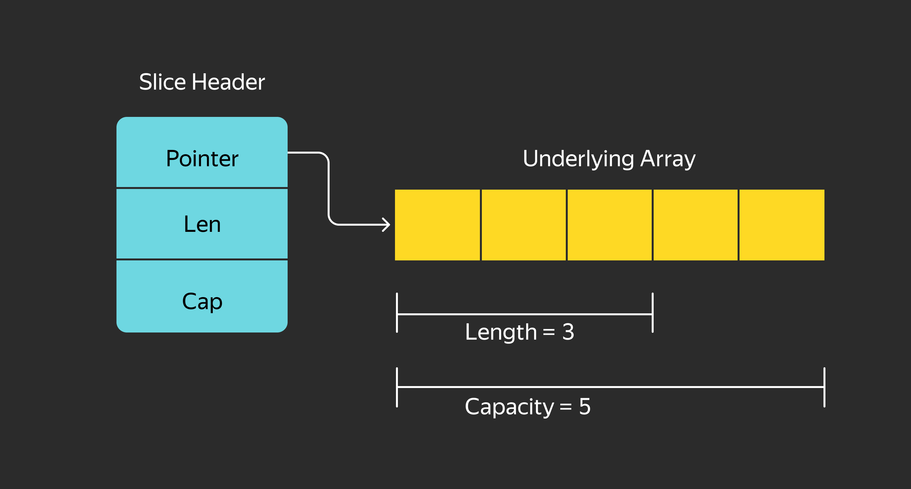

Параметры слайса `len` и `cap` могут быть получены с помощью вызова соответствующих встроенных функций `len()` и `cap()`.

Если просто объявить такую структуру, то она будет равна `nil`.

Для создания слайса используется встроенная функция `make()`:
```go
mySlice := make([]TypeOfelement, LenOfslice, CapOfSlice)
mySlice := make([]int,0) // слайс [], базовый массив []
mySlice := make([]int,5) // слайс [0 0 0 0 0], базовый массив [0 0 0 0 0]
mySlice := make([]int,5,10) // слайс [0 0 0 0 0], базовый массив [0 0 0 0 0 0 0 0 0 0]
```

Аргументы функции `make`:
1. Тип слайса (пустые квадратные скобки и тип элемента слайса).
2. Длина слайса. Если не передана, то по умолчанию равна нулю.
3. Ёмкость слайса — размер базового массива. Если значение не передано, то по умолчанию равна длине слайса.

Функция `make` создаёт массив длиной `cap` и записывает указатель на него в структуру слайса.
Также она заполняет поля `len` и `cap` в этой структуре и возвращает её в виде переменной типа «слайс».

Даже если `len` и `cap` переданы как нулевые, сама структура уже не будет равна `nil`.
Она будет выделена в памяти, и указатель на базовый массив получит значение, отличное от `nil`.

Если передать в функцию `make` параметр `cap` меньше `len`, то будет вызвана ошибка компиляции или паника во время исполнения.

Слайс может быть создан из композитного литерала так же, как и массив. Единственное отличие — не указываем размер массива:
```go
s = []int{1, 2, 3}  // [1 2 3]
```

Длина и ёмкость слайса будут равны композитному литералу.

Новый слайс может быть создан на основе уже существующего слайса или массива.
Для этого используется операция взятия слайса.
Она выполняется с помощью двух скобок с двоеточием `[i:j]`, где `i` — индекс первого элемента нового слайса, а `j` — индекс следующего элемента, не входящего в новый слайс.

Допускается не указывать `i` и `j` — в таком случае `i` по умолчанию будет равен 0, `j` — равен длине массива или слайса.

Таким образом, `[:]` вернёт слайс всего массива, `[:k]` — от начала и до k-го элемента, `[k:]` — от k-го элемента до конца массива.

`i` и `j` должны быть неотрицательны и меньше `len`, иначе будет вызвана ошибка компиляции или паника.

Рассмотрим пример с массивом среднесуточных температур из раздела про массивы.
```go
weekTempArr := [7]int{1,2,3,4,5,6,7}
workDaysSlice := weekTempArr[:5]
weekendSlice := weekTempArr[5:]
fromTuesdayToThursDaySlice := weekTempArr[1:4] 
weekTempSlice := weekTempArr[:]

fmt.Println(workDaysSlice, len(workDaysSlice), cap(workDaysSlice)) // [1 2 3 4 5] 5 7
fmt.Println(weekendSlice, len(weekendSlice), cap(weekendSlice)) // [6 7] 2 2 
fmt.Println(fromTuesdayToThursDaySlice, len(fromTuesdayToThursDaySlice), cap(fromTuesdayToThursDaySlice)) // [2 3 4] 3 6 
fmt.Println(weekTempSlice, len(weekTempSlice), cap(weekTempSlice)) // [1 2 3 4 5 6 7] 7 7 
```

### Задание 3 для самопроверки
> Попробуйте изменить какой-либо элемент в одном из этих слайсов через операцию []. 
> Убедитесь, что значения изменились и в других слайсах.
> Все слайсы в этом примере действительно смотрят на один и тот же базовый массив.
> Обратите внимание на ёмкость — она равна размеру базового массива, кроме первых элементов.

> В слайс workDaysSlice взяли элементы с 0 по 4, однако 5 и 6 по-прежнему остаются в массиве.


## Изменение размеров слайса
Как вы уже знаете, слайс — последовательность элементов динамического размера.

Уменьшение размера слайса производится через операцию взятия слайса.
Результат взятия можно присвоить этому же слайсу:
```go
s := []int{1,2,3} // [1 2 3]
s = s[:len(s)-1] // [1 2]
```

Ёмкость массива при этом не изменяется.

Для увеличения размера слайса используется встроенная функция `append`.
Она принимает переменную типа «слайс» и одну или несколько переменных типа элемента слайса, затем возвращает новый слайс, который состоит из копии переданного слайса и переданных в него элементов.

> Внимание: `append` не изменяет переданный ей слайс, а создаёт новый на основе переданного.

Рассмотрим пример:
```go
a := []int{1, 2, 3}
fmt.Println(a, len(a), cap(a)) // [1 2 3] 3 3
b := append(a, 4)
fmt.Println(a, len(a), cap(a)) // [1 2 3] 3 3
fmt.Println(b, len(b), cap(b)) // [1 2 3 4] 4 6
``` 

После выполнения `append` значение `a` не изменилось, зато `b` увеличилось на один элемент, и его длина стала равна 4, а ёмкость 6.

Дело в механике `append`: если ёмкость слайса позволяет разместить добавляемые элементы — то есть разница между длиной слайса и его ёмкостью больше или равна количеству размещаемых элементов, — то `append` создаёт новый слайс, используя тот же базовый массив, а новые элементы записываются в него сразу после имеющихся элементов слайса.

Если же ёмкость слайса не позволяет разместить эти элементы, то создаётся новый базовый массив вдвое больше существующего, в него копируются все элементы переданного слайса и добавляются новые.
Именно поэтому в нашем примере ёмкость слайса увеличилась с 3 до 6.

Такой алгоритм работы применяется не только в Go, но и в Python, С++ и многих других языках программирования.
Это связано с тем, что выделение нового участка памяти во время работы программы — достаточно дорогостоящая операция с точки зрения затрат вычислительных ресурсов, и выгоднее держать немного памяти про запас.
Ёмкость базового массива как раз и задаёт такой запас.

Чтобы соединить два слайса, нужно распаковать слайс `append(a,b...)`.
Функция принимает некоторое количество отдельных элементов и преобразует слайс в список через распаковку.

Рассмотрим ещё несколько примеров.
```go
s := make([]int, 4, 7) // [0 0 0 0], len = 4 cap = 7
// 1. Создаём слайс s с базовым массивом на 7 элементов. 
// Четыре первых элемента будут доступны в слайсе.

slice1 := append(s[:2], 2, 3, 4)  
fmt.Println(s, slice1) // [0 0 2 3] [0 0 2 3 4]
// 2. Берём слайс из первых двух элементов s и добавляем к ним три элемента.
// Так как суммарная длина полученного слайса (len == 5) меньше ёмкости s[:2] (cap == 7), 
// то базовый массив остаётся прежним.
// Слайс s тоже изменился, но его длина осталась прежней

slice2 := append(s[1:2], 7) 
fmt.Println(s, slice1, slice2) // [0 0 7 3] [0 0 7 3 4] [0 7]
// 3. Здесь также базовый массив остаётся прежним, изменились все три слайса

slice3 := append(s, slice1[1:]...)
fmt.Println(len(slice3), cap(slice3))  // 8 14
// 4. Длина s и slice1[1:] равна 4, длина нового слайса будет равна 8,  
// что больше ёмкости базового массива.
// Будет создан новый базовый массив ёмкостью 14,
// ёмкость нового базового массива подбирается автоматически 
// и зависит от текущего размера и количества добавленных элементов

// 5. Легко проверить, что slice3 ссылается на новый базовый массив
s[1] = 99
fmt.Println(s, slice1, slice2, slice3) 
// [0 99 7 3] [0 99 7 3 4] [99 7] [0 0 7 3 0 7 3 4] 
Так этот процесс выглядит на картинке:
```

Так этот процесс выглядит на картинке:
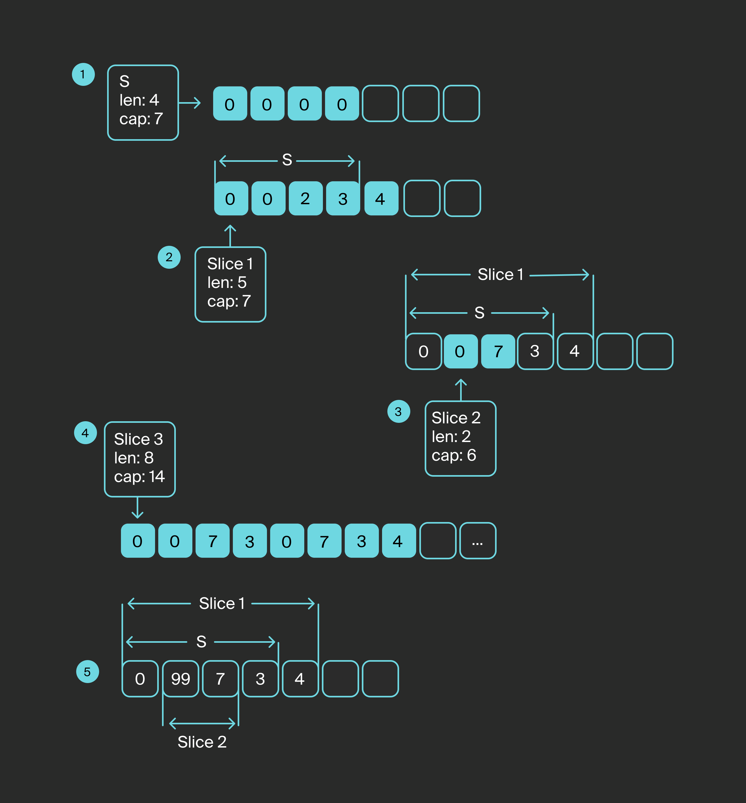

Здесь не очень понятно, будут ли новые слайсы ссылаться на тот же базовый массив или отправят свои копии в новый массив.
Поэтому на практике функцию `append` рекомендуют лишь для присвоения слайса самому себе: `s = append(s, b)`.

> Чтобы использовать слайсы, нужно понимать механизм их работы.
> В противном случае вы будете получать ошибки, которые очень трудно найти.
> Старайтесь избегать ситуаций, когда на базовый массив ссылается несколько слайсов и происходит добавление или изменение элементов.

Операция взятия слайса поддерживает и третий параметр: `[low:high:max]` — третьим параметром указывается ёмкость базового массива, необходимая для создания нового слайса.
При этом `max` должна быть меньше или равна ёмкости базового массива или слайса.
Вряд ли вы встретите аналогичный пример на практике, но знать про него будет полезно.


## Присваивание слайса и передача в функции
Присвоение друг другу переменных слайса даже самого внушительного размера не потребляет больших вычислительных мощностей, потому что сама по себе структура слайса всегда содержит всего три поля: `ptr`, `len` и `cap`.
Однако надо держать в уме, что эти переменные ссылаются на один и тот же массив, поэтому изменение в данных одного слайса может повлечь за собой изменение другого.

При передаче слайса в аргументы функции структура слайса копируется в локальную переменную внутри функции.
Это позволяет изменить данные внутри слайса, переданного в функцию.
Но если нужно добавить или удалить элементы из слайса, то эти изменения затронут только локальную переменную слайса.

Для примера возьмём пару функций из стандартной библиотеки:
```go
s := []int{5, 4, 1, 3, 2}
sort.Ints(s)
fmt.Println(s) // [1 2 3 4 5]
```

Функция `sort.Ints` сортирует полученный слайс целых чисел по возрастанию.
Она не меняет размер и ёмкость слайса, поэтому может спокойно работать с ним.
```go
    // Пример взят из стандартной библиотеки
    import (
    "bytes"
    "fmt"
)

func main() {
    bSlice := []byte(" \t\n a lone gopher \n\t\r\n")
    fmt.Printf("%s", bytes.TrimSpace(bSlice)) // a lone gopher
    fmt.Printf("%s", bSlice)  // \t\n a lone gopher \n\t\r\n 
    
}
```
 
Функция `bytes.TrimSpace` принимает _**слайс байт**_ и возвращает новый слайс байт, откуда были удалены начальные и конечные пробельные символы.
Размер слайса должен измениться, а значит, `bSlice` останется нетронутым. В итоге `bytes.TrimSpace` подарит нам новый слайс.


## Копирование слайсов
Для копирования элементов из одного слайса в другой применяется функция `copy([]T dest, []T src)`, где `dest` — это слайс-приёмник, а `src` — слайс-источник.
Эта функция только перезаписывает элементы, поэтому количество скопированных элементов будет равно меньшей длине из двух слайсов.
```go
var dest []int
dest2, dest3 := make([]int, 3),  make([]int, 5)
src := []int{1, 2, 3, 4}
copy(dest, src)
copy(dest2, src)
copy(dest3, src)
fmt.Println(dest, dest2, dest3, src ) // [] [1 2 3] [1 2 3 4 0] [1 2 3 4]
```

## Обход слайсов и доступ к элементам
Обход слайсов и доступ к элементам слайса происходят точно так же, как и для массивов.
Чтобы добраться до элементов по индексу, используются квадратные скобки `[]`, циклы `for` и `for range`.


## Полезные приёмы для работы со слайсами
В отличие от других языков программирования, Go не щеголяет обилием функций для работы со слайсами.
Гоферы выкрутились и придумали несколько приёмов, которые позволяют решать частые задачи.

#### Удаление последнего элемента слайса:
```go
s := []int{1, 2, 3}
if len(s) != 0 { // защищаемся от паники
    s = s[:len(s)-1]
}
fmt.Println(s) // [1 2]
```

#### Удаление первого элемента слайса:
```go
s := []int{1,2,3}
if len(s) != 0 { // защищаемся от паники
    s = s[1:]
} 
fmt.Println(s) // [2 3]
```

#### Удаление элемента слайса с индексом `i`:
```go
s := []int{1,2,3,4,5}
i := 2

if len(s) != 0 && i < len(s)-1  { // защищаемся от паники
    s = append(s[:i], s[i+1:]...)
} 
fmt.Println(s) // [1 2 4 5]
```

#### Сравнение двух слайсов:
```go
s1 := []int{1,2,3}
s2 := []int{1,2,4}
s3 := []string{"1","2","3"}
s4 := []int{1,2,3}

fmt.Println(reflect.DeepEqual(s1,s2)) // false
fmt.Println(reflect.DeepEqual(s1,s3)) // false
fmt.Println(reflect.DeepEqual(s1,s4)) // true
```

## Заключение
Слайсы широко применяются в Go для реализации коллекций однотипных элементов, но требуют грамотного применения: без понимания их устройства вы можете нарваться на каверзные ошибки.

## Дополнительные материалы
[Go Slice Tricks Cheat Sheet](https://ueokande.github.io/go-slice-tricks/)
[Digital Ocean. Массивы и срезы в Go](https://www.digitalocean.com/community/tutorials/understanding-arrays-and-slices-in-go-ru)


# Мапы
**Словарь, ассоциативный массив, хеш-таблица** — распространённая в программировании структура данных, которая во многих языках встроена в базовый синтаксис, а в остальных реализована на уровне библиотек.

**Ассоциативный массив** — это набор пар вида «ключ-значение». Ключу можно присвоить значение `Map[key] = value`, а потом извлечь это значение `value = Map[key]` по ключу. Ключи уникальны: одному ключу соответствует только одно значение. 
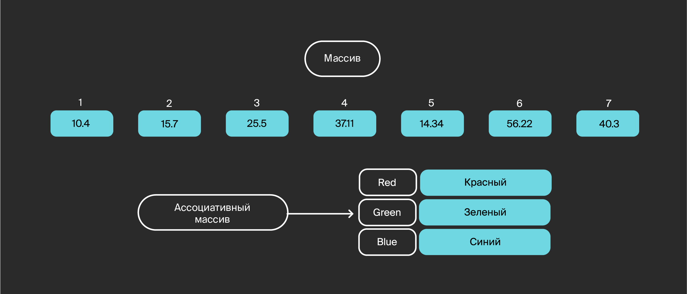

На рисунке приведено сравнение ассоциативного и обычного массивов.
Если для обычного массива можно получить значение по индексу, то для ассоциативного значение добывается через ключ.

В простом массиве значение элемента можно получить по целочисленному индексу этого элемента.
В ассоциативном массиве индексом элемента может служить не только целое число или порядковый номер, но и, например, строка.

Адрес значения для ключа, как правило, вычисляется хеш-функцией, поэтому такую структуру данных ещё называют **хеш-таблицей (hash table, hash map)**.

**Хеш-функция** — это любая функция, которая может однозначно перевести любое переданное значение в некоторое множество ограниченных значений.
Удобство применения хеш-функций в том, что из неограниченного множества значений можно получить значения из конечного множества.
Их можно использовать, например, для адресов массивов.

В различных языках программирования реализация ассоциативного массива различается:
- С++ — библиотечный класс `std::map`.
- Python — встроенный тип `dict()`.
- PHP — класс `Ds\Map`.
- Lua — `table`.

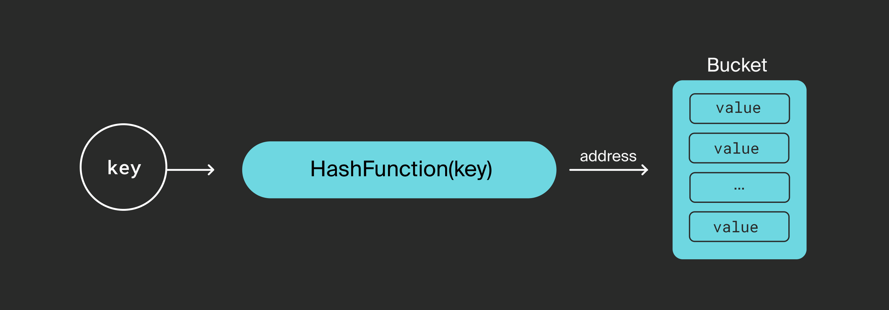

В Go такой тип данных встроен в базовый синтаксис и называется map.

Пример кода:
```go
m := make(map[string]string)    // создаём map — о применении функции make для создания переменных типа map будет рассказано ниже
m["foo"] = "bar"        // заполняем парами «ключ-значение»
m["ping"] = "pong"        
fmt.Println(m)            // печатаем
```

Выведет:
```go
map[foo:bar ping:pong]
```

Теперь разберём подробнее.

## Объявление map
Декларируется тип map так:
```go
var m map[KeyType]ValueType
```

Ключи должны быть одного типа, значения — тоже.
При этом тип ключей может не совпадать с типом значений.

В языке Go `map` — **ссылочный тип (reference type)**, поэтому одного объявления типа `map` недостаточно.

К примеру, такой код скомпилируется:
```go
var m map[string]string
m["foo"] = "bar"
```

Но выдаст ошибку во время исполнения ([run-time panic](https://golang.org/ref/spec#Run_time_panics)):
```commandline
panic: assignment to entry in nil map
```

Чтобы объект ссылочного типа можно было использовать, его нужно сначала создать (инициализировать) встроенной функцией [make()](https://golang.org/ref/spec#Making_slices_maps_and_channels):
```go
type MyMap map[string] string

var m1 MyMap
m1 = make(MyMap, 5)

// объект готов
m1["foo"] = "bar"
```


## Сложный литерал (composite literal)
Вы можете не декларировать тип переменной, например `string`, а просто задать значение литерально:
```go
MyString := "Это моя строка" 
```

Компилятор сам назначит переменной тип, сконструирует объект и присвоит значение.

Такая нотация работает и для сложных типов.

Для `map` composite literal выглядит так:
```go
MyMap := map[KeyType]ValueType{key1: value1, key2: value2, ... , keyN: valueN,}
// например
MyStringMap := map[string]string{"first": "первый", "second": "второй",}
```

В данном случае композитный литерал создаёт `map` без использования функции `make` и уже с инициализированными парами «ключ-значение».


## Ограничения для типов ключей
Для ключей должны быть определены операторы `==` и `!=`, поэтому ключ не может быть функцией, хеш-таблицей или слайсом.

Если вы попробуете сделать так,
```go
var MyMap map[[]byte]string
```

то получите ошибку компиляции:
```commandline
./prog.go:6:12: invalid map key type []byte
```

На тип значений не накладывается никаких ограничений.


## Синтаксис map
Значения для ключей устанавливаются оператором присваивания:
```go
m[key] = value
```

А извлекаются индексным выражением:
```go
v, ok = m[k]
v, ok := m[k]
var v, ok = m[k]
```

Можно использовать простую форму индексного выражения:
```go
v = m[k]
```

В такой форме выражение обязательно возвращает:
- значение, привязанное к ключу k, если такое существует;
- в противном случае — нулевое значение типа.

Если сделать `m := make(map[int]int)`, не заполнить данными и всё же запросить значение ключа 100 `v :=  m[100]`, запрос будет отработан и вернёт значение 0 (нулевое значение для типа `int`).

Если присвоить значение ключу 50 `m[50] = 0` и запросить его `v := m[50]`, ответ будет таким же — `0`.

Это два разных случая:
- ключу не назначено значение;
- ключу назначено нулевое значение.

Чтобы различать их, лучше пользоваться полной формой индексного выражения: `v, ok = m[k]`.
Тогда переменная `ok` примет значение `true`, если ключ найден, и `false` в противном случае.

Сокращённые формы арифметических операторов здесь будут работать:
```go
m[k] += 2
// или
m[k]++
```

Взять ссылку на элемент `map` не получится.

Такой код
```go
addr := &m[k]
```

вызовет ошибку компиляции:
```commandline
cannot take the address of m[k]
```


## Встроенные функции для типа map
В Go для операций с map предусмотрены встроенные функции.

Функция `len(m)` возвращает количество элементов в таблице.
Её можно применять и к неинициализированной таблице, для которой ещё не использовали конструктор `make()`, — тогда `len(m)` возвращает `0`.
```go
var m1 map[int]int
m2 := map[int]int{1: 10, 2: 20, 3: 30}
fmt.Println(len(m1), len(m2))
```

Получим:
```commandline
0 3
```

Функция `len()` не даёт гарантии, что `map` инициализирована.
Чтобы удостовериться, избежав run-time panic, можно сравнить таблицу с `nil` — нулевым значением для типа `map`.
И `nil` — единственное значение, с которым можно сравнивать `map`. Сравнивать map друг с другом нельзя, так как оператор `==` не определён.
```go
var m map[string]string
if m != nil {            // если не проверить это условие,
    m["foo"] = "bar"    // то здесь можно получить panic
}
```

Функция `delete(m, k)` удаляет из таблицы `m` элемент с ключом `k`.
Если таблица не инициализирована или такого ключа в ней нет, run-time panic не будет, просто no-op.
```go
m := map[int]string{1: "first"}
v, ok := m[1]
fmt.Println(v, ok)
delete(m, 1)
v, ok = m[1]
fmt.Println(v, ok)
```

Выведет:
```commandline
first true
false
```


## Использование в циклах range
`map` можно использовать в цикле `for` c итератором `range`.

Для этого предусмотрен удобный синтаксис:
```go
m := make(map[string]string)
m["foo"] = "bar"
m["bazz"] = "yup"
for k, v := range m {
    // k будет перебирать ключи,
    // v — соответствующие этим ключам значения
    fmt.Printf("Ключ %v, имеет значение %v \n", k, v)
}
```

Если запустить цикл на неинициализированной `map`, будет сделано `0` итераций.

Если нужно изменить значения в цикле, то стоит помнить, что так не сработает:
```go
for k, v := range m {
    v = "here key "+k
}
```

В цикле переменной `v` итеративно присваиваются значения из таблицы.
Любое присваивание в Go имеет семантику pass-by-value, то есть значения из таблицы копируются в переменную `v`, а сама таблица не меняется.

Если нужна модификация таблицы, лучше сделать так:
```go
for k, v := range m {
    m[k] = "here key "+k    // применяем к таблице индексное выражение
                // и модифицируем её прямым доступом к ячейкам  
}
```

Go позволяет добавлять и удалять значения в `map` прямо внутри цикла, в процессе итерации.
Удалённые ключи гарантированно не попадут в последующие итерации.
С добавленными ключами таких гарантий нет
Новый ключ может попасть в последующие итерации, а может и не попасть.

Такой вариант возможен, но считается плохой практикой:
```go
for k, _ := range m { // обратите внимание на подчёркивание _
    delete(m, k)
}
```

Переменная _ используется в Go, когда оператор присваивания устанавливает несколько значений, но не все из них нужны разработчику.
Однако предоставлять переменную для значения придётся, иначе будет синтаксическая ошибка, которую не пропустит компилятор.
Разработчик предоставляет переменную `_`, чем сообщает компилятору, что значение ему не потребуется и его можно не вычислять.

В случае `for range map` допустимо писать `for k := range m`, то есть предоставить только одну переменную итерации.
Можно и вовсе не предоставлять ни одной: `for range m`.

`map` — неупорядоченный контейнер, в случае с которым порядок обхода ключей в цикле `for` не гарантируется и может различаться в циклах одной и той же таблицы.
К тому же `map` нельзя отсортировать.


## Конкурентный (concurrent) доступ
Go — многопоточный язык.
Многопоточность заложена в базовый синтаксис.
При запуске горутин помните, что ни один встроенный тип в Go (кроме `chan`) не защищён для доступа из нескольких потоков, и `map` не исключение.

> Для безопасного использования `map` из нескольких потоков должны применяться механизмы защиты, иначе возможно повреждение данных или состояние гонки.
> Недавно в стандартной библиотеке появился потокобезопасный вариант ассоциативного массива, эквивалент `map`, которым можно пользоваться в многопоточной среде.
> Механизмы защиты в этот тип уже встроены.


## Пример кода
Посчитаем и выведем количество вхождений для всех символов, которые встречаются в указанном предложении.
```go
// предложение
sentence := "Πολύ λίγα πράγματα συμβαίνουν στο σωστό χρόνο, και τα υπόλοιπα δεν συμβαίνουν καθόλου"
// инициализируем map
// ключами будут знаки, а значениями — количество вхождений
frequency := make(map[rune]int)
// пройдёмся по знакам в предложении
for _, v := range sentence {
    frequency[v]++    // встреченному знаку увеличиваем частоту
}
// печатаем
for k, v := range frequency {
    fmt.Printf("Знак %c встречается %d раз \n", k, v)
}
```

Выведет:
```commandline
Знак σ встречается 5 раз 
Знак β встречается 2 раз 
Знак δ встречается 1 раз 
Знак θ встречается 1 раз 
Знак Π встречается 1 раз 
Знак ο встречается 7 раз 
Знак   встречается 12 раз 
Знак ω встречается 1 раз 
Знак χ встречается 1 раз 
Знак κ встречается 2 раз 
Знак λ встречается 4 раз 
Знак ύ встречается 1 раз 
Знак ά встречается 1 раз 
Знак τ встречается 4 раз 
Знак ό встречается 4 раз 
Знак , встречается 1 раз 
Знак ε встречается 1 раз 
Знак ί встречается 3 раз 
Знак ρ встречается 2 раз 
Знак π встречается 3 раз 
Знак μ встречается 3 раз 
Знак υ встречается 6 раз 
Знак ν встречается 6 раз 
Знак ι встречается 2 раз 
Знак γ встречается 2 раз 
Знак α встречается 9 раз
```


# Структуры
Структура в Go представляет собой тип данных с заданным набором атрибутов (полей), использующийся для описания составных объектов.
Структура имеет близкие аналоги в других языках программирования:
- C — `struct`;
- С++ — `class`, `struct`;
- Python — `class`, `tuple`;
- PHP — `class`;
- Lua — `table`.

Посмотрите, как выглядит описание типа `Person`:
```go
type Person struct {
    Name        string
    Email       string
    dateOfBirth time.Time
}
```

Здесь описан тип структуры, отображающий информацию о некотором человеке: его имя, электронную почту, дату рождения.
Поля структуры могут быть любого типа, доступного в языке.

Могут быть и указателями на саму структуру. Классический пример — структура данных «дерево»:
```go
type Tree struct {
    Value      int
    LeftChild  *Tree
    RightChild *Tree
}
```


## Инициализация
Существует несколько подходов к созданию экземпляра объекта.
### 1. Пустой объект
```go
p := Person{}
// или
var p Person
```

Все поля структуры при таком подходе принимают значения по умолчанию.

Подход применяют:
- когда экземпляр не требует специальной инициализации и может быть использован дальше по коду;
- когда для инициализации полей нужны дополнительные условия и данные, то есть выставление значений конкретных полей будет следовать ниже по коду.

### 2. Неявное указание значений полей
```go
date := time.Date(2000, 12, 1, 0, 0, 0, 0, time.UTC)
p := Person{ "Иван", "ivan@yandex.ru", date }
```

При таком подходе перечисляют значения для всех полей структуры, используя литералы либо значения внешних переменных.

Требования:
- Нужно перечислить все поля объекта.
- Порядок следования аргументов инициализатора должен совпадать с порядком описания полей структуры. Если поставить поле `Email` на первое место в описании type `Person struct`, инициализация экземпляра выше будет некорректна (с точки зрения логики, но не компилятора).

Подход применяют:
- когда нужно явно указать значения всех полей объекта;
- когда вы уверены, что спецификация типа не будет меняться часто, иначе придётся вносить правки для каждого инициализатора объекта в коде.

### 3. Явное указание значений полей
```go
p := Person{ Name: "Иван", Email: "ivan@yandex.ru" }
```

При таком подходе явно указывают имена полей и их значения.

Особенности:
- этот подход отличается от первого опциональным указанием полей;
- порядок указания полей не важен;
- значения полей, которые не были использованы в инициализаторе (**dateOfBirth** в примере), примут значения по умолчанию.

Для повышения читабельности кода такую инициализацию часто описывают в несколько строк, что справедливо и для второго подхода:
```go
p := Person{
    Name: "Иван",
    Email: "ivan@yandex.ru",
}
```

> Обратите внимание, что последняя строка в многострочной записи литерала тоже заканчивается запятой.
> Это делается для того, чтобы можно было вставлять и удалять строки, не заботясь о запятой в конце.

Подход применяют:
- почти всегда, так как он лишён ограничений, описанных выше.

На практике обычно применяется явное указание имён, потому что оно снижает количество возможных ошибок.

Рассмотрим пример, когда в коде, возможно в другом пакете или даже репозитории, у нас указана структура `Person` со следующими полями:
```go
type Person struct {
    // Имя
    Name string
    // Возраст
    Age int
}
```

Структура очень простая, и Go инициализирует её следующим образом:
```go
man := Person{"Alex", 30}

fmt.Printf ("Man %#v", man) // 
```

Затем описание структуры изменяется:
```go
type Person struct {
    // Имя
    Name string
    // Количество детей 
    NumChild int
    // Возраст
    Age int
}
```

Компилятор подсказывает, что для инициализации недостаточно полей, тогда добавляем ещё значение:
```go
man := Person{"Alex", 30, 2}

fmt.Printf ("Man %#v", man) // И получаем работающую (хоть и неправильно) программу 
```
Вполне вероятно, что количество детей у человека особо не влияет на код.
Однако нам потребовалось внести правки в наш код из-за внешних изменений.

При использовании явного указания полей проблемы бы не возникли:
```go
man := Person{Name:"Alex", Age: 30}
// Будет корректно работать с любыми структурами, включающими эти поля
```

### 4. Конструктор
Учитывая тонкости при инициализации сложного объекта, разработчики применяют конструкторы.

В Go нет синтаксиса конструкторов и деструкторов, но часто можно встретить аналог:
```go
func NewPerson(name, email string, dobYear, dobMonth, dobDate int) Person {
   return Person{
       Name:        name,
       Email:       email,
       dateOfBirth: time.Date(dobYear, time.Month(dobMonth), dobDate, 0, 0, 0, 0, time.UTC),
   }
}
```

Вот некоторые правила, одобренные Go-сообществом:
- имя функции конструктора пишут с префиксом New;
- если конструктор производит валидацию аргументов, функция должна возвращать ошибку последним аргументом.

Можем вернуться к нашему примеру, чтобы добавить проверку корректности `email` и числовых компонент даты — тогда декларация функции примет вид:
```go
func NewPerson(name, email string, dobYear, dobMonth, dobDate int) (Person, error) {}
```

Подход применяют:
- когда нужно производить валидацию аргументов, чтобы построить логически правильный объект;
- когда построение экземпляра объекта требует дополнительных действий, например подключения к базе данных.

> Пример выше не идеален, так как изменение спецификации `Person` потребует изменения прототипа конструктора или создания новой версии (скажем, `NewPersonWithPhone()`).
> Идиоматичные Go-подходы к созданию объектов рассмотрим в следующих темах.

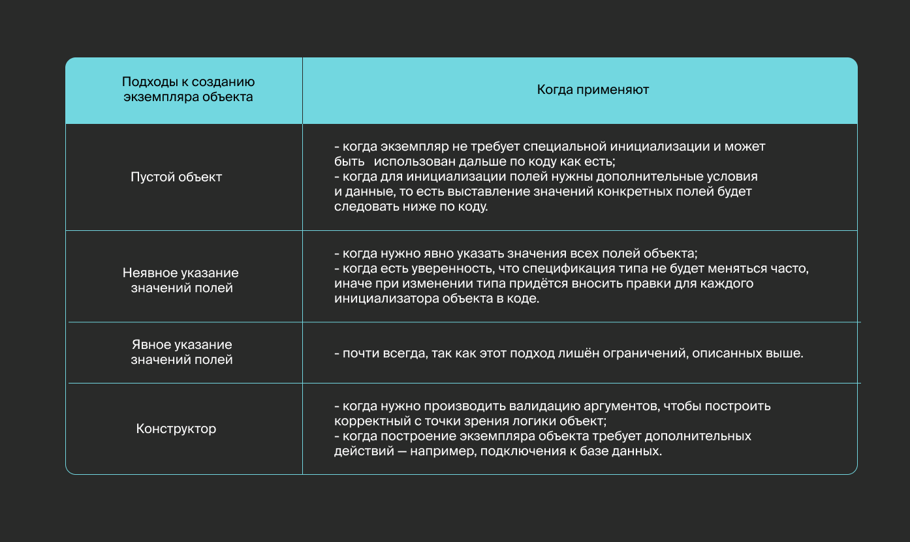


## Доступ к полям
Для доступа к полям структуры используется точка (p.Name):
```go
p := NewPerson("Иван", "ivan@yandex.ru", 2000, 12, 1)
fmt.Println(p.Name, p.Email)

p.Name = "Пётр"
fmt.Println(p.Name) 
```
```go
Иван ivan@yandex.ru
Пётр
```


## Область видимости
Как вы уже знаете, в Go есть понятия **экспортируемых** и **неэкспортируемых** типов.
Код разделяется на пакеты, и, чтобы тип, функция или глобальная переменная были доступны в другом пакете, их имена должны начинаться с заглавной буквы.
Это же правило работает для полей и методов структуры.


В примере выше `Person` — экспортируемый тип (публичный). 
Другие пакеты могут создавать экземпляры этого типа и иметь доступ к публичным полям `Name` и `Email`. А поле `dateOfBirth` — неэкспортируемое (приватное).

> Неэкспортируемый тип можно использовать в другом пакете, если есть соответствующий конструктор типа и экспортируемая функция конструктора.
> Такой трюк встречается в Go-коде, однако чаще всего для сокрытия реализации используют интерфейсы. 
> О них будет рассказано в соответствующей главе нашего курса.

Приведём пример экспортирования приватного типа:
```go
package foo

// privateFoo — неэкспортируемый тип
type privateFoo struct {
    Value string
}

// NewPrivateFoo — конструктор типа privateFoo
// Функция публичная, то есть может быть вызвана из других пакетов
func NewPrivateFoo() privateFoo {
    return privateFoo{Value: "some data"}
}
```
```go
package main

import "github.com/the_greatest_coder/hello_go/foo"

func main() {
    // f := foo.privateFoo{} // ошибка компиляции
    f := foo.NewPrivateFoo()
    fmt.Println(f.Value) // поле Value экспортируемое, то есть его можно использовать
}
```
```go
some data
```


## Теги
У каждого поля структуры может быть набор аннотаций, которые называются тегами (tags):
```go
type GetUserRequest struct {
    UserId string `json:"user_id" yaml: "user_id" format:"uuid" example:"2e263a90-b74b-11eb-8529-0242ac130003"`
    IsDeleted *bool `json:"is_deleted,omitempty" yaml:"is_deleted"`
}
```

Теги не влияют на представление или работу с данными напрямую, но могут использоваться пакетами для получения дополнительной информации о конкретном поле.

Набор тегов с их значениями можно представить как набор ключей и значений, где ключи разделяются пробелами, а значения ключей — запятой.

В примере выше встречаются следующие теги:
- `json` — используется пакетом encoding/json для сериализации/десерилизации структур в JSON;
- `yaml` — похож на `json`, но используется внешними библиотеками для работы с форматом YAML;
- `format` и `example` — могут быть как подсказкой для разработчика, так и аннотацией для генерации Swagger-описания (к примеру, библиотекой swag).

Применяемые аннотации чаще всего зависят от используемой библиотеки.
Возможные ключи и значения стоит искать в документации пакета (в худшем случае — в коде).

Разработчик может вводить свои теги и работать с ними через пакет reflect стандартной библиотеки.


## Анонимные структуры
Анонимные структуры объявляются и используются непосредственно в коде. 
Отдельный тип для них не описывают, потому что анонимные структуры применяются однократно, и описание имеет смысл только для конкретной части кода: например, при сериализации/десериализации сообщений. 
Чаще всего анонимные структуры используют в тестах для описания тестовых структур.

Проще всего понять концепцию анонимных структур из следующего соображения:
```go
type Person struct {
    Name string 
}
```

Конструкция `type Person ...` на самом деле не описывает, а создаёт тип на основе существующего и называет его.
То есть по факту тип создаёт именно конструкция `struct{}`.

Получив такой анонимный тип, можно сразу же создать переменную этого типа.

Приведём пример использования анонимной структуры при построении REST-запроса:
```go
req := struct {
    NameContains string `json:"name_contains"`
    Offset       int    `json:"offset"`
    Limit        int    `json:"limit"`
}{
    NameContains: "Иван",
    Limit:        50,
}

reqRaw, _ := json.Marshal(req)
fmt.Println(string(reqRaw)) 
```
```go
{"name_contains":"Иван","offset":0,"limit":50}
```

Здесь мы описали анонимную структуру, инициализировали её экземпляр, произвели JSON-сериализацию и вывели результат в виде строки.


## struct{}
```go
var c struct{}
// или
c := struct{}{}

fmt.Println(unsafe.Sizeof(c))
fmt.Println(unsafe.Pointer(&c)) 
```
```commandline
0
0x11d46e8
```

Размер `struct{}` равен `0`, при этом объект `c` имеет адрес.
Такую лазейку можно использовать для оптимизации кода по памяти, а в дальнейшем разберём это на практике.

## Сравнение структур и их аналогов в популярных языках программирования
В таблице приведены особенности структур языка Go в сравнении с другими языками.

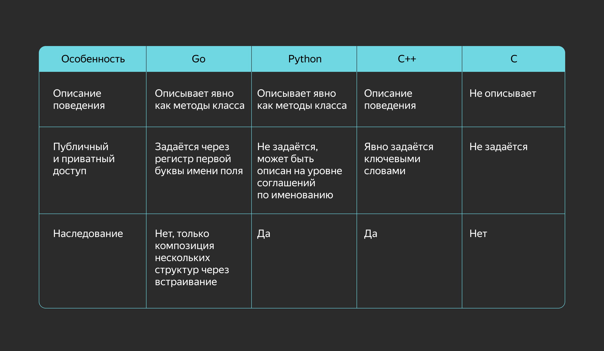


# Функции
К концу 60-х годов прошлого века программисты успели написать столько кода, что начали путаться и повторяться.
Напрашивалось решение, которое было бы проще поддерживать и использовать многократно.
Именно тогда нидерландский учёный Эдсгер Вибе Дейкстра придумал «структурное программирование» и опубликовал свои идеи в работе «О вреде оператора goto».

Принцип 4 методологии структурного программирования гласит: «Повторяющиеся фрагменты программы можно оформить в виде подпрограмм (процедур и функций)».

**Функция** — это логически целостный участок кода с одним входом и одним выходом в потоке управления. Этот участок можно использовать многократно, обращаясь к нему по имени.

Смысловая нагрузка у функции в программировании примерно такая же, как у функции в математике.
У функции есть название и определение. Ей можно передать значения переменных и получить результат.

Сначала нужно определить функцию:
```go
func Cube(x int) int{ // декларация функции
    return x*x*x  // тело функции
}
```

И только затем её можно использовать:
```go
result := Cube(5) // вызов функции
```


## Декларация функции в Go
Декларацию функции часто называют сигнатурой (signature).
```go
func MyFunction(arg1 arg1type, arg2 arg2type) resultType{
    // тело функции
}
```

Здесь:
- `MyFunction` — имя функции.
- `arg1 arg1type` — параметр функции и его тип. Типы параметров должны быть заявлены при декларации, потому что Go — статически типизированный язык.
- `resultType` — тип возвращаемого значения.

Результат функции тоже можно именовать:
```go
func Divide(x int) (half int) {
    half = x/2
    return // тогда в инструкции return имя можно не указывать
}
```

> Обратите внимание, что нельзя декларировать функцию внутри другой функции.
> Это ограничение языка, связанное с особенностями компиляции.


## Параметры
Аргументы передаются функции путём копирования значения, то есть функции не могут изменять переданные им переменные.

Для примера напишем такой код:
```go
func increment(x int) {
    // x — локальная переменная для этой функции
    x++ 
}

func main() {
    n := 5
    // n копируется в переменную x
    increment(n) // значение n не изменится
    fmt.Println(n)
}
```

Получим:
```commandline
5
```
 
Если параметры одного типа, можно сократить код:
```go
func Sum(x, y int) int{
    return x + y
}
```

> В Go есть специальный синтаксис для функций, которые можно вызывать с переменным количеством аргументов (**variadic functions**).
> Параметр, принимающий такие аргументы, нужно поставить последним в списке, а перед его типом — многоточие.

```go
func Sum(x ...int) int
```

Внутри функции этот параметр рассматривается как `нумерованная последовательность аргументов (slice)`.
```go
func Sum(x ...int) (res int) {
    for _, v := range x {
        res += v
    }
    return
}
```

Вызывают такую функцию обычным образом, со списком аргументов через запятую:
```go
sum := Sum(2, 3, 5, 1, 2, 57)
```
 
Если вызвать эту функцию без аргументов `Sum()`, параметр `x` примет значение `nil`. Тогда цикл не пройдёт ни одной итерации, и функция вернёт `0`.


## Возвращаемые значения
Функция необязательно возвращает значение.
Она может использоваться исключительно ради побочных эффектов, производимых ею в среде исполнения.
Например, `fmt.Println()`.

Также функция может возвращать не одно, а несколько значений разных типов.
```go
func foo()(int, int, string)
```

При вызове такой функции должны быть предоставлены переменные, которым надо все эти значения присвоить.
```go
x, y, z := foo()
```

А если некоторые значения не нужны, можно воспользоваться переменной `_`.
```go
_, y, _ := foo()
```

В функции, которая возвращает значение, обязательно должна быть инструкция `return`.

Список возвращаемых значений имеет тот же синтаксис, что и список параметров. Например, можно написать коротко:
```go
func foo() (x, y, z int)
```

Обратите внимание, что здесь возвращаемые значения имеют имена.
В теле функции они могут использоваться как обычные переменные.
При входе в функцию они будут инициализированы значениями по умолчанию для данного типа.

Если функция содержит именованные возвращаемые значения, то необязательно указывать список возвращаемых значений оператором `return`.
В таком случае будут возвращены значения переменных, которые они имеют к этому моменту.

Вот функция, которая находит индекс буквы в строке и возвращает вторым аргументом `false`, если буква не найдена:
```go
func Index(st string, a rune) (index int, ok bool) {
  for i, c := range st {
    if c == a {
      return i, true
    }
  }
    return // вернутся значения по умолчанию
}
```

Если количество и тип возвращаемых функцией значений
```go
func foo()(int, int)
```

в точности соответствуют параметрам другой функции,
```go
func bar(x int, y int)
```

то допускается такой синтаксис вызова:
```go
bar(foo())
```


## Рекурсивные функции
В Go можно декларировать рекурсивную функцию — вызывающую саму себя.

Вот хрестоматийный пример рекурсивного вычисления `n!`, факториала числа:
```go
func fact(n int) int {
    if n == 0 {    // терминальная ветка — то есть условие выхода из рекурсии
        return 1
    } else {    // рекурсивная ветка 
        return n * fact(n-1)
    }
}
```

А вот числа Фибоначчи:
```go
func Fib(n int) int {
    switch {
    case n <= 1:    // терминальная ветка 
        return n
    default:        // рекурсивная ветка
        return Fib(n-1) + Fib(n-2)
    }
}
```

Всё как обычно.

Следует помнить, что в Go вызов функции имеет определённую вычислительную стоимость, а также затраты по памяти, ведь как минимум нужно скопировать аргументы.
Поэтому множество вложенных вызовов функции может привести к снижению производительности программы и переполнению памяти.

Итеративные алгоритмы будут работать быстрее. Для сравнения приведём итеративную реализацию (на основе циклов) вышеуказанных примеров:
```go
func fact(n int) int {
    res := 1
    for n > 0 {
        res *= n
        n--
    }
    return res
}
```
```go
func Fib(n int) int {
    a, b := 0, 1
    for n > 0 {
        a, b = b, a+b
        n--
    }
    return a
}
```

Тем не менее это не означает, что рекурсивные алгоритмы неприменимы.
В ряде случаев они могут быть полезнее, проще и делать код нагляднее.

Приведём пример работы с рекурсивным обходом всех файлов в данной директории, причём директория может содержать вложенные поддиректории:
```go
func main() {
    PrintAllFiles(".")
}

func PrintAllFiles(path string) {
    // получаем список всех элементов в папке (и файлов, и директорий)
    files, err := ioutil.ReadDir(path)
    if err != nil {
        fmt.Println("unable to get list of files", err)
        return
    }
    //  проходим по списку
    for _, f := range files {
        // получаем имя элемента
        // filepath.Join — функция, которая собирает путь к элементу с разделителями
        filename := filepath.Join(path, f.Name())
        // печатаем имя элемента
        fmt.Println(filename)
        // если элемент — директория, то вызываем для него рекурсивно ту же функцию
        if f.IsDir() {
            PrintAllFiles(filename)
        }
    }
}
```

Итеративная реализация данного алгоритма была бы куда сложнее.


## Функция первого класса
Функции в Go ничем не уступают другим классам объектов.
У функции есть тип и значение.
Функцию можно присвоить переменной, можно передать аргументом другой функции.
Функция может возвращать в качестве значения другую функцию.

Тип функции виден в её сигнатуре, то есть определяется как набор типов и количества аргументов, возвращаемых значений.

Например, эта функция
```go
func Say(animal string) (v string) {
    switch animal {
    default:
        v = "heh"
    case "dog":
        v = "gav"
    case "cat":
        v = "myau"
    case "cow":
        v = "mu"
    }
    return
}
```

имеет тип:
```go
func(string) string 
```

Можно присвоить её переменной такого типа:
```go
var voice func(string) string
voice = Say
```

Можно написать функцию высшего порядка с параметром такого типа:
```go
func Print(who string, how func(string) string){
    fmt.Println(how(who))
}
```

И передать ей функцию аргументом:
```go
Print("dog", Say)
```

Для функции есть литеральная форма синтаксиса.
Функцию можно создать по месту, не декларируя и не именуя в блоке деклараций.
```go
f := func(s string) string { return s }
```

Можно даже использовать литерал в качестве аргумента при вызове:
```go
Print("dog", func(s string) string { return s }) 
```

Это то, что ещё называют анонимной или лямбда-функцией.

Можно написать функцию, которая возвращает функции значениями:
```go
func Do(say bool) func(string) string {
    if say {
        return Say
    }
    return func(s string) string { return s }
}
```

И вызывать вот так:
```go
Print("dog", Do(true))
```


## Замыкания
Go — язык с **лексической областью видимости (lexically scoped)**.
Это значит, что переменные, определённые в окружающих блоках видимости (например, глобальные переменные), доступны функции всегда, а не только на время вызова.
Можно считать, что функция их запоминает.

Лексическая область видимости и анонимные функции позволяют реализовать **замыкания (closure)**.

Вот классический пример итератора чётных чисел, построенного на замыкании:
```go
func Generate(seed int) func() {
    return func() {
        fmt.Println(seed) // замыкание получает внешнюю переменную seed
        seed += 2 // переменная модифицируется
    }
    
}

func main() {
    iterator := Generate(0)
    iterator()
    iterator()
    iterator()
    iterator()
    iterator()
}
```

Замыкание привязывает к себе внешнюю переменную.
После выхода из внешней функции `Generate` она не уничтожается, а остаётся привязанной к функции замыкания, причём её значение сохраняется между вызовами функции.

Получаем:
```bash
0
2
4
6
8
```

А вот и упоминавшиеся числа Фибоначчи, но теперь написанные с применением замыкания:
```go
func fib() func() int {
    x1, x2 := 0, 1
    // возвращаемая функция замыкает x1, x2
    return func() int {
        x1, x2 = x2, x1+x2
        return x1
    }
}

func main() {
    f := fib() // получили функцию-замыкание. f() — захватила x1, x2. x1 = 0, x2 = 1
    fmt.Println(f()) // x1 = 1, x2 = 1
    fmt.Println(f()) // x1 = 1, x2 = 2
    fmt.Println(f()) // x1 = 2, x2 = 3
    fmt.Println(f()) // x1 = 3, x2 = 5
    fmt.Println(f()) // x1 = 5, x2 = 8
    fmt.Println(f()) // x1 = 8, x2 = 13

}
```

Получаем:
```bash
1
1
2
3
5
8
13
```

Такие функции иногда называют **генераторами**.
Они выдают новое значение какой-либо последовательности при каждом вызове.

Замыкания довольно полезные.
Они позволяют просто и изящно реализовать определённые паттерны проектирования.
Тем не менее, чтобы эффективно использовать замыкания, надо представлять, как они работают.

Приведём более практичный пример использования замыкания.
Создадим две функции-обёртки, одна из которых будет подсчитывать количество вызовов, а вторая — время исполнения функции.
```go
// countCall — функция-обёртка для подсчёта вызовов
func countCall(f func(string)) func(string) {
    cnt := 0
    // получаем имя функции. Подробнее об этом вызове будет рассказано в следующем курсе
    funcname := runtime.FuncForPC(reflect.ValueOf(f).Pointer()).Name()
    return func(s string) {
        cnt++
        fmt.Printf("Функция %s вызвана %d раз\n", funcname, cnt)
        f(s)
    }
}

// metricTimeCall — функция-обёртка для замера времени
func metricTimeCall(f func(string)) func(string) {
    return func(s string) {
        start := time.Now() // получаем текущее время
        f(s)
        fmt.Println("Execution time: ", time.Now().Sub(start)) // получаем интервал времени как разницу между двумя временными метками
    }
}

func myprint(s string) {
    fmt.Println(s)
}

func main() {

    countedPrint := countCall(myprint)
    countedPrint("Hello world")
    countedPrint("Hi")

    // обратите внимание, что мы оборачиваем уже обёрнутую функцию, а значение счётчика вызовов при этом сохраняется
    countAndMetricPrint := metricTimeCall(countedPrint)
    countAndMetricPrint("Hello")
    countAndMetricPrint("World")

}
// Результат

Функция main.myprint вызвана 1 раз
Hello world
Функция main.myprint вызвана 2 раз
Hi
Функция main.myprint вызвана 3 раз
Hello
Execution time:  3.147µs
Функция main.myprint вызвана 4 раз
World
Execution time:  3.16µs
```

Вот ещё интересный пример применения замыкания.
Вспомним функцию `PrintAllFilesWithFilter`, с которой мы недавно работали.
Её недостаток в том, что параметр `filter` передаётся при каждом рекурсивном вызове.
От этого можно избавиться, используя анонимную функцию в качестве замыкания.
```go
func PrintAllFilesWithFilterСlosure(path string, filter string) {
    // создаём переменную, содержащую функцию обхода
    // мы создаём её заранее, а не через оператор :=, чтобы замыкание могло сослаться на него
    var walk func(string)
    walk = func(path string) {
        // получаем список всех элементов в папке (и файлов, и директорий)
        files, err := ioutil.ReadDir(path)
        if err != nil {
            fmt.Println("unable to get list of files", err)
            return
        }
        //  проходим по списку
        for _, f := range files {
            // получаем имя элемента
            // filepath.Join — функция, которая собирает путь к элементу с разделителями
            filename := filepath.Join(path, f.Name())
            // печатаем имя элемента, если путь к нему содержит filter, который получим из внешнего контекста
            if strings.Contains(filename, filter) {
                fmt.Println(filename)
            }
            // если элемент — директория, то вызываем для него рекурсивно ту же функцию
            if f.IsDir() {
                walk(filename)
            }
        }
    }
    // теперь вызовем функцию walk
    walk(path)
}
```
 
Теперь неизменяющийся параметр не копируется на каждом шаге рекурсии.
Замыкание просто ссылается на его значение, повышая скорость работы программы и снижая вероятность ошибки.

> Такой подход часто применяется в веб-разработке на Go, когда группа функций-обработчиков объединяется в цепочки, разделяя между собой ответственность за определённые действия.


## Особенные функции
Точка входа в программу — функция `main()`.
Она обязательно должна существовать в единственном виде и в любой исполняемой программе на Go.
`main()` не принимает аргументов и не возвращает значений.

В Go есть встроенные функции, например: `make()`, `new()`, `len()`, `cap()`, `delete()`, `close()`, `append()`, `copy()`, `panic()`, `recover()`.
Это не библиотечные функции.
Они не вполне подчиняются правилам для функций пользователя.
У них может не быть сигнатуры, а их использование документировано в спецификации языка — основополагающем для Go документе.

В базовом синтаксисе языка также описана вот эта функция:
```go
func init() { … }
```

В пакете и даже в одном файле можно декларировать несколько таких функций.
Они будут вызваны один раз при инициализации пакета, после присвоения глобальных переменных, в том порядке, в котором они предоставлены компилятору (встречаются в исходном тексте).
Прямой вызов функции `init()` в коде программы не предусмотрен.

Служат эти функции для создания окружения, необходимого пакету для корректной работы.

Вот простой пример:
```go
var name, surname string

func init() {
    name = "John"
}
func init() {
    if surname == "" {
        surname = "Doe"
    }
}
func main() {
    fmt.Println("Hello " + name + " " + surname)
}
```


## Задание 5 с самопроверкой
Напишем конструктор типа с начальными значениями и удобными опциями.
Воспользуемся подходом, который предложил Роб Пайк в статье [Self-referential functions and the design of options](https://commandcenter.blogspot.com/2014/01/self-referential-functions-and-design.html).

В Go нет конструкторов в классическом ООП-понимании.
Есть встроенные аллокаторы `make()` и `new()`, которые инициализируют поля в их нулевые значения.
Необходимые параметры устанавливаются литерально, присваиванием.
```go
type Person struct {
    Name string
    Surname string
    Age int
}

john := Person{Name: "John", Surname: "Doe", Age: 21}
john.Age = 27 
```

Это не очень технологично. 
Предположим, нам нужно инициализировать однотипные элементы значениями по умолчанию, но с возможностью задать некоторые параметры.
```go
type Item struct {
    NoOption string
    Parameter1 string
    Parameter2 int
}
```

Сделаем свой конструктор с опциями.
```go
func NewItem(opts ...option) *Item {
    // инициализируем типовыми значениями
    i := &Item{
        NoOption: "usual",
        Parameter1: "default",
        Parameter2: 42,
    }
    // применяем опции в том порядке, в котором они были заявлены
    for _, opt := range opts {
        opt(i)
    }
    return i
}
```

Здесь опции — это функции, применяемые к объекту.
За это подход получил название **funcopts**.
```go
type option func(*Item)
```
Чтобы устанавливать параметры, будем использовать функции высшего порядка, возвращающие значениями функции `option`.
```go
func Option1(option1 string) option {
    return func(i *Item) {
        i.Parameter1 = option1
    }
}
func Option2(option2 int) option {
    return func(i *Item) {
        i.Parameter2 = option2
    }
}
```
Тогда инициализация объекта конструктором будет выглядеть так:
```go
func main() {
    // с параметрами по умолчанию
    item1 := NewItem()
    // с применением одной опции
    item2 := NewItem(Option2(70))
    // или двух
    item3 := NewItem(Option1("unusual"), Option2(99))
    // опции можно заявлять в разном порядке
    item4 := NewItem(Option2(88), Option1("rare"))
}
```


# Оператор отложенного вызова
Открывая доступ к ресурсу (файлу, сокету, сетевому соединению), программист думает, как бы потом не забыть его закрыть.
И забывает.

Под ресурсом понимаем любой объект, который может быть открыт (получаем доступ) и закрыт (отдаём доступ).
Если наш код возьмёт доступ и не отдаст — будет не очень.

> Обычно в языках ООП такое решается с помощью контекстных менеджеров (Python) или деструкторов (C++, Java).
> Однако в Gо это происходит по-другому — через механизм отложенного вызова.

В Go есть оператор, который позволяет запланировать отложенный вызов, — это инструкция `defer`.
Мы рассматривали его кратко в уроке «Особенности языка», а сейчас разберём в подробностях.
```go
resource := System.Acquire("resourceID")
defer System.Close(resource) 
```

Оператор `defer` часто применяется на практике, вот только для начинающих не всегда очевидно, как он работает и какие есть подводные камни.

Оператор `defer` используют внутри функций, а его `операндом` служит выражение вызова функции.
Будем называть эти функции «отложившая» и «отложенная», чтобы избежать путаницы.

Инструкция `defer` вычисляет аргументы для вызова, но вызов не делает.
Вызов выполняется непосредственно перед тем, как отложившая его функция вернёт управление.
```go
func EvaluationOrder(){
    defer fmt.Println("deferred")
    fmt.Println("evaluated")
}
```

Выведет:
```bash
evaluated
deferred
```
 
1. Работу оператора можно описать следующим образом.
2. Идёт обычное выполнение программы.
3. Наступает очередь выполнения оператора `defer`.
3. Вычисляются операнды отложенной функции, если такие есть.
4. Вызов функции вместе со значениями откладывается в специальный стек.
5. Выполнение функции продолжается. Если встречается оператор `defer`, то повторяем пункты 3 и 4.
6. Если встречается оператор `return`, то функция вычисляет его операнды и сохраняет значение в буфер.
7. Если стек отложенных вызовов не пустой, то извлекаем из него вызов функции и выполняем его.
8. Повторяем пункт 7, пока стек не опустеет.
9. Выходим из функции, возвращая значение из буфера.

Важно понимать, что результат функции вычисляется до выполнения отложенных вызовов.

Отложенных вызовов может быть несколько. Тогда они выполняются в обратном порядке, то есть начиная с того, который был отложен последним, так как вызовы складывались в стек.
```go
fmt.Println("Hello")
for i := 1; i <= 3; i++ {
    defer fmt.Println(i)
}
fmt.Println("World")
```

Выведет:
```bash
Hello
World
3
2
1
```

Отложенная функция может возвращать значение, которое не используется.
Действительно, его вернуть просто некуда.
Создатели языка решили не накладывать ограничений на отложенные функции, что удобно, ведь иначе пришлось бы писать что-нибудь такое:
```go
func VeryImportantFunc(s string, x, y, z int) (a int, b bool) {
    ...
}

//...

defer func (s string, x, y, z int)  {
    _,_ = VeryImportanttFunc(s,x,y,z)
}(s,x,y,z)
```

Этот код валиден, громоздок, подвержен ошибкам, но не несёт никакой смысловой нагрузки.
К счастью, Go позволяет написать:
```go
defer VeryImportanttFunc(s,x,y,z)
```

Также отложенная функция может быть анонимной и заданной литерально.
Напомним, что анонимной называется функция, задаваемая литералом по месту использования.
Анонимная функция в таком случае задаётся сразу вместе с вызовом.

В таком случае ей могут быть доступны переменные отложившей функции.
Произойдёт **замыкание (closure)**.
Например, если у отложившей функции есть именованное возвращаемое значение, отложенная функция может его изменить.
```go
func unintuitive() (value string){
    defer func() {value = "На самом деле"}() // круглые скобки в конце означают, что функция вызывается
    return "Казалось бы"
}
```

Обратите внимание, это работает только с именованными возвращаемыми значениями.
Следующий код выведет "Казалось бы":
```go
func intuitive() (string){
    value := "Казалось бы"
    defer func() {value = "На самом деле"}()
    return value
}
```

В чём разница?
В первом случае функция возвращает переменную `value`.
При вычислении операнда `return` ей действительно присваивается значение `"Казалось бы"`, но эта переменная захвачена замыканием и изменяется в нём.
После чего она и возвращается из функции.

Во втором случае у нас есть некоторая скрытая переменная `ret1`, в которую при вызове оператора `return` копируется значение её операнда.
После любые действия с `value` уже не будут важны.

Также распространённой ошибкой является предположение, что операнды отложенной функции будут вычислены во время её выполнения.
Это не так, они вычисляются при выполнении оператора `defer`:
```go
func SimeFunc() {
    a := "some text"
    defer func(s string){
        fmt.Println(s)    
    }(a)
    a = "another text"
}
```

Функция напечатает `"some text"`.
Оператор `defer` чаще всего можно увидеть с парными функциями `Open()`/`Close()`, `Lock()`/`Unlock()`.
Его ставят сразу после захвата ресурса, чтобы точно не забыть.

Вот классический пример:
```go
// открываем файл
file, err := os.OpenFile("file.txt", os.O_APPEND|os.O_CREATE|os.O_WRONLY, 0644)
if err != nil {
    log.Fatal(err)
}
// не забываем закрыть файл
defer file.Close()
// работаем с файлом
_, err = file.WriteString("")
if err != nil {
    log.Fatal(err)
}
```


## Пример применения
Реализуем на основе функции `defer` замер времени выполнения функции.

Для начала создадим функцию, которая будет измерять время выполнения и выводить его на экран.
```go
func metricTime (start time.Time) {
    // функция Now() возвращает текущее время, а функция Sub возвращает разницу между двумя временными метками
    fmt.Println(time.Now().Sub(start))
}
```

Теперь применим её внутри какой-нибудь функции.
```go
func VeryLongTimeFunction () {
    defer     metricTime(time.Now()) // передаём в функцию metricTime значение текущего времени и откладываем её вызов до возврата
    // Какие-то долгие вычисления
}
```


## defer и panic
Во время выполнения программы могут возникнуть различные непредвиденные обстоятельства, из-за которых дальнейшая работа функции будет невозможна.
В таком случае выполнение функции немедленно прекращается, паника передаётся вызывающей функции и затем вверх по стеку, пока выполнение программы не завершится.

Однако этот процесс меняется, если паникующая функция имеет отложенные вызовы.
Они будут исполнены после выхода из функции и могут понять, что произошла паника.

Это похоже на механизм исключений в С++ и Python, однако крайне не рекомендуется использовать `panic` для обычной работы.
Вызывать панику следует лишь тогда, когда выполнение программы действительно не может продолжаться и она должна быть завершена.
```go
func PanicingFunc () {
    defer func(){
        if r := recover(); r != nil {  // встроенная функция recover останавливает панику и возвращает описание произошедшего
            fmt.Println("Panic is caught", r)    
        } 
    }()
    /// 
    /// 
    
    panic("Мне здесь совсем ничего не нравится!") 
    // встроенная функция panic () вызывает панику у функции. 
    // в качестве аргумента ей принято передавать причину паники. Именно она будет возвращена функцией recover
}
```

Без применения оператора `defer` остановить панику было бы невозможно.
Он позволяет вклиниться в стек вызовов функций и остановить её.
Заметьте, что не всякую панику можно восстановить.
Иногда возникают особые ситуации, когда `recover` не срабатывает. 
О них будет рассказано в следующих курсах.


# Пакеты и импорт
Чем сложнее программа и чем больше людей над ней работают, тем важнее правильная организация исходного кода и понятная для всех архитектура проекта.

Любую крупную задачу можно разбить на подзадачи и реализовать их в виде пакетов.
Грамотное разделение проекта на пакеты и размещение их в соответствующих директориях позволяет:
- подключать к работе больше людей, так как разработчики могут реализовывать пакеты независимо друг от друга;
- тестировать и отлаживать компоненты (пакеты) сразу после их образования, создавая тесты внутри пакета;
- поддерживать и вносить изменения в дальнейшем, так как нужный код легко найти.


## Пакет
**Пакет** — это единица компиляции, пространства имён и импорта.
Весь код на языке Go находится в каком-либо пакете.

Проще говоря, пакет — это набор файлов с исходным кодом, который находится в одной папке проекта.
Пакеты позволяют логически разделить ваш проект на компоненты.
Все элементы кода (типы, константы, переменные, функции) доступны внутри пакета, как если бы они были объявлены в одном файле.
В каждом файле исходный код на языке Go должен начинаться с объявления пакета: ключевого слова `package` и имени пакета.
```go
package main

import "fmt"

func main() {
    fmt.Println(`Hello, world!`)
}
```

В директории у всех файлов должно быть одинаковое имя пакета, потому что компилятор будет обрабатывать сразу все файлы директории (если не указать на конкретный) и при разных именах пакетов возникнет ошибка.
Однако из этого правила есть исключение — файлы, название которых заканчивается на `_test.go`, могут иметь другое имя пакета, так как они игнорируются при сборке программы.

Подход «одна директория — один пакет» упрощает работу и дальнейшую поддержку программ.
Строго рекомендуется, чтобы название пакета совпадало с именем папки, так как с ними будет проще работать.

Если нужно создать исполняемый файл, у пакета должно быть имя `main` и одноимённая функция в одном из файлов.
В остальных случаях, если пакет будет использоваться как библиотека, желательно, чтобы имя пакета отражало его назначение.

## Как лучше называть пакет и его элементы
Чем создавать большой универсальный пакет, старайтесь разбивать код на мелкие пакеты и присваивать каждому из них понятное имя.

Записывайте имя пакета строчными буквами.
Хорошо, если оно будет коротким, но информативным: другим программистам должно быть понятно, что делает этот пакет.

Подбирайте пакету уникальное имя в рамках репозитория.
В противном случае при импорте нескольких пакетов с одинаковыми именами придётся использовать алиасы.

Не пишите в имени пакета общие слова: `util`, `base`, `tools`, `lib`, `common`.
Обычно эти имена ничего не рассказывают о реальном назначении пакета и только засоряют пространства имён.
Помните, что имя пакета будет использоваться в коде.

Не используйте множественное число.
Пакеты `strings`, `bytes`, `errors` в стандартной библиотеке Go названы так, чтобы избежать конфликта с типами.

> Когда будете называть элементы пакета, помните главное правило: при импорте пакета доступны только те определения, имена которых начинаются с заглавной буквы.
> В примере ниже при импорте пакета можно вызвать `mypkg.Process()`, но не `mypkg.calculate()`.
> Это правило относится к функциям, методам, константам, типам и глобальным переменным.

```go
package mypkg

func Process() {
    ...
}

func calculate() {
    ...
}
```

Не используйте слова из названия пакета при именовании экспортируемых объектов.
Например, если есть пакет `md` для работы с форматом Markdown, функцию конвертации в HTML можно так и назвать — `HTML`.
Не стоит называть функцию `MarkdownToHTML`: имя пакета уже указывает на то, с чем вы работаете.


## Пути пакета
Кроме имени пакета, важно правильно выбрать директорию, где он будет храниться.
Компилятор пойдёт по этому пути, чтобы произвести импорт.

Раньше все исходные файлы должны были находиться в поддиректории `GOPATH\src`. 
Здесь `GOPATH` — это переменная окружения, которая определяет рабочее пространство, где хранятся исходники и двоичные файлы.
По умолчанию она равна директории установки Go: если при импорте указан пакет `company\pkg`, он должен находиться в `GOPATH\src\company\pkg`.

Сейчас такой подход признан устаревшим, поэтому рекомендуется использовать модули (modules).
Подробнее о работе с модулями расскажем в следующих уроках, а здесь будет краткая версия: **модуль** — это законченная библиотека или приложение, которое может содержать внутренние пакеты и импортировать внешние.
Модуль вы можете разместить в любой директории, независимо от пути установки Go.
Если ваш пакет представляет собой отдельную библиотеку или приложение, оформляйте его в виде модуля и размещайте, где вам удобно.

Cтрогих правил по организации директорий нет, но лучше начать путь с домена или имени автора, чтобы избежать конфликтов имён при публичном использовании пакетов.
Например, вы можете создать директорию `golang` и размещать там все Go-проекты, для личных закрытых проектов создать отдельную поддиректорию, а публичные размещать сразу в поддиректории соответствующего репозитория.
В этом случае пакеты с GitHub будут расположены в поддиректориях вида `github.com/author/packagename`.

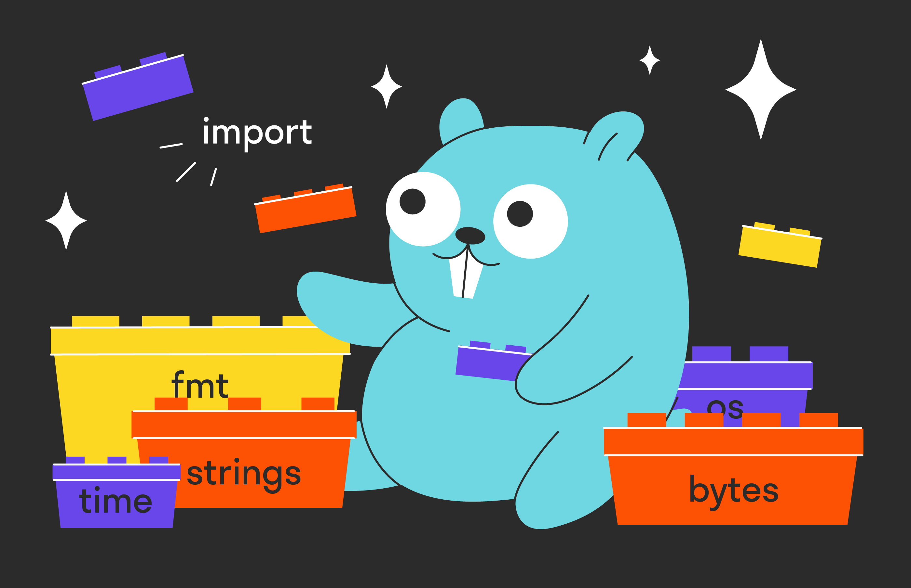


## Экспорт
Как было сказано выше, все элементы кода доступны внутри пакета.
Но как сделать их доступными извне?
Для этого в Go существует концепция экспорта.

> Любой элемент (тип, константа, переменная, функция) является экспортируемым, то есть доступным внешним пакетам для импорта, если его имя начинается с большой буквы.
> В противном случае такой элемент доступен только внутри пакета. 
> Это сродни модификаторам `public` и `private` из С++/Java или `static` из С++.

Пример экспортируемых элементов:
```go
var ParsedString string

func Print (s string){}

const Red = 3

type MyStruct struct{
    a int
}
```

И неэкспортируемые:
```go
func someTestFunc()

const green = 5
```

Экспортируемые элементы представляют собой внешний интерфейс вашего пакета.
Пусть он будет минималистичным.
Если элемент не нужен вне пакета, лучше сделать его неэкспортируемым.

Также с особой осторожностью следует относиться к экспорту переменных: возможно, будет лучше сделать функции, меняющие ваши переменные, чтобы код не становился негибким и опасным.
Вам будет труднее делать изменения в коде пакета, если внешний код использует переменные из вашего пакета.


## Импорт
Чтобы один пакет мог использовать другой, его надо импортировать.
Импорт пакета чем-то похож на аналогичный процесс в Python.
Он выполняется с помощью ключевого слова `import`.

Указывать `import` можно для каждого пакета, но чаще перечисляют все пакеты внутри круглых скобок.
`import` должен идти сразу после объявления package.
```go
package main

import "fmt"
import (
    "encoding/json"
    "strings"

    "github.com/yuin/goldmark"
    "golang.org/x/crypto/bcrypt"
    "gopkg.in/yaml.v2"
)
```

> Пакеты можно разбивать пустыми строками на группы: например, стандартная библиотека, внутренние пакеты и внешние пакеты.
> При этом пакеты внутри группы лучше отсортировать по алфавиту. 
> Подключите автоматический вызов стандартной утилиты форматирования `gofmt` к своей IDE, чтобы исправлять подобные недочёты. 
> Если у пакета несколько версий, можно указывать нужную версию после имени пакета.

Как было сказано выше, импортируются только экспортируемые переменные. 
Если пакеты при импорте образуют цикл, то есть импортируют друг друга напрямую или через другие пакеты, компилятор выдаст ошибку. 
Например, если у нас есть три пакета, то такая последовательность импорта недопустима — компилятор просто впадёт в цикл, обходя пакеты:
```go
package A

import "B" 
```
```go
package B

import "C"
```
```go
package C

import "A" 
```

При обращении к импортируемым объектам нужно указывать через точку имя пакета и имя элемента: `fmt.Println(...)`, `yaml.Marshal(...)`.


## Переименование импорта
Может возникнуть ситуация, когда понадобится импортировать два пакета с одинаковыми именами: например, `crypto/rand` и `math/rand`.
Тогда нужно для одного из пакетов указать другое имя (алиас). Кроме этого случая, альтернативное имя при импорте бывает полезным, если у пакета длинное имя.
Что касается нового имени пакета, то оно указывается через пробел перед полным именем.
```go
import (
    hl "github.com/yuin/goldmark-highlighting"
)
```

Согласитесь, вызов `hl.NewHighlighting(...)` не загромождает код, в отличие от `goldmark-highlighting.NewHighlighting(...)`.
Однако не стоит увлекаться переименованиями без явной нужды.


## Рассмотрим подробнее, как выполняется импорт пакетов.
При компиляции программы компилятор начинает с пакета main.
1. Если в `main` есть импорты каких-либо пакетов, то он переходит к ним и компилирует их, до тех пор пока не скомпилируются все необходимые пакеты для сборки программы.
2. Затем компилятор компилирует пакет `main` и собирает основное приложение, а далее в процессе выполнения программы произойдёт следующее:
   1. В том порядке, в котором пакеты были проимпортированы, будут инициализироваться переменные пакета. 
   2. После будут выполнены функции `init()` внутри каждого пакета. Функций `init()` может быть несколько, и они выполнятся в том порядке, в котором были объявлены.
   3. И после их выполнения наступит очередь функции `main`.
   
Таким образом, часть кода по инициализации может быть выполнена ещё до запуска основной программы.
Это очень удобная особенность, и в процессе работы вы, скорее всего, с ней столкнётесь.


## Пустой импорт
Если импортировать пакет, но не использовать его внутри файла, компилятор выдаст ошибку.
Однако бывают ситуации, когда нужно, чтобы импортируемый пакет вызвал функцию `init` для инициализации данных.
В этом случае указывается знак подчёркивания `_` вместо альтернативного имени импортируемого пакета.

В качестве примера можно привести очень удобный пакет `embed` из стандартной библиотеки.
Он позволяет инициировать значения строковых переменных содержимыми файла.
```go
import _ "embed"

//go:embed insert.sql
var queryInsert string
```

В первом случае можем получить пустой импорт, когда пакет не используется напрямую, не вызываются функции из него, а импортируются только аннотации в комментариях.

Второй случай — применение в процессе разработки.
Go запрещает компилировать код, в котором есть неиспользованные импорты, но иногда при отладке импорт нужно оставлять.
Тогда он может быть помечен как пустой.
Естественно, этот код используется только в отладочных целях и стоит держать его подальше от вашей кодовой базы.


## Организация кода
Go не накладывает ограничений на структуру проекта и расположение пакетов.
Можно организовывать файлы в проекте как угодно, но есть рекомендации, придерживаясь которых вы сделаете свой проект понятным для других программистов.

Существует подход, который называется **Standard Go Project Layout**.
В нём код проекта организуется в виде следующих директорий:

### cmd
Если в проекте будет несколько бинарных файлов, создайте для них поддиректории в `cmd`. Имена поддиректорий должны соответствовать именам исполняемых файлов.
```
- cmd
    - client
        main.go
    - server
        main.go
```

Если в проекте один исполняемый файл, исходные файлы можно разместить прямо в директории проекта.
Старайтесь использовать один-два исходных файла.
Остальной код нужно вынести в отдельные пакеты.

### internal
Директория `internal` содержит внутренние пакеты Go-проекта.
На уровне компилятора запрещён импорт таких пакетов извне родительской директории `internal`.
Например, пакет `.../root/client/internal/a/b` можно импортировать только в файле дерева директорий, которые начинаются с `.../root/client`, и нельзя в `.../root/server` или другом репозитории.

Рекомендуется размещать в директории `internal` весь основной исходный код программы, разбитый на поддиректории с соответствующими пакетами.
В зависимости от сложности проекта пакеты могут иметь разный уровень вложенности.

### pkg
Директорию `pkg` определите для пакетов, которые можно использовать в других проектах.
Предпочтительнее для публичных проектов заводить отдельные репозитории.

### vendor
Директория `vendor` содержит внешние пакеты.
C появлением в Go модулей все зависимости хранятся в кеше модуля.
Поэтому директорию `vendor` можно использовать на старых версиях Go или в том случае, если вы хотите быть уверены, что все зависимости находятся внутри директории проекта.

### test
Как правило, в каждом пакете есть один или несколько тестовых файлов `name_test.go`.
Директорию `test` можно использовать для комплексного тестирования с привлечением дополнительных инструментов.

### docs
Директория `docs` предназначена для ведения документации по проекту.
Это может быть документация для пользователей или дополнение к документации, которую автоматически генерирует `godoc`.


## Прочие директории
Вот ещё варианты директорий, которые встречаются в Go-проектах:
- `api` — дополнительные файлы для сервисов с API.
- `assets` — дополнительные файлы-ресурсы. Например, картинки.
- `build` — файлы для упаковки и непрерывной интеграции.
- `configs` — файлы конфигураций.
- `deployments/deploy` — файлы конфигураций и шаблоны для сервисов, операционных систем и контейнеров.
- `examples` — примеры использования приложений и библиотек.
- `sсripts` — скрипты для установки, настройки и других действий с проектом.
- `tools` — инструменты для поддержки проекта. Могут быть написаны на Go c использованием пакетов проекта.
- `website` — директория с файлами для веб-сайта проекта.

Это неполный список.
Можно создавать директории с другими именами.
Старайтесь давать такие имена, которые раскрывали бы назначение директории.


## Задание с самопроверкой
Создайте пакет для базовых математических вычислений со слайсами.
В итоге проект будет содержать два пакета main и тот, который разработали вы.
Расположение папок и структура проекта остаются на ваше усмотрение.

Пакет должен реализовывать следующие математические операции:
- `func SumSlice(s []int) int` возвращает сумму слайса.
- `func MapSlice(s []int, op func ( int) int)` применяет функцию, переданную во втором аргументе к слайсу.
- `func FoldSlice(s []int, op func ( int, int) int, init int) int` сворачивает слайс.

То есть применяют операцию по цепочке сначала к `init` и `s[]`, потом результат и полученное значение — к следующему и так далее.
Итоговый результат возвращается функцией, которая не должна изменять слайс.

Импортируйте ваш проект в свою программу и протестируйте:
```go
package mathslice

type Slice []Element

type Element int

// SumSlice — возвращает сумму элементов
func SumSlice(slice Slice) (res Element) {
    for _, s := range slice {
        res += s
    }
    return
}

// MapSlice — применяет функцию op к каждому элементу
func MapSlice(slice Slice, op func(Element) Element) {
    for i, s := range slice {
        slice[i] = op(s)
    }
}

// FolвSlice — сворачивает слайс.
func FoldSlice(slice Slice, op func(Element, Element) Element, init Element) (res Element) {
    res = op(init, slice[0])
    for i := 1; i < len(slice); i++ {
        res = op(res, slice[i])
    }
    return
}
```

```go
package main

import (
    "exercise/mathslice"
    "fmt"
)

func main() {

    s := mathslice.Slice{1, 2, 3}
    fmt.Println(s)
    fmt.Println("Сумма слайса: ", mathslice.SumSlice(s))

    mathslice.MapSlice(s, func(i mathslice.Element) mathslice.Element {
        return i * 2
    })

    fmt.Println("Слайс, умноженный на два: ", s)

    fmt.Println("Сумма слайса: ", mathslice.SumSlice(s))

    fmt.Println("Свёртка слайса умножением ",
        mathslice.FoldSlice(s,
            func(x mathslice.Element, y mathslice.Element) mathslice.Element {
                return x * y
            },
            1))

    fmt.Println("Свёртка слайса сложением ",
        mathslice.FoldSlice(s,
            func(x mathslice.Element, y mathslice.Element) mathslice.Element {
                return x + y
            },
            0))

}
```


## Дополнительные материалы
- [Style guideline for Go packages](https://rakyll.org/style-packages/)
- [Practical Go: Real world advice for writing maintainable Go programs](https://dave.cheney.net/practical-go/presentations/qcon-china.html)
- [Standard Go Project Layout](https://github.com/golang-standards/project-layout/blob/master/README_ru.md)


## Примечание - вызов локального пакета
[Мануал](https://go.dev/doc/tutorial/call-module-code)
1. Представим, что у нас следующая структура каталогов (`greetings` будет вспомогательным модулем, который мы будем вызывать из модуля `hello`):
    ```
    <home>/
     |-- greetings/
     |-- hello/
    ```
2. Вызовем в директории `greetings` команду `go mod init example.com/greetings`
3. Вызовем в директории `hello` команду `go mod init example.com/hello`
4. Пропишем `import` в коде модуля `hello`
5. Вызовем в директории `hello` команду `go mod edit -replace example.com/greetings=../greetings`
6. Вызовем в директории `hello` команду `go mod tidy`
7. Файл `go.mod` в директории `hello` должен получиться примерно следующим:
```
module example.com/hello

go 1.16

replace example.com/greetings => ../greetings

require example.com/greetings v0.0.0-00010101000000-000000000000
```


# Связь пакетов и файловой системы
В прошлом уроке вы узнали, что пакеты в Go — это директории с исходниками.
В этом расскажем, каким образом положение исходников в файловой системе определяет пути для импорта.

Если не пользоваться модулями (о них пойдёт речь в следующем уроке), то **путь для импорта пакета** — это путь к директории пакета относительно `${GOPATH}/src`.

При установке компилятора он создаёт переменную окружения `GOPATH`, которая указывает путь к папке установки.

> Напомним, что переменные окружения — это переменные, которые хранятся в вашей операционной системе и доступны программам.
> Посмотреть список переменных окружения можно командой `go env`, какую-то конкретную — например, `go env GOPATH`, а изменить переменную окружения — через команду `go env -w <Имя переменной>=<новое значение>`.

Допустим, нужно создать пакет для какого-нибудь финансового проекта. Назовём его `finance`.

По мере написания кода этого пакета выясняется, что в разных местах требуются одни и те же математические функции.
Тогда выносим их в отдельный подпакет `finmath`, после чего дерево пакетов в файловой системе будет выглядеть примерно так (названия файлов могут быть другие):
```
finance
├── money_calculation.go
└── finmath
    └── arithmetics.go
```

Если считать от `GOPATH`, то вот так:
```
GOPATH
└── src
    └── finance
        ├── money_calculation.go
        └── finmath
            └── arithmetics.go
```

Теперь можно импортировать пакеты `finance` и `finmath` по путям `"finance"` и `"finance/finmath"` соответственно:
```go
package main

import (
    "fmt"

    "finance"
    "finance/finmath"
)

func main() {
    fmt.Println(finance.GetMostRecentBill())
    fmt.Println(finmath.Add(1, 2))
}
```

Путь к пакетам, которые хостятся в системах контроля версий, обычно имеет вид `${GOPATH}/src/<VCS_URL>/<USER_NAME>/<REPO_NAME>`, а что касается, например, библиотеки тестирования [testify](https://github.com/stretchr/testify), то `${GOPATH}/src/github.com/stretchr/testify`.

>В Go на уровне компилятора запрещены циклические импорты.
> Если несколько пакетов зациклились друг на друга, нужно либо перекладывать проблемный код в отдельные пакеты, либо пересматривать логику работы приложения.
> Циклический импорт — это сигнал о том, что в приложении есть архитектурная проблема.
> Если архитектура приложения выстроена правильно, то циклические импорты не должны возникать.

О том, как правильно выстраивать архитектуру приложения, вы можете узнать на других наших курсах.

### Задание
Напишите функцию сложения целых чисел `AddInts(a, b int) int`.
Разместите файл с этой функцией в локальной файловой системе так, чтобы приведённый ниже код успешно отработал.
Изменять приведённый код нельзя.
```go
package main

import (
    "fmt"

    "toppackage/middlepackage/bottompackage/mathxxx"
)

func main() {
    if sum := mathxxx.AddInts(3, 2); sum != 5 {
        panic(fmt.Sprintf("sum must be equal 5; got %d", sum))
    }

    fmt.Println("Well done!")
}
```

### Правильный ответ
Нужно создать файл `GOPATH/src/toppackage/middlepackage/bottompackage/mathxxx/math.go` (имя файла может быть другим) со следующим содержимым:
```go
package mathxxx

func AddInts(a, b int) int {
    return a + b
}
```


# Модули
В этом уроке вы узнаете:
- что такое модули и почему с ними лучше, чем без них;
- как создать свой первый локальный модуль и запустить программу.

Начнём с подхода, при котором в системе может быть установлена только одна версия пакета, а его положение в файловой системе будет однозначно определено путём импорта.

У этого подхода есть существенные недостатки:
- Нельзя устанавливать несколько версий одной и той же библиотеки, так как у них будет одинаковый путь импорта и Go не сможет их различить. Без работы с разными версиями библиотеки не обойтись, если на каком-то этапе её развития была нарушена обратная совместимость. Например, наше приложение может работать правильно только с определённой версией пакета, который используют другие приложения. Они могут захотеть что-нибудь изменить в этом пакете, и разрешение таких конфликтов обернётся настоящей катастрофой.
- Нельзя свободно перемещать код по файловой системе. Если целевая директория находится за пределами GOPATH/src, код становится недоступен.

Сейчас такой подход применяется только для стандартных библиотек.

> Эти и многие другие проблемы (например, невозможность хранить в проекте список его зависимостей, по аналогии с `package.json` в npm JavaScript или `requirements.txt` для pip в Python) решают модули.
> После выхода Go 1.16 модули стали способом разрешения зависимостей по умолчанию.

По [официальной документации](https://golang.org/ref/mod#modules-overview), модуль — это коллекция пакетов с общими версионированием и релизным циклом.
Модули могут загружаться либо напрямую из систем контроля версий, либо с модульных прокси-серверов.
О том, как устанавливать модули из внешних источников, поговорим в следующем уроке.

Проще говоря, это группа пакетов, которые хранятся и обновляются вместе.
Даже ваше приложение будет являться модулем.

Метаинформация о модуле содержится в файле `go.mod` в корневой директории модуля.
Полный список всех директив этого файла можно также найти в [документации](https://golang.org/ref/mod#modules-overview).

Метаинофрмация о модуле говорит о том, как он будет собираться, экспортироваться и какие будет использовать внешние зависимости.

В этом уроке разберём несколько базовых директив на примере создания локальных модулей, то есть расположенных в нашей файловой системе.
Другие виды модулей рассмотрим в следующем уроке.
Пример базируется на Go 1.17, поэтому в других версиях некоторые моменты могут отличаться.


## Создание модуля
Создадим новую директорию `ypmodule`:
```bash
mkdir ypmodule
cd ypmodule
```

Инициализируем модуль внутри директории стандартной утилитой `go mod`:
```bash
go mod init ypmodule
```

В директории создался файл `go.mod`, содержащий:
```
module ypmodule

go 1.17
```

Строка `module ypmodule` содержит путь импорта модуля — это префикс, относительно которого будут импортироваться все пакеты этого модуля.
Например, чтобы импортировать пакет `somepackage` из модуля `ypmodule`, надо добавить в код строку:
```go
import "ypmodule/somepackage"
```
 
Следует отметить, что в большинстве случаев файл `go.mod` не редактируется вручную, а изменяется с помощью `go mod`.

В примере путь импорта — это одно слово `ypmodule`.
Но путь может быть и полноценным URL. Например, `github.com/someuser/somerepo`.
Такие пути будут рассмотрены далее.

Строка `go 1.17` указывает на версию Go, использованную при создании этого модуля.

Создадим в модуле пакет `calc` для работы с числами и поместим в него файл `math.go` с функцией сложения целых чисел.
```go
package calc

func AddInts(a, b int) int {
    return a + b
}
```

В примере для модуля `calc` создана отдельная директория.
Но если не предполагается добавлять в модуль больше одного пакета, можно писать код прямо в директории с файлом `go.mod`.

Чтобы протестировать функциональность модуля, создадим рядом с `ypmodule` ещё один модуль — `main`.
Файловая структура будет выглядеть так:
```
.
├── main
└── ypmodule
    ├── calc
    │   └── math.go
    └── go.mod 
```

Для создания нового модуля выполним в `main` команду:
```bash
go mod init main
```

Создадим в новом модуле файл `main.go`, содержащий:
```go
package main

import (
    "fmt"

    "ypmodule/calc"
)

func main() {
    fmt.Println(calc.AddInts(1, 2))
}
```

Попробуем запустить функцию `main`. И получим ошибку:
```bash
main.go:6:2: package ypmodule/calc is not in GOROOT (/usr/local/go/src/ypmodule/calc)
```

> Дело в том, что в файле `main/go.mod` не описано, где искать модуль `ypmodule`.
> Сначала Go пошёл в `GOROOT` и не обнаружил его.
> Затем Go увидел, что `ypmodule` не похож на URL, поэтому искать этот пакет в сети нет смысла.

Поскольку сейчас работаем с локальным модулем (то есть его код лежит только на нашей файловой системе), для определения его положения на локальном диске нужно воспользоваться директивой [replace](https://golang.org/ref/mod#go-mod-file-replace).
После её добавления файл `main/go.mod` будет выглядеть так:
```
module main

go 1.17

// директивой replace указываем положение корня 
// модуля ypmodule относительно main/go.mod
replace ypmodule => ../ypmodule
```

> Так как `ypmodule` содержит внутри себя другие пакеты и зависимости, их тоже нужно указать.
> Можно не знать о зависимостях и структуре этого модуля, но инструментарий в Go придёт на помощь.

Выполним команду `go get ypmodule`:
```
go get ypmodule

go get: added ypmodule v0.0.0-00010101000000-000000000000
```

В `go.mod` появилась строка:
```
require ypmodule v0.0.0-00010101000000-000000000000 // indirect
```
 
Она указывает, какую конкретно версию модуля `ypmodule` будет использовать `main` при сборке.
Комментарий `// indirect` подсказывает, что сам пакет `ypmodule` в коде не импортируется, только `calc`.

Запустим `main` ещё раз.
Ура, всё заработало!
Первые локальные модули успешно нашли друг друга.


## Когда нужно применять модули?
На практике — всегда.
Модули дают разработчику очень много возможностей по управлению зависимостями программы.
Преимущество модулей станет более понятным через один урок.
Не стоит опасаться лишней сложности выполнения, так как почти всю работу по настройке модуля за вас может сделать среда разработки и инструментарий Go.


## Задание
Есть два модуля, которые расположены относительно друг друга следующим образом:
```
├── main
│   ├── go.mod
│   └── main.go
└── somemodule
    ├── somepackage
    │   └── file.go
    └── go.mod
```

Файл `main.go` имеет вид:
```go
package main

import (
    "fmt"

    "workspace/user/repo/somepackage"
)

func main() {
    somepackage.Func()
    fmt.Println("OK")
}
```

Напишите файл `main/go.mod` так, чтобы код отработал без ошибок.
Подсказка: используйте `go mod` и `go get`.

### Ответ
```
module main

go 1.17

replace workspace/user/repo => ../somemodule

require somemodule v0.0.0-00010101000000-000000000000 // indirect
```

За исключением директивы replace, всю работу за нас сделал инструментарий Go.


# Внешние зависимости
Сейчас вы узнаете, как работать с внешними зависимостями в своём проекте и какими критериями руководствоваться при выборе таких зависимостей.

**Внешними зависимостями** называются пакеты, не входящие в состав стандартной библиотеки.

Кроме пакетов, хранящихся в локальной файловой системе, нужно работать с пакетами из внешних источников.
Например, вам может понадобиться какой-нибудь фреймворк или специфичный пакет.

В Go есть два способа загрузить пакеты:
- вручную установить утилитой `go get` (подробную документацию можно найти [здесь](https://golang.org/pkg/cmd/go/internal/get/));
- использовать список зависимостей в `go.mod`.

Рассмотрим оба варианта, но в дальнейшем будем пользоваться только `go.mod`, так как в проектах лучше выбирать второй способ.
Это позволит хранить описание зависимостей локально и облегчит установку другим разработчикам.


## Установка пакетов вручную утилитой `go get`
В случае использования go get установка стороннего пакета выглядит так:
```bash
go get github.com/username/packagename
```

Утилита `go get` сходит на `https://github.com/username/packagename` и скачает требуемый пакет, если он был найден по переданному URL.
Если система контроля версий поддерживает несколько протоколов, Go по очереди попробует все.
Например, в случае гита он попробует `https://` и `git+ssh://`.

После этого скачанные данные будут помещены в `GOPATH/src/username/packagename`.


## Установка зависимостей из `go.mod`
Из прошлого урока вы знаете, что система модулей позволяет явно прописать список зависимостей проекта.
Для этого используется директива [require](https://golang.org/ref/mod#go-mod-file-require).
После запуска кода Go автоматически скачает пакеты, перечисленные в блоке `require`, и закеширует их в директории `$GOPATH/pkg/mod`.

Например, если в модуле есть единственная зависимость от библиотеки `github.com/stretchr/testify`, то `go.mod` будет иметь вид:
```
module somemodule

go 1.16

require github.com/stretchr/testify v1.7.0
```

Также будет создан специальный файл `go.sum`, обеспечивающий стопроцентную воспроизводимость запусков.
Он содержит хеш-суммы всех модулей и тем самым гарантирует воспроизводимую установку модулей на разных окружениях.
Подробнее можно прочитать [здесь](https://github.com/golang/go/wiki/Modules#is-gosum-a-lock-file-why-does-gosum-include-information-for-module-versions-i-am-no-longer-using).

> Зачастую не нужно вручную прописывать зависимости в `go.mod`.
> Go может автоматически обновить список зависимостей в `go.mod` при запуске программы (имеется в виду вызов `go run`, `go build`, `go test`), если путь импорта библиотеки — это URL до репозитория с кодом и не требуется версия библиотеки, отличная от актуальной.

Но что делать, если нужна не самая свежая версия библиотеки?
В этом случае можно указать в директиве `require` требуемую версию.
В примере это была `v1.7.0`.


## Версионирование
В Go используется [семантическое версионирование](https://semver.org/spec/v2.0.0.html) (Semantic Versioning, или semver).

Семантическое версионирование — это общепринятый формат нумерации релизов (пакетов, модулей, библиотек и т. д.).
Версия пишется в формате `vX.Y.Z`, где:
- `X` — мажорная версия (major),
- `Y` — минорная версия (minor),
- `Z` — патч-версия (patch).

Например, у пакета с версией `v1.2.3` есть мажорная версия `1`, минорная `2` и патч-версия `3`.
- Патч-версию стоит изменять в случае небольших исправлений в пакете.
- Минорная версия меняется в случае добавления новой функциональности.
- Мажорная версия меняется в случае поломки обратной совместимости с предыдущей версией кода.

Увеличение старшего разряда должно происходить с одновременным обнулением младших разрядов.
То есть увеличение мажорной версии обнуляет минорную и патч-версию, а увеличение минорной версии обнуляет только патч-версию.

У семантической версии может быть пререлизный суффикс через дефис. Например, `v1.2.3-beta`.

В случае работы с Git версия пакета определяется тегом релиза (подробнее о тегах можно прочитать [здесь](https://git-scm.com/book/ru/v2/%D0%9E%D1%81%D0%BD%D0%BE%D0%B2%D1%8B-Git-%D0%A0%D0%B0%D0%B1%D0%BE%D1%82%D0%B0-%D1%81-%D1%82%D0%B5%D0%B3%D0%B0%D0%BC%D0%B8)).
Теги — это просто метаданные.
Есть два типа тегов — легковесные и аннотированные.
Первые просто помечают коммит версией, вторые содержат дополнительно кучу информации — имя автора, дату создания, контрольную сумму и так далее.

Если требуется увеличить версию пакета до некоторого значения (например, `v1.2.3`), нужно выполнить следующие команды:
```bash
git tag v1.2.3
git push --tags
```


## Подмена зависимостей
Иногда нужно подменить библиотеку в коде её форком (копией), но при этом не менять все пути импорта.
Например, в ситуации, когда в библиотеке обнаружен критичный баг, PR отправлен, но нет времени ждать, когда его зальют.

На помощь приходит директива [replace](https://golang.org/ref/mod#go-mod-file-replace).
В прошлом уроке её использовали, чтобы определить положение локального модуля в файловой системе.
Но эта директива также позволяет заменить один внешний модуль (или определённую его версию) на другой.

Это можно сделать так:
```
replace (
    golang.org/x/net v1.2.3 => example.com/fork/net v1.4.5
    golang.org/x/net => example.com/fork/net v1.4.5
)
```


## Сохранение зависимостей
Итак, модули позволяют исчерпывающе описать, от каких библиотек зависит пакет, и разработчики получают возможность скачать все требуемые зависимости.

Но что, если код зависит от репозитория, который внезапно был удалён или стал приватным?

Если надо каждый раз ходить за ним в соответствующие репозитории систем контроля версий, это [проблема](https://qz.com/646467/how-one-programmer-broke-the-internet-by-deleting-a-tiny-piece-of-code/). Репозиторий может быть недоступен из-за блокировок, либо это может быть локальный репозиторий, к которому нужно подключаться через proxy, либо меинтейнер может просто удалить свой репозиторий по каким-то своим причинам.

Есть два решения: вендоринг и `go proxy`.


## Вендоринг
Вендоринг — это практика, при которой исходный код зависимостей хранится прямо в модуле.

> В Go завендоренные библиотеки должны храниться в папке `vendor` рядом с файлом `go.mod`.
> Чтобы завендорить все используемые библиотеки, нужно выполнить команду `go mod vendor`.

Но у вендоринга есть недостатки:
- Папка `vendor` не используется по умолчанию, если при запуске программы не выставлен флаг `-mod=vendor`.
- В случае больших монореп эта папка растёт бесконтрольно, что замедляет клонирование репозитория (а это происходит постоянно при прогонах автотестов и прочего CI/CD).
- Пулл-реквесты, на 99% состоящие из завендоренных файлов, сложно ревьюить.
Большую часть этих проблем можно решить прокси-серверами модулей.


## Прокси-серверы модулей
Прокси-сервер модулей — это выделенный сервер для хранения модулей в скачанном и скомпилированном виде.

Использование прокси-сервера модулей имеет ряд преимуществ:
- Папка `vendor` больше не нужна. Следовательно, в репозитории нет лишних файлов, на ревью они не будут загрязнять диф.
- Прокси-сервера позволяют [сильно ускорить](https://twitter.com/sajma/status/1155006281263923201?s=21) загрузку по сравнению с клиентами систем контроля версий.


## Использование прокси-серверов
Адрес прокси-сервера модулей задаётся переменной окружения `GOPROXY`.
Значение этой переменной — перечисленные через запятую адреса прокси-серверов или специальное значение `direct`. 
Например:
```
GOPROXY=https://proxy.golang.org/,direct
```

При скачивании зависимостей `go get` идёт по URL из этой переменной и пытается скачать требуемую зависимость.
Если ни на одном сервере нет нужной зависимости или было встречено специальное значение `direct`, то `go get` отправится прямо в репозиторий соответствующей системы контроля версий.

Прокси-сервер по умолчанию — `proxy.golang.org`.
Этот публичный прокси-сервер поддерживается компанией Google и непрерывно кеширует все скачиваемые через него модули.


## Checksum
В файле `sum.go` хранится информация для стопроцентной воспроизводимости билдов.
Но есть проблема: на момент первого билда нет информации о контрольных суммах модулей, и в этот момент злонамеренный прокси-сервер в состоянии отправить нам модифицированный код.
Контрольные суммы — это просто хеши, по которым можно определить, изменилось ли содержимое модуля.

> Для решения этой проблемы в экосистеме Go есть база данных контрольных сумм модулей — [checksum](https://go.googlesource.com/proposal/+/master/design/25530-sumdb.md).

При скачивании нового модуля Go сходит в сконфигурированную базу контрольных сумм и проверит, совпадает ли контрольная сумма скачанного кода с той, что хранится в базе.
Если это не так, Go выдаст ошибку и закончит работу.

А если в файле `go.sum` уже есть контрольная сумма скачиваемого модуля, то `checksum` использоваться не будет.

Адрес используемой `checksum` определяется переменной окружения `GOSUMDB` (по умолчанию — `sum.golang.org`).

Также можно полностью выключить использование `checksum`, установив `GOSUMDB=off`.


## Приватные зависимости
Часто в разрабатываемом коде используются как публичные, так и приватные модули.
И нужно, чтобы приватные модули не утекли в публичный прокси-сервер зависимостей.
Например, вы разрабатываете модуль для внутренних нужд компании и не хотите передавать код конкурентам.

Есть несколько вариантов, как этого можно избежать:
- Поднять свой приватный прокси ([раз](https://github.com/gomods/athens), [два](https://github.com/goproxy/goproxy), [три](https://thumbai.app/)).
- Установить `GOPROXY` в значение `direct`, чтобы всегда ходить в обход прокси-серверов.
- Установить переменную `GOPRIVATE`. Значение этой переменной равно маске путей импорта модулей (например, `GOPRIVATE=*.internal.company.com`), для которых не нужно использовать прокси-серверы зависимостей, а нужно ходить напрямую в системы контроля версий.


## Как искать подходящие зависимости
Вот несколько советов о том, как среди множества похожих пакетов выбрать тот, который стоит использовать:
- Чем больше звёзд у проекта, тем лучше.
- Чем больше контрибьюторов, тем меньше вероятность, что проект умрёт.
- Чем дольше не было коммитов, тем больше вероятность, что их уже не будет и баги в либе придётся чинить самим.
- Чем лучше покрытие библиотеки тестами, тем меньше вероятность словить баг в зависимости.
- Если репозиторий фигурирует в известном списке репозиториев, скорее всего ему можно доверять (в случае Go можно обращаться, например, к [https://github.com/avelino/awesome-go](https://github.com/avelino/awesome-go)).
- Чем лучше проект документирован, тем больше вероятность, что не придётся искать ответы на свои вопросы в исходниках.

В следующем уроке поговорим о публикации собственных пакетов в сети и о том, как сделать так, чтобы другим разработчикам было удобно ими пользоваться.


## Задание
Есть модуль `main`, состоящий из одного файла `main.go`:
```go
package main

import (
    "fmt"

    "yourpackage" // ваш пакет
)

func main() {
    if sum := yourpackage.Add(1, 2); sum != 3 {
        panic(fmt.Sprintf("sum expected to be 3; got %d", sum))
    }

    fmt.Println("Well done!")
}
```

Создайте собственный модуль и используйте его в данном примере вместо `yourpackage`.

Для выполнения этого задания нужно:
- Опубликовать на GitHub свой модуль, в котором определена функция func Add(a, b int) int.
- Создать файл main/go.mod, где будут прописаны все необходимые зависимости.
- Заменить строчку yourpackage на настоящий путь импорта созданного модуля.

### Правильный ответ
```go
// File: mymath/go.mod
module github.com/username/mymath

go 1.16

// File: mymath/addition.go
package mymath

func Add(a, b int) int {
    return a + b
}

// File: main/go.mod
module main

go 1.16

require (
    github.com/username/mymath latest
)

// File: main/main.go
package main

import (
    "fmt"

    "github.com/username/mymath"
)
```


# Правила хорошего тона при поддержке собственных модулей
В двух предыдущих уроках вы узнали, что такое модули, и разобрались, как работать с локальными и внешними зависимостями. В этом уроке поговорим о том, как публиковать собственные модули в сети, вписывать их в экосистему Go и делать так, чтобы другим разработчикам было удобно ими пользоваться.

Заодно кратко расскажем о некоторых стандартных утилитах из мира Go, потому что подробный разбор ждёт вас в платной версии курса «Продвинутый Go-разработчик» во время работы над реальным проектом.

Начнём с форматирования кода.

## Форматирование кода и gofmt
Код, написанный в одном стиле, удобно и приятно читать. 
Сравните сами:

**Плохо отформатированный код:**
```go
func Add(a, b ArrInt) ArrInt 

{
length := len(a)
if length-len(b) > 0 
    {
length = len(b) }
c := make(ArrInt, length)

for i := 0; i <length; i++ 
    {
    c[i]=a[i]+b[i]
    }

    return c }
```

**Хорошо отформатированный код:**
```go
func Add(a, b ArrInt) ArrInt {
    length := len(a)
    if length-len(b) > 0 {
        length = len(b)
    }
    c := make(ArrInt, length)
    for i := 0; i < length; i++ {
        c[i] = a[i] + b[i]
    }
    return c
}
```

В разных языках вопрос с форматированием решается по-разному.
Например, в Python есть официальный стандарт [PEP 8](https://www.python.org/dev/peps/pep-0008/), а в C++ — несколько популярных стилей.

> Go решает этот вопрос необычным образом: весь код должен быть отформатирован стандартной утилитой `gofmt` или её расширенной версией `goimports`.
> Утилита `goimports` делает то же самое, что и `gofmt`, но ещё автоматически оптимизирует и сортирует импорты.

Такая утилита позволяет не запоминать, что нужно использовать при выравнивании кода — табы или пробелы, сколько оставлять пустых строк между двумя соседними функциями и прочие мелочи, с которыми машины справляются гораздо лучше людей.
Пользуйтесь ею перед публикацией всех своих пакетов — и другие программисты скажут вам спасибо.

Форматирование — далеко не единственное, что определяет качество кода.
Разработчики по невнимательности могут употреблять конструкции вроде `a = append(a,)` или `fmt.Printf("Here must be number %d")`.
В этом случае могут помочь линтеры.


## Линтеры и go vet
В экосистеме Go наиболее распространённый линтер — [vet](https://golang.org/cmd/vet/).

В отличие от форматера кода gofmt, линтер не даёт стопроцентной гарантии правильности своей работы — могут быть ложноположительные и ложноотрицательные срабатывания.
Скорее всего, придётся немного поколдовать с настройками, прежде чем линтер начнёт корректно работать в каждом проекте.

Манипуляции с настройкой и подключением линтера к системам CI/CD окупят себя, когда вы сэкономите время на этапе код-ревью.


## Документация и godoc
В экосистеме Go есть стандартная утилита для создания документации на основе комментариев в коде — это godoc.
Запустите `go install golang.org/x/tools/...@latest`, чтобы установить все пакеты и утилиты `golang.org/x/tools`, в том числе `godoc`.

Документация к любой сущности (функции, структуре, переменной или пакету) — это комментарий, который предшествует декларации этой сущности.
Например:
```go
// Foo выполняет очень важную роль в проекте — ничего не делает :)
func Foo() {}

// описывает новый тип данных «никнейм» на основе стандартного строкового типа
type nickname string
``` 

На основе таких комментариев godoc может сгенерировать документацию в формате HTML, `man pages` и т. д.

Документирование публичного API разрабатываемых пакетов позволяет сторонним разработчикам получить ответы на вопросы относительно функционала без чтения исходников.
Документируйте свои пакеты — и жизнь пользователей станет лучше.


## Тестирование кода
Как известно, [код без тестов по определению сломан](https://www.slideshare.net/ericholscher/testing-slides-1387499/22-Code_without_tests_is_broken).
Поэтому тестирование кода — обязательная часть разработки.

Подробный разбор тестирования запланирован в следующих уроках.
Сейчас лишь подчеркнём, что пакетом с хорошим покрытием тестами пользоваться значительно приятнее, чем пакетом, в котором работоспособность кода зависит исключительно от внимательности автора.


## Версионирование без неожиданностей
В предыдущем уроке рассматривалась концепция семантического версионирования и говорилось о том, когда стоит менять версию пакета: патчевую, минорную или мажорную.
Этих правил нужно придерживаться, особенно в случае поломки обратной совместимости.
Ведь при разработке своего проекта никто не хочет внезапно узнать, что с сегодняшнего дня исчезла какая-нибудь функция, о существовании которой он и не подозревал, но из-за которой развалилась компиляция очень важной библиотеки.

Чтобы защититься от возмущений со стороны пользователей вашей библиотеки, не забывайте инкрементировать мажорную версию каждый раз, когда ломаете в библиотеке обратную совместимость.


# ООП
В этой теме вы расширите знания о возможностях структур в языке Go:
* познакомитесь с синтаксисом описания их методов;
* узнаете, как «вкладывать» одну структуру в другую;
* выясните, относится ли Go к объектно-ориентированным языкам программирования.

Фундамент ООП выполнен из следующих компонентов:
* **Абстракция** — возможность определить свойства и методы объекта, которые полностью описывают его характеристики, задают границы применения и позволяют использовать объект как составную часть системы.
* **Инкапсуляция** — возможность связать данные объекта и его поведение вместе.
* **Сокрытие** — возможность скрыть реализацию объекта, предоставив пользователю некую спецификацию (интерфейс) взаимодействия с ним (спрятать что-нибудь «под капотом»).
* **Наследование** — возможность создать производные от родительских объектов, которые будут расширять или изменять свойства и поведение родителя (базового класса).
* **Полиморфизм** — возможность по-разному реализовать объекты с одинаковой спецификацией.

Рассмотрим, как каждый из этих механизмов ООП реализуется в Go и существует ли он там в принципе.


# Методы
Метод представляет собой функцию, привязанную к конкретному типу.
Методы позволяют связывать поведение и данные типа в самом типе, обеспечивая инкапсуляцию.
Если вы знакомы с программированием на Python или С++/C#/Java, то методы в Go будут похожи на методы классов, за некоторыми исключениями.

> В Python, например, объект класса передаётся в метод через явно указанную первую переменную `self`.
> В Go для этого реализован отдельный синтаксис — метод должен быть объявлен в том же пакете, что и тип, к которому он привязывается.
> В Python же метод определяется в теле класса.
> С++ требует явного указания, к какому классу принадлежит метод, однако указатель на объект класса, для которого вызван метод, передаётся неявно через переменную this.

```go
// объявление типа
  type MyType int 
// объявление метода
func (m MyType) String() string{
      return fmt.Sprintf("MyType: %d", m)      
}
// вызов метода
var m MyType = 5
var s string = m.String()
```

Синтаксис метода типа похож на синтаксис обычной функции, но добавляется **получатель (receiver)** после ключевого слова `func`.
Можно сказать, что получатель — это ещё один аргумент функции.

Методы могут быть не только у типа данных «структура», что удивит людей, ранее писавших на других языках ООП.
Так как методы определяются в том же пакете, что и тип, то методам доступны все неэкспортируемые элементы в этом пакете.

Важно отметить, что, по сути, методы не предоставляют механизма сокрытия.
Если мы определим два типа в одном пакете, то неэкспортируемые поля и методы одного типа будут доступны методам другого типа.
Сокрытие реализуется через неэкспортируемые элементы пакета.

Приведём пример каноничной для Go реализации перечисления (enum) с минимальным набором методов:
```go
// DeliveryState — статус доставки и обработки сообщения.
type DeliveryState string

// Возможные значения перечисления DeliveryState.
const (
    DeliveryStatePending   DeliveryState = "pending"      // сообщение отправлено
    DeliveryStateAck       DeliveryState = "acknowledged" // сообщение получено
    DeliveryStateProcessed DeliveryState = "processed"    // сообщение обработано успешно
    DeliveryStateCanceled  DeliveryState = "canceled"     // обработка сообщения прервана
)

// IsValid проверяет валидность текущего значения типа DeliveryState.
func (s DeliveryState) IsValid() bool {
    switch s {
    case DeliveryStatePending, DeliveryStateAck, DeliveryStateProcessed, DeliveryStateCanceled:
        return true
    default:
        return false
    }
}

// String возвращает строковое представление типа DeliveryState.
func (s DeliveryState) String() string {
    return string(s)
}
```

Тип `DeliveryState` эквивалентен типу `string`, поэтому можно получить его экземпляр простым преобразованием типов.
Приведём пример такого преобразования и применения функции валидации:
```go
func HandleMsgDeliveryStatus(status DeliveryState) error {
    // проверка корректности enum-значения через вызов метода типа DeliveryState
    if !status.IsValid() {
        return fmt.Error("status: invalid")
    }

    // код обработки сообщения

    return nil
}

func main() {
    // приводим строку "fake" к типу DeliveryState
    if err := HandleMsgDeliveryStatus(DeliveryState("fake")); err != nil {
        panic(err)
    }
}
```


## Методы структур
Приведём ещё один пример использования методов.
Методы определяются для пользовательских типов данных, и чаще всего в этой роли выступают структуры.
В целом методы структур явно не отличаются от методов других типов, но есть нюансы, которые стоит разобрать.

Определим тип кольцевой буфер с минимальным набором методов и приведём пример кода:
```go
// CircularBuffer реализует структуру данных «кольцевой буфер» для значений float64.
type CircularBuffer struct {
    values  []float64 // текущие значения буфера
    headIdx int       // индекс головы (первый непустой элемент)
    tailIdx int       // индекс хвоста (первый пустой элемент)
}

// GetCurrentSize возвращает текущую длину буфера.
func (b CircularBuffer) GetCurrentSize() int {
    if b.tailIdx < b.headIdx {
        return b.tailIdx + cap(b.values) - b.headIdx
    }

    return b.tailIdx - b.headIdx
}

// GetValues возвращает слайс текущих значений буфера, сохраняя порядок записи.
func (b CircularBuffer) GetValues() (retValues []float64) {
    for i := b.headIdx; i != b.tailIdx; i = (i + 1) % cap(b.values) {
        retValues = append(retValues, b.values[i])
    }

    return
}

// AddValue добавляет новое значение в буфер.
func (b *CircularBuffer) AddValue(v float64) {
    b.values[b.tailIdx] = v
    b.tailIdx = (b.tailIdx + 1) % cap(b.values)
    if b.tailIdx == b.headIdx {
        b.headIdx = (b.headIdx + 1) % cap(b.values)
    }
}

// NewCircularBuffer — конструктор типа CircularBuffer.
func NewCircularBuffer(size int) CircularBuffer {
    return CircularBuffer{values: make([]float64, size+1)}
}

func main() {
    buf := NewCircularBuffer(4)
    for i := 0; i < 6; i++ {
        if i > 0 {
            buf.AddValue(float64(i))
        }
        fmt.Printf("[%d]: %v\n", buf.GetCurrentSize(), buf.GetValues())
    }
}
```
```
[0]: []
[1]: [1]
[2]: [1 2]
[3]: [1 2 3]
[4]: [1 2 3 4]
[4]: [2 3 4 5]
```

В примере выше показано, что у метода может быть два варианта получателя: 1. Получатель по значению (`b CircularBuffer`). 2. Получатель по указателю (`b* CircularBuffer`).


### Получатель по значению
> Вызов в обоих случаях одинаков.
> Однако при `b.Method()` для получателей по указателю компилятор фактически создаёт такой вызов `(&b).Method()`, то есть в метод передаётся указатель на объект, для которого вызывается метод.

У типа `CircularBuffer` есть два метода с получателем по значению (**value receiver**): `GetCurrentSize`, `GetValues`.
Для этих методов получатель принимает вид `func (b CircularBuffer)`.

Оба метода не изменяют состояние объекта с точки зрения логики типа.
С точки зрения языка методы с таким получателем не могут изменить состояние объекта, который вызвал данный метод.

Переменная `b` (получатель метода) содержит копию экземпляра `CircularBuffer`, поэтому любое изменение полей `b` приведёт к изменению локальной (для метода) копии объекта.
Если поле структуры имеет ссылочный тип, то изменение этого поля в локальной копии отразится на оригинальной переменной.
Для примера добавим метод, который явно устанавливает значение элемента буфера (слайса `values`) по индексу:
```go
// ForceSetValueByIdx выставляет значение буфера по индексу.
func (b CircularBuffer) ForceSetValueByIdx(idx int, v float64) {
    // лучше не использовать такой приём на практике, когда параметр метода
    // не указатель, а значение
    b.values[idx] = v
}

func main() {
    buf := NewCircularBuffer(4)
    buf.ForceSetValueByIdx(0, -1.0)
    buf.ForceSetValueByIdx(1, -2.0)
    fmt.Println(buf.values)
}
```
```
[-1 -2 0 0 0]
```

Почему так происходит? Если поле — это указатель или имеет ссылочный тип (`map`, `chan`, `slice`), то оно будет ссылаться на те же самые объекты и в копии переменной.

### Получатель по указателю
У типа `CircularBuffer` есть один метод с получателем по указателю (**pointer receiver**): `AddValue`.
Получатель такого типа принимает вид `func (b *CircularBuffer)`.
Функция метода получает указатель на экземпляр типа и, как следствие, может изменять его поля.

Важно отметить, что методы с получателем по указателю могут быть не только у структур, но и у любых других пользовательских типов:
```go
type IntSlice []int

func (s *IntSlice) Add(v int) {
    *s = append(*s, v)
}

func main() {
    s := make(IntSlice, 0)
    s.Add(1)
    s.Add(2)
    fmt.Println(s)
}
```
```
[1 2]
```

### Подведём итог.
Метод с получателем по значению получает копию объекта, для которого он был вызван, поэтому такой метод не может поменять значение вызывающего объекта.
Однако если среди полей объекта есть ссылочные типы, то их изменение повлияет на исходный объект.
Метод с получателем по указателю получает указатель на объект, для которого он был вызван, и работает с указателем.

Вызов метода с получателем по значению для указателя на объект будет эквивалентен вызову `(*b).Method()`.

Вызов метода с получателем по указателю для значения объекта будет эквивалентен вызову `(&b).Method()`.


## ООП и методы
Как было показано выше, методы отвечают за инкапсуляцию в реализации парадигмы ООП в Go и действительно позволяют связать поведение и данные в одном типе.

> **Обратите внимание**: так как функция в Go является объектом первого порядка, получаем некоторые возможности для расширения возможностей программирования и получения более изящного кода.

### Функция как поле структуры
Для примера создадим структуру следующего вида:
```go
type MyStruct struct {
    A int
    Log func (s string) 
}

var s MyStruct{
    A : 1, 
    Print : func (s string) { fmt.Println(s)},
}

s.Log("some string")
```

Вызов функции-поля внешне не отличается от вызова метода, однако есть существенные особенности:
1. Функция-поле не имеет доступа к вызвавшему её объекту, если он не передан в неё явно.
2. Функция-поле может быть динамически переопределена во время работы программы. Это позволяет использовать, например, функции из других пакетов.
3. Функция-поле может быть пустой. Тогда её вызов создаст панику.

Функция как поле структуры может использоваться для изменения поведения объекта на лету.

### Передача метода как аргумента функции
Мы уже знаем, что функция в Go может быть передана в качестве аргумента в другую функцию.
Методы работают аналогичным образом.

Рассмотрим пример.
У нас есть некоторая функция-обработчик, которая принимает число и функцию:
```go
func Handle(num float64,  add func(float64)) {
  add(num)
}
```
Создадим новый кольцевой буфер из примера выше:
```go
buf := NewCircularBuffer(4)

// Теперь вызовем
Handle(1.0, buf.AddValue)
Handle(2.0, buf.AddValue)
Handle(3.0, buf.AddValue)
Handle(4.0, buf.AddValue)
fmt.Printf("[%d]: %v\n", buf.GetCurrentSize(), buf.GetValues())
```

Здесь показан очень важный момент — метод был передан как функция в функцию-обработчик.
При этом он сохранил привязку к конкретному экземпляру структуры, методом которой он является.

**Тип аргумента обработчика** — это тип функции, и получатель этой функции может быть любым.
То есть типы методов совпадают, если совпадают их аргументы и возвращаемые значения.
Тип получателя при этом не учитывается.
Такой подход часто применяется при построении серверов, где методы регистрируются как обработчики входящих запросов.

Обратите внимание, у типа `CircularBuffer` есть методы с получателями и по значению, и по указателю.
Такое смешивание разных типов методов допускается стандартом языка, но не принято в Go-сообществе.
Придерживайтесь соглашений, которым следует ваша команда разработчиков.

Если у объекта все методы только с получателем по значению и все поля неэкспортируемые, можно сказать, что этот объект **неизменяем (immutable)**.
И наоборот, объект **изменяем (mutable)**, если все методы с получателем по указателю или одно из полей экспортируемое.
Это сильно облегчает жизнь пользователям вашего типа, если вы разрабатываете библиотеку с десятками тысяч ⭐ на GitHub.

Наличие методов по указателю не обязывает вас создавать его экземпляры через указатель:
```go
type MyType struct {
    value int
}

func (t *MyType) SetValue(v int) {
    t.value = v
}

func (t MyType) String() string {
    return fmt.Sprintf("Value: %d", t.value)
}

func main() {
    t := MyType{}
    // или
    t := &MyType{}

    t.SetValue(100)
    fmt.Println(t)
}
```
```
Value: 100
```

Таким образом, методы с получателем по указателю и по значению работают практически одинаково, за исключением того, что передаётся в функцию-метод — значение или указатель.

Методы — это один из основных и, можно сказать, наиболее используемый инструмент в Go для построения сложных программ.
При этом методы не являются членами класса, как в Python, и могут быть созданы для любого типа данных.
Доступ к переменным из метода осуществляется через получателя.
